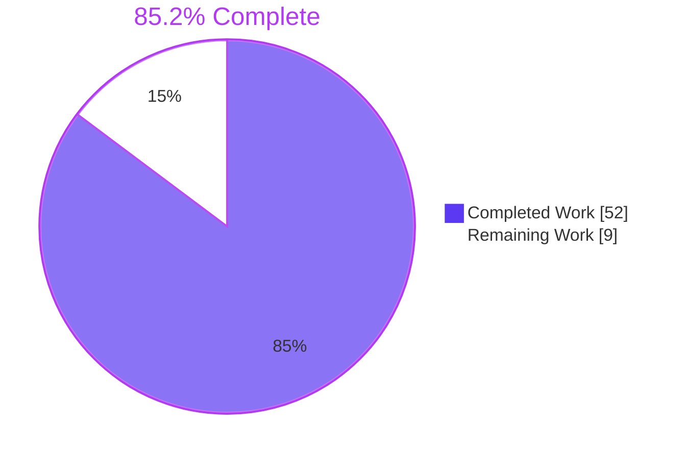
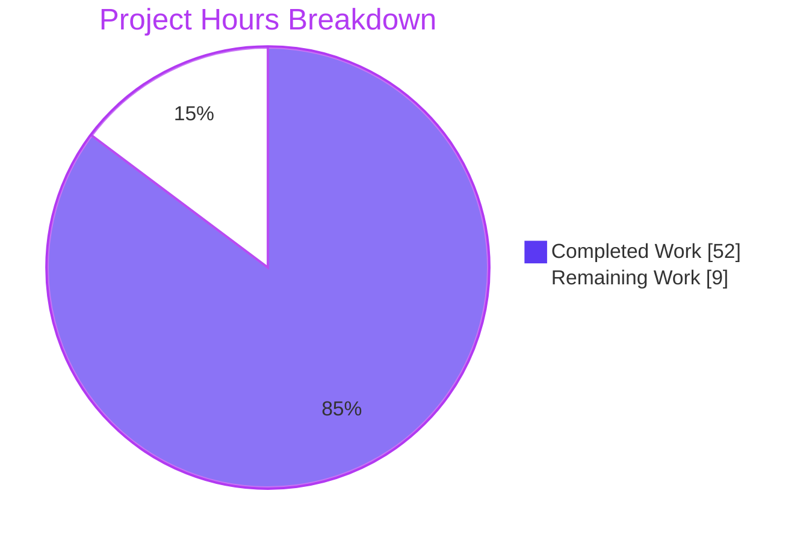
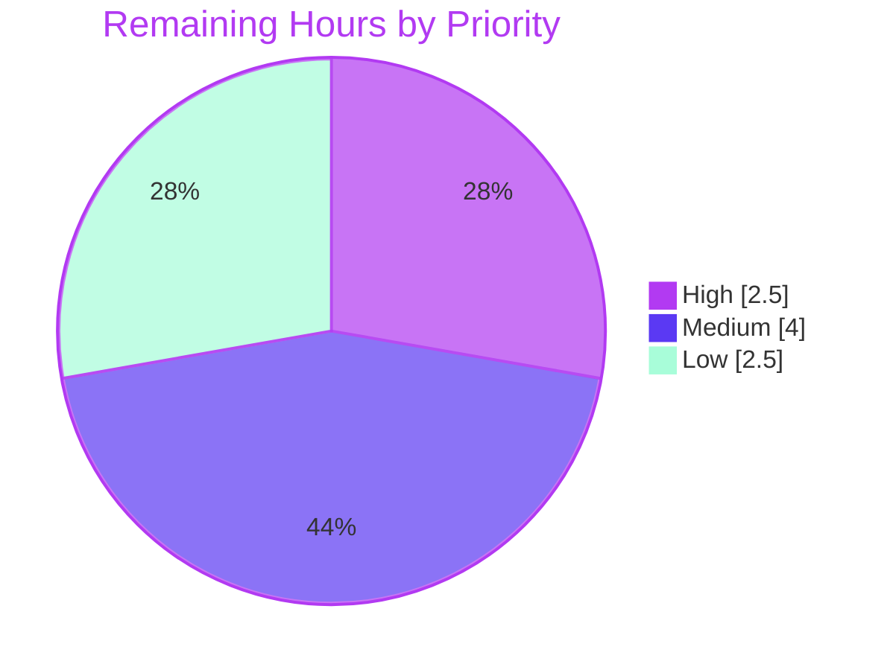

# 1. Executive Summary

## 1.1 Project Overview

A zero-dependency Node.js tutorial repository that teaches newcomers how an HTTP server is built, around one endpoint: `/hello` returns `Hello world` as plain text. It targets developers new to server-side Node.js and instructors who need a minimal reference. Nine files make up the scope: three ES-module source files on the built-in `node:http`, a five-test `node:test` suite, the npm manifest and lockfile, `.nvmrc`, `.gitignore`, and a README walkthrough with Windows variants. It supports the Node.js 24 and 22 LTS lines and binds loopback only.

## 1.2 Completion Status



| Metric | Value |
|---|---|
| Total Hours | 61 |
| Completed Hours (AI + Manual) | 52 (52 AI + 0 manual) |
| Remaining Hours | 9 |
| Percent Complete | 85.2% |

52 of 61 hours complete = **85.2%**. Every planned file passes its checks; the remaining 9 hours are cross-platform verification, sign-off and one optional test.

## 1.3 Key Accomplishments

- [x] `/hello` GET and HEAD: 200, `text/plain; charset=utf-8`, `Content-Length: 11`, byte-exact `Hello world`
- [x] Other methods on `/hello`, CONNECT included, get 405 with `Allow: GET, HEAD`; other paths get 404
- [x] Malformed request targets get 404 and never crash the process
- [x] Startup URL, `PORT` override, port-in-use exit 1 and Ctrl+C/SIGTERM exit 0 verified
- [x] `npm test` 5 of 5 on Node.js 24 and 22, with 100% coverage of both request-path modules
- [x] Zero dependencies, 0 audit vulnerabilities, loopback-only listener
- [x] About 13 million load requests with 0 errors; over 1,900 hostile inputs with no crash or reflection
- [x] README commands and outputs match the running server byte for byte

## 1.4 Critical Unresolved Issues

**4 of the 13 AAP requirements (FR-1 to FR-7, NFR-1 to NFR-6) carry an open item**; none blocks local use on Linux.

| Issue | Impact | Owner | ETA |
|---|---|---|---|
| NFR-4: the Windows walkthrough (Windows PowerShell 5.1, PowerShell 7, Command Prompt, `npm.cmd`, execution-policy remedy, `curl.exe`, `Invoke-WebRequest -UseBasicParsing`) has never been run (Section 5.2, D8) | A Windows learner may meet an instruction whose output differs from the README | Developer with a Windows machine | 2.5 h |
| FR-6: after `npm start` and Ctrl+C the shell reports exit status 130 under dash, while AAP 0.8 states 0; `node` itself exits 0 and the README explains this (D4) | Learner confusion only; macOS behaviour unverified | Developer with a Mac | 1 h |
| FR-4: CONNECT socket teardown in `src/server.js` is not guarded by any test, and lowercase or unknown methods receive Node's parser 400 rather than 405 (D1, D5) | A later edit could remove the teardown without any test failing | Maintainer | 1.5 h |
| NFR-1: the "Node.js is too old" troubleshooting text and `.nvmrc` through a version manager have never been run against a real old runtime or nvm | The quoted troubleshooting symptoms may not match real output | Maintainer | 1 h |

## 1.5 Access Issues

No access issues identified. Nothing in install, build, test or run requires credentials, secrets, network services or third-party packages.

## 1.6 Recommended Next Steps

1. [High] Run the README walkthrough in Windows PowerShell 5.1, PowerShell 7 and Command Prompt; correct any mismatch.
2. [Medium] Accept or revert each design decision in Section 5.2, chiefly the CONNECT listener.
3. [Medium] Run the walkthrough on macOS and confirm the Ctrl+C exit-status note.
4. [Medium] Have a Node.js newcomer follow the README end to end.
5. [Low] Add a test guarding CONNECT socket teardown.

# 2. Project Hours Breakdown

## 2.1 Completed Work Detail

| Component | Hours | Description |
|---|---|---|
| npm project configuration | 2 | `package.json` (`type: module`, `private`, `engines.node >=22.0.0`, `start`/`test` scripts, zero dependencies), generated `package-lock.json` (lockfileVersion 3, root entry only), `.nvmrc` (`24`), `.gitignore` (`node_modules/`) |
| `/hello` handler — `src/hello.js` | 4 | `GREETING` and `helloHandler`: GET/HEAD 200 with explicit `Content-Type` and `Content-Length`, 405 with `Allow: GET, HEAD`; learner comments and JSDoc (FR-2, FR-3, FR-4) |
| Server factory and router — `src/server.js` | 7 | Side-effect-free `createServer()`, exact pathname routing through a fixed URL base with a `URL.canParse` guard, 404 branch, `'connect'` listener answering CONNECT, `DEFAULT_PORT` and `HOST` (FR-5, NFR-5, NFR-6) |
| Process entry point — `src/index.js` | 6 | `PORT` parsing with fallback, loopback `listen`, exact startup line, port-in-use message with exit 1 after stderr drains, rethrow of other errors, SIGINT/SIGTERM shutdown that closes every connection (FR-1, FR-6, FR-7) |
| Test suite — `test/hello.test.js` | 8 | The five AAP 0.8 tests on an ephemeral port, per-request 5 s deadline, raw-socket helper for CONNECT, method loops for 404/405, 100% line/branch/function coverage of both request-path modules |
| README tutorial — `README.md` | 14 | 656-line walkthrough in the AAP 0.4.4 order: prerequisites, install, run, call the endpoint (POSIX and Windows forms), structure, nine "How it works" topics, port change in three shells, tests, five troubleshooting entries, add-a-route exercise |
| Acceptance verification on Node.js 24 and 22 | 5 | Every AAP 0.8 command and expected output checked on both LTS lines: startup line, curl contract, `PORT` matrix, port-in-use exit 1, signal exit 0, `npm test`, coverage, source greps, `npm audit` |
| Performance, security and test-strength validation | 6 | Load runs to about 13.3 million requests, memory and descriptor stability, over 1,900 hostile-input cases, loopback exposure checks, 40-mutant sweep of the suite, Chrome rendering checks |
| **Total** | **52** | |

## 2.2 Remaining Work Detail

| Category | Hours | Priority |
|---|---|---|
| Windows walkthrough verification — Windows PowerShell 5.1, PowerShell 7 and Command Prompt: install, `npm.cmd`, execution-policy remedy, port forms, `curl.exe`, `Invoke-WebRequest -UseBasicParsing`, Ctrl+C prompt | 2.5 | High |
| macOS walkthrough run, including the exit status after Ctrl+C on `npm start` | 1 | Medium |
| Sign-off on the delivery-time design decisions in Section 5.2 (D1–D7) | 1 | Medium |
| Newcomer read-through of the README for learnability (NFR-1) | 1.5 | Medium |
| Pull-request review and merge to `main` | 0.5 | Medium |
| Test guarding CONNECT socket teardown (`src/server.js` `'connect'` listener) | 1.5 | Low |
| Real Node.js 20 `EBADENGINE` output and `nvm use` check against the README troubleshooting text and `.nvmrc` | 1 | Low |
| **Total** | **9** | |

## 2.3 Hours Calculation

- Completed: 2 + 4 + 7 + 6 + 8 + 14 + 5 + 6 = **52 hours**
- Remaining: 2.5 + 1 + 1 + 1.5 + 0.5 + 1.5 + 1 = **9 hours**
- Total: 52 + 9 = **61 hours**
- Completion: 52 / 61 × 100 = **85.2%**

Confidence is high for completed hours (every component is present and exercised) and medium for remaining hours, since the Windows run may surface README corrections whose size is unknown.

# 3. Test Results

All figures below come from runs of the committed tree (`422dff1`) on Node.js 24.21.0 / npm 11.19.0 and Node.js 22.23.2 / npm 10.9.8.

| Area / Category | Framework | Tests | Passed | Failed | Coverage | What This Proves |
|---|---|---|---|---|---|---|
| `/hello` success contract — `GET /hello returns the greeting`, `HEAD /hello returns headers only` (Node.js 24) | `node:test`, `node:assert/strict`, global `fetch` | 2 | 2 | 0 | `src/hello.js` 100% line / branch / function | GET returns 200, both declared headers and the byte-exact 11-byte body; HEAD returns the same headers with an empty body |
| Routing — `Path matching is exact`, `An unknown path is not found` (Node.js 24) | `node:test`, `fetch`, `node:net` | 2 | 2 | 0 | `src/server.js` 100% line / branch / function | `?name=ada` matches; `/hello/`, `/HELLO`, `/`, `/goodbye` (under GET, POST, PUT, DELETE), an unparseable target and an authority-form CONNECT all receive 404 |
| Method rejection — `An unsupported method is rejected` (Node.js 24) | `node:test`, `fetch`, `node:net` | 1 | 1 | 0 | Included above | POST, PUT, DELETE, PATCH, OPTIONS and CONNECT on `/hello` return 405 with `Allow: GET, HEAD` and body `Method Not Allowed` |
| Full suite on the second LTS line (Node.js 22, TAP reporter) | `node --test` | 5 | 5 | 0 | — | The contract behaves identically on both supported lines (`# pass 5`, `# fail 0`) |
| Coverage run (`node --test --experimental-test-coverage`, Node.js 24) | `node --test` | 5 | 5 | 0 | 100.00 / 100.00 / 100.00 for both request-path modules | The AAP 0.11.2 target is met; `src/index.js` is exempt by design |
| Static and supply-chain checks | `node --check`, `grep`, `npm ci`, `npm audit` | 8 checks | 8 | 0 | n/a | All 4 JS files parse; no `Sync(` call in the request path; no shelling out, platform branching or path separators; clean install of 1 package; 0 vulnerabilities |

**Totals:** 5 tests, 5 passed, 0 failed on each supported Node.js line; suite duration about 150 ms.

**Not Covered** — delivered but not exercised by any automated test:

- `src/index.js` in full: `PORT` parsing and fallback, the startup line, the port-in-use message and exit 1, and SIGINT/SIGTERM shutdown with `closeAllConnections()`. The AAP exempts this file from the suite; it was verified at runtime only. Re-run the Section 9 runtime checks after any edit.
- CONNECT socket teardown (`socket.destroy()` in the `'connect'` listener, `src/server.js:254`). Removing it leaves all five tests passing; only a manual shutdown with a half-open CONNECT client exposes it.
- Response headers the AAP does not specify, such as the 404 `Content-Length`, are unasserted.
- Windows PowerShell and Command Prompt forms, macOS, `.nvmrc` through a version manager, and the Node.js < 22 troubleshooting path: never run. Test on those platforms before announcing Windows or macOS support.
- README prose and source comments: checked against live server output by reading, not by any test.

# 4. Runtime Validation & UI Verification

The product is a headless HTTP service with no authentication and no external integrations, by design. The flows below were driven against a live server on Linux, on Node.js 24 and 22, with curl, raw sockets, a load generator and headless Chrome.

- ✅ **Start-up** — `npm start` and `node src/index.js` print exactly `Server listening at http://127.0.0.1:<port>/ - try http://127.0.0.1:<port>/hello` and bind 127.0.0.1 only; connections to non-loopback interfaces and IPv6 are refused.
- ✅ **`/hello` in curl and Chrome** — 200, `text/plain; charset=utf-8`, `Content-Length: 11`, 11 body bytes; Chrome renders the text inline with no download; HEAD returns headers only; `?name=ada` still matches.
- ✅ **404, 405 and edge targets** — unknown paths return `Not Found`; 23 non-GET/HEAD methods plus CONNECT return 405 with `Allow`; `//%zz/x`, `http://a:99999/hello` and `OPTIONS *` return 404; the process survives 300 reset CONNECTs and parser abuse.
- ✅ **Port configuration** — `PORT=8080` binds 8080; `8080junk` binds 8080; empty, `abc`, `0` and `-5` fall back to 3000; `PORT=65536` is rethrown with Node's own `ERR_SOCKET_BAD_PORT` and exit 1.
- ✅ **Port already in use** — the exact 152-byte stderr line, empty stdout and exit 1, both from `node` and through `npm start`, including when stderr is a full pipe.
- ✅ **Shutdown** — SIGINT and SIGTERM exit 0 within milliseconds with idle keep-alive, zero-byte, browser-preconnect and half-open CONNECT clients attached; nothing is printed.
- ⚠ **Ctrl+C through `npm start`** — the server exits 0, but the shell reports 130 because npm runs the script through `sh`; the README's "Stopping cleanly" section says so.
- ✅ **Load and resource stability** — about 13.3 million requests with 0 errors; 13–18k requests/s from one client and 55–63k from four; RSS plateaus at 78–88 MB; probe latency stays sub-millisecond under load.
- ✅ **Hostile input** — over 1,900 cases across query, headers, bodies, paths, CRLF and smuggling framing: no input is reflected, no `Server` or `X-Powered-By` header, no stack or path leaks, no crash.
- ⚠ **Never exercised at runtime** — Windows PowerShell 5.1, PowerShell 7, Command Prompt, macOS, `.nvmrc` through nvm, and a Node.js < 22 runtime.

# 5. Compliance & Quality Review

## 5.1 Compliance Matrix

| # | AAP Deliverable | Benchmark | Status | Progress | Evidence |
|---|---|---|---|---|---|
| 1 | FR-1 server process, FR-7 startup line | Single foreground process; exact startup URL on stdout | ✅ Pass | ██████████ 100% | `src/index.js:130-132` |
| 2 | FR-2, FR-3 greeting and media type | 200, `text/plain; charset=utf-8`, `Content-Length: 11`, byte-exact body | ✅ Pass | ██████████ 100% | `src/hello.js:93-105`; test `GET /hello returns the greeting` |
| 3 | FR-4 method handling | HEAD headers only; 405 with `Allow: GET, HEAD` | ✅ Pass (parser-level 400 caveat, D5) | █████████░ 95% | `src/hello.js:52-64`; `src/server.js:245-281` |
| 4 | FR-5 unmatched paths | Every other path answered 404, none left hanging | ✅ Pass | ██████████ 100% | `src/server.js:216-221` |
| 5 | FR-6 one-command run | `npm start` and `npm test` work unattended | ⚠ Pass with caveat (exit 130 via npm, D4) | █████████░ 95% | `package.json:7-10` |
| 6 | NFR-1 learnability | 11-section README; learner comments in every source file | ⚠ Linux path verified; Windows and old-Node paths unexecuted | ████████░░ 85% | `README.md`; comments in `src/*.js` |
| 7 | NFR-2 zero dependencies | 0 packages; committed lockfile; `npm ci` idempotent | ✅ Pass | ██████████ 100% | `package-lock.json`; `npm audit` 0 |
| 8 | NFR-3 non-blocking request path | No `Sync(` call; no blocking under load | ✅ Pass | ██████████ 100% | AAP 0.8 grep; load runs |
| 9 | NFR-4 portability | No platform-specific constructs; Windows forms documented | ⚠ Constructs absent; Windows/macOS never run (D8) | ████████░░ 80% | AAP 0.8 grep; `README.md` Windows sections |
| 10 | NFR-5 security basics | Loopback bind, no secrets, method and pathname only | ✅ Pass | ██████████ 100% | `src/server.js:39,85-87` |
| 11 | NFR-6 testability and coverage | Side-effect-free factory; port 0; 100% line and branch | ✅ Pass | ██████████ 100% | Coverage 100/100/100 |
| 12 | Code standards and user rules | ESM only, naming, style, doc comments, no TODOs; 3 user rules state no requirement | ✅ Pass | ██████████ 100% | `src/*.js`, `test/hello.test.js` |

## 5.2 AAP & Rule Divergences and Gaps

No divergence from the user-specified rules exists: all three rules have empty or placeholder bodies and state no requirement, and no access-control feature was inferred from their titles. None of the divergences below was requested by a human, so none is marked Sanctioned.

| # | What the AAP/Rule Required | What Was Delivered Instead | Why It Diverged | Impact | Remediation |
|---|---|---|---|---|---|
| D1 | One request listener; a new route is one handler module plus one router branch (AAP 0.1.3, 0.4.4); tests use `node:test`, `node:assert/strict`, `fetch` (0.4.1) | A second, `'connect'` listener in `createServer()`; the add-a-route exercise adds each path there too; tests also import `node:net` | Node never passes CONNECT to the request listener and otherwise drops it unanswered; `fetch` cannot send CONNECT | About 60 more router lines; one extra exercise step; still zero dependencies | Accept, or remove and let CONNECT go unanswered |
| D2 | A fixed URL base alone keeps malformed targets from crashing the listener (AAP 0.3.2) | `pathnameOf()` guards `new URL` with `URL.canParse`; unparseable targets receive 404; `//host/hello` returns 200 | A fixed base does not stop `new URL` throwing on targets such as `http://a:99999/hello` | Prevents a one-request process crash | None; keep |
| D3 | Signals close the listener then exit 0; no draining beyond `server.close()` (0.3.2, 0.6.2) | `close(cb)` plus `closeAllConnections()`; the port-in-use path sets `process.exitCode = 1` and removes the signal handlers | `close()` alone leaves zero-byte browser preconnects open, so the process would not exit; an immediate exit can drop a pending stderr write | A request still arriving at shutdown is dropped | Accept |
| D4 | Ctrl+C "exits with code `0`" (AAP 0.8) | `node` exits 0; `npm start` reports 130 under dash; README documents it | npm runs the script via `sh -c`, and dash is itself stopped by SIGINT | Learners checking `echo $?` see 130 | Accept; confirm on macOS |
| D5 | Every other method on `/hello` answered 405 (FR-4) | Methods Node's parser rejects (lowercase `get`, `FOO`) receive Node's 400 | `node:http`, mandated by AAP 0.3.1, rejects them before application code runs | Every request is still answered | Accept |
| D6 | README output `# pass 5`; `Invoke-WebRequest http://127.0.0.1:3000/hello`; the AAP 0.4.4 section list | Spec output `ℹ pass 5` shown first; `-UseBasicParsing` added; extra Contents, execution-policy, "curl cannot connect", patched-runtime and exit-130 passages | Node 24's terminal default is the spec reporter; Windows PowerShell 5.1 blocks `npm.ps1` and prompts on bare `Invoke-WebRequest` | 656-line README; Windows text unexecuted | Review during the Windows run |
| D7 | Five tests with `before()`/`after()` and `fetch` (AAP 0.4.1) | Same five names plus a 5 s request deadline, `closeAllConnections()` in `after()`, method loops and a raw-socket helper | Without a deadline a regression that leaves a request unanswered hangs `npm test` | 489-line test file for a beginner to read | Accept |
| D8 | The walkthrough succeeds on Windows with `curl.exe` and per-shell forms (AAP 0.8) | Windows forms written from Microsoft and npm documentation, never executed | Not carried out in this run; execution was verified on Linux, as NFR-4 permits | Windows learners rely on untested text | Run on Windows (Section 2.2) |

**D1 — CONNECT answered by a second listener.** AAP FR-4 and 0.4.3 require that every other method on `/hello` receives 405 and that every request is answered, but Node hands CONNECT to the server's `'connect'` event and, with no listener, closes the socket without a byte. `src/server.js:245-281` therefore answers CONNECT itself: 405 with `Allow` for `/hello`, 404 otherwise, then destroys the socket. The consequence is that the add-a-route exercise now needs the new path in that listener's check as well (`src/server.js:194-197`, README "Add a second route"), and the tests import `node:net` (`test/hello.test.js:59`) because `fetch` refuses CONNECT. Decide whether the stricter contract is worth the extra lesson.

**D2 — `URL.canParse` guard.** AAP 0.3.2 asserts that a constant URL base lets malformed `Host` values, absolute-form targets and `OPTIONS *` resolve safely. That holds for the base, but `new URL` still throws on a target such as `GET http://a:99999/hello`, which Node's HTTP parser accepts, and an exception in the listener would stop the process. `pathnameOf()` (`src/server.js:85-87`) asks `URL.canParse` first and returns `false`, which falls through to the ordinary 404. `URL.parse` was avoided because it needs Node.js 22.1.0 and the engines floor is 22.0.0. A target beginning `//host/hello` resolves to `/hello` under the WHATWG URL standard and returns 200; this is documented, not normalised. No action is needed.

**D3 — Shutdown and exit mechanics.** AAP 0.3.2 describes shutdown as closing the listener and exiting 0, and 0.6.2 excludes draining beyond `server.close()`. `server.close()` alone does not close a connection that has sent no bytes, and browsers open such speculative preconnects, so Ctrl+C would leave the process running until the browser let go. `shutdown()` (`src/index.js:164-167`) therefore also calls `closeAllConnections()`; responses are written synchronously, so only a request still arriving is dropped. Separately, the port-in-use branch sets `process.exitCode = 1` rather than exiting on the spot, so the remedy line reaches a slow pipe, and removes the signal handlers so a signal in that moment cannot report success (`src/index.js:113-115`). Exit codes match the AAP.

**D4 — Exit status 130 through npm.** AAP 0.8 states that Ctrl+C on `npm start` exits with code 0. The `node` process does exit 0, but npm runs the `start` script through `sh -c`; where `/bin/sh` is dash (Debian, Ubuntu), the shell is itself terminated by SIGINT and npm reports 130. Prefixing the script with `exec` would avoid it but break Command Prompt, so `package.json` is unchanged and README "Stopping cleanly" explains the difference and shows `node src/index.js` returning 0. macOS behaviour was not checked. Accept the documented behaviour, or rewrite AAP 0.8's expectation, after confirming on a Mac.

**D5 — Parser-level method rejections.** FR-4 says every method other than GET and HEAD receives 405. Node's built-in `llhttp` parser, which AAP 0.3.1 mandates by choosing `node:http`, rejects method tokens outside its table (lowercase `get`, invented tokens such as `FOO`) with its own bare `400 Bad Request` and `Connection: close` before any application code runs; versionless HTTP/0.9 request lines are accepted and answered 200 or 404. Every such request is still answered, and none hangs or crashes the server. Honouring FR-4 literally would require replacing the HTTP parser, which contradicts the stack decision, so the requirement is read as covering the methods the parser delivers.

**D6 — README content beyond the plan.** Three expected outputs differ from AAP 0.4.4 and 0.8. The test section shows Node 24's spec output (`ℹ pass 5 / ℹ fail 0`) and gives the TAP form `# pass 5` in one sentence, because the terminal default differs by line. The PowerShell-native call is `Invoke-WebRequest -UseBasicParsing`, because Windows PowerShell 5.1 blocks the bare form behind a security prompt; the bare form is still named for PowerShell 7. The README also adds a Contents list, a "PowerShell says running scripts is disabled" entry with `npm.cmd`, a "curl cannot connect" entry, advice to install the newest release of an LTS line, and the exit-130 note. Review these during the Windows run.

**D7 — Test-harness additions.** AAP 0.4.1 describes `before()` and `after()` hooks and calls made with the global `fetch`. The five AAP 0.8 test names are unchanged, but `test/hello.test.js` adds `fetchWithDeadline` (`test/hello.test.js:128`), a 5-second `AbortSignal.timeout` per request, because a router change that leaves a request unanswered would otherwise hang `npm test` indefinitely rather than fail it. `after()` skips cleanup when nothing is listening and calls `closeAllConnections()`; the 404 and 405 tests loop over several methods; a raw-socket helper (`test/hello.test.js:173`) sends CONNECT. The cost is a 489-line file that is heavier reading for a beginner than the plan envisaged.

**D8 — Windows walkthrough unexecuted.** AAP 0.8's tutorial usability check says the walkthrough succeeds on Windows using `curl.exe` and the per-shell forms. The README carries every form AAP 0.4.4 requires, plus execution-policy and batch-job guidance, written from Microsoft Learn and npm documentation. None of it has been run: this check was not carried out in this run, and execution was verified on Linux only, which NFR-4 permits for execution but not for this acceptance statement. A developer with Windows 10 or 11 should follow the README in Windows PowerShell 5.1, PowerShell 7 and Command Prompt (Section 2.2, 2.5 hours) and correct any mismatch.

# 6. Risk Assessment

| # | Risk | Category | Severity | Probability | Mitigation | Status |
|---|---|---|---|---|---|---|
| 1 | Windows instructions (`npm.cmd`, execution policy, `$env:PORT`, `set PORT`, `curl.exe`, `Invoke-WebRequest -UseBasicParsing`) differ from real output | Integration | Medium | Medium | Run the walkthrough on Windows PowerShell 5.1, PowerShell 7 and Command Prompt; correct the README | Open |
| 2 | A learner adding a route forgets the `'connect'` listener check, so CONNECT to the new path gets 404 instead of 405 | Technical | Low | Medium | README step and router comment call it out; a copied CONNECT assertion in the new test would catch it | Mitigated in docs |
| 3 | A later edit removes `socket.destroy()` from the CONNECT listener and no test fails; a half-open CONNECT client then blocks Ctrl+C | Technical | Low | Low | Add a test that asserts the server closes a CONNECT socket after answering | Open |
| 4 | `src/index.js` (PORT, port-in-use, shutdown) has no automated test, so regressions surface only in manual runs | Technical | Medium | Low | Re-run the Section 9 runtime checks after any change; optionally add a subprocess smoke test | Accepted (AAP exemption) |
| 5 | The server trusts its loopback-only deployment: no hardening headers, no connection cap, idle sockets held about 89 s, any `Host` answered, `//host` and absolute-form targets mapped to `/hello` | Security | Low (High if exposed) | Low | Keep `HOST` fixed at 127.0.0.1; add headers, limits and target normalisation before any network or proxy exposure | Accepted by design |
| 6 | The `>=22.0.0` engines floor admits unpatched Node.js releases | Security | Low | Medium | README Prerequisites advises the newest release of the chosen LTS line and links security announcements | Mitigated in docs |
| 7 | Learners see exit status 130 after Ctrl+C on `npm start` and assume shutdown failed | Operational | Low | Medium | README "Stopping cleanly" explains it; confirm macOS wording | Mitigated in docs |
| 8 | Release-line drift: Node.js 24 leaves Active LTS on 2026-10-20 and Node.js 22 reaches end-of-life on 2027-04-30, staling version examples | Operational | Low | High | Review README version examples and `.nvmrc` at each LTS promotion | Open |

# 7. Visual Project Status



**Remaining hours by priority (9 hours total)**



| Remaining Category (Section 2.2) | Hours | Priority |
|---|---|---|
| Windows walkthrough verification | 2.5 | High |
| Newcomer README read-through | 1.5 | Medium |
| macOS walkthrough run | 1 | Medium |
| Design-decision sign-off | 1 | Medium |
| Pull-request review and merge | 0.5 | Medium |
| CONNECT teardown test | 1.5 | Low |
| Node.js 20 and nvm checks | 1 | Low |
| **Total** | **9** | |

# 8. Summary & Recommendations

The project is **85.2% complete** (52 of 61 hours). Every one of the nine planned files exists and does what the plan specifies: `/hello` returns the byte-exact `Hello world` with explicit `Content-Type` and `Content-Length`, HEAD, 405 and 404 behave as the contract of record requires, and the process entry point handles `PORT`, a port already in use and Ctrl+C deliberately. The suite passes 5 of 5 on Node.js 24 and 22 with 100% line, branch and function coverage of the two request-path modules, the dependency count is zero, and `npm audit` is clean.

Verification went well beyond the unit suite. The running server was driven with curl, raw sockets and Chrome on both LTS lines, load-tested to about 13 million requests with no errors and flat memory, and probed with over 1,900 hostile inputs without a crash, a reflected value or an identifying header. The README's quoted commands and outputs match the live server byte for byte on Linux.

The remaining gaps are verification, not construction. The Windows walkthrough, the heart of NFR-4 and of AAP 0.8's usability check, has never been run; macOS, a real pre-22 runtime and `.nvmrc` through nvm are likewise unexercised. Eight delivery-time decisions depart from the plan's letter, the most visible being the CONNECT listener, which adds one step to the add-a-route exercise, and the exit status 130 a learner sees after stopping `npm start`. All are documented in Section 5.2 and need an owner's accept-or-revert decision rather than new code.

The critical path to release is: run the walkthrough on Windows and correct the README (2.5 hours), confirm macOS (1 hour), sign off Section 5.2 (1 hour), have a newcomer read the README (1.5 hours), then merge. Success looks like a newcomer on each of the three platforms reaching `Hello world` from the README alone, `npm test` reporting 5 of 5 on both LTS lines, and coverage remaining at 100%.

**Production readiness:** ready for Linux learners today as a loopback-only tutorial; ready for a public, cross-platform release once the Windows and macOS walkthroughs are confirmed. It is not, and is not intended to be, a network-exposed service.

# 9. Development Guide

## 9.1 System Prerequisites

- Node.js on a supported LTS line: 24 (recommended, matches `.nvmrc`) or 22. The engines floor is `>=22.0.0`; verified releases are v24.21.0 and v22.23.2.
- npm, which ships with Node.js (verified: 11.19.0 with Node 24, 10.9.8 with Node 22).
- `curl` or a browser. On Windows use `curl.exe`, which ships with Windows 10 and later.
- Any OS that runs Node.js; execution has been verified on Linux x86_64.
- No database, container, service, environment file or secret is needed.

## 9.2 Environment Setup

No virtual environment or `.env` is used. The only optional setting is `PORT` (default 3000). The server always binds 127.0.0.1.

```bash
node --version    # expect v24.x or v22.x, for example v24.21.0
npm --version     # expect 11.x (Node 24) or 10.x (Node 22)
```

If you use nvm, `nvm use` in the repository root selects the installed 24.x release named by `.nvmrc`.

## 9.3 Dependency Installation

Run from the repository root. Nothing is downloaded, and `node_modules` is not created.

```bash
npm install
# up to date, audited 1 package in 150ms
# found 0 vulnerabilities

CI=true npm ci      # reproducible install from the committed lockfile, same output
```

## 9.4 Build

There is no build step (plain ES modules, no TypeScript, no bundler). To syntax-check every file:

```bash
for f in src/*.js test/*.js; do node --check "$f" && echo "ok $f"; done
```

## 9.5 Application Startup

```bash
npm start
# > node-hello-tutorial@1.0.0 start
# > node src/index.js
#
# Server listening at http://127.0.0.1:3000/ - try http://127.0.0.1:3000/hello
```

The process stays in the foreground. Press Ctrl+C to stop it. Other ports:

```bash
PORT=8080 npm start               # bash / zsh
$env:PORT=8080; npm start         # PowerShell (npm.cmd start if scripts are blocked)
set PORT=8080 && npm start        # Command Prompt
```

To run in the background and stop it cleanly (POSIX shells):

```bash
PORT=3100 node src/index.js > app.log 2>&1 &
pid=$!
# ... use the server ...
kill -INT "$pid"; wait "$pid"; echo "exit=$?"   # exit=0
```

If you background `npm start` instead, signal the process that owns the port, not npm: `kill -INT "$(lsof -ti tcp:3100 -sTCP:LISTEN)"`.

## 9.6 Verification Steps

```bash
curl -i http://127.0.0.1:3000/hello
# HTTP/1.1 200 OK
# Content-Type: text/plain; charset=utf-8
# Content-Length: 11
# Date: ... / Connection: keep-alive / Keep-Alive: timeout=5  (values vary)
#
# Hello world

curl -sS http://127.0.0.1:3000/hello | wc -c                              # 11
curl -I http://127.0.0.1:3000/hello                                       # 200, headers only
curl -s 'http://127.0.0.1:3000/hello?name=ada'                            # Hello world
curl -s -o /dev/null -w '%{http_code}\n' http://127.0.0.1:3000/hello/     # 404
curl -s -o /dev/null -w '%{http_code}\n' http://127.0.0.1:3000/HELLO      # 404
curl -i http://127.0.0.1:3000/goodbye                                     # 404, body Not Found
curl -i -X POST http://127.0.0.1:3000/hello                               # 405, Allow: GET, HEAD
```

Automated checks:

```bash
npm test                                           # ℹ tests 5 / ℹ pass 5 / ℹ fail 0
npm test -- --test-reporter=tap                    # ... # pass 5 / # fail 0
node --test --experimental-test-coverage           # hello.js and server.js 100.00 / 100.00 / 100.00
npm audit                                          # found 0 vulnerabilities
grep -n "Sync(" src/hello.js src/server.js         # no output, exit 1
grep -n "child_process\|exec(\|spawn(\|path.sep\|process.platform" src/*.js   # no output, exit 1
```

To test on the second LTS line, put its `bin` directory first on `PATH` for one command, for example `PATH=/path/to/node-v22/bin:$PATH npm test` (Node 22 prints TAP output when not attached to a terminal).

## 9.7 Example Usage

Start a second instance on a port that is already held to see the one failure a learner is most likely to hit:

```bash
PORT=3100 node src/index.js &          # first instance
PORT=3100 node src/index.js; echo $?   # second instance
# Port 3100 is already in use. Set the PORT environment variable to a free port, for example 3001, and start again - see "Change the port" in the README.
# 1
```

To extend the tutorial, follow README "Next steps → Add a second route": add a handler module beside `src/hello.js`, one `if` branch in the request listener in `src/server.js`, the same path in the `'connect'` listener's check, and one test; then change the unknown-path test from `/goodbye` to another path such as `/nowhere`.

## 9.8 Troubleshooting

| Symptom | Cause | Resolution |
|---|---|---|
| `Port 3000 is already in use ...`, exit 1 | Another process (often an earlier `npm start`) holds the port | Stop it with Ctrl+C, or start on another port with `PORT=3001 npm start` |
| `echo $?` prints 130 after Ctrl+C on `npm start` | npm runs the script via `sh`, which is also stopped by SIGINT | Expected; `node src/index.js` stopped the same way exits 0 |
| `npm warn EBADENGINE` during install | Node.js older than 22.0.0 | Install the newest release of Node.js 24 or 22 |
| PowerShell: `npm.ps1 cannot be loaded because running scripts is disabled` | Windows PowerShell 5.1 default execution policy | Use `npm.cmd`, Command Prompt, or `Set-ExecutionPolicy -Scope CurrentUser RemoteSigned` |
| `curl` in PowerShell prints an object or a security prompt | `curl` is an alias for `Invoke-WebRequest` in Windows PowerShell 5.1 | Use `curl.exe`, or `Invoke-WebRequest -UseBasicParsing http://127.0.0.1:3000/hello` |
| `curl: (7) Failed to connect` | Server not running, wrong port, or a non-loopback address used | Start the server and use the URL from its startup line |
| `RangeError [ERR_SOCKET_BAD_PORT]` | `PORT` above 65535 | Choose a port between 1 and 65535 |

# 10. Appendices

## A. Command Reference

| Command | Purpose |
|---|---|
| `npm install` / `CI=true npm ci` | Validate the zero-dependency install against the lockfile |
| `npm start` | Run `node src/index.js` on `PORT` or 3000 |
| `PORT=8080 npm start` | Run on another port (bash/zsh form) |
| `npm test` | Run the five-test suite (`node --test`) |
| `npm test -- --test-reporter=tap` | Same, with TAP output (`# pass 5`) |
| `node --test --experimental-test-coverage` | Suite plus per-file coverage table |
| `node --check <file>` | Syntax check a JS file |
| `npm audit` | Dependency advisory check (expects 0) |
| `grep -n "Sync(" src/hello.js src/server.js` | NFR-3 source check (expects no output) |
| `grep -n "child_process\|exec(\|spawn(\|path.sep\|process.platform" src/*.js` | NFR-4 source check (expects no output) |

## B. Port Reference

| Port | Use |
|---|---|
| 3000 | Default listening port (`DEFAULT_PORT`, `src/server.js:29`) |
| `PORT` value | Override, parsed with `Number.parseInt`; positive integers only, otherwise 3000 |
| 0 (OS-assigned) | Used only by the test suite, so tests never collide with a running server |
| Host | Always `127.0.0.1` (`HOST`, `src/server.js:39`); not configurable |

## C. Key File Locations

| Path | Contents |
|---|---|
| `src/index.js` | Entry point: port resolution, listen, startup line, port-in-use handling, shutdown |
| `src/server.js` | `createServer()`, request router, CONNECT listener, `DEFAULT_PORT`, `HOST` |
| `src/hello.js` | `GREETING`, `helloHandler` — the `/hello` contract |
| `test/hello.test.js` | The five AAP 0.8 tests, request deadline and raw-socket helper |
| `README.md` | Tutorial walkthrough |
| `package.json` | Manifest: ESM, `private`, engines floor, `start` and `test` scripts |
| `package-lock.json` | Generated lockfile (never hand-edit; regenerate with `npm install`) |
| `.nvmrc` | Development line `24` (advisory) |
| `.gitignore` | Ignores `node_modules/` |

## D. Technology Versions

| Technology | Version |
|---|---|
| Node.js (primary) | v24.21.0 ("Krypton", Active LTS) |
| Node.js (second supported line) | v22.23.2 ("Jod", Maintenance LTS) |
| npm | 11.19.0 (Node 24), 10.9.8 (Node 22) |
| HTTP layer | Built-in `node:http` |
| Test runner | Built-in `node:test` with `node:assert/strict`, global `fetch`, `node:net` |
| Module system | ES modules (`"type": "module"`) |
| Third-party packages | None |

## E. Environment Variable Reference

| Variable | Required | Default | Effect |
|---|---|---|---|
| `PORT` | No | 3000 | Listening port. The leading whole number is used (`8080junk` → 8080); empty, non-numeric, 0 or negative values fall back to 3000; values above 65535 stop the process with `ERR_SOCKET_BAD_PORT` |

## F. Developer Tools Guide

- **Coverage:** `node --test --experimental-test-coverage` prints a table for `src/hello.js` and `src/server.js`. Node 22 also lists the test file, so its `all files` row reads below 100% while both source rows stay at 100%.
- **Single test:** `node --test --test-name-pattern='^Path matching is exact$'`.
- **Port inspection:** `lsof -ti tcp:<port> -sTCP:LISTEN` or `ss -ltnp` shows which process holds a port.
- **No linter or formatter** is configured by design; style is two-space indentation, semicolons, single quotes, named exports and `const` by default.

## G. Glossary

| Term | Meaning |
|---|---|
| Request listener | The function `http.createServer` calls for every request, with `req` and `res` |
| Pathname | The path part of a URL, without the query string (`/hello` in `/hello?name=ada`) |
| `URL.canParse` | Returns whether `new URL` would succeed, without throwing |
| CONNECT | HTTP method asking a proxy to open a tunnel; Node routes it to the `'connect'` event, not the request listener |
| EADDRINUSE | Operating-system error: another process already holds the port |
| Loopback | 127.0.0.1, reachable only from the same machine |
| LTS | Node.js Long-Term Support release line |
| Engines floor | The minimum Node.js version `package.json` admits (`>=22.0.0`); not the list of supported lines |
