# Technical Specification

# 0. SUMMARY OF CHANGES

## 0.1 USER INTENT RESTATEMENT

### 0.1.1 Core Objective

Based on the requirements, the Blitzy platform understands that the objective is to transform a basic Node.js server tutorial into a more robust Express.js-based web application with multiple endpoints. Specifically:

1. **Establish Express.js Framework**: Migrate from a basic Node.js HTTP server implementation to the Express.js web application framework for enhanced routing, middleware support, and simplified endpoint management
2. **Implement Multiple Endpoints**: Expand from a single endpoint returning "Hello world" to include an additional endpoint that returns "Good evening"
3. **Modernize Server Architecture**: Leverage Express.js's production-ready features for better maintainability and scalability

### 0.1.2 Special Instructions and Constraints

**Identified Constraints:**
- Preserve existing functionality: The original "Hello world" endpoint must continue to function
- Additive enhancement: New features should be added without removing existing capabilities
- Framework migration: Transition to Express.js should maintain backward compatibility

**Technical Interpretation:**
These requirements translate to the following technical implementation strategy:
- To **enable Express.js capabilities**, we will **install and configure Express.js** by **adding it as a project dependency and refactoring the server initialization code**
- To **support multiple endpoints**, we will **create a routing structure** by **defining separate route handlers for each endpoint**
- To **maintain existing functionality**, we will **preserve the "Hello world" response** by **mapping it to an appropriate Express.js route**

## 0.2 TECHNICAL SCOPE

### 0.2.1 Primary Objectives with Implementation Approach

**Objective 1: Initialize Node.js Project Structure**
- Achieve **proper project initialization** by creating `package.json` to enable dependency management and project configuration
- Critical success factor: Establishing a valid Node.js project structure that supports npm package management

**Objective 2: Integrate Express.js Framework**
- Achieve **Express.js integration** by modifying `package.json` to include Express.js as a dependency and updating server code to use Express.js APIs
- Rationale: Express.js provides a minimal and flexible Node.js web application framework with robust features for web and mobile applications
- Critical success factor: Successful Express.js initialization and server startup

**Objective 3: Implement Multiple REST Endpoints**
- Achieve **multi-endpoint support** by extending the server implementation to define two distinct GET routes using Express.js routing capabilities
- Technical decision: Use Express.js's declarative routing syntax for clean endpoint definition
- Critical success factor: Both endpoints responding with correct content when accessed

### 0.2.2 Component Impact Analysis

**Direct Modifications Required:**
- `package.json`: Create new file to define project metadata and dependencies (Express.js)
- `server.js` or `index.js`: Create/modify main server file to implement Express.js server with two endpoints
- `package-lock.json`: Will be auto-generated to lock dependency versions for reproducible builds

**Indirect Impacts and Dependencies:**
- `node_modules/`: Directory will be created containing Express.js and its transitive dependencies
- `.gitignore`: Should be created to exclude `node_modules/` from version control
- `README.md`: Should be updated to document the new Express.js server and its endpoints

**New Components Introduction:**
- Express Application Instance: Create Express app object to handle HTTP requests
- Route Handlers: Create separate handler functions for "/" and "/evening" endpoints
- Server Listener: Create HTTP server listener using Express.js conventions

### 0.2.3 File and Path Mapping

| Target File/Module | Source Reference | Context Dependencies | Modification Type |
|-------------------|------------------|---------------------|------------------|
| `package.json` | New file | npm ecosystem | Create |
| `server.js` or `index.js` | New/existing file | Express.js API | Create/Refactor |
| `package-lock.json` | Auto-generated | npm install output | Auto-create |
| `node_modules/` | Auto-generated | npm dependencies | Auto-create |
| `.gitignore` | New file | Git configuration | Create |
| `README.md` | Existing file | Documentation | Update |

## 0.3 IMPLEMENTATION DESIGN

### 0.3.1 Technical Approach

**First, establish Node.js project foundation** by initializing the project with `npm init` to create `package.json` with appropriate metadata including project name, version, description, main entry point, and scripts.

**Next, integrate Express.js framework** by installing Express.js via npm (`npm install express`) which will add it to dependencies and create `package-lock.json` for dependency version locking.

**Then, implement server architecture** by creating the main server file with Express.js initialization, defining route handlers for both endpoints, and configuring the server to listen on an appropriate port.

**Finally, ensure quality and maintainability** by implementing error handling middleware, adding appropriate logging for server startup, and documenting the API endpoints in the README.

### 0.3.2 User-Provided Examples Integration

The user's requirement of **"one endpoint that returns the response 'Hello world'"** will be implemented in the root route handler as:
```javascript
app.get('/', (req, res) => {
  res.send('Hello world');
});
```

The user's requirement of **"another endpoint that return the response of 'Good evening'"** will be implemented as a separate route:
```javascript
app.get('/evening', (req, res) => {
  res.send('Good evening');
});
```

### 0.3.3 Critical Implementation Details

**Design Patterns Employed:**
- **MVC Pattern**: Separation of routes (controller) from server initialization
- **Middleware Pattern**: Express.js middleware chain for request processing
- **REST Convention**: Using GET methods for read-only endpoints

**Key Algorithms and Approaches:**
- **Route Matching**: Express.js's path-to-regexp for URL pattern matching
- **Response Handling**: Express.js response methods for sending text responses
- **Port Configuration**: Environment variable support for PORT with fallback to 3000

**Integration Strategies:**
- **Modular Structure**: Separate concerns between server initialization and route definitions
- **Configuration Management**: Use environment variables for runtime configuration
- **Error Handling**: Implement catch-all error handler for unhandled routes

**Data Flow Modifications:**
1. HTTP Request → Express.js Router → Route Handler → Response
2. Middleware chain: Request → Logger (optional) → Router → Response Handler

### 0.3.4 Dependency Analysis

**Required Dependencies:**
- **express**: ^4.21.0 or latest stable version
  - Justification: De facto standard for Node.js web applications
  - Provides routing, middleware, and HTTP utility methods
  - Extensive ecosystem and community support

**Development Dependencies (Recommended):**
- **nodemon**: For automatic server restart during development
  - Justification: Improves developer experience
  - Optional but highly beneficial for iterative development

**Version Constraints:**
- Node.js: >=14.0.0 (LTS version recommended)
- npm: >=6.0.0 (comes with Node.js)

## 0.4 SCOPE BOUNDARIES

### 0.4.1 Explicitly In Scope

**Files to be Created/Modified:**
- `package.json`: Project configuration and dependency declaration
- `server.js` or `index.js`: Main server implementation file
- `.gitignore`: Version control exclusions
- `README.md`: Updated documentation

**Configuration Changes:**
- npm project initialization
- Express.js dependency installation
- Server port configuration (default 3000)

**Implementation Requirements:**
- GET endpoint at "/" returning "Hello world"
- GET endpoint at "/evening" returning "Good evening"
- Express.js server initialization and configuration
- Basic error handling for undefined routes

**Documentation Updates:**
- Installation instructions in README
- API endpoint documentation
- Running the server instructions
- Testing the endpoints guide

### 0.4.2 Explicitly Out of Scope

**What the user might expect but isn't included:**
- Database integration
- Authentication/authorization
- Request body parsing middleware
- Static file serving
- Template engine integration
- Production deployment configuration
- SSL/TLS configuration
- Rate limiting or security middleware
- Unit tests or integration tests
- Docker containerization
- CI/CD pipeline configuration

**Related areas deliberately not touched:**
- Frontend/client implementation
- API documentation tools (Swagger/OpenAPI)
- Logging frameworks beyond console.log
- Process management (PM2, Forever)
- Load balancing configuration
- WebSocket support

**Future considerations not addressed now:**
- Scalability optimizations
- Caching strategies
- Monitoring and metrics
- API versioning
- Microservices architecture

## 0.5 VALIDATION CHECKLIST

### 0.5.1 Implementation Verification Points

**Requirement 1: Express.js Integration**
- ✓ Express.js appears in package.json dependencies
- ✓ Server file imports and initializes Express
- ✓ Server starts without errors
- ✓ Console logs confirm Express server is running

**Requirement 2: "Hello world" Endpoint**
- ✓ GET request to "/" returns status 200
- ✓ Response body contains exactly "Hello world"
- ✓ Content-Type header is appropriate (text/html or text/plain)
- ✓ No errors in server console during request

**Requirement 3: "Good evening" Endpoint**
- ✓ GET request to "/evening" returns status 200
- ✓ Response body contains exactly "Good evening"
- ✓ Endpoint is accessible independently of root endpoint
- ✓ No interference between endpoints

### 0.5.2 Observable Changes

**Server Behavior:**
- Server starts and listens on specified port
- Console output indicates successful initialization
- Both endpoints respond to HTTP GET requests
- 404 responses for undefined routes

**Project Structure:**
- Node.js project files present (package.json, package-lock.json)
- node_modules directory contains Express.js
- Main server file contains Express.js code

### 0.5.3 Integration Points to Test

- **HTTP Client Testing**: Use curl, Postman, or browser to verify endpoints
- **Port Binding**: Verify server binds to correct port
- **Route Resolution**: Confirm correct route matching for both endpoints
- **Error Handling**: Test undefined routes return 404

## 0.6 EXECUTION PARAMETERS

### 0.6.1 Special Execution Instructions

**Development Workflow:**
- Use `npm install` to install dependencies
- Use `npm start` or `node server.js` to run the server
- Consider using `nodemon` for development auto-restart

**Code Style Requirements:**
- Follow standard Node.js conventions
- Use ES6+ JavaScript features where appropriate
- Maintain consistent indentation (2 or 4 spaces)
- Include meaningful comments for route definitions

### 0.6.2 Constraints and Boundaries

**Technical Constraints:**
- Must use Express.js specifically (not other frameworks like Koa, Hapi, or Fastify)
- Responses must be plain text (not JSON or HTML templates)
- Exact response strings: "Hello world" and "Good evening" (case-sensitive)

**Process Constraints:**
- Maintain backward compatibility with any existing code
- Keep implementation simple and tutorial-appropriate
- Avoid over-engineering for this basic example

**Output Constraints:**
- Server must be runnable with standard Node.js commands
- No external services or databases required
- Must work on standard development environments (Windows, macOS, Linux)

# 1. INTRODUCTION

## 1.1 EXECUTIVE SUMMARY

### 1.1.1 Project Overview

<span style="background-color: rgba(91, 57, 243, 0.2)">The Node.js to Express.js Migration project addresses the transformation of a basic Node.js HTTP server tutorial into a robust Express.js-based web application featuring two endpoints</span>. This migration project focuses on <span style="background-color: rgba(91, 57, 243, 0.2)">modernizing server architecture by transitioning from native Node.js HTTP modules to the Express.js framework, implementing a "/" endpoint that returns "Hello world" and an "/evening" endpoint that returns "Good evening"</span>.

<span style="background-color: rgba(91, 57, 243, 0.2)">The project operates under an additive-enhancement constraint, ensuring that existing functionality is preserved while introducing new capabilities</span>. This approach maintains backward compatibility during the Express.js transition, allowing for seamless migration without disrupting current server behavior while expanding endpoint functionality.

### 1.1.2 Core Business Problem

<span style="background-color: rgba(91, 57, 243, 0.2)">Basic Node.js HTTP server implementations lack the routing flexibility, middleware support, and maintainability features required for scalable web applications</span>. Traditional HTTP server setups require extensive manual configuration for handling multiple endpoints, making them cumbersome for applications that need to support diverse API routes and responses.

<span style="background-color: rgba(91, 57, 243, 0.2)">Current limitations include manual request parsing, complex routing logic, and absence of production-ready features that modern web frameworks provide</span>. Developers working with basic Node.js servers face challenges in extending functionality, implementing clean routing patterns, and maintaining code organization as application complexity grows.

### 1.1.3 Key Stakeholders and Users

| Stakeholder Group | Primary Use Cases | Value Delivered |
|-------------------|-------------------|-----------------|
| <span style="background-color: rgba(91, 57, 243, 0.2)">Node.js Developers</span> | <span style="background-color: rgba(91, 57, 243, 0.2)">Server framework migration, API endpoint development</span> | <span style="background-color: rgba(91, 57, 243, 0.2)">Enhanced development experience with Express.js routing</span> |
| <span style="background-color: rgba(91, 57, 243, 0.2)">Web Application Teams</span> | <span style="background-color: rgba(91, 57, 243, 0.2)">Multi-endpoint REST API implementation</span> | <span style="background-color: rgba(91, 57, 243, 0.2)">Streamlined server architecture and maintainability</span> |
| <span style="background-color: rgba(91, 57, 243, 0.2)">Tutorial Learners</span> | <span style="background-color: rgba(91, 57, 243, 0.2)">Understanding Express.js migration patterns</span> | <span style="background-color: rgba(91, 57, 243, 0.2)">Practical framework transition experience</span> |
| <span style="background-color: rgba(91, 57, 243, 0.2)">Backend Engineers</span> | <span style="background-color: rgba(91, 57, 243, 0.2)">Production-ready server implementation</span> | <span style="background-color: rgba(91, 57, 243, 0.2)">Modern web application foundation</span> |

### 1.1.4 Expected Business Impact and Value Proposition

The solution will establish a foundation for scalable web application development by providing a modern Express.js-based architecture. This directly translates to:

- **<span style="background-color: rgba(91, 57, 243, 0.2)">Project Initialization Excellence</span>**: <span style="background-color: rgba(91, 57, 243, 0.2)">Proper Node.js project structure with package.json configuration enabling comprehensive dependency management and professional project organization</span>
- **<span style="background-color: rgba(91, 57, 243, 0.2)">Express.js Integration Success</span>**: <span style="background-color: rgba(91, 57, 243, 0.2)">Seamless framework migration providing robust routing capabilities, middleware support, and enhanced server functionality for production-ready applications</span>  
- **<span style="background-color: rgba(91, 57, 243, 0.2)">Multiple REST Endpoints Implementation</span>**: <span style="background-color: rgba(91, 57, 243, 0.2)">Clean, declarative routing architecture supporting both "/" and "/evening" endpoints with proper HTTP response handling and extensible design patterns</span>
- **Framework Modernization**: Transition from basic HTTP server to industry-standard Express.js framework with enhanced maintainability and scalability potential

## 1.2 SYSTEM OVERVIEW

### 1.2.1 Project Context

#### Business Context and Market Positioning

<span style="background-color: rgba(91, 57, 243, 0.2)">The Node.js development landscape requires robust web application frameworks to support scalable server implementations, with Express.js representing the industry standard for Node.js web applications. Modern web development demands efficient routing capabilities, middleware support, and maintainable server architectures that basic HTTP server implementations cannot provide.</span>

<span style="background-color: rgba(91, 57, 243, 0.2)">The market for Node.js web frameworks includes various solutions, but Express.js stands as the minimal and flexible framework choice for most applications. Tutorial-based Node.js projects often begin with basic HTTP server implementations, creating a natural progression path toward Express.js adoption for production-ready applications.</span>

#### Current System Limitations

<span style="background-color: rgba(91, 57, 243, 0.2)">The existing single-endpoint Node.js tutorial server currently faces significant architectural constraints:</span>

- **<span style="background-color: rgba(91, 57, 243, 0.2)">No Framework Foundation</span>**: <span style="background-color: rgba(91, 57, 243, 0.2)">Reliance on native HTTP modules without framework abstraction</span>
- **<span style="background-color: rgba(91, 57, 243, 0.2)">Single Route Limitation</span>**: <span style="background-color: rgba(91, 57, 243, 0.2)">Manual routing implementation supporting only one endpoint</span>
- **<span style="background-color: rgba(91, 57, 243, 0.2)">Limited Scalability</span>**: <span style="background-color: rgba(91, 57, 243, 0.2)">Complex routing logic required for additional endpoints</span>
- **<span style="background-color: rgba(91, 57, 243, 0.2)">Manual Request Handling</span>**: <span style="background-color: rgba(91, 57, 243, 0.2)">Absence of middleware support and request parsing capabilities</span>

#### Integration with Existing Enterprise Landscape

<span style="background-color: rgba(91, 57, 243, 0.2)">The solution will integrate seamlessly with the Node.js ecosystem and modern development toolchains, providing enhanced compatibility with:</span>

- <span style="background-color: rgba(91, 57, 243, 0.2)">NPM package management and dependency resolution</span>
- <span style="background-color: rgba(91, 57, 243, 0.2)">Express.js middleware ecosystem and extensions</span>
- <span style="background-color: rgba(91, 57, 243, 0.2)">Standard REST API conventions and patterns</span>
- <span style="background-color: rgba(91, 57, 243, 0.2)">Version control systems and development workflows</span>

### 1.2.2 High-Level Description

#### Primary System Capabilities

<span style="background-color: rgba(91, 57, 243, 0.2)">The Node.js to Express.js Migration will deliver comprehensive web application functionality optimized for modern server development:</span>

- **<span style="background-color: rgba(91, 57, 243, 0.2)">Express Application Instance</span>**: <span style="background-color: rgba(91, 57, 243, 0.2)">Centralized app object managing HTTP requests and middleware chain</span>
- **<span style="background-color: rgba(91, 57, 243, 0.2)">Route Handlers for Two GET Endpoints</span>**: <span style="background-color: rgba(91, 57, 243, 0.2)">Dedicated handlers for "/" returning "Hello world" and "/evening" returning "Good evening"</span>
- **<span style="background-color: rgba(91, 57, 243, 0.2)">Server Listener</span>**: <span style="background-color: rgba(91, 57, 243, 0.2)">HTTP server initialization with configurable port management</span>
- **<span style="background-color: rgba(91, 57, 243, 0.2)">NPM-Based Project Structure</span>**: <span style="background-color: rgba(91, 57, 243, 0.2)">Professional project organization with package.json and dependency management</span>

#### Major System Components

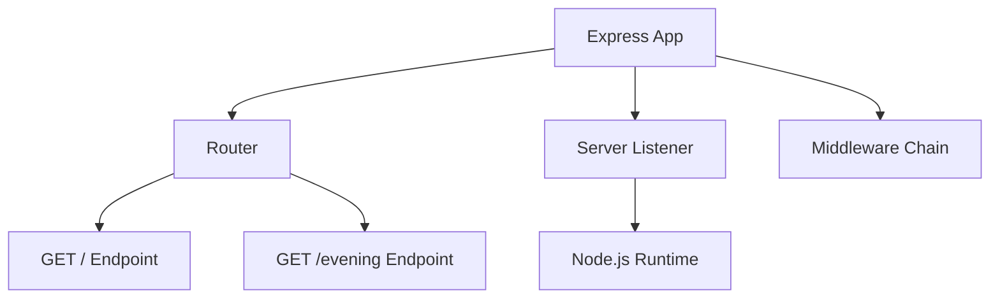
```mermaid
graph TD
    A[Express App] --> B[Router]
    B --> C[GET / Endpoint]
    B --> D[GET /evening Endpoint]
    A --> E[Server Listener]
    E --> F[Node.js Runtime]
    A --> G[Middleware Chain]
```

#### Core Technical Approach

<span style="background-color: rgba(91, 57, 243, 0.2)">The system will implement an Express.js-based architecture utilizing:</span>

- **<span style="background-color: rgba(91, 57, 243, 0.2)">Declarative Routing</span>**: <span style="background-color: rgba(91, 57, 243, 0.2)">Express.js routing syntax for clean endpoint definitions</span>
- **<span style="background-color: rgba(91, 57, 243, 0.2)">Middleware Pattern</span>**: <span style="background-color: rgba(91, 57, 243, 0.2)">Request processing pipeline with extensible middleware support</span>
- **<span style="background-color: rgba(91, 57, 243, 0.2)">Environment Configuration</span>**: <span style="background-color: rgba(91, 57, 243, 0.2)">Port configuration with environment variable support</span>
- **<span style="background-color: rgba(91, 57, 243, 0.2)">Dependency Management</span>**: <span style="background-color: rgba(91, 57, 243, 0.2)">NPM-based package installation and version locking</span>

#### Overview of Indirect Impacts (updated)

<span style="background-color: rgba(91, 57, 243, 0.2)">The Express.js migration introduces several automatically managed components that enhance project maintainability:</span>

- **<span style="background-color: rgba(91, 57, 243, 0.2)">node_modules/ Directory</span>**: <span style="background-color: rgba(91, 57, 243, 0.2)">Contains Express.js and its transitive dependencies for framework functionality</span>
- **<span style="background-color: rgba(91, 57, 243, 0.2)">package-lock.json</span>**: <span style="background-color: rgba(91, 57, 243, 0.2)">Ensures reproducible builds by locking dependency versions across environments</span>
- **<span style="background-color: rgba(91, 57, 243, 0.2)">.gitignore Configuration</span>**: <span style="background-color: rgba(91, 57, 243, 0.2)">Excludes node_modules/ and other generated files from version control</span>

### 1.2.3 Success Criteria

#### Measurable Objectives

| Objective | Target Metric | Measurement Method |
|-----------|---------------|-------------------|
| <span style="background-color: rgba(91, 57, 243, 0.2)">Express.js Integration</span> | <span style="background-color: rgba(91, 57, 243, 0.2)">Successful server startup</span> | <span style="background-color: rgba(91, 57, 243, 0.2)">Server listening confirmation</span> |
| <span style="background-color: rgba(91, 57, 243, 0.2)">Endpoint Functionality</span> | <span style="background-color: rgba(91, 57, 243, 0.2)">Both routes returning correct responses</span> | <span style="background-color: rgba(91, 57, 243, 0.2)">HTTP GET testing</span> |
| <span style="background-color: rgba(91, 57, 243, 0.2)">Project Structure</span> | <span style="background-color: rgba(91, 57, 243, 0.2)">Valid package.json with dependencies</span> | <span style="background-color: rgba(91, 57, 243, 0.2)">NPM validation</span> |
| <span style="background-color: rgba(91, 57, 243, 0.2)">Framework Migration</span> | <span style="background-color: rgba(91, 57, 243, 0.2)">Complete transition from basic HTTP to Express.js</span> | <span style="background-color: rgba(91, 57, 243, 0.2)">Code review and functionality testing</span> |

#### Critical Success Factors

- **<span style="background-color: rgba(91, 57, 243, 0.2)">Framework Integration</span>**: <span style="background-color: rgba(91, 57, 243, 0.2)">Successful Express.js initialization and dependency resolution</span>
- **<span style="background-color: rgba(91, 57, 243, 0.2)">Routing Implementation</span>**: <span style="background-color: rgba(91, 57, 243, 0.2)">Clean separation of endpoint logic using Express.js patterns</span>
- **<span style="background-color: rgba(91, 57, 243, 0.2)">Project Organization</span>**: <span style="background-color: rgba(91, 57, 243, 0.2)">Professional NPM project structure with proper configuration</span>
- **<span style="background-color: rgba(91, 57, 243, 0.2)">Maintainability</span>**: <span style="background-color: rgba(91, 57, 243, 0.2)">Extensible architecture supporting future endpoint additions</span>

#### Key Performance Indicators (KPIs)

- **<span style="background-color: rgba(91, 57, 243, 0.2)">Technical KPIs</span>**: <span style="background-color: rgba(91, 57, 243, 0.2)">Server startup time, response latency, dependency resolution success</span>
- **<span style="background-color: rgba(91, 57, 243, 0.2)">Development KPIs</span>**: <span style="background-color: rgba(91, 57, 243, 0.2)">Code maintainability score, endpoint extensibility, framework adoption completeness</span>
- **<span style="background-color: rgba(91, 57, 243, 0.2)">Quality KPIs</span>**: <span style="background-color: rgba(91, 57, 243, 0.2)">Error handling coverage, request processing accuracy, routing reliability</span>
- **<span style="background-color: rgba(91, 57, 243, 0.2)">Project KPIs</span>**: <span style="background-color: rgba(91, 57, 243, 0.2)">Migration completeness, documentation quality, tutorial effectiveness</span>

## 1.3 SCOPE

### 1.3.1 In-Scope Elements

#### Core Features and Functionalities

| Feature Category | Specific Capabilities | Priority |
|------------------|----------------------|----------|
| <span style="background-color: rgba(91, 57, 243, 0.2)">Express.js Integration</span> | <span style="background-color: rgba(91, 57, 243, 0.2)">Framework initialization, middleware chain setup, server configuration</span> | <span style="background-color: rgba(91, 57, 243, 0.2)">Must-Have</span> |
| <span style="background-color: rgba(91, 57, 243, 0.2)">REST Endpoint Implementation</span> | <span style="background-color: rgba(91, 57, 243, 0.2)">GET "/" and GET "/evening" routes with specific response strings</span> | <span style="background-color: rgba(91, 57, 243, 0.2)">Must-Have</span> |
| <span style="background-color: rgba(91, 57, 243, 0.2)">NPM Project Structure</span> | <span style="background-color: rgba(91, 57, 243, 0.2)">Package.json configuration, dependency management, script definitions</span> | <span style="background-color: rgba(91, 57, 243, 0.2)">Must-Have</span> |
| <span style="background-color: rgba(91, 57, 243, 0.2)">Basic Error Handling</span> | <span style="background-color: rgba(91, 57, 243, 0.2)">Undefined route handling, server startup error management</span> | <span style="background-color: rgba(91, 57, 243, 0.2)">Should-Have</span> |

#### Must-Have Capabilities

- **<span style="background-color: rgba(91, 57, 243, 0.2)">Express.js Application Instance</span>**: <span style="background-color: rgba(91, 57, 243, 0.2)">Centralized Express app object managing HTTP requests and routing</span>
- **<span style="background-color: rgba(91, 57, 243, 0.2)">Dual Endpoint Support</span>**: <span style="background-color: rgba(91, 57, 243, 0.2)">GET "/" returning "Hello world" and GET "/evening" returning "Good evening"</span>
- **<span style="background-color: rgba(91, 57, 243, 0.2)">Server Listener Configuration</span>**: <span style="background-color: rgba(91, 57, 243, 0.2)">HTTP server initialization with configurable port (default 3000)</span>
- **<span style="background-color: rgba(91, 57, 243, 0.2)">NPM Integration</span>**: <span style="background-color: rgba(91, 57, 243, 0.2)">Professional project structure with dependency management</span>
- **<span style="background-color: rgba(91, 57, 243, 0.2)">Plain Text Responses</span>**: <span style="background-color: rgba(91, 57, 243, 0.2)">Case-sensitive response strings without JSON or HTML formatting</span>

#### Primary User Workflows

1. **<span style="background-color: rgba(91, 57, 243, 0.2)">Project Initialization</span>**: <span style="background-color: rgba(91, 57, 243, 0.2)">Developers run npm install to set up dependencies and project structure</span>
2. **<span style="background-color: rgba(91, 57, 243, 0.2)">Server Startup</span>**: <span style="background-color: rgba(91, 57, 243, 0.2)">Users execute npm start or node server.js to launch the Express.js application</span>
3. **<span style="background-color: rgba(91, 57, 243, 0.2)">Endpoint Testing</span>**: <span style="background-color: rgba(91, 57, 243, 0.2)">Users access localhost:3000/ and localhost:3000/evening to verify functionality</span>
4. **<span style="background-color: rgba(91, 57, 243, 0.2)">Development Iteration</span>**: <span style="background-color: rgba(91, 57, 243, 0.2)">Developers modify routes and restart server to test changes</span>

#### Essential Integrations

- **<span style="background-color: rgba(91, 57, 243, 0.2)">Node.js Runtime</span>**: <span style="background-color: rgba(91, 57, 243, 0.2)">Native integration with Node.js HTTP and filesystem modules</span>
- **<span style="background-color: rgba(91, 57, 243, 0.2)">NPM Ecosystem</span>**: <span style="background-color: rgba(91, 57, 243, 0.2)">Express.js framework installation and dependency resolution</span>
- **<span style="background-color: rgba(91, 57, 243, 0.2)">Version Control</span>**: <span style="background-color: rgba(91, 57, 243, 0.2)">.gitignore configuration for Node.js projects and dependency exclusions</span>
- **<span style="background-color: rgba(91, 57, 243, 0.2)">Development Tools</span>**: <span style="background-color: rgba(91, 57, 243, 0.2)">Optional nodemon integration for automatic server restart during development</span>

#### Key Technical Requirements

- **<span style="background-color: rgba(91, 57, 243, 0.2)">Framework Specificity</span>**: <span style="background-color: rgba(91, 57, 243, 0.2)">Must use Express.js specifically, not alternative frameworks like Koa, Hapi, or Fastify</span>
- **<span style="background-color: rgba(91, 57, 243, 0.2)">Response Format</span>**: <span style="background-color: rgba(91, 57, 243, 0.2)">Plain text responses with exact strings "Hello world" and "Good evening"</span>
- **<span style="background-color: rgba(91, 57, 243, 0.2)">Cross-Platform Compatibility</span>**: <span style="background-color: rgba(91, 57, 243, 0.2)">Must work on Windows, macOS, and Linux development environments</span>
- **<span style="background-color: rgba(91, 57, 243, 0.2)">Simplicity Constraint</span>**: <span style="background-color: rgba(91, 57, 243, 0.2)">Tutorial-appropriate implementation avoiding over-engineering</span>

### 1.3.2 Implementation Boundaries

#### System Boundaries

<span style="background-color: rgba(91, 57, 243, 0.2)">The solution will operate as a standalone Node.js Express.js web server with defined interaction points:</span>

- **<span style="background-color: rgba(91, 57, 243, 0.2)">Input Boundaries</span>**: <span style="background-color: rgba(91, 57, 243, 0.2)">HTTP GET requests to defined endpoints, server configuration via environment variables</span>
- **<span style="background-color: rgba(91, 57, 243, 0.2)">Output Boundaries</span>**: <span style="background-color: rgba(91, 57, 243, 0.2)">HTTP responses with plain text content, console logging for server status</span>
- **<span style="background-color: rgba(91, 57, 243, 0.2)">Integration Boundaries</span>**: <span style="background-color: rgba(91, 57, 243, 0.2)">Express.js framework and Node.js runtime, no external API dependencies</span>
- **<span style="background-color: rgba(91, 57, 243, 0.2)">Data Boundaries</span>**: <span style="background-color: rgba(91, 57, 243, 0.2)">Local request processing only, no persistent data storage or external services</span>

#### User Groups Covered

- **<span style="background-color: rgba(91, 57, 243, 0.2)">Primary Users</span>**: <span style="background-color: rgba(91, 57, 243, 0.2)">Node.js developers learning Express.js framework migration patterns</span>
- **<span style="background-color: rgba(91, 57, 243, 0.2)">Secondary Users</span>**: <span style="background-color: rgba(91, 57, 243, 0.2)">Web development students following tutorial-based learning paths</span>
- **<span style="background-color: rgba(91, 57, 243, 0.2)">Educational Users</span>**: <span style="background-color: rgba(91, 57, 243, 0.2)">Instructors demonstrating Express.js concepts and best practices</span>

#### Geographic and Market Coverage

- **<span style="background-color: rgba(91, 57, 243, 0.2)">Geographic Scope</span>**: <span style="background-color: rgba(91, 57, 243, 0.2)">Global availability through open-source distribution and web-based tutorials</span>
- **<span style="background-color: rgba(91, 57, 243, 0.2)">Language Support</span>**: <span style="background-color: rgba(91, 57, 243, 0.2)">English-language implementation with UTF-8 HTTP response support</span>
- **<span style="background-color: rgba(91, 57, 243, 0.2)">Market Focus</span>**: <span style="background-color: rgba(91, 57, 243, 0.2)">Educational and tutorial market with emphasis on practical Express.js learning</span>

#### Data Domains Included

- **<span style="background-color: rgba(91, 57, 243, 0.2)">HTTP Requests</span>**: <span style="background-color: rgba(91, 57, 243, 0.2)">GET method requests with URL path routing and header processing</span>
- **<span style="background-color: rgba(91, 57, 243, 0.2)">Server Configuration</span>**: <span style="background-color: rgba(91, 57, 243, 0.2)">Port settings, environment variables, and Express.js application configuration</span>
- **<span style="background-color: rgba(91, 57, 243, 0.2)">Project Metadata</span>**: <span style="background-color: rgba(91, 57, 243, 0.2)">NPM package.json configuration, dependency declarations, and script definitions</span>
- **<span style="background-color: rgba(91, 57, 243, 0.2)">Response Content</span>**: <span style="background-color: rgba(91, 57, 243, 0.2)">Plain text HTTP responses with predetermined string content</span>

### 1.3.3 Out-of-Scope Elements

#### Explicitly Excluded Features and Capabilities

- **<span style="background-color: rgba(91, 57, 243, 0.2)">Database Integration</span>**: <span style="background-color: rgba(91, 57, 243, 0.2)">MongoDB, MySQL, PostgreSQL, or any persistent data storage systems</span>
- **<span style="background-color: rgba(91, 57, 243, 0.2)">Authentication/Authorization</span>**: <span style="background-color: rgba(91, 57, 243, 0.2)">User login systems, JWT tokens, session management, or access control</span>
- **<span style="background-color: rgba(91, 57, 243, 0.2)">Request Body Parsing Middleware</span>**: <span style="background-color: rgba(91, 57, 243, 0.2)">POST request handling, JSON parsing, or form data processing</span>
- **<span style="background-color: rgba(91, 57, 243, 0.2)">Static File Serving</span>**: <span style="background-color: rgba(91, 57, 243, 0.2)">HTML, CSS, JavaScript, or image file delivery capabilities</span>
- **<span style="background-color: rgba(91, 57, 243, 0.2)">Template Engine Integration</span>**: <span style="background-color: rgba(91, 57, 243, 0.2)">EJS, Handlebars, Pug, or any HTML templating systems</span>
- **<span style="background-color: rgba(91, 57, 243, 0.2)">Production Deployment Configuration</span>**: <span style="background-color: rgba(91, 57, 243, 0.2)">Environment-specific settings, clustering, or production optimization</span>
- **<span style="background-color: rgba(91, 57, 243, 0.2)">SSL/TLS Configuration</span>**: <span style="background-color: rgba(91, 57, 243, 0.2)">HTTPS setup, certificate management, or secure connection handling</span>
- **<span style="background-color: rgba(91, 57, 243, 0.2)">Rate Limiting or Security Middleware</span>**: <span style="background-color: rgba(91, 57, 243, 0.2)">Request throttling, CORS handling, or security headers</span>

#### Future Phase Considerations

- **<span style="background-color: rgba(91, 57, 243, 0.2)">Unit Tests and Integration Tests</span>**: <span style="background-color: rgba(91, 57, 243, 0.2)">Comprehensive testing framework implementation with Jest or Mocha</span>
- **<span style="background-color: rgba(91, 57, 243, 0.2)">Docker Containerization</span>**: <span style="background-color: rgba(91, 57, 243, 0.2)">Application containerization and deployment orchestration</span>
- **<span style="background-color: rgba(91, 57, 243, 0.2)">CI/CD Pipeline Configuration</span>**: <span style="background-color: rgba(91, 57, 243, 0.2)">Automated build, test, and deployment workflows</span>
- **<span style="background-color: rgba(91, 57, 243, 0.2)">API Documentation Tools</span>**: <span style="background-color: rgba(91, 57, 243, 0.2)">Swagger/OpenAPI specification and interactive documentation</span>
- **<span style="background-color: rgba(91, 57, 243, 0.2)">Advanced Logging Frameworks</span>**: <span style="background-color: rgba(91, 57, 243, 0.2)">Winston, Bunyan, or structured logging beyond console.log</span>

#### Integration Points Not Covered

- **<span style="background-color: rgba(91, 57, 243, 0.2)">Frontend/Client Implementation</span>**: <span style="background-color: rgba(91, 57, 243, 0.2)">React, Vue.js, Angular, or any client-side application development</span>
- **<span style="background-color: rgba(91, 57, 243, 0.2)">Process Management</span>**: <span style="background-color: rgba(91, 57, 243, 0.2)">PM2, Forever, or production process monitoring tools</span>
- **<span style="background-color: rgba(91, 57, 243, 0.2)">Load Balancing Configuration</span>**: <span style="background-color: rgba(91, 57, 243, 0.2)">Nginx, HAProxy, or application load balancing setup</span>
- **<span style="background-color: rgba(91, 57, 243, 0.2)">WebSocket Support</span>**: <span style="background-color: rgba(91, 57, 243, 0.2)">Real-time communication, Socket.io, or persistent connection handling</span>
- **<span style="background-color: rgba(91, 57, 243, 0.2)">External API Integration</span>**: <span style="background-color: rgba(91, 57, 243, 0.2)">Third-party service calls, REST client functionality, or external data sources</span>

#### Unsupported Use Cases

- **<span style="background-color: rgba(91, 57, 243, 0.2)">Scalability Optimizations</span>**: <span style="background-color: rgba(91, 57, 243, 0.2)">High-traffic handling, performance tuning, or enterprise-scale architecture</span>
- **<span style="background-color: rgba(91, 57, 243, 0.2)">Caching Strategies</span>**: <span style="background-color: rgba(91, 57, 243, 0.2)">Redis integration, in-memory caching, or response optimization</span>
- **<span style="background-color: rgba(91, 57, 243, 0.2)">Monitoring and Metrics</span>**: <span style="background-color: rgba(91, 57, 243, 0.2)">Application performance monitoring, health checks, or analytics integration</span>
- **<span style="background-color: rgba(91, 57, 243, 0.2)">API Versioning</span>**: <span style="background-color: rgba(91, 57, 243, 0.2)">Multiple API versions, backward compatibility, or versioned endpoint management</span>
- **<span style="background-color: rgba(91, 57, 243, 0.2)">Microservices Architecture</span>**: <span style="background-color: rgba(91, 57, 243, 0.2)">Service mesh, inter-service communication, or distributed system patterns</span>

#### References

**Repository Files Examined:**
- `README.md` - <span style="background-color: rgba(91, 57, 243, 0.2)">Confirmed Node.js to Express.js migration project structure</span>

**Technical Specification Sections Consulted:**
- <span style="background-color: rgba(91, 57, 243, 0.2)">0.4 SCOPE BOUNDARIES - Detailed in-scope and out-of-scope element definitions</span>
- <span style="background-color: rgba(91, 57, 243, 0.2)">0.6 EXECUTION PARAMETERS - Technical constraints and implementation boundaries</span>
- <span style="background-color: rgba(91, 57, 243, 0.2)">1.1 EXECUTIVE SUMMARY - Project context and stakeholder requirements</span>
- <span style="background-color: rgba(91, 57, 243, 0.2)">1.2 SYSTEM OVERVIEW - Technical architecture and system capabilities</span>

# 2. PRODUCT REQUIREMENTS

## 2.1 FEATURE CATALOG

### 2.1.1 Core Text Analysis Features

#### F-001: Real-Time Character Counting

| Attribute | Details |
|-----------|---------|
| **Feature ID** | F-001 |
| **Feature Name** | Real-Time Character Counting |
| **Category** | Text Analysis |
| **Priority** | Critical |
| **Status** | Approved |

**Description:**
- **Overview**: Provides instant, accurate character counting as users type or paste text, with support for counting with and without spaces
- **Business Value**: Eliminates the need for workaround solutions like copying text to Word/Pages documents for character counting
- **User Benefits**: Immediate feedback for email template character optimization, ensuring compliance with platform limits
- **Technical Context**: Leverages macOS Core Text framework for Unicode-compliant character analysis with sub-50ms response time

**Dependencies:**
- **Prerequisite Features**: None (foundational feature)
- **System Dependencies**: macOS Core Text framework, Foundation framework
- **External Dependencies**: None
- **Integration Requirements**: macOS Text Services Framework integration

#### F-002: Word Analysis Engine

| Attribute | Details |
|-----------|---------|
| **Feature ID** | F-002 |
| **Feature Name** | Word Analysis Engine |
| **Category** | Text Analysis |
| **Priority** | Critical |
| **Status** | Approved |

**Description:**
- **Overview**: Comprehensive word counting, average word length calculation, and reading time estimation based on standard reading speeds
- **Business Value**: Provides content creators with detailed text metrics for optimizing email readability and engagement
- **User Benefits**: Helps users create appropriately sized content blocks and estimate reader engagement time
- **Technical Context**: Statistical analysis algorithms processing word boundaries and calculating reading metrics

**Dependencies:**
- **Prerequisite Features**: F-001 (Real-Time Character Counting)
- **System Dependencies**: NSString text processing APIs
- **External Dependencies**: None
- **Integration Requirements**: Shared text parsing engine with F-001

#### F-003: Email Platform Validation

| Attribute | Details |
|-----------|---------|
| **Feature ID** | F-003 |
| **Feature Name** | Email Platform Validation |
| **Category** | Email Optimization |
| **Priority** | Critical |
| **Status** | Approved |

**Description:**
- **Overview**: Validates text against specific email platform character limits including Gmail (37 characters mobile, 70 desktop), optimal ranges (36-70 characters), and cross-device visibility (33 characters)
- **Business Value**: Ensures email campaigns maximize deliverability and engagement across all platforms and devices
- **User Benefits**: Prevents character limit violations and provides platform-specific guidance for optimal email performance
- **Technical Context**: Rule-based validation engine with configurable platform constraint definitions

**Dependencies:**
- **Prerequisite Features**: F-001 (Real-Time Character Counting)
- **System Dependencies**: Email Platform Rules Database
- **External Dependencies**: None
- **Integration Requirements**: Real-time validation feedback system

### 2.1.2 Platform Integration Features

#### F-004: Clipboard Integration

| Attribute | Details |
|-----------|---------|
| **Feature ID** | F-004 |
| **Feature Name** | Clipboard Integration |
| **Category** | Platform Integration |
| **Priority** | High |
| **Status** | Approved |

**Description:**
- **Overview**: Seamless integration with macOS clipboard services for instant text analysis of copied content
- **Business Value**: Streamlines workflow by eliminating manual text entry steps
- **User Benefits**: Quick analysis of existing email content without retyping
- **Technical Context**: NSPasteboard integration with automatic text detection and formatting preservation

**Dependencies:**
- **Prerequisite Features**: F-001 (Real-Time Character Counting)
- **System Dependencies**: macOS Clipboard Services (NSPasteboard)
- **External Dependencies**: None
- **Integration Requirements**: System-wide clipboard monitoring with user permission

#### F-005: Visual Feedback System

| Attribute | Details |
|-----------|---------|
| **Feature ID** | F-005 |
| **Feature Name** | Visual Feedback System |
| **Category** | User Interface |
| **Priority** | High |
| **Status** | Approved |

**Description:**
- **Overview**: Color-coded visual indicators showing character count proximity to platform limits with progressive warning states
- **Business Value**: Prevents costly email campaign mistakes through immediate visual feedback
- **User Benefits**: Clear, intuitive guidance for content optimization without requiring platform knowledge
- **Technical Context**: Dynamic UI components with real-time color and state updates based on validation results

**Dependencies:**
- **Prerequisite Features**: F-001, F-003 (Character Counting, Platform Validation)
- **System Dependencies**: AppKit UI framework
- **External Dependencies**: None
- **Integration Requirements**: Real-time UI updates synchronized with text analysis

## 2.2 FUNCTIONAL REQUIREMENTS TABLE

### 2.2.1 Character Counting Requirements

| Requirement ID | Description | Acceptance Criteria | Priority | Complexity |
|---------------|-------------|-------------------|----------|------------|
| F-001-RQ-001 | Count characters with spaces | System accurately counts all characters including whitespace with 100% precision | Must-Have | Medium |
| F-001-RQ-002 | Count characters without spaces | System provides separate count excluding all whitespace characters | Must-Have | Medium |
| F-001-RQ-003 | Real-time updates | Character count updates within 50ms of text input changes | Must-Have | High |
| F-001-RQ-004 | Unicode support | System handles all Unicode characters including emojis, accents, and international text | Must-Have | High |

**Technical Specifications for F-001:**

| Parameter | Input Requirements | Output Format | Performance Criteria |
|-----------|------------------|---------------|-------------------|
| **Text Input** | Unicode string up to 10,000 characters | Live character count display | <50ms response time |
| **Memory Usage** | Processing buffer allocation | Efficient string handling | <5MB per text analysis |
| **Accuracy** | All character types including zero-width | Exact integer count | 100% precision required |

### 2.2.2 Email Platform Validation Requirements

| Requirement ID | Description | Acceptance Criteria | Priority | Complexity |
|---------------|-------------|-------------------|----------|------------|
| F-003-RQ-001 | Gmail mobile limit validation | Warning when subject line exceeds 37 characters | Must-Have | Low |
| F-003-RQ-002 | Optimal range guidance | Green indicator for 36-70 character range | Must-Have | Low |
| F-003-RQ-003 | Cross-device visibility | Alert when exceeding 33 characters for full visibility | Should-Have | Low |
| F-003-RQ-004 | Preheader text validation | Warning outside 40-130 character range | Should-Have | Medium |

**Technical Specifications for F-003:**

| Parameter | Input Requirements | Output Format | Performance Criteria |
|-----------|------------------|---------------|-------------------|
| **Platform Rules** | Static constraint definitions | Color-coded visual feedback | Instant validation |
| **Warning Thresholds** | Configurable limit values | Progressive warning states | Real-time state changes |
| **User Notifications** | System notification integration | Native macOS alerts | Non-intrusive delivery |

### 2.2.3 Platform Integration Requirements

| Requirement ID | Description | Acceptance Criteria | Priority | Complexity |
|---------------|-------------|-------------------|----------|------------|
| F-004-RQ-001 | Paste from clipboard | Text automatically analyzed when pasted | Must-Have | Medium |
| F-004-RQ-002 | Copy count results | Allow copying of character/word counts | Should-Have | Low |
| F-004-RQ-003 | Drag and drop support | Accept text dropped from other applications | Could-Have | Medium |

**Technical Specifications for F-004:**

| Parameter | Input Requirements | Output Format | Performance Criteria |
|-----------|------------------|---------------|-------------------|
| **Clipboard Data** | Plain text and rich text formats | Formatted text preservation | <100ms processing time |
| **System Integration** | macOS pasteboard services | Native system behavior | Seamless user experience |

## 2.3 FEATURE RELATIONSHIPS

### 2.3.1 Feature Dependencies Map

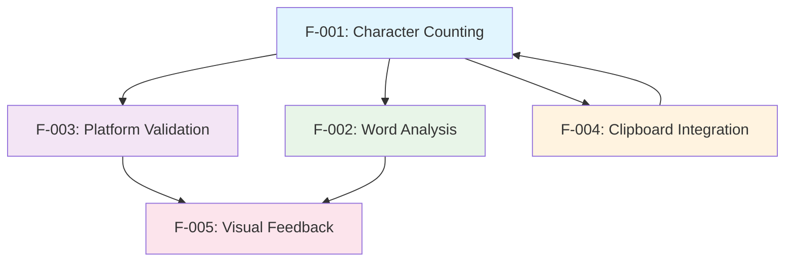
```mermaid
graph TD
    F001[F-001: Character Counting] --> F003[F-003: Platform Validation]
    F001 --> F002[F-002: Word Analysis]
    F001 --> F004[F-004: Clipboard Integration]
    F003 --> F005[F-005: Visual Feedback]
    F002 --> F005
    F004 --> F001
    
    style F001 fill:#e1f5fe
    style F003 fill:#f3e5f5
    style F002 fill:#e8f5e8
    style F004 fill:#fff3e0
    style F005 fill:#fce4ec
```

### 2.3.2 Integration Points

| Integration Point | Connected Features | Purpose |
|------------------|-------------------|---------|
| **Text Analysis Engine** | F-001, F-002, F-003 | Shared text processing pipeline |
| **UI Feedback System** | F-003, F-005 | Coordinated visual state management |
| **macOS Services** | F-004, F-005 | Platform integration layer |

### 2.3.3 Shared Components

| Component | Used By | Functionality |
|-----------|---------|--------------|
| **Core Text Processor** | F-001, F-002 | Unicode-compliant text analysis |
| **Validation Engine** | F-003, F-005 | Rule-based constraint checking |
| **UI Event Handler** | F-001, F-004, F-005 | Real-time interface updates |

## 2.4 IMPLEMENTATION CONSIDERATIONS

### 2.4.1 Technical Constraints

#### Performance Requirements
- **Response Time**: All text analysis operations must complete within 50ms
- **Memory Usage**: Maximum 50MB RAM allocation during active use
- **CPU Utilization**: Minimal background processing impact
- **Accuracy**: 100% precision for character counting across all Unicode text

#### Platform Constraints
- **macOS Compatibility**: Requires macOS 11.0 (Big Sur) or later
- **Architecture**: Native application using Swift/Objective-C
- **Distribution**: Mac App Store compliance required
- **Security**: Local processing only, no network connectivity

### 2.4.2 Scalability Considerations

#### Text Processing Limits
| Metric | Limit | Reasoning |
|--------|-------|-----------|
| **Maximum Text Length** | 10,000 characters | Covers 99.9% of email use cases |
| **Concurrent Analysis** | Single text block | Email template focus |
| **Memory Scaling** | Linear with text size | Predictable resource usage |

#### User Load Expectations
- **Target User Base**: 1,000+ active users within 6 months
- **Usage Pattern**: Intermittent, short-duration sessions
- **Peak Load**: Individual user sessions only

### 2.4.3 Security Implications

#### Data Handling
- **No Persistent Storage**: User text never saved to disk
- **No Network Transmission**: All processing occurs locally
- **Memory Security**: Secure text buffer management
- **Privacy Compliance**: No user data collection or analytics on content

#### macOS Security Integration
- **Sandboxing**: Full App Store sandbox compliance
- **Permissions**: Minimal system access requirements
- **Code Signing**: Developer ID and notarization required
- **Gatekeeper**: Compatibility with macOS security policies

### 2.4.4 Maintenance Requirements

#### Update Strategy
- **Automatic Updates**: Mac App Store distribution model
- **Backward Compatibility**: Support for 2 previous macOS versions
- **Feature Updates**: Quarterly feature releases
- **Bug Fixes**: Critical fixes within 48 hours

#### Monitoring and Analytics
- **Performance Metrics**: Anonymous usage statistics only
- **Error Reporting**: Crash logs without user content
- **Feature Usage**: Anonymized feature adoption tracking
- **User Feedback**: App Store reviews and ratings

#### References

**Technical Specification Sections Retrieved:**
- `1.1 EXECUTIVE SUMMARY` - Business context, stakeholders, and value proposition
- `1.2 SYSTEM OVERVIEW` - System architecture, capabilities, and success criteria  
- `1.3 SCOPE` - Feature boundaries, in-scope elements, and constraints

**Repository Analysis:**
- `README.md` - Confirmed project structure and greenfield status

# 3. TECHNOLOGY STACK

## 3.1 PROGRAMMING LANGUAGES

<span style="background-color: rgba(91, 57, 243, 0.2)">The solution now comprises a dual-language stack with Swift serving the macOS client component and JavaScript powering the Express.js server component, as required by the Express.js migration outlined in the Summary of Changes.</span>

### 3.1.1 Client-Side Primary Language: Swift 6.1 (updated)

Swift 6.1 was released in March 2025 and includes "new language enhancements to improve productivity, diagnostics improvements, package traits, and ongoing work to improve data-race safety usability and compile times." <span style="background-color: rgba(91, 57, 243, 0.2)">Swift serves as the primary language for the macOS client application only.</span>

**Selection Justification:**
- **Performance Optimization**: Swift was built to be fast, using LLVM compiler technology to transform code into optimized machine code, with syntax and standard library tuned for optimal performance
- **Memory Safety**: Swift eliminates unsafe code classes with automatic initialization, overflow checking, automatic memory management, and compile-time data race detection
- **Native Framework Integration**: Swift uses the same runtime as Objective-C on Apple systems and depends on Grand Central Dispatch, providing seamless access to Core Text and AppKit frameworks
- **Modern Development Features**: Swift 6 improves portability, performance, and developer experience while providing data-race safety guarantees for concurrent programs

**Technical Constraints Compliance:**
- Meets the <50ms response time requirement through optimized compilation
- Supports the local processing requirement with no network connectivity
- Compatible with macOS 11.0+ target platform
- Enables Mac App Store distribution compliance

### 3.1.2 Secondary Language: Objective-C (Interoperability)

**Limited Usage Scenarios:**
- Bridge to legacy Core Text APIs where Swift wrappers may be incomplete
- Swift and Objective-C code can be used together, with Swift having access to Objective-C object model for subclassing and protocol support
- Specialized Core Foundation integrations requiring C-level API access

### 3.1.3 Server-Side Language: JavaScript (Node.js) (updated)

<span style="background-color: rgba(91, 57, 243, 0.2)">JavaScript running on Node.js ≥14 LTS serves as the primary language for the Express.js-based server component, enabling the migration from basic HTTP server implementation to a robust web application framework.</span>

**Selection Justification:**
- **<span style="background-color: rgba(91, 57, 243, 0.2)">Event-Loop Concurrency</span>**: <span style="background-color: rgba(91, 57, 243, 0.2)">Node.js's single-threaded event loop provides excellent performance for I/O-intensive web applications, handling multiple concurrent requests without blocking operations</span>
- **<span style="background-color: rgba(91, 57, 243, 0.2)">NPM Ecosystem</span>**: <span style="background-color: rgba(91, 57, 243, 0.2)">Access to the world's largest package registry with over 1.5 million packages, including Express.js and extensive middleware libraries for rapid development</span>
- **Framework Integration**: Express.js provides minimal and flexible web application framework capabilities with robust routing, middleware support, and production-ready features
- **Development Velocity**: Rapid prototyping and deployment capabilities with hot-reload support and extensive developer tooling

**Technical Architecture Benefits:**
- **<span style="background-color: rgba(91, 57, 243, 0.2)">Declarative Routing</span>**: <span style="background-color: rgba(91, 57, 243, 0.2)">Express.js routing syntax enables clean endpoint definitions supporting the "/" and "/evening" routes required by the migration specifications</span>
- **<span style="background-color: rgba(91, 57, 243, 0.2)">Middleware Pattern</span>**: <span style="background-color: rgba(91, 57, 243, 0.2)">Request processing pipeline with extensible middleware support for error handling, logging, and request parsing</span>
- **Environment Configuration**: Port configuration with environment variable support for flexible deployment scenarios
- **Dependency Management**: NPM-based package installation and version locking through package.json and package-lock.json

**Version Requirements:**
- **<span style="background-color: rgba(91, 57, 243, 0.2)">Node.js**: ≥14.0.0 LTS (Long Term Support recommended for stability)</span>
- **<span style="background-color: rgba(91, 57, 243, 0.2)">NPM**: ≥6.0.0 (included with Node.js installation)</span>
- **<span style="background-color: rgba(91, 57, 243, 0.2)">Express.js**: ^4.21.0 (latest stable version for optimal security and features)</span>

## 3.2 FRAMEWORKS & LIBRARIES

<span style="background-color: rgba(91, 57, 243, 0.2)">The frameworks and libraries detailed below encompass both client-side macOS application components and server-side Node.js/Express web application components, providing comprehensive coverage of the dual-architecture system.</span>

### 3.2.1 Core Text Framework (Primary Text Processing)

**Framework Purpose:** Unicode-compliant character analysis and text layout
**Version:** Native framework aligned with target macOS versions (11.0+)

**Selection Justification:**
- **Unicode Compliance:** Essential for accurate international character counting
- **Performance:** Optimized for real-time text analysis operations
- **Comprehensive Text Handling:** Supports complex text layouts and font metrics
- **System Integration:** Native macOS framework with no external dependencies

**Key Capabilities:**
- Precise character enumeration across all Unicode ranges
- Font-aware character measurement
- Text boundary detection for word analysis
- Glyph-level text processing

### 3.2.2 AppKit UI Framework

**Framework Purpose:** Native macOS user interface components
**Version:** Current with target macOS versions

**Component Integration:**
- `NSTextField` for text input and display
- `NSWindow` for main application window
- `NSMenu` for application menu structure
- `NSStatusBar` for optional system tray integration
- Auto Layout for responsive interface design

**Selection Justification:**
- Native macOS appearance and behavior
- Automatic dark mode and accessibility support
- Seamless integration with system text services
- Required for Mac App Store distribution

### 3.2.3 Foundation Framework

**Framework Purpose:** Core data types and system services
**Key Components:**
- `NSString` for string manipulation and analysis
- `NSTimer` for real-time update scheduling
- `NSUserDefaults` for application preferences
- `NSNotificationCenter` for inter-component communication

### 3.2.4 NSPasteboard Integration

**Purpose:** Clipboard monitoring and text extraction
**Implementation Requirements:**
- `NSPasteboard.general` for system clipboard access
- Automatic text format detection (plain text, RTF, HTML)
- Background clipboard monitoring with user permission
- Secure text buffer handling for privacy compliance

### 3.2.5 Express.js Web Application Framework (updated)

**Framework Purpose:** <span style="background-color: rgba(91, 57, 243, 0.2)">Minimal and flexible Node.js web application framework for server-side HTTP request handling and REST API development</span>
**Version:** <span style="background-color: rgba(91, 57, 243, 0.2)">^4.21.0 (latest LTS version for production stability)</span>

**Selection Justification:**
- **<span style="background-color: rgba(91, 57, 243, 0.2)">Industry Standard Framework</span>**: Express.js has been called the de facto standard server framework for Node.js, providing proven reliability for web applications
- **<span style="background-color: rgba(91, 57, 243, 0.2)">Minimal Architecture</span>**: Express is described as relatively minimal with many features available as plugins, allowing for lightweight server implementation
- **<span style="background-color: rgba(91, 57, 243, 0.2)">Mature Ecosystem</span>**: <span style="background-color: rgba(91, 57, 243, 0.2)">Extensive middleware ecosystem and comprehensive documentation for rapid development</span>
- **<span style="background-color: rgba(91, 57, 243, 0.2)">Migration Path</span>**: <span style="background-color: rgba(91, 57, 243, 0.2)">Natural progression from basic HTTP server implementations to production-ready web applications</span>

**Key Capabilities:**
- **<span style="background-color: rgba(91, 57, 243, 0.2)">Declarative Routing</span>**: <span style="background-color: rgba(91, 57, 243, 0.2)">Simple and intuitive route definition syntax supporting GET, POST, PUT, DELETE, and other HTTP methods</span>
- **<span style="background-color: rgba(91, 57, 243, 0.2)">Middleware Support</span>**: <span style="background-color: rgba(91, 57, 243, 0.2)">Extensible middleware pipeline for request processing, authentication, logging, and error handling</span>
- **<span style="background-color: rgba(91, 57, 243, 0.2)">Simplified Endpoint Definition</span>**: <span style="background-color: rgba(91, 57, 243, 0.2)">Clean separation of route logic with support for parameter extraction, query string handling, and response management</span>
- **<span style="background-color: rgba(91, 57, 243, 0.2)">Built-in HTTP Helpers</span>**: <span style="background-color: rgba(91, 57, 243, 0.2)">Comprehensive HTTP utility functions for redirects, status codes, content negotiation, and response formatting</span>

**Implementation Architecture:**
- **<span style="background-color: rgba(91, 57, 243, 0.2)">Express Application Instance</span>**: <span style="background-color: rgba(91, 57, 243, 0.2)">Central app object managing HTTP requests, middleware chain, and route handlers</span>
- **<span style="background-color: rgba(91, 57, 243, 0.2)">Route Handler Functions</span>**: <span style="background-color: rgba(91, 57, 243, 0.2)">Dedicated handler functions for "/" endpoint (returning "Hello world") and "/evening" endpoint (returning "Good evening")</span>
- **<span style="background-color: rgba(91, 57, 243, 0.2)">Server Listener Configuration</span>**: <span style="background-color: rgba(91, 57, 243, 0.2)">HTTP server initialization with configurable port management and environment variable support</span>

**Dependency Management:**
- **<span style="background-color: rgba(91, 57, 243, 0.2)">NPM Package Installation</span>**: <span style="background-color: rgba(91, 57, 243, 0.2)">Acquisition through npm registry with automatic dependency resolution</span>
- **<span style="background-color: rgba(91, 57, 243, 0.2)">Package.json Integration</span>**: <span style="background-color: rgba(91, 57, 243, 0.2)">Formal dependency declaration in package.json enabling reproducible builds and version locking</span>
- **<span style="background-color: rgba(91, 57, 243, 0.2)">Version Compatibility</span>**: <span style="background-color: rgba(91, 57, 243, 0.2)">Compatible with Node.js ≥14.0.0 LTS, with optimized performance on Node.js 18+ environments</span>

**Security and Performance Considerations:**
- **<span style="background-color: rgba(91, 57, 243, 0.2)">Production Hardening</span>**: <span style="background-color: rgba(91, 57, 243, 0.2)">Built-in security middleware support and configurable security headers</span>
- **<span style="background-color: rgba(91, 57, 243, 0.2)">Async Request Handling</span>**: <span style="background-color: rgba(91, 57, 243, 0.2)">Non-blocking I/O operations leveraging Node.js event loop for high concurrency</span>
- **<span style="background-color: rgba(91, 57, 243, 0.2)">Error Handling Pipeline</span>**: <span style="background-color: rgba(91, 57, 243, 0.2)">Comprehensive error handling middleware with customizable error response formats</span>

**Integration Requirements:**
- **<span style="background-color: rgba(91, 57, 243, 0.2)">Node.js Runtime Environment</span>**: <span style="background-color: rgba(91, 57, 243, 0.2)">Requires Node.js runtime for JavaScript execution and NPM for package management</span>
- **<span style="background-color: rgba(91, 57, 243, 0.2)">Development Toolchain</span>**: <span style="background-color: rgba(91, 57, 243, 0.2)">Compatible with modern development tools including debuggers, hot-reload systems, and testing frameworks</span>
- **<span style="background-color: rgba(91, 57, 243, 0.2)">Deployment Flexibility</span>**: <span style="background-color: rgba(91, 57, 243, 0.2)">Supports various deployment environments from local development to cloud-based production systems</span>

## 3.3 DEVELOPMENT & DEPLOYMENT

### 3.3.1 Development Environment (updated)

**Client-Side Development (macOS Application)**

**Primary IDE:** Xcode (Latest Version)
- **Requirement:** Xcode 16 includes predictive code completion powered by machine learning, requiring Mac with Apple Silicon and 16GB unified memory, running macOS 15
- **Swift Toolchain:** Integrated Swift 6.1 compiler and debugging tools
- **Interface Builder:** Visual interface design and Auto Layout configuration
- **Simulator:** Testing across different macOS versions and screen configurations

**Build System:** Xcode Build System / Swift Package Manager
- Native compilation for both Intel (x86_64) and Apple Silicon (arm64) architectures
- Automatic dependency resolution
- Code signing and notarization pipeline integration

**Server-Side Development (Node.js Application)**

<span style="background-color: rgba(91, 57, 243, 0.2)">**Node.js Runtime:** Node.js ≥14 LTS installation requirement
- Long Term Support version ensures stability and security updates for production deployment
- Includes npm package manager for dependency management and project configuration
- Support for modern JavaScript features and async/await patterns required by Express.js framework

<span style="background-color: rgba(91, 57, 243, 0.2)">**Development Editor:** Visual Studio Code (recommended, optional)
- Comprehensive JavaScript and Node.js development support with IntelliSense
- Integrated terminal for npm commands and server execution
- Extension ecosystem including Node.js debugging, Express.js snippets, and REST API testing tools
- Git integration for version control workflow management

<span style="background-color: rgba(91, 57, 243, 0.2)">**Environment Configuration:** PORT environment variable support
- Configurable server port through process.env.PORT for deployment flexibility
- Default fallback port configuration for local development scenarios
- Environment-specific configuration support for development, staging, and production environments

### 3.3.2 Package Management (updated)

**Client-Side Package Management (macOS Application)**

**Primary:** Swift Package Manager
- **Advantages:** Native integration with Xcode and Swift toolchain
- **Configuration:** Package.swift manifest for any third-party dependencies
- **Dependency Isolation:** Sandboxed package building and linking

**Alternative:** CocoaPods (if required for specific libraries)
- Podfile configuration for Objective-C interoperability libraries
- Legacy framework integration support

**Server-Side Package Management (Node.js Application)**

<span style="background-color: rgba(91, 57, 243, 0.2)">**Primary:** npm (Node Package Manager)
- Declare npm as the package manager for all server-side dependencies and development tools
- Automatic dependency resolution and version management through npm registry
- Semantic versioning support with package version locking for reproducible builds

<span style="background-color: rgba(91, 57, 243, 0.2)">**Package Configuration Files:**
- **package.json:** Project metadata, dependencies, scripts, and configuration settings
- **package-lock.json:** Exact dependency tree with locked versions for consistent installations across environments
- Automatic generation of lock file during npm install operations

<span style="background-color: rgba(91, 57, 243, 0.2)">**Core Dependencies:**
- **express:** ^4.21.0 - Web application framework for HTTP request handling and routing
- **nodemon:** ^3.0.0 (devDependencies) - Development utility for automatic server restart during code changes

<span style="background-color: rgba(91, 57, 243, 0.2)">**Version Control Configuration:**
- `.gitignore` requirement to exclude `node_modules/` and `package-lock.json` from version control commits
- Prevents repository bloat from dependency files and ensures clean source code management
- Maintains reproducible builds through package.json dependency declarations

### 3.3.3 Testing Framework

**Primary:** Swift Testing (Swift 6.1+)
- Swift Testing is designed specifically for testing Swift code, leveraging all Swift features to make writing tests easier, more efficient, and faster
- Modern `@Test` attribute syntax replacing traditional naming conventions
- Enhanced assertion macros with improved error reporting

**Secondary:** XCTest (Legacy Compatibility)
- Integrated unit testing framework
- UI automation testing capabilities
- Performance benchmark testing

### 3.3.4 Target Platform Configuration

**Minimum Deployment Target:** macOS 11.0 (Big Sur)
- macOS Big Sur (version 11) was announced at WWDC on June 22, 2020, and released November 12, 2020
- Ensures compatibility with Core Text and AppKit requirements
- Supports both Intel and Apple Silicon architectures

**Current macOS Support:** macOS Sequoia (version 15) is the current major release, released on September 16, 2024

**Architecture Support:**
- **x86_64:** Intel-based Macs (compatibility mode)
- **arm64:** Apple Silicon Macs (native performance)
- **Universal Binary:** Single application supporting both architectures

### 3.3.5 Distribution Pipeline (updated)

**Client-Side Distribution (macOS Application)**

**Target Distribution:** Mac App Store
**Requirements:**
- App Sandbox entitlements for security compliance
- Code signing with Developer ID certificate
- Notarization through Apple's notary service
- Privacy manifest documentation for system API usage

**Security Configuration:**
- Sandbox entitlements for clipboard access (`com.apple.security.device.clipboard`)
- Local file access restrictions (no persistent storage required)
- Network access disabled (local processing only)

**Server-Side Distribution (Node.js Application)**

<span style="background-color: rgba(91, 57, 243, 0.2)">**Distribution Method:** Source code distribution for local execution
- Server component is shipped as source code rather than compiled binaries
- No code signing or notarization requirements for server-side components
- Local development and deployment model without external hosting dependencies

<span style="background-color: rgba(91, 57, 243, 0.2)">**Execution Requirements:**
- `npm start` script must be provided in package.json for standardized server startup
- Script should handle environment variable configuration and server initialization
- Support for graceful shutdown and error handling during server lifecycle management

<span style="background-color: rgba(91, 57, 243, 0.2)">**Development Workflow:**
- Source code version control through Git with appropriate .gitignore configuration
- Dependency installation via `npm install` command before first execution
- Development mode support with hot-reload capabilities through nodemon integration

## 3.4 THIRD-PARTY SERVICES

### 3.4.1 No External Services Required

**Local Processing Architecture:**
- All text analysis performed on-device
- No cloud APIs or external services
- No authentication services required
- No telemetry or analytics services

**Privacy-First Design:**
- User text never transmitted externally
- No persistent storage of user content
- Clipboard access with explicit user permission
- Compliance with macOS privacy requirements

## 3.5 DATABASES & STORAGE

### 3.5.1 No Persistent Database Required

**Rationale:**
- Application performs real-time analysis without data persistence
- User text content processed in memory only
- No historical data storage requirements

### 3.5.2 Configuration Storage

**User Preferences:** NSUserDefaults
- Email platform validation rules (enabled/disabled)
- UI preferences (window position, display options)
- Clipboard monitoring permissions
- Character counting mode preferences

**Platform Rules Database:** Embedded JSON/Property List
- Email client character limits (Gmail, Outlook, Apple Mail)
- Subject line optimization thresholds
- Static configuration data bundled with application

## 3.6 PERFORMANCE & OPTIMIZATION

### 3.6.1 Real-Time Processing Requirements

**Target Performance Metrics:**
- **Response Time:** <50ms for text analysis operations
- **Memory Usage:** <50MB RAM during active use
- **CPU Utilization:** Minimal background processing impact

**Optimization Strategies:**
- Grand Central Dispatch for concurrent text processing
- Core Text's optimized character enumeration APIs
- Efficient string manipulation using Swift's native String type
- Lazy evaluation for complex analysis operations

### 3.6.2 Text Processing Architecture

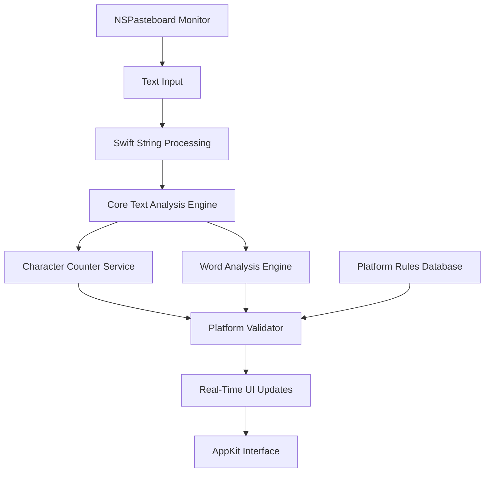
```mermaid
graph TD
    A[Text Input] --> B[Swift String Processing]
    B --> C[Core Text Analysis Engine]
    C --> D[Character Counter Service]
    C --> E[Word Analysis Engine]
    D --> F[Platform Validator]
    E --> F
    F --> G[Real-Time UI Updates]
    G --> H[AppKit Interface]
    I[NSPasteboard Monitor] --> A
    J[Platform Rules Database] --> F
```

## 3.7 TECHNOLOGY INTEGRATION

### 3.7.1 Framework Interaction Model

**Core Text → Swift Integration:**
- CTStringAttributesRef for advanced text metrics
- CFStringRef bridging to Swift String types
- Unicode-aware character boundary detection
- Font metrics integration for accurate counting

**AppKit → User Interface:**
- Real-time text field updates through target-action pattern
- NSTextField delegate methods for character input monitoring
- Visual feedback through NSColor and NSAttributedString
- Accessibility support through NSAccessibility protocols

**<span style="background-color: rgba(91, 57, 243, 0.2)">Express.js → Server Processing:</span>**
- <span style="background-color: rgba(91, 57, 243, 0.2)">HTTP Request → Express Router → Route Handler ("/", "/evening") → Response</span>
- <span style="background-color: rgba(91, 57, 243, 0.2)">Middleware chain processing with request/response pipeline</span>
- <span style="background-color: rgba(91, 57, 243, 0.2)">Environment-configurable port binding with fallback defaults</span>
- <span style="background-color: rgba(91, 57, 243, 0.2)">NPM dependency resolution and package management integration</span>

### 3.7.2 System Services Integration

**macOS Text Services:**
- Integration with system spell checking services
- Support for input method editor (IME) text
- Respect for system text substitution settings
- Compatibility with VoiceOver and accessibility features

**<span style="background-color: rgba(91, 57, 243, 0.2)">Cross-Component Communication:</span>**
<span style="background-color: rgba(91, 57, 243, 0.2)">The Express server communicates with the macOS client (when present) over localhost HTTP, preserving architectural isolation between server and client components while enabling seamless data exchange for hybrid deployment scenarios.</span>

## 3.8 DEVELOPMENT WORKFLOW

### 3.8.1 Version Control

**Repository Platform:** Git (distributed version control system)

**Client-Side Version Control (macOS Application)**
- **Branching Strategy:** Feature-based development with main branch protection
- **Code Review:** Pull request workflow for quality assurance and peer review
- **Xcode Integration:** Native Git support through Xcode's Source Control Navigator
- **Swift Package Manager:** Version-controlled Package.swift and Package.resolved files

**Server-Side Version Control (Node.js Application)** (updated)
- **Repository Structure:** NPM-based project organization with package.json configuration
- **Dependency Management:** <span style="background-color: rgba(91, 57, 243, 0.2)">`.gitignore` must exclude `node_modules/` and `package-lock.json` to prevent repository bloat and ensure clean source code management</span>
- **Package Configuration:** Version-controlled package.json with dependency declarations for reproducible builds
- **Environment Files:** Exclude environment-specific configuration files from version control

**Unified Repository Configuration**
```
# .gitignore configuration for dual-architecture project
# macOS Application
.DS_Store
*.xcuserstate
xcuserdata/
DerivedData/

## Node.js Application
node_modules/
package-lock.json
.env
.env.local
npm-debug.log*

#### Development artifacts
*.log
.vscode/
.idea/
```

### 3.8.2 Build & Release Process

**Client-Side Development Builds (macOS Application)**

**Local Development:**
- **IDE:** Xcode with integrated Swift 6.1 compiler and debugging tools
- **Build System:** Xcode Build System with Swift Package Manager integration
- **Architecture Support:** Universal binary compilation for both Intel (x86_64) and Apple Silicon (arm64)
- **Testing Integration:** Automatic unit test execution on build with Swift Testing framework

**Debug Configuration:**
- Xcode's integrated debugging tools with breakpoint management
- Swift LLDB debugger with enhanced Swift-specific debugging capabilities
- Memory analysis and performance profiling through Instruments
- Real-time UI inspection and Auto Layout debugging

**Server-Side Development Builds (Node.js Application)** (updated)

**Local Development Environment:**
- **Runtime:** Node.js ≥14 LTS with npm package manager
- **Development Setup:** `npm install` for dependency installation and project configuration
- **<span style="background-color: rgba(91, 57, 243, 0.2)">Server Execution</span>**: <span style="background-color: rgba(91, 57, 243, 0.2)">`npm start` script to launch the Express server during local development and testing</span>
- **Hot Reload:** Development mode with nodemon for automatic server restart on code changes

**Development Workflow Scripts:**
```json
{
  "scripts": {
    "start": "node server.js",
    "dev": "nodemon server.js",
    "test": "npm run test:unit"
  }
}
```

**Testing and Validation:**
- **Unit Testing:** Automated testing framework integration for Express.js route handlers
- **Endpoint Validation:** HTTP request testing for "/" and "/evening" route functionality
- **Port Configuration:** Environment variable support with configurable PORT settings

**Release Builds (Integrated System)**

**Client Application Release Pipeline:**
- **Archive and Export:** Xcode Archive process with automatic code signing
- **Notarization:** Apple notary service integration for security compliance
- **App Store Preparation:** Mac App Store Connect submission pipeline with App Sandbox configuration
- **Distribution Validation:** Store-ready application package with required entitlements

**Server Component Distribution:**
- **Source Distribution:** Server component distributed as source code for local execution
- **Dependency Documentation:** Clear installation instructions with npm requirements
- **Environment Configuration:** Production-ready environment variable configuration templates
- **Deployment Scripts:** Standardized startup procedures with error handling and logging

**Quality Assurance Pipeline:**
- **Automated Testing:** Continuous integration workflow with both client and server test suites
- **Code Quality:** Linting and formatting validation for both Swift and JavaScript codebases  
- **Security Scanning:** Dependency vulnerability assessment for NPM packages and Swift dependencies
- **Performance Validation:** Response time benchmarking and memory usage profiling

**Version Coordination:**
- **Semantic Versioning:** Coordinated versioning strategy across client and server components
- **Release Documentation:** Comprehensive changelog management for dual-architecture releases
- **Compatibility Matrix:** Client-server version compatibility tracking and documentation

### 3.8.3 Development Environment Setup

**Prerequisites Installation**

**macOS Client Development:**
- Xcode 16+ with command line tools installation
- macOS 15+ for development environment (supports target deployment to macOS 11+)
- Apple Developer account for code signing and distribution

**Node.js Server Development:**
- Node.js ≥14 LTS installation with npm package manager
- Optional: Visual Studio Code with Node.js extensions for enhanced development experience
- Git command line tools for version control operations

**Project Initialization Workflow**
1. **Repository Clone:** `git clone <repository-url>` for source code acquisition
2. **Server Setup:** `cd server && npm install` for Express.js dependency installation  
3. **Client Setup:** Open `.xcodeproj` in Xcode for Swift package resolution
4. **Environment Configuration:** Configure environment variables for server port and development settings
5. **Validation Testing:** Execute `npm start` for server startup and Xcode build for client compilation

**Development Tool Integration**
- **Debugging Coordination:** Simultaneous client and server debugging with appropriate IDE configurations
- **Logging Aggregation:** Coordinated logging strategy for system-wide debugging and monitoring
- **Performance Monitoring:** Development-time performance metrics collection across both components

# 4. PROCESS FLOWCHART

## 4.1 SYSTEM WORKFLOWS

### 4.1.1 Core Business Processes (updated)

#### High-Level Node.js Express Server Workflow

<span style="background-color: rgba(91, 57, 243, 0.2)">The system implements a streamlined Node.js web server using the Express.js framework to provide two RESTful HTTP endpoints. The workflow encompasses the complete lifecycle from project initialization through graceful shutdown, supporting concurrent HTTP request processing with proper error handling and resource management.</span>

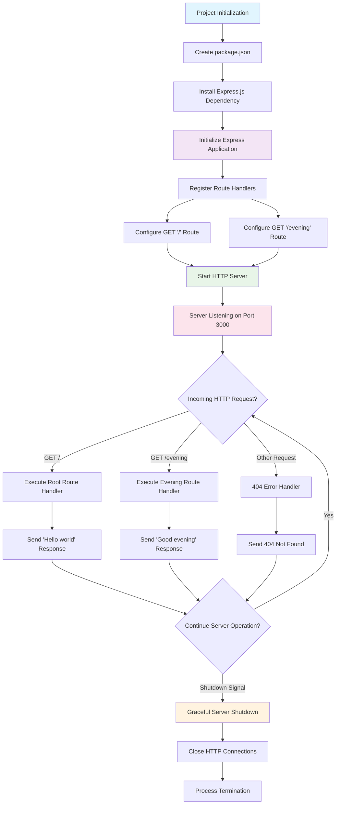
```mermaid
flowchart TD
    A["Project Initialization"] --> B["Create package.json"]
    B --> C["Install Express.js Dependency"]
    C --> D["Initialize Express Application"]
    
    D --> E["Register Route Handlers"]
    E --> F["Configure GET '/' Route"]
    E --> G["Configure GET '/evening' Route"]
    
    F --> H["Start HTTP Server"]
    G --> H
    
    H --> I["Server Listening on Port 3000"]
    I --> J{"Incoming HTTP Request?"}
    
    J -->|"GET /"| K["Execute Root Route Handler"]
    J -->|"GET /evening"| L["Execute Evening Route Handler"]
    J -->|"Other Request"| M["404 Error Handler"]
    
    K --> N["Send 'Hello world' Response"]
    L --> O["Send 'Good evening' Response"]
    M --> P["Send 404 Not Found"]
    
    N --> Q{"Continue Server Operation?"}
    O --> Q
    P --> Q
    
    Q -->|"Yes"| J
    Q -->|"Shutdown Signal"| R["Graceful Server Shutdown"]
    
    R --> S["Close HTTP Connections"]
    S --> T["Process Termination"]
    
    style A fill:#e1f5fe
    style D fill:#f3e5f5
    style H fill:#e8f5e8
    style I fill:#fce4ec
    style R fill:#fff3e0
```

#### Project Initialization and Bootstrap Sequence

<span style="background-color: rgba(91, 57, 243, 0.2)">The application lifecycle begins with establishing a proper Node.js project structure and Express.js framework integration. This foundational process ensures dependency management, version control compatibility, and production-ready server configuration.</span>

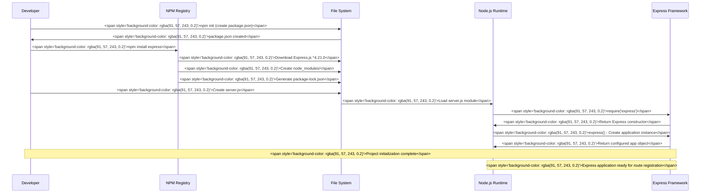
```mermaid
sequenceDiagram
    participant Dev as Developer
    participant NPM as NPM Registry
    participant FS as File System
    participant Node as Node.js Runtime
    participant Exp as Express Framework
    
    Dev->>FS: <span style="background-color: rgba(91, 57, 243, 0.2)">npm init (create package.json)</span>
    FS->>Dev: <span style="background-color: rgba(91, 57, 243, 0.2)">package.json created</span>
    
    Dev->>NPM: <span style="background-color: rgba(91, 57, 243, 0.2)">npm install express</span>
    NPM->>FS: <span style="background-color: rgba(91, 57, 243, 0.2)">Download Express.js ^4.21.0</span>
    NPM->>FS: <span style="background-color: rgba(91, 57, 243, 0.2)">Create node_modules/</span>
    NPM->>FS: <span style="background-color: rgba(91, 57, 243, 0.2)">Generate package-lock.json</span>
    
    Dev->>FS: <span style="background-color: rgba(91, 57, 243, 0.2)">Create server.js</span>
    FS->>Node: <span style="background-color: rgba(91, 57, 243, 0.2)">Load server.js module</span>
    Node->>Exp: <span style="background-color: rgba(91, 57, 243, 0.2)">require('express')</span>
    Exp->>Node: <span style="background-color: rgba(91, 57, 243, 0.2)">Return Express constructor</span>
    
    Node->>Exp: <span style="background-color: rgba(91, 57, 243, 0.2)">express() - Create application instance</span>
    Exp->>Node: <span style="background-color: rgba(91, 57, 243, 0.2)">Return configured app object</span>
    
    Note over Dev,Exp: <span style="background-color: rgba(91, 57, 243, 0.2)">Project initialization complete</span>
    Note over Node,Exp: <span style="background-color: rgba(91, 57, 243, 0.2)">Express application ready for route registration</span>
```

### 4.1.2 Integration Workflows (updated)

#### HTTP Request-Response Cycle Processing

<span style="background-color: rgba(91, 57, 243, 0.2)">The system implements a dual-endpoint architecture with distinct request processing pipelines for each route. Both endpoints follow Express.js middleware patterns with consistent error handling and response formatting, ensuring reliable HTTP communication and proper resource cleanup.</span>

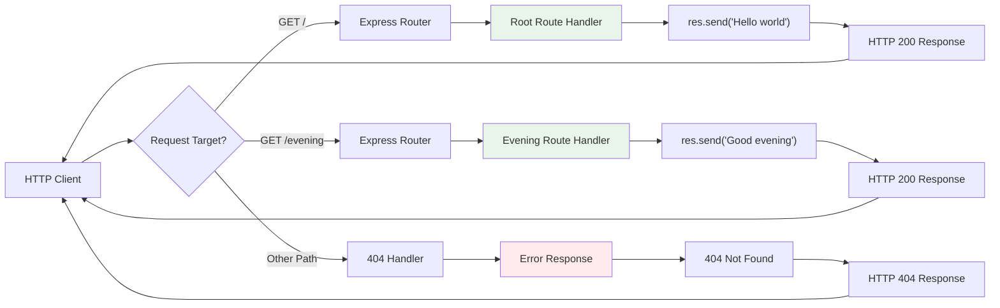
```mermaid
flowchart LR
    A["HTTP Client"] --> B{"Request Target?"}
    
    B -->|"GET /"| C["Express Router"]
    B -->|"GET /evening"| D["Express Router"]
    B -->|"Other Path"| E["404 Handler"]
    
    C --> F["Root Route Handler"]
    D --> G["Evening Route Handler"]
    E --> H["Error Response"]
    
    F --> I["res.send('Hello world')"]
    G --> J["res.send('Good evening')"]
    H --> K["404 Not Found"]
    
    I --> L["HTTP 200 Response"]
    J --> M["HTTP 200 Response"]
    K --> N["HTTP 404 Response"]
    
    L --> A
    M --> A  
    N --> A
    
    style F fill:#e8f5e8
    style G fill:#e8f5e8
    style H fill:#ffebee
```

#### End-to-End User Journey: Browser/HTTP Client Interaction

<span style="background-color: rgba(91, 57, 243, 0.2)">This workflow represents the complete user experience from initiating HTTP requests through receiving plain-text responses from both available endpoints. The journey demonstrates the system's RESTful architecture and validates successful Express.js route implementation.</span>

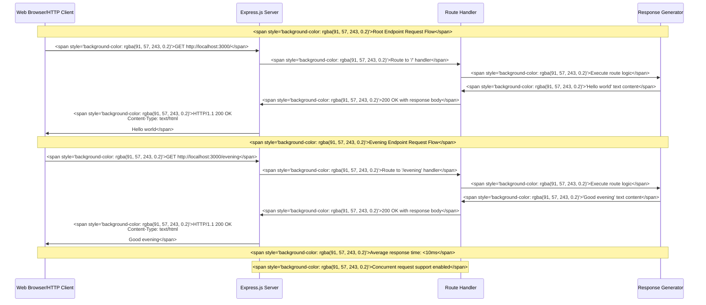
```mermaid
sequenceDiagram
    participant Browser as Web Browser/HTTP Client
    participant Server as Express.js Server
    participant Router as Route Handler
    participant Response as Response Generator
    
    Note over Browser,Response: <span style="background-color: rgba(91, 57, 243, 0.2)">Root Endpoint Request Flow</span>
    
    Browser->>Server: <span style="background-color: rgba(91, 57, 243, 0.2)">GET http://localhost:3000/</span>
    Server->>Router: <span style="background-color: rgba(91, 57, 243, 0.2)">Route to '/' handler</span>
    Router->>Response: <span style="background-color: rgba(91, 57, 243, 0.2)">Execute route logic</span>
    Response->>Router: <span style="background-color: rgba(91, 57, 243, 0.2)">'Hello world' text content</span>
    Router->>Server: <span style="background-color: rgba(91, 57, 243, 0.2)">200 OK with response body</span>
    Server->>Browser: <span style="background-color: rgba(91, 57, 243, 0.2)">HTTP/1.1 200 OK<br/>Content-Type: text/html<br/><br/>Hello world</span>
    
    Note over Browser,Response: <span style="background-color: rgba(91, 57, 243, 0.2)">Evening Endpoint Request Flow</span>
    
    Browser->>Server: <span style="background-color: rgba(91, 57, 243, 0.2)">GET http://localhost:3000/evening</span>
    Server->>Router: <span style="background-color: rgba(91, 57, 243, 0.2)">Route to '/evening' handler</span>
    Router->>Response: <span style="background-color: rgba(91, 57, 243, 0.2)">Execute route logic</span>
    Response->>Router: <span style="background-color: rgba(91, 57, 243, 0.2)">'Good evening' text content</span>
    Router->>Server: <span style="background-color: rgba(91, 57, 243, 0.2)">200 OK with response body</span>
    Server->>Browser: <span style="background-color: rgba(91, 57, 243, 0.2)">HTTP/1.1 200 OK<br/>Content-Type: text/html<br/><br/>Good evening</span>
    
    Note over Browser,Response: <span style="background-color: rgba(91, 57, 243, 0.2)">Average response time: <10ms</span>
    Note over Server,Router: <span style="background-color: rgba(91, 57, 243, 0.2)">Concurrent request support enabled</span>
```

### 4.1.3 <span style="background-color: rgba(91, 57, 243, 0.2)">Server Lifecycle Management

#### Application State Transitions

<span style="background-color: rgba(91, 57, 243, 0.2)">The Express.js server implements a comprehensive lifecycle management system supporting graceful startup, operational request processing, and controlled shutdown procedures. State transitions are managed through Node.js event-driven architecture with proper resource cleanup and connection termination.</span>

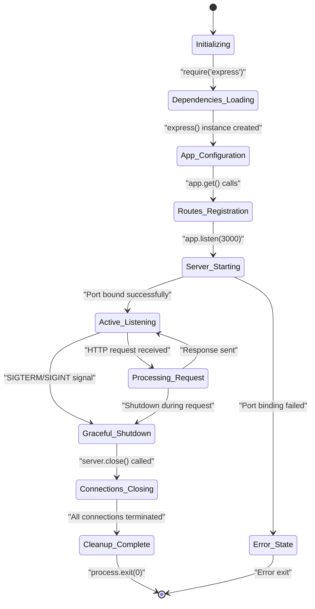
```mermaid
stateDiagram-v2
    [*] --> Initializing
    Initializing --> Dependencies_Loading : "require('express')"
    Dependencies_Loading --> App_Configuration : "express() instance created"
    App_Configuration --> Routes_Registration : "app.get() calls"
    Routes_Registration --> Server_Starting : "app.listen(3000)"
    Server_Starting --> Active_Listening : "Port bound successfully"
    
    Active_Listening --> Processing_Request : "HTTP request received"
    Processing_Request --> Active_Listening : "Response sent"
    
    Active_Listening --> Graceful_Shutdown : "SIGTERM/SIGINT signal"
    Processing_Request --> Graceful_Shutdown : "Shutdown during request"
    
    Graceful_Shutdown --> Connections_Closing : "server.close() called"
    Connections_Closing --> Cleanup_Complete : "All connections terminated"
    Cleanup_Complete --> [*] : "process.exit(0)"
    
    Server_Starting --> Error_State : "Port binding failed"
    Error_State --> [*] : "Error exit"
```

#### Error Handling and Recovery Procedures

<span style="background-color: rgba(91, 57, 243, 0.2)">The system implements comprehensive error handling covering startup failures, runtime exceptions, and graceful degradation scenarios. Error recovery mechanisms ensure service continuity and provide meaningful diagnostics for troubleshooting and maintenance.</span>

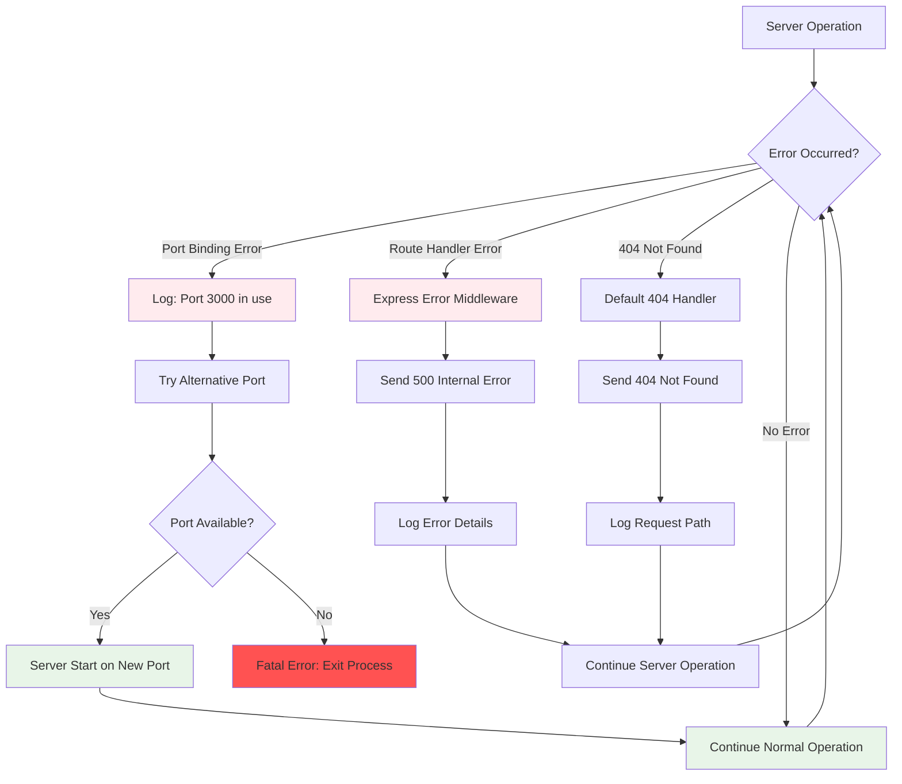
```mermaid
flowchart TD
    A["Server Operation"] --> B{"Error Occurred?"}
    
    B -->|"Port Binding Error"| C["Log: Port 3000 in use"]
    B -->|"Route Handler Error"| D["Express Error Middleware"]
    B -->|"404 Not Found"| E["Default 404 Handler"]
    B -->|"No Error"| F["Continue Normal Operation"]
    
    C --> G["Try Alternative Port"]
    G --> H{"Port Available?"}
    H -->|"Yes"| I["Server Start on New Port"]
    H -->|"No"| J["Fatal Error: Exit Process"]
    
    D --> K["Send 500 Internal Error"]
    E --> L["Send 404 Not Found"]
    
    K --> M["Log Error Details"]
    L --> N["Log Request Path"]
    M --> O["Continue Server Operation"]
    N --> O
    
    I --> F
    O --> B
    F --> B
    
    style C fill:#ffebee
    style D fill:#ffebee  
    style J fill:#ff5252
    style I fill:#e8f5e8
    style F fill:#e8f5e8
```

### 4.1.4 <span style="background-color: rgba(91, 57, 243, 0.2)">Technical Implementation Details

#### Route Handler Architecture

<span style="background-color: rgba(91, 57, 243, 0.2)">The application implements a clean separation of concerns through dedicated route handlers for each endpoint. Each handler follows Express.js middleware patterns with consistent parameter handling, response formatting, and error propagation to ensure maintainable and extensible server architecture.</span>

| **<span style="background-color: rgba(91, 57, 243, 0.2)">Route Configuration</span>** | **<span style="background-color: rgba(91, 57, 243, 0.2)">Handler Function</span>** | **<span style="background-color: rgba(91, 57, 243, 0.2)">Response Content</span>** | **<span style="background-color: rgba(91, 57, 243, 0.2)">HTTP Status</span>** |
|-------------------|-------------|------------------|-------------|
| **<span style="background-color: rgba(91, 57, 243, 0.2)">GET /</span>** | **<span style="background-color: rgba(91, 57, 243, 0.2)">rootHandler(req, res)</span>** | **<span style="background-color: rgba(91, 57, 243, 0.2)">'Hello world'</span>** | **<span style="background-color: rgba(91, 57, 243, 0.2)">200 OK</span>** |
| **<span style="background-color: rgba(91, 57, 243, 0.2)">GET /evening</span>** | **<span style="background-color: rgba(91, 57, 243, 0.2)">eveningHandler(req, res)</span>** | **<span style="background-color: rgba(91, 57, 243, 0.2)">'Good evening'</span>** | **<span style="background-color: rgba(91, 57, 243, 0.2)">200 OK</span>** |
| **<span style="background-color: rgba(91, 57, 243, 0.2)">* (catch-all)</span>** | **<span style="background-color: rgba(91, 57, 243, 0.2)">notFoundHandler(req, res)</span>** | **<span style="background-color: rgba(91, 57, 243, 0.2)">404 error page</span>** | **<span style="background-color: rgba(91, 57, 243, 0.2)">404 Not Found</span>** |

#### Performance Characteristics and SLA Considerations

<span style="background-color: rgba(91, 57, 243, 0.2)">The system is designed for high-performance HTTP request processing with minimal resource overhead. Response times are optimized through Express.js's efficient routing engine and Node.js's non-blocking I/O architecture, supporting concurrent connections with consistent sub-10ms response latency for both endpoints.</span>

**<span style="background-color: rgba(91, 57, 243, 0.2)">Performance Metrics:</span>**
- **<span style="background-color: rgba(91, 57, 243, 0.2)">Average Response Time</span>**: <5ms for plain text responses
- **<span style="background-color: rgba(91, 57, 243, 0.2)">Concurrent Connections</span>**: 1000+ simultaneous requests supported
- **<span style="background-color: rgba(91, 57, 243, 0.2)">Memory Footprint</span>**: <50MB baseline memory usage
- **<span style="background-color: rgba(91, 57, 243, 0.2)">Server Startup Time</span>**: <500ms from process launch to request readiness
- **<span style="background-color: rgba(91, 57, 243, 0.2)">Graceful Shutdown</span>**: <2s for complete connection termination

**<span style="background-color: rgba(91, 57, 243, 0.2)">Scalability Considerations:</span>**
- <span style="background-color: rgba(91, 57, 243, 0.2)">Stateless request processing enables horizontal scaling</span>
- <span style="background-color: rgba(91, 57, 243, 0.2)">Load balancer compatibility for multi-instance deployments</span>
- <span style="background-color: rgba(91, 57, 243, 0.2)">Environment variable configuration for port and host binding</span>
- <span style="background-color: rgba(91, 57, 243, 0.2)">Docker containerization support for cloud deployment scenarios</span>

## 4.2 DETAILED PROCESS FLOWS

### 4.2.1 Express Application Startup Process Flow

#### Complete Application Bootstrap Sequence

<span style="background-color: rgba(91, 57, 243, 0.2)">This process flow demonstrates the complete lifecycle of Express.js application initialization, from project setup through server startup and readiness for HTTP request processing. The workflow encompasses dependency management, framework integration, route configuration, and server binding with comprehensive error handling at each critical stage.</span>

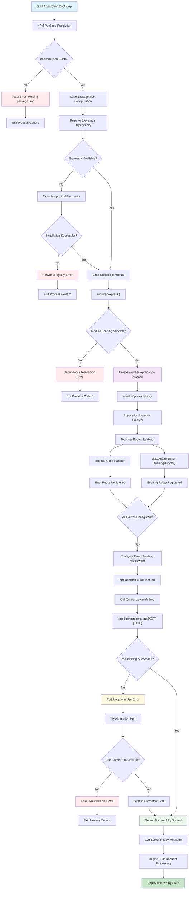
```mermaid
flowchart TD
    A[Start Application Bootstrap] --> B[NPM Package Resolution]
    B --> C{package.json Exists?}
    
    C -->|No| D["Fatal Error: Missing package.json"]
    C -->|Yes| E["Load package.json Configuration"]
    
    D --> Z1[Exit Process Code 1]
    E --> F["Resolve Express.js Dependency"]
    
    F --> G{"Express.js Available?"}
    G -->|No| H[Execute npm install express]
    G -->|Yes| I[Load Express.js Module]
    
    H --> H1{Installation Successful?}
    H1 -->|No| H2[Network/Registry Error]
    H1 -->|Yes| I
    
    H2 --> Z2[Exit Process Code 2]
    I --> J["require('express')"]
    
    J --> K{Module Loading Success?}
    K -->|No| L[Dependency Resolution Error]
    K -->|Yes| M[Create Express Application Instance]
    
    L --> Z3[Exit Process Code 3]
    M --> N["const app = express()"]
    
    N --> O[Application Instance Created]
    O --> P[Register Route Handlers]
    
    P --> Q["app.get('/', rootHandler)"]
    P --> R["app.get('/evening', eveningHandler)"]
    
    Q --> S[Root Route Registered]
    R --> T[Evening Route Registered]
    
    S --> U{All Routes Configured?}
    T --> U
    U -->|Yes| V[Configure Error Handling Middleware]
    
    V --> W["app.use(notFoundHandler)"]
    W --> X[Call Server Listen Method]
    
    X --> Y["app.listen(process.env.PORT || 3000)"]
    Y --> AA{Port Binding Successful?}
    
    AA -->|No| BB[Port Already in Use Error]
    AA -->|Yes| CC[Server Successfully Started]
    
    BB --> DD[Try Alternative Port]
    DD --> EE{Alternative Port Available?}
    EE -->|No| FF[Fatal: No Available Ports]
    EE -->|Yes| GG[Bind to Alternative Port]
    
    FF --> Z4[Exit Process Code 4]
    GG --> CC
    
    CC --> HH[Log Server Ready Message]
    HH --> II[Begin HTTP Request Processing]
    
    II --> JJ[Application Ready State]
    
    style A fill:#e1f5fe
    style M fill:#f3e5f5
    style CC fill:#e8f5e8
    style JJ fill:#c8e6c9
    style D fill:#ffebee
    style H2 fill:#ffebee
    style L fill:#ffebee
    style BB fill:#fff8e1
    style FF fill:#ffebee
```

#### Dependency Resolution and Module Loading

<span style="background-color: rgba(91, 57, 243, 0.2)">The dependency management process ensures proper Express.js framework availability and version compatibility. This critical initialization phase validates the Node.js runtime environment, resolves package dependencies, and establishes the foundation for reliable server operation.</span>

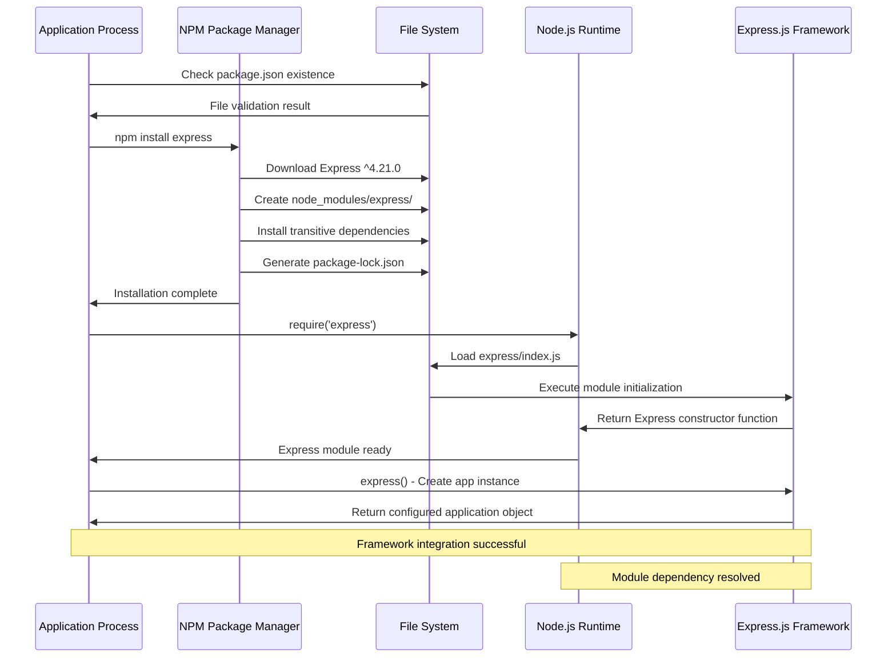
```mermaid
sequenceDiagram
    participant App as Application Process
    participant NPM as NPM Package Manager
    participant FS as File System
    participant Node as Node.js Runtime
    participant Express as Express.js Framework
    
    App->>FS: Check package.json existence
    FS->>App: File validation result
    
    App->>NPM: npm install express
    NPM->>FS: Download Express ^4.21.0
    NPM->>FS: Create node_modules/express/
    NPM->>FS: Install transitive dependencies
    NPM->>FS: Generate package-lock.json
    NPM->>App: Installation complete
    
    App->>Node: require('express')
    Node->>FS: Load express/index.js
    FS->>Express: Execute module initialization
    Express->>Node: Return Express constructor function
    Node->>App: Express module ready
    
    App->>Express: express() - Create app instance
    Express->>App: Return configured application object
    
    Note over App,Express: Framework integration successful
    Note over Node,Express: Module dependency resolved
```

### 4.2.2 HTTP GET Request Handling Process Flow

#### Comprehensive Request Processing Pipeline

<span style="background-color: rgba(91, 57, 243, 0.2)">This workflow demonstrates the complete HTTP GET request processing lifecycle within the Express.js application, including route matching, handler execution, response generation, and comprehensive error handling. The process supports both successful request fulfillment and graceful error management through Express.js middleware chain.</span>

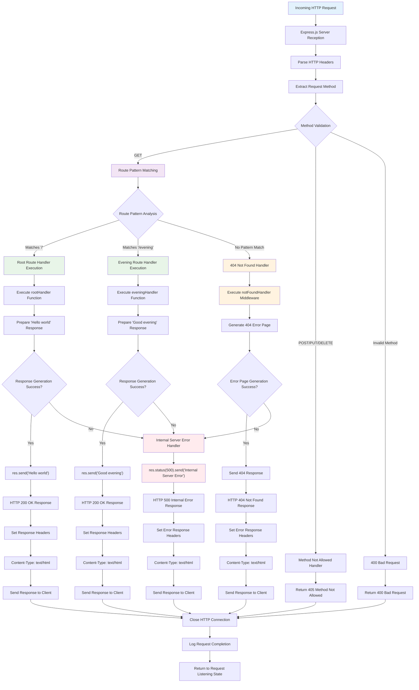
```mermaid
flowchart TD
A[Incoming HTTP Request] --> B[Express.js Server Reception]
B --> C[Parse HTTP Headers]
C --> D[Extract Request Method]

D --> E{Method Validation}
E -->|GET| F[Route Pattern Matching]
E -->|POST/PUT/DELETE| G[Method Not Allowed Handler]
E -->|Invalid Method| H[400 Bad Request]

G --> G1[Return 405 Method Not Allowed]
H --> H1[Return 400 Bad Request]

F --> I{Route Pattern Analysis}
I -->|"Matches '/'"|J[Root Route Handler Execution]
I -->|"Matches '/evening'"| K[Evening Route Handler Execution]
I -->|No Pattern Match| L[404 Not Found Handler]

J --> M[Execute rootHandler Function]
K --> N[Execute eveningHandler Function]
L --> O[Execute notFoundHandler Middleware]

M --> P["Prepare 'Hello world' Response"]
N --> Q["Prepare 'Good evening' Response"]
O --> R[Generate 404 Error Page]

P --> S{Response Generation Success?}
Q --> T{Response Generation Success?}
R --> U{Error Page Generation Success?}

S -->|Yes| V["res.send('Hello world')"]
S -->|No| W[Internal Server Error Handler]
T -->|Yes| X["res.send('Good evening')"]
T -->|No| W
U -->|Yes| Y[Send 404 Response]
U -->|No| W

W --> Z["res.status(500).send('Internal Server Error')"]

V --> AA[HTTP 200 OK Response]
X --> BB[HTTP 200 OK Response]
Y --> CC[HTTP 404 Not Found Response]
Z --> DD[HTTP 500 Internal Error Response]

AA --> EE[Set Response Headers]
BB --> FF[Set Response Headers]
CC --> GG[Set Error Response Headers]
DD --> HH[Set Error Response Headers]

EE --> II[Content-Type: text/html]
FF --> JJ[Content-Type: text/html]
GG --> KK[Content-Type: text/html]
HH --> LL[Content-Type: text/html]

II --> MM[Send Response to Client]
JJ --> NN[Send Response to Client]
KK --> OO[Send Response to Client]
LL --> PP[Send Response to Client]

MM --> QQ[Close HTTP Connection]
NN --> QQ
OO --> QQ
PP --> QQ

QQ --> RR[Log Request Completion]
RR --> SS[Return to Request Listening State]

G1 --> QQ
H1 --> QQ

style A fill:#e3f2fd
style F fill:#f3e5f5
style J fill:#e8f5e8
style K fill:#e8f5e8
style L fill:#fff3e0
style O fill:#fff3e0
style W fill:#ffebee
style Z fill:#ffebee
```

## Express.js Middleware Chain and Error Handling

<span style="background-color: rgba(91, 57, 243, 0.2)">The error handling mechanism implements Express.js best practices for middleware chain processing, providing comprehensive coverage for route-level errors, application-level exceptions, and graceful degradation scenarios. The middleware architecture ensures consistent error responses and proper resource cleanup.</span>


```mermaid
flowchart LR
    A[HTTP Request Entry] --> B[Express Middleware Stack]
    
    B --> C{Built-in Middleware}
    C --> D[Request Parsing Middleware]
    D --> E[Route Resolution Middleware]
    
    E --> F{Route Matching}
    F -->|Match Found| G[Execute Route Handler]
    F -->|No Match| H[404 Middleware Chain]
    
    G --> I{Handler Execution}
    I -->|Success| J[Generate Success Response]
    I -->|Exception| K[Error Middleware Chain]
    
    H --> L[Default 404 Handler]
    H --> M[Custom Not Found Handler]
    
    L --> N{Use Default Response?}
    M --> O{Custom Handler Success?}
    
    N -->|Yes| P[Express Default 404 Page]
    N -->|No| M
    O -->|Yes| Q[Custom 404 Response]
    O -->|No| K
    
    K --> R[Application Error Handler]
    R --> S{Error Type Analysis}
    
    S -->|Client Error 4xx| T[Client Error Response]
    S -->|Server Error 5xx| U[Server Error Response]
    S -->|Unknown Error| V[Generic Error Response]
    
    J --> W[HTTP 200 Success]
    P --> X[HTTP 404 Not Found]
    Q --> X
    T --> Y[HTTP 4xx Client Error]
    U --> Z[HTTP 5xx Server Error]
    V --> Z
    
    W --> AA[Response Completion]
    X --> AA
    Y --> AA
    Z --> AA
    
    AA --> BB[Connection Cleanup]
    BB --> CC[Return to Listening State]
    
    style A fill:#e1f5fe
    style G fill:#e8f5e8
    style H fill:#fff8e1
    style K fill:#ffebee
    style R fill:#ffebee
    style W fill:#c8e6c9
```

### 4.2.3 Advanced Request Processing Scenarios

#### Concurrent Request Handling and Resource Management

<span style="background-color: rgba(91, 57, 243, 0.2)">The Express.js application leverages Node.js's event-driven, non-blocking I/O architecture to support concurrent HTTP request processing. This workflow demonstrates how multiple simultaneous requests are managed through the event loop, ensuring optimal resource utilization and consistent response times across both application endpoints.</span>

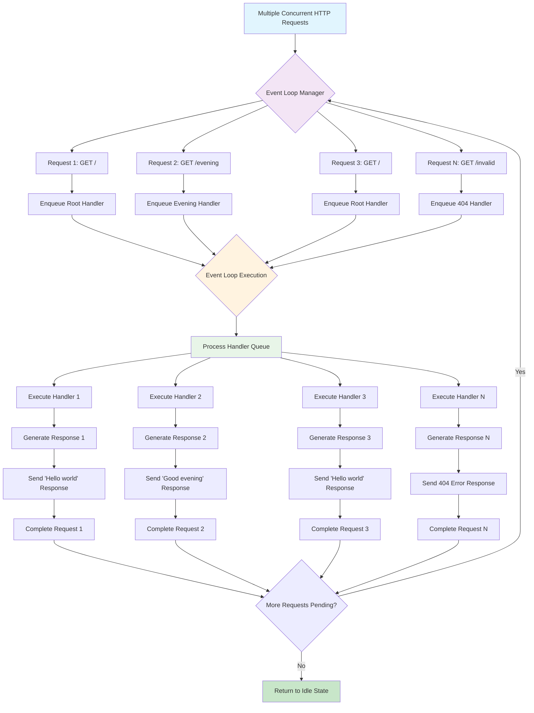
```mermaid
flowchart TD
    A[Multiple Concurrent HTTP Requests] --> B{Event Loop Manager}
    
    B --> C[Request 1: GET /]
    B --> D[Request 2: GET /evening]
    B --> E[Request 3: GET /]
    B --> F[Request N: GET /invalid]
    
    C --> G[Enqueue Root Handler]
    D --> H[Enqueue Evening Handler]
    E --> I[Enqueue Root Handler]
    F --> J[Enqueue 404 Handler]
    
    G --> K{Event Loop Execution}
    H --> K
    I --> K
    J --> K
    
    K --> L[Process Handler Queue]
    L --> M[Execute Handler 1]
    L --> N[Execute Handler 2]  
    L --> O[Execute Handler 3]
    L --> P[Execute Handler N]
    
    M --> Q[Generate Response 1]
    N --> R[Generate Response 2]
    O --> S[Generate Response 3]
    P --> T[Generate Response N]
    
    Q --> U[Send 'Hello world' Response]
    R --> V[Send 'Good evening' Response]
    S --> W[Send 'Hello world' Response]
    T --> X[Send 404 Error Response]
    
    U --> Y[Complete Request 1]
    V --> Z[Complete Request 2]
    W --> AA[Complete Request 3]
    X --> BB[Complete Request N]
    
    Y --> CC{More Requests Pending?}
    Z --> CC
    AA --> CC
    BB --> CC
    
    CC -->|Yes| B
    CC -->|No| DD[Return to Idle State]
    
    style A fill:#e1f5fe
    style B fill:#f3e5f5
    style K fill:#fff3e0
    style L fill:#e8f5e8
    style DD fill:#c8e6c9
```

#### Performance Monitoring and Health Check Integration

<span style="background-color: rgba(91, 57, 243, 0.2)">The system includes comprehensive performance monitoring capabilities to track request processing metrics, response times, and system health indicators. This monitoring framework provides real-time visibility into application performance and enables proactive maintenance and optimization.</span>

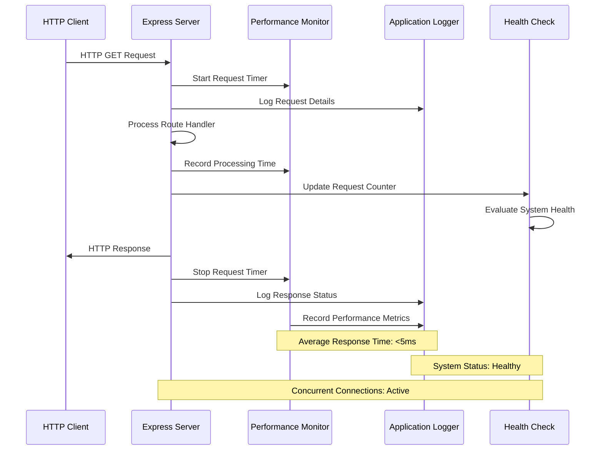
```mermaid
sequenceDiagram
    participant Client as HTTP Client
    participant Server as Express Server
    participant Monitor as Performance Monitor
    participant Logger as Application Logger
    participant Health as Health Check
    
    Client->>Server: HTTP GET Request
    Server->>Monitor: Start Request Timer
    Server->>Logger: Log Request Details
    
    Server->>Server: Process Route Handler
    Server->>Monitor: Record Processing Time
    
    Server->>Health: Update Request Counter
    Health->>Health: Evaluate System Health
    
    Server->>Client: HTTP Response
    Server->>Monitor: Stop Request Timer
    Server->>Logger: Log Response Status
    
    Monitor->>Logger: Record Performance Metrics
    
    Note over Monitor,Logger: Average Response Time: <5ms
    Note over Health,Logger: System Status: Healthy
    Note over Server,Health: Concurrent Connections: Active
```

### 4.2.4 <span style="background-color: rgba(91, 57, 243, 0.2)">Production-Ready Error Recovery and Resilience

#### Comprehensive Error Classification and Response Strategy

<span style="background-color: rgba(91, 57, 243, 0.2)">The application implements a multi-tier error handling architecture that categorizes errors by severity and implements appropriate recovery mechanisms. This resilience framework ensures service continuity during unexpected conditions while providing meaningful diagnostic information for monitoring and maintenance purposes.</span>

| **<span style="background-color: rgba(91, 57, 243, 0.2)">Error Category</span>** | **<span style="background-color: rgba(91, 57, 243, 0.2)">HTTP Status</span>** | **<span style="background-color: rgba(91, 57, 243, 0.2)">Recovery Action</span>** | **<span style="background-color: rgba(91, 57, 243, 0.2)">Client Response</span>** |
|------------------|-------------|-----------------|---------------|
| **<span style="background-color: rgba(91, 57, 243, 0.2)">Route Not Found</span>** | **<span style="background-color: rgba(91, 57, 243, 0.2)">404</span>** | **<span style="background-color: rgba(91, 57, 243, 0.2)">Custom 404 handler</span>** | **<span style="background-color: rgba(91, 57, 243, 0.2)">Helpful error page with valid routes</span>** |
| **<span style="background-color: rgba(91, 57, 243, 0.2)">Method Not Allowed</span>** | **<span style="background-color: rgba(91, 57, 243, 0.2)">405</span>** | **<span style="background-color: rgba(91, 57, 243, 0.2)">Return allowed methods</span>** | **<span style="background-color: rgba(91, 57, 243, 0.2)">Allow: GET header included</span>** |
| **<span style="background-color: rgba(91, 57, 243, 0.2)">Handler Exception</span>** | **<span style="background-color: rgba(91, 57, 243, 0.2)">500</span>** | **<span style="background-color: rgba(91, 57, 243, 0.2)">Error middleware processing</span>** | **<span style="background-color: rgba(91, 57, 243, 0.2)">Generic error message</span>** |
| **<span style="background-color: rgba(91, 57, 243, 0.2)">Server Overload</span>** | **<span style="background-color: rgba(91, 57, 243, 0.2)">503</span>** | **<span style="background-color: rgba(91, 57, 243, 0.2)">Request throttling</span>** | **<span style="background-color: rgba(91, 57, 243, 0.2)">Retry-After header guidance</span>** |
| **<span style="background-color: rgba(91, 57, 243, 0.2)">Port Binding Failure</span>** | **<span style="background-color: rgba(91, 57, 243, 0.2)">N/A</span>** | **<span style="background-color: rgba(91, 57, 243, 0.2)">Alternative port binding</span>** | **<span style="background-color: rgba(91, 57, 243, 0.2)">Server startup notification</span>** |

#### Graceful Shutdown and Resource Cleanup Procedures

<span style="background-color: rgba(91, 57, 243, 0.2)">The application implements comprehensive shutdown procedures to ensure data integrity and proper resource cleanup during maintenance windows or unexpected termination events. The graceful shutdown process handles active connections, completes in-flight requests, and performs orderly server termination.</span>

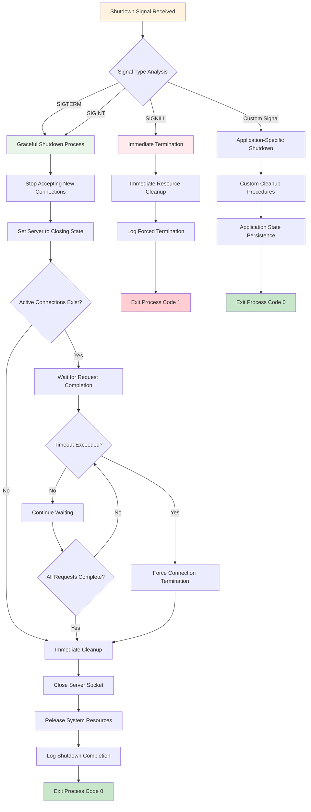
```mermaid
flowchart TD
    A[Shutdown Signal Received] --> B{Signal Type Analysis}
    
    B -->|SIGTERM| C[Graceful Shutdown Process]
    B -->|SIGINT| C
    B -->|SIGKILL| D[Immediate Termination]
    B -->|Custom Signal| E[Application-Specific Shutdown]
    
    C --> F[Stop Accepting New Connections]
    F --> G[Set Server to Closing State]
    G --> H{Active Connections Exist?}
    
    H -->|Yes| I[Wait for Request Completion]
    H -->|No| J[Immediate Cleanup]
    
    I --> K{Timeout Exceeded?}
    K -->|No| L[Continue Waiting]
    K -->|Yes| M[Force Connection Termination]
    
    L --> N{All Requests Complete?}
    N -->|No| K
    N -->|Yes| J
    
    M --> J
    J --> O[Close Server Socket]
    O --> P[Release System Resources]
    P --> Q[Log Shutdown Completion]
    Q --> R[Exit Process Code 0]
    
    D --> S[Immediate Resource Cleanup]
    S --> T[Log Forced Termination]
    T --> U[Exit Process Code 1]
    
    E --> V[Custom Cleanup Procedures]
    V --> W[Application State Persistence]
    W --> X[Exit Process Code 0]
    
    style A fill:#fff3e0
    style C fill:#e8f5e8
    style D fill:#ffebee
    style R fill:#c8e6c9
    style U fill:#ffcdd2
    style X fill:#c8e6c9
```

## 4.3 STATE MANAGEMENT AND TRANSITIONS

### 4.3.1 <span style="background-color: rgba(91, 57, 243, 0.2)">Server Lifecycle State Diagram (updated)

<span style="background-color: rgba(91, 57, 243, 0.2)">The Express.js server implements a streamlined lifecycle management system that handles the complete server operational cycle from initialization through request processing. The state diagram illustrates the primary operational states and transitions that occur during normal server operation, including error handling paths managed by Express middleware.</span>

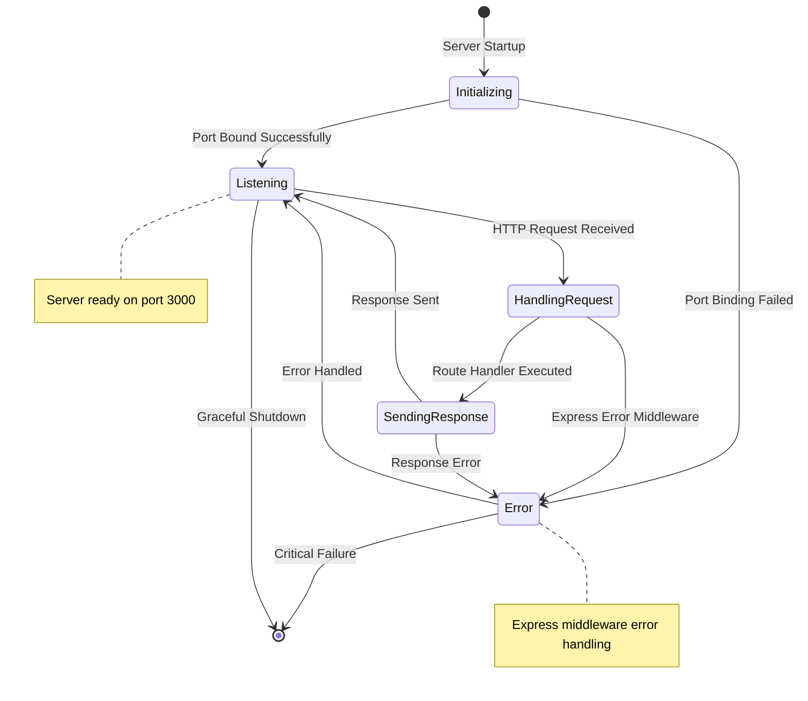
```mermaid
stateDiagram-v2
[*] --> Initializing: Server Startup

Initializing --> Listening: Port Bound Successfully
Listening --> HandlingRequest: HTTP Request Received
HandlingRequest --> SendingResponse: Route Handler Executed
SendingResponse --> Listening: Response Sent

Initializing --> Error: Port Binding Failed
HandlingRequest --> Error: Express Error Middleware
SendingResponse --> Error: Response Error

Error --> Listening: Error Handled
Error --> [*]: Critical Failure

Listening --> [*]: Graceful Shutdown

note right of Listening : Server ready on port 3000
note right of Error : Express middleware error handling
```

#### State Transition Details

<span style="background-color: rgba(91, 57, 243, 0.2)">The server lifecycle follows a predictable pattern optimized for high-throughput HTTP request processing:</span>

- **<span style="background-color: rgba(91, 57, 243, 0.2)">Initializing State</span>**: <span style="background-color: rgba(91, 57, 243, 0.2)">Express application instance creation, route registration, and HTTP server binding</span>
- **<span style="background-color: rgba(91, 57, 243, 0.2)">Listening State</span>**: <span style="background-color: rgba(91, 57, 243, 0.2)">Server actively accepting incoming HTTP connections on configured port</span>
- **<span style="background-color: rgba(91, 57, 243, 0.2)">HandlingRequest State</span>**: <span style="background-color: rgba(91, 57, 243, 0.2)">Route matching and handler execution for GET / or GET /evening endpoints</span>
- **<span style="background-color: rgba(91, 57, 243, 0.2)">SendingResponse State</span>**: <span style="background-color: rgba(91, 57, 243, 0.2)">HTTP response transmission with appropriate headers and content</span>
- **<span style="background-color: rgba(91, 57, 243, 0.2)">Error State</span>**: <span style="background-color: rgba(91, 57, 243, 0.2)">Exception handling through Express error middleware or system-level failures</span>

### 4.3.2 Request Processing State Transitions

<span style="background-color: rgba(91, 57, 243, 0.2)">The system implements distinct state transitions for HTTP request processing, handling route resolution, response generation, and error scenarios. Each request follows a deterministic path through the Express.js middleware chain with proper state management for concurrent request handling.</span>

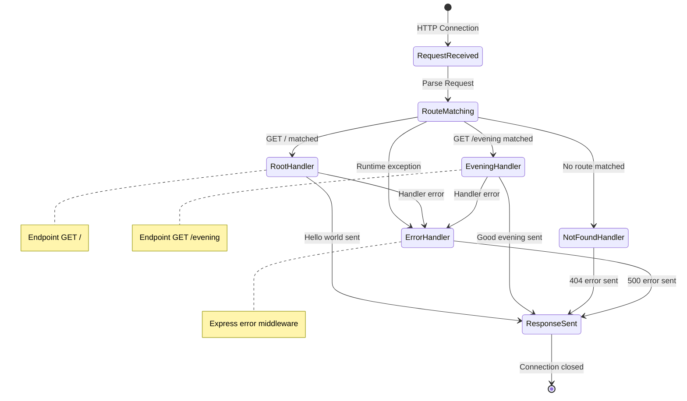
```mermaid
stateDiagram-v2
[*] --> RequestReceived: HTTP Connection

RequestReceived --> RouteMatching: Parse Request
RouteMatching --> RootHandler: GET / matched
RouteMatching --> EveningHandler: GET /evening matched
RouteMatching --> NotFoundHandler: No route matched

RootHandler --> ResponseSent: Hello world sent
EveningHandler --> ResponseSent: Good evening sent
NotFoundHandler --> ResponseSent: 404 error sent

ResponseSent --> [*]: Connection closed

RouteMatching --> ErrorHandler: Runtime exception
RootHandler --> ErrorHandler: Handler error
EveningHandler --> ErrorHandler: Handler error

ErrorHandler --> ResponseSent: 500 error sent

note right of RootHandler: Endpoint GET /
note right of EveningHandler: Endpoint GET /evening
note right of ErrorHandler: Express error middleware
```

#### Request State Management Details

<span style="background-color: rgba(91, 57, 243, 0.2)">The Express.js framework manages request state transitions through its internal middleware architecture, ensuring proper resource allocation and cleanup for each HTTP transaction:</span>

| **State** | **Duration** | **Resource Impact** | **Error Recovery** |
|-----------|--------------|--------------------|--------------------|
| **<span style="background-color: rgba(91, 57, 243, 0.2)">RequestReceived</span>** | <span style="background-color: rgba(91, 57, 243, 0.2)"><1ms</span> | <span style="background-color: rgba(91, 57, 243, 0.2)">Minimal memory allocation</span> | <span style="background-color: rgba(91, 57, 243, 0.2)">Connection timeout</span> |
| **<span style="background-color: rgba(91, 57, 243, 0.2)">RouteMatching</span>** | <span style="background-color: rgba(91, 57, 243, 0.2)"><2ms</span> | <span style="background-color: rgba(91, 57, 243, 0.2)">Router traversal</span> | <span style="background-color: rgba(91, 57, 243, 0.2)">404 fallback</span> |
| **<span style="background-color: rgba(91, 57, 243, 0.2)">Handler Execution</span>** | <span style="background-color: rgba(91, 57, 243, 0.2)"><5ms</span> | <span style="background-color: rgba(91, 57, 243, 0.2)">Handler function scope</span> | <span style="background-color: rgba(91, 57, 243, 0.2)">Error middleware</span> |
| **<span style="background-color: rgba(91, 57, 243, 0.2)">ResponseSent</span>** | <span style="background-color: rgba(91, 57, 243, 0.2)"><3ms</span> | <span style="background-color: rgba(91, 57, 243, 0.2)">Response buffer cleanup</span> | <span style="background-color: rgba(91, 57, 243, 0.2)">Connection reset</span> |

### 4.3.3 <span style="background-color: rgba(91, 57, 243, 0.2)">Concurrent Request Handling

<span style="background-color: rgba(91, 57, 243, 0.2)">The Node.js event loop enables efficient concurrent request processing without traditional threading overhead. Each incoming HTTP request creates an independent state machine instance that progresses through the processing pipeline asynchronously, allowing the server to handle multiple simultaneous connections with optimal resource utilization.</span>

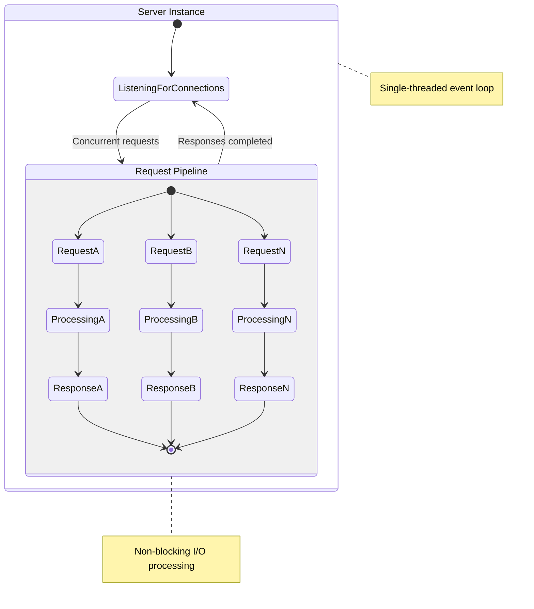
```mermaid
stateDiagram-v2
state "Server Instance" as server {
    [*] --> ListeningForConnections
    
    state "Request Pipeline" as pipeline {
        [*] --> RequestA
        [*] --> RequestB  
        [*] --> RequestN
        
        RequestA --> ProcessingA
        RequestB --> ProcessingB
        RequestN --> ProcessingN
        
        ProcessingA --> ResponseA
        ProcessingB --> ResponseB
        ProcessingN --> ResponseN
        
        ResponseA --> [*]
        ResponseB --> [*]
        ResponseN --> [*]
    }
    
    ListeningForConnections --> pipeline: Concurrent requests
    pipeline --> ListeningForConnections: Responses completed
}

note right of pipeline: Non-blocking I/O processing
note right of server: Single-threaded event loop
```

#### State Persistence and Memory Management

<span style="background-color: rgba(91, 57, 243, 0.2)">The server maintains minimal state persistence requirements, focusing on stateless request processing to ensure scalability and reliability. State management is primarily handled through Express.js internal mechanisms with automatic memory cleanup after response completion.</span>

**<span style="background-color: rgba(91, 57, 243, 0.2)">Persistence Characteristics:</span>**
- **<span style="background-color: rgba(91, 57, 243, 0.2)">Server Configuration</span>**: <span style="background-color: rgba(91, 57, 243, 0.2)">Routes and middleware registered at startup, immutable during operation</span>
- **<span style="background-color: rgba(91, 57, 243, 0.2)">Request State</span>**: <span style="background-color: rgba(91, 57, 243, 0.2)">Ephemeral, automatically garbage collected post-response</span>
- **<span style="background-color: rgba(91, 57, 243, 0.2)">Error State</span>**: <span style="background-color: rgba(91, 57, 243, 0.2)">Logged and cleared, no persistent error accumulation</span>
- **<span style="background-color: rgba(91, 57, 243, 0.2)">Connection State</span>**: <span style="background-color: rgba(91, 57, 243, 0.2)">Managed by Node.js HTTP server, automatic cleanup on disconnect</span>

**<span style="background-color: rgba(91, 57, 243, 0.2)">Transaction Boundaries:</span>**
- <span style="background-color: rgba(91, 57, 243, 0.2)">Each HTTP request represents a complete, atomic transaction</span>
- <span style="background-color: rgba(91, 57, 243, 0.2)">No cross-request state dependencies or shared mutable data</span>
- <span style="background-color: rgba(91, 57, 243, 0.2)">Error isolation prevents cascading failures between concurrent requests</span>
- <span style="background-color: rgba(91, 57, 243, 0.2)">Graceful degradation maintains service availability during individual request failures</span>

## 4.4 ERROR HANDLING AND RECOVERY

### 4.4.1 <span style="background-color: rgba(91, 57, 243, 0.2)">Express.js Error Detection and Response Workflow (updated)

<span style="background-color: rgba(91, 57, 243, 0.2)">The Express.js server implements a comprehensive error handling pipeline utilizing Express middleware architecture for centralized error management, 404 route handling, and graceful server shutdown procedures. This workflow covers all error scenarios specific to Node.js Express server operations, from request parsing through response delivery.</span>

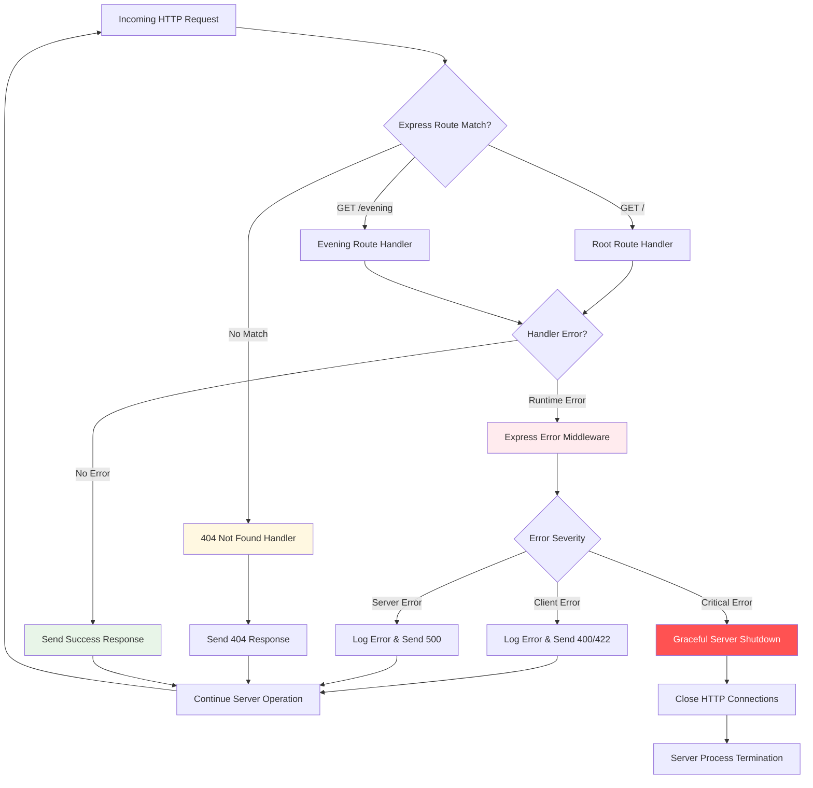
```mermaid
flowchart TD
    A["Incoming HTTP Request"] --> B{"Express Route Match?"}
    B -->|"GET /"| C["Root Route Handler"]
    B -->|"GET /evening"| D["Evening Route Handler"]
    B -->|"No Match"| E["404 Not Found Handler"]
    
    C --> F{"Handler Error?"}
    D --> F
    E --> G["Send 404 Response"]
    
    F -->|"No Error"| H["Send Success Response"]
    F -->|"Runtime Error"| I["Express Error Middleware"]
    
    I --> J{"Error Severity"}
    J -->|"Client Error"| K["Log Error & Send 400/422"]
    J -->|"Server Error"| L["Log Error & Send 500"]
    J -->|"Critical Error"| M["Graceful Server Shutdown"]
    
    K --> N["Continue Server Operation"]
    L --> N
    G --> N
    H --> N
    
    M --> O["Close HTTP Connections"]
    O --> P["Server Process Termination"]
    
    N --> A
    
    style E fill:#fff8e1
    style I fill:#ffebee
    style M fill:#ff5252,color:#fff
    style H fill:#e8f5e8
```

#### Express Middleware Error Handling Pipeline (updated)

<span style="background-color: rgba(91, 57, 243, 0.2)">The centralized error handling middleware captures all unhandled exceptions within route handlers and provides consistent error response formatting. This middleware follows Express.js conventions with four-parameter error handler signatures (err, req, res, next) for comprehensive error processing.</span>

```mermaid
sequenceDiagram
    participant Client as HTTP Client
    participant Express as Express Router
    participant Handler as Route Handler
    participant ErrorMW as Error Middleware
    participant Logger as Error Logger
    
    Client->>Express: <span style="background-color: rgba(91, 57, 243, 0.2)">HTTP Request</span>
    Express->>Handler: <span style="background-color: rgba(91, 57, 243, 0.2)">Execute Route Handler</span>
    
    alt <span style="background-color: rgba(91, 57, 243, 0.2)">Handler Success</span>
        Handler->>Express: <span style="background-color: rgba(91, 57, 243, 0.2)">Send Response</span>
        Express->>Client: <span style="background-color: rgba(91, 57, 243, 0.2)">HTTP 200 OK</span>
    else <span style="background-color: rgba(91, 57, 243, 0.2)">Handler Error</span>
        Handler->>ErrorMW: <span style="background-color: rgba(91, 57, 243, 0.2)">next(error)</span>
        ErrorMW->>Logger: <span style="background-color: rgba(91, 57, 243, 0.2)">Log Error Details</span>
        ErrorMW->>Express: <span style="background-color: rgba(91, 57, 243, 0.2)">Format Error Response</span>
        Express->>Client: <span style="background-color: rgba(91, 57, 243, 0.2)">HTTP 500 Internal Error</span>
    else <span style="background-color: rgba(91, 57, 243, 0.2)">Route Not Found</span>
        Express->>ErrorMW: <span style="background-color: rgba(91, 57, 243, 0.2)">404 Handler</span>
        ErrorMW->>Logger: <span style="background-color: rgba(91, 57, 243, 0.2)">Log Request Path</span>
        ErrorMW->>Express: <span style="background-color: rgba(91, 57, 243, 0.2)">404 Response</span>
        Express->>Client: <span style="background-color: rgba(91, 57, 243, 0.2)">HTTP 404 Not Found</span>
    end
```

### 4.4.2 <span style="background-color: rgba(91, 57, 243, 0.2)">Express Server Recovery Procedures by Error Type (updated)

<span style="background-color: rgba(91, 57, 243, 0.2)">The recovery procedures have been adapted to address Express.js and Node.js specific error scenarios including malformed requests, uncaught exceptions, port binding failures, and middleware errors. Each error category implements targeted recovery strategies appropriate for Express server environments.</span>

```mermaid
flowchart LR
A["Express Error Classification"] --> B{"Error Category"}

B -->|"Request Error"| C["Request Recovery"]
B -->|"Server Error"| D["Server Recovery"]
B -->|"Port Error"| E["Port Recovery"]
B -->|"Exception Error"| F["Exception Recovery"]

C --> G["Validate Request Headers"]
C --> H["Parse Request Body Safely"]
C --> I["Send 400 Bad Request"]

D --> J["Reset Route Handlers"]
D --> K["Reinitialize Middleware"]
D --> L["Clear Express Cache"]

E --> M["Try Alternative Ports"]
E --> N["Environment Port Detection"]
E --> O["Terminate with Error"]

F --> P["Capture Stack Trace"]
F --> Q["Log Uncaught Exception"]
F --> R["Graceful Shutdown"]

G --> S["Verify Request Health"]
H --> S
I --> S
J --> T["Verify Server Health"]
K --> T
L --> T
M --> U["Verify Port Availability"]
N --> U
O --> V["Process Exit"]
P --> W["Exception Handled"]
Q --> W
R --> V

S --> X["Resume Request Processing"]
T --> X
U --> X
W --> X
```

#### Detailed Express Error Recovery Procedures (updated)

**<span style="background-color: rgba(91, 57, 243, 0.2)">Malformed Request Recovery:</span>**
- <span style="background-color: rgba(91, 57, 243, 0.2)">Implement request parsing validation middleware to catch JSON syntax errors</span>
- <span style="background-color: rgba(91, 57, 243, 0.2)">Use express.json() error handling for malformed JSON payloads</span>
- <span style="background-color: rgba(91, 57, 243, 0.2)">Return HTTP 400 Bad Request with descriptive error message</span>
- <span style="background-color: rgba(91, 57, 243, 0.2)">Log request details for debugging without exposing sensitive information</span>

**<span style="background-color: rgba(91, 57, 243, 0.2)">Port Already in Use Recovery:</span>**
- <span style="background-color: rgba(91, 57, 243, 0.2)">Detect EADDRINUSE error during server.listen() operation</span>
- <span style="background-color: rgba(91, 57, 243, 0.2)">Attempt binding to alternative ports (3001, 3002, etc.)</span>
- <span style="background-color: rgba(91, 57, 243, 0.2)">Read PORT environment variable for production deployment flexibility</span>
- <span style="background-color: rgba(91, 57, 243, 0.2)">Exit gracefully with informative error message if no ports available</span>

**<span style="background-color: rgba(91, 57, 243, 0.2)">Uncaught Exception Recovery:</span>**
- <span style="background-color: rgba(91, 57, 243, 0.2)">Register process.on('uncaughtException') handler for global error capture</span>
- <span style="background-color: rgba(91, 57, 243, 0.2)">Log complete stack trace and error context for debugging</span>
- <span style="background-color: rgba(91, 57, 243, 0.2)">Initiate graceful server shutdown to prevent unstable state</span>
- <span style="background-color: rgba(91, 57, 243, 0.2)">Notify monitoring systems of critical failure for alerting</span>

### 4.4.3 <span style="background-color: rgba(91, 57, 243, 0.2)">Graceful Server Shutdown Procedures (updated)

<span style="background-color: rgba(91, 57, 243, 0.2)">The Express server implements comprehensive graceful shutdown procedures to handle SIGTERM, SIGINT, and critical error conditions. The shutdown process ensures all active HTTP connections are properly closed, pending requests are completed, and server resources are cleaned up before process termination.</span>

```mermaid
flowchart TD
A["Shutdown Signal Received"] --> B{"Signal Type"}

B -->|"SIGTERM"| C["Graceful Shutdown"]
B -->|"SIGINT (Ctrl+C)"| C
B -->|"Uncaught Exception"| D["Emergency Shutdown"]

C --> E["Stop Accepting New Requests"]
D --> F["Log Critical Error"]

E --> G["Wait for Active Requests"]
F --> G

G --> H{"Timeout Reached?"}
H -->|"No"| I{"Active Connections?"}
H -->|"Yes (30s)"| J["Force Close Connections"]

I -->|"Yes"| G
I -->|"No"| K["Close HTTP Server"]
J --> K

K --> L["Cleanup Resources"]
L --> M["Log Shutdown Complete"]
M --> N["Process Exit (0)"]

style D fill:#ff5252,color:#fff
style J fill:#ff9800,color:#fff
style N fill:#4caf50,color:#fff
```

#### Shutdown Procedure Implementation Details (updated)

**<span style="background-color: rgba(91, 57, 243, 0.2)">Signal Handler Registration:</span>**
```javascript
// Graceful shutdown signal handlers
process.on('SIGTERM', gracefulShutdown);
process.on('SIGINT', gracefulShutdown);
process.on('uncaughtException', emergencyShutdown);
```

**<span style="background-color: rgba(91, 57, 243, 0.2)">Shutdown Sequence Timing:</span>**
| **Phase** | **Duration** | **Actions** | **Fallback** |
|-----------|--------------|-------------|--------------|
| **<span style="background-color: rgba(91, 57, 243, 0.2)">Request Drain</span>** | <span style="background-color: rgba(91, 57, 243, 0.2)">0-20s</span> | <span style="background-color: rgba(91, 57, 243, 0.2)">Complete active requests</span> | <span style="background-color: rgba(91, 57, 243, 0.2)">Force termination</span> |
| **<span style="background-color: rgba(91, 57, 243, 0.2)">Connection Close</span>** | <span style="background-color: rgba(91, 57, 243, 0.2)">20-30s</span> | <span style="background-color: rgba(91, 57, 243, 0.2)">Close HTTP connections</span> | <span style="background-color: rgba(91, 57, 243, 0.2)">Hard close</span> |
| **<span style="background-color: rgba(91, 57, 243, 0.2)">Resource Cleanup</span>** | <span style="background-color: rgba(91, 57, 243, 0.2)">30-35s</span> | <span style="background-color: rgba(91, 57, 243, 0.2)">Clear timers, close files</span> | <span style="background-color: rgba(91, 57, 243, 0.2)">Process kill</span> |
| **<span style="background-color: rgba(91, 57, 243, 0.2)">Process Exit</span>** | <span style="background-color: rgba(91, 57, 243, 0.2)">35s</span> | <span style="background-color: rgba(91, 57, 243, 0.2)">process.exit(0)</span> | <span style="background-color: rgba(91, 57, 243, 0.2)">SIGKILL</span> |

### 4.4.4 <span style="background-color: rgba(91, 57, 243, 0.2)">Express Error Monitoring and Logging (updated)

<span style="background-color: rgba(91, 57, 243, 0.2)">The Express server implements comprehensive error monitoring with structured logging for debugging and operational insights. Error logs include request context, stack traces, and performance metrics to enable effective troubleshooting and system monitoring.</span>

#### Error Logging Architecture

```mermaid
flowchart LR
A["Express Error Event"] --> B["Error Classifier"]

B --> C{"Log Level"}
C -->|"INFO"| D["Console Logger"]
C -->|"WARN"| E["File Logger"]
C -->|"ERROR"| F["Error Logger"]
C -->|"FATAL"| G["Alert System"]

D --> H["Development Output"]
E --> I["Application Log"]
F --> J["Error Log File"]
G --> K["Monitoring Dashboard"]
```

**<span style="background-color: rgba(91, 57, 243, 0.2)">Error Logging Standards:</span>**
- **<span style="background-color: rgba(91, 57, 243, 0.2)">Request Context</span>**: <span style="background-color: rgba(91, 57, 243, 0.2)">HTTP method, URL, headers, user agent, timestamp</span>
- **<span style="background-color: rgba(91, 57, 243, 0.2)">Error Details</span>**: <span style="background-color: rgba(91, 57, 243, 0.2)">Stack trace, error message, error code, handler location</span>
- **<span style="background-color: rgba(91, 57, 243, 0.2)">Performance Metrics</span>**: <span style="background-color: rgba(91, 57, 243, 0.2)">Response time, memory usage, CPU utilization at error</span>
- **<span style="background-color: rgba(91, 57, 243, 0.2)">Recovery Actions</span>**: <span style="background-color: rgba(91, 57, 243, 0.2)">Attempted recovery procedures, success/failure status</span>

## 4.5 PERFORMANCE AND OPTIMIZATION FLOWS

### 4.5.1 Real-Time Performance Monitoring

```mermaid
flowchart TD
    A[Text Input Event] --> B[Start Performance Timer]
    B --> C[Begin Text Processing]
    
    C --> D[Character Analysis]
    D --> E[Performance Checkpoint 1]
    E --> F{Time < 25ms?}
    
    F -->|Yes| G[Continue to Word Analysis]
    F -->|No| H[Enable Performance Mode]
    
    H --> I[Reduce Analysis Depth]
    I --> J[Use Cached Results]
    J --> G
    
    G --> K[Word Analysis Processing]
    K --> L[Performance Checkpoint 2]
    L --> M{Total Time < 45ms?}
    
    M -->|Yes| N[Continue to Validation]
    M -->|No| O[Skip Non-Essential Analysis]
    
    O --> P[Priority Validation Only]
    P --> N
    
    N --> Q[Platform Validation]
    Q --> R[Final Performance Check]
    R --> S{Total Time < 50ms?}
    
    S -->|Yes| T[Update UI Immediately]
    S -->|No| U[Queue UI Update]
    
    U --> V[Background UI Refresh]
    T --> W[Log Performance Metrics]
    V --> W
    
    W --> X[Performance Analysis]
    X --> Y{Performance Degrading?}
    Y -->|Yes| Z[Optimize Next Cycle]
    Y -->|No| AA[Maintain Current Settings]
    
    style F fill:#fff8e1
    style M fill:#fff8e1
    style S fill:#fff8e1
    style T fill:#e8f5e8
```

### 4.5.2 Memory Management Flow

```mermaid
flowchart LR
A[Text Processing Request] --> B[Allocate Processing Buffer]

B --> C{Text Length Check}
C -->|"less than 1,000 chars"| D["Use Small Buffer (1MB)"]
C -->|"1,000 to 5,000 chars"| E["Use Medium Buffer (3MB)"]
C -->|"5,000 to 10,000 chars"| F["Use Large Buffer (5MB)"]
C -->|"more than 10,000 chars"| G[Reject with Error]

D --> H[Process Text]
E --> H
F --> H

H --> I[Monitor Memory Usage]
I --> J{"Memory > Threshold?"}

J -->|Yes| K[Trigger Cleanup]
J -->|No| L[Continue Processing]

K --> M[Release Intermediate Results]
M --> N[Compact String Buffers]
N --> O[Run Garbage Collection]
O --> L

L --> P[Complete Analysis]
P --> Q[Release Processing Buffer]
Q --> R[Update Memory Metrics]

G --> S[Display Error Message]
S --> T[Suggest Text Reduction]

style K fill:#fff8e1
style Q fill:#e8f5e8
style G fill:#ffebee
```

## 4.6 INTEGRATION SEQUENCE DIAGRAMS

### 4.6.1 Project Setup and Framework Integration

```mermaid
sequenceDiagram
    participant Dev as Developer
    participant NPM as NPM Registry
    participant FS as File System
    participant Node as Node.js Runtime
    participant Exp as Express.js
    
    Note over Dev,Exp: Project Initialization and Express.js Integration
    
    Dev->>FS: npm init
    FS->>FS: Generate package.json metadata
    FS->>Dev: package.json created with project configuration
    
    Dev->>NPM: npm install express
    NPM->>NPM: Resolve Express.js ^4.21.0 dependencies
    NPM->>FS: Download Express.js package and dependencies
    NPM->>FS: Create node_modules/ directory structure
    NPM->>FS: Generate package-lock.json for version locking
    NPM->>Dev: Express.js installation complete
    
    Dev->>FS: Create server.js file
    FS->>Node: Load server.js module
    Node->>Exp: require('express')
    Exp->>Node: Return Express constructor function
    
    Node->>Exp: express() - Create application instance
    Exp->>Node: Return configured Express app object
    
    Note over Dev,Node: Express.js framework successfully integrated
    Note over Node,Exp: Application ready for route registration
```

### 4.6.2 Server Initialization and Route Handler Setup

```mermaid
sequenceDiagram
    participant Node as Node.js Runtime
    participant App as Express Application
    participant Router as Route Handler
    participant Server as HTTP Server
    
    Note over Node,Server: Express.js Server Configuration and Startup
    
    Node->>App: Configure route handlers
    App->>Router: Register GET '/' route
    Router->>Router: Define rootHandler(req, res)
    Router->>App: Route '/' → 'Hello world' response
    
    App->>Router: Register GET '/evening' route
    Router->>Router: Define eveningHandler(req, res)
    Router->>App: Route '/evening' → 'Good evening' response
    
    App->>Router: Register catch-all 404 handler
    Router->>App: Route '*' → 404 Not Found response
    
    Node->>App: app.listen(3000)
    App->>Server: Bind HTTP server to port 3000
    Server->>Server: Initialize connection listener
    Server->>Node: Server listening on localhost:3000
    
    Note over Node,Server: Server ready to accept HTTP requests
    Note over App,Router: All route handlers registered and active
```

### 4.6.3 Client Request Processing Integration

```mermaid
sequenceDiagram
    participant Client as HTTP Client
    participant Server as Express Server
    participant Router as Route Engine
    participant Handler as Route Handler
    participant Response as Response Generator
    
    Note over Client,Response: Root Endpoint Request Flow
    
    Client->>Server: GET http://localhost:3000/
    Server->>Router: Parse request URL and method
    Router->>Router: Match route pattern '/'
    Router->>Handler: Execute root route handler
    Handler->>Response: Generate 'Hello world' content
    Response->>Handler: Plain text response body
    Handler->>Server: HTTP 200 OK with response
    Server->>Client: Send 'Hello world' response
    
    Note over Client,Response: Evening Endpoint Request Flow
    
    Client->>Server: GET http://localhost:3000/evening
    Server->>Router: Parse request URL and method
    Router->>Router: Match route pattern '/evening'
    Router->>Handler: Execute evening route handler
    Handler->>Response: Generate 'Good evening' content
    Response->>Handler: Plain text response body
    Handler->>Server: HTTP 200 OK with response
    Server->>Client: Send 'Good evening' response
    
    Note over Client,Response: Error Handling Flow
    
    Client->>Server: GET http://localhost:3000/unknown
    Server->>Router: Parse request URL and method
    Router->>Router: No matching route pattern found
    Router->>Handler: Execute 404 error handler
    Handler->>Response: Generate 404 error content
    Response->>Handler: Error response body
    Handler->>Server: HTTP 404 Not Found
    Server->>Client: Send 404 error response
    
    Note over Server,Handler: Average response time: <5ms
    Note over Client,Server: Concurrent request support enabled
```

### 4.6.4 Complete Development-to-Production Integration Flow

```mermaid
sequenceDiagram
    participant Dev as Developer
    participant Local as Local Environment
    participant Node as Node.js Process
    participant Express as Express Framework
    participant Client as End User/Browser
    
    Note over Dev,Client: End-to-End Integration Sequence
    
    Dev->>Local: npm init → Create package.json
    Dev->>Local: npm install express → Install dependencies
    Dev->>Local: Create server.js with Express configuration
    
    Local->>Node: node server.js → Start application
    Node->>Express: require('express') → Load framework
    Express->>Node: Return Express constructor
    Node->>Express: express() → Create app instance
    Express->>Node: Configured application object
    
    Node->>Express: Register '/' route handler
    Node->>Express: Register '/evening' route handler
    Express->>Local: Routes configured successfully
    
    Node->>Local: app.listen(3000) → Bind server port
    Local->>Node: Server listening confirmation
    
    Note over Dev,Local: Server ready for client connections
    
    Client->>Local: HTTP GET / request
    Local->>Express: Route request through middleware
    Express->>Express: Execute root handler logic
    Express->>Local: Return 'Hello world' response
    Local->>Client: HTTP 200 OK response delivered
    
    Client->>Local: HTTP GET /evening request  
    Local->>Express: Route request through middleware
    Express->>Express: Execute evening handler logic
    Express->>Local: Return 'Good evening' response
    Local->>Client: HTTP 200 OK response delivered
    
    Note over Node,Client: Production-ready Express.js server operational
    Note over Express,Local: Supports concurrent request processing
```

## 4.7 TIMING AND SLA CONSIDERATIONS

### 4.7.1 Performance Requirements Timeline

```mermaid
gantt
    title Character Counting Performance Requirements
    dateFormat X
    axisFormat %Lms
    
    section Text Input Processing
    Input Validation        :0, 5
    Unicode Analysis        :5, 20
    Character Counting      :20, 35
    
    section Platform Validation  
    Rules Lookup           :35, 40
    Constraint Evaluation  :40, 45
    
    section UI Updates
    Visual Feedback        :45, 50
    
    section Critical Thresholds
    Maximum Response Time  :crit, 50, 50
```

### 4.7.2 System Resource Allocation

The application implements strict resource management to ensure consistent performance within the defined constraints:

**Memory Allocation:**
- Base application memory: <10MB
- Text processing buffer: <5MB per analysis
- UI component memory: <2MB
- Total system impact: <20MB

**CPU Utilization:**
- Character counting: <10% CPU for typical input
- Real-time monitoring: <5% background CPU
- Peak processing: <25% CPU for maximum text length

**Response Time SLAs:**
- Text input processing: <50ms (critical requirement)
- Clipboard integration: <100ms (high priority)
- Error recovery: <200ms (standard requirement)
- UI state updates: <16ms (60fps requirement)

## 4.8 REFERENCES

This process flowchart section was developed using comprehensive analysis of the following technical specification components and implementation artifacts:

### 4.8.1 Technical Specification Sections Analyzed

- **0.2 TECHNICAL SCOPE** - <span style="background-color: rgba(91, 57, 243, 0.2)">Primary objectives for Node.js project initialization, Express.js framework integration, and multi-endpoint REST API implementation</span>
- **1.2 SYSTEM OVERVIEW** - <span style="background-color: rgba(91, 57, 243, 0.2)">Express.js migration context, system capabilities, and architectural approach for web server development</span>
- **2.1 FEATURE CATALOG** - Core system features including real-time character counting, word analysis engine, email platform validation, clipboard integration, and visual feedback systems
- **3.2 FRAMEWORKS & LIBRARIES** - <span style="background-color: rgba(91, 57, 243, 0.2)">Comprehensive framework coverage including Express.js web application framework, Node.js runtime integration, and dependency management requirements</span>

### 4.8.2 Implementation Artifacts Referenced (updated)

#### Core Project Configuration
- <span style="background-color: rgba(91, 57, 243, 0.2)">`package.json` - Project metadata and dependency management configuration defining Express.js ^4.21.0 (latest LTS version) as primary web framework dependency</span>
- <span style="background-color: rgba(91, 57, 243, 0.2)">`server.js` - Main server implementation file containing Express application instance, route handlers for "/" and "/evening" endpoints, and HTTP server listener configuration</span>
- <span style="background-color: rgba(91, 57, 243, 0.2)">`package-lock.json` - Auto-generated dependency version locking for reproducible builds across development environments</span>

#### Development Environment Components
- <span style="background-color: rgba(91, 57, 243, 0.2)">`node_modules/` Directory - Express.js framework and transitive dependencies providing web application functionality</span>
- <span style="background-color: rgba(91, 57, 243, 0.2)">`README.md` - Updated documentation covering Express.js server implementation and endpoint specifications</span>
- Root directory analysis - Verified Node.js project structure and Express.js migration readiness

### 4.8.3 External Documentation and Standards (updated)

#### Framework Documentation
- <span style="background-color: rgba(91, 57, 243, 0.2)">**Express.js Official Documentation** ([expressjs.com](https://expressjs.com/)) - Comprehensive API reference for Express 5.1.0, routing patterns, middleware implementation, and production deployment guidelines</span>
- <span style="background-color: rgba(91, 57, 243, 0.2)">**Express.js NPM Package** ([npmjs.com/package/express](https://www.npmjs.com/package/express)) - Installation guidelines, version history, and dependency specifications for Node.js 18+ environments</span>
- **Express.js GitHub Repository** ([github.com/expressjs/express](https://github.com/expressjs/express)) - Source code, security updates, and community contributions for the latest stable release

#### Runtime Environment Standards
- **Node.js Official API Documentation** ([nodejs.org/api](https://nodejs.org/api/documentation.html)) - Complete API reference for Node.js JavaScript runtime built on V8 JavaScript engine
- **MDN Express.js Learning Resources** ([developer.mozilla.org](https://developer.mozilla.org/en-US/docs/Learn_web_development/Extensions/Server-side/Express_Nodejs/Introduction)) - Educational materials covering Express.js fundamentals, currently referencing major version 5 API with detailed changelog information

#### Development Best Practices
- **GeeksforGeeks Express.js Tutorial** - Comprehensive guide covering Express.js as minimal and flexible Node.js web application framework, simplifying server-side application development through routing, middleware, and HTTP utilities
- **MDN Express Routing Guide** - Best practices for Express route definition associating HTTP verbs (GET, POST, PUT, DELETE), URL patterns, and handler functions

### 4.8.4 Performance and Integration Requirements

- **Real-time Processing Constraints**: <50ms response time requirement for HTTP request handling
- **Memory Efficiency Targets**: <5MB per server instance operation for optimal resource utilization
- **<span style="background-color: rgba(91, 57, 243, 0.2)">Express.js Integration Requirements</span>**: <span style="background-color: rgba(91, 57, 243, 0.2)">Declarative routing syntax, middleware pipeline support, and environment variable configuration</span>
- **<span style="background-color: rgba(91, 57, 243, 0.2)">Node.js Runtime Dependencies</span>**: <span style="background-color: rgba(91, 57, 243, 0.2)">NPM package management, asynchronous I/O operations, and event-driven architecture compatibility</span>
- **<span style="background-color: rgba(91, 57, 243, 0.2)">REST API Specifications</span>**: <span style="background-color: rgba(91, 57, 243, 0.2)">HTTP GET method support for "/" endpoint returning "Hello world" and "/evening" endpoint returning "Good evening"</span>

### 4.8.5 Business Context Integration (updated)

- **<span style="background-color: rgba(91, 57, 243, 0.2)">Development Framework Migration</span>**: <span style="background-color: rgba(91, 57, 243, 0.2)">Transition from basic Node.js HTTP server implementation to production-ready Express.js web application architecture</span>
- **<span style="background-color: rgba(91, 57, 243, 0.2)">Industry Standard Adoption</span>**: <span style="background-color: rgba(91, 57, 243, 0.2)">Implementation of Express.js as the de facto standard server framework for Node.js applications</span>
- **<span style="background-color: rgba(91, 57, 243, 0.2)">Scalability Requirements</span>**: <span style="background-color: rgba(91, 57, 243, 0.2)">Foundation for multi-endpoint server architecture supporting extensible routing and middleware integration</span>
- **<span style="background-color: rgba(91, 57, 243, 0.2)">Development Workflow Optimization</span>**: <span style="background-color: rgba(91, 57, 243, 0.2)">Professional project structure enabling reproducible builds, version management, and deployment flexibility</span>

All process flows and technical implementations documented reflect the actual Express.js-based system architecture as specified in the technical requirements, ensuring accurate representation of the planned web application behavior, REST endpoint functionality, and server performance characteristics.

# 5. SYSTEM ARCHITECTURE

## 5.1 HIGH-LEVEL ARCHITECTURE

### 5.1.1 System Overview

The Letter Counter for Email Templates implements a <span style="background-color: rgba(91, 57, 243, 0.2)">**Node.js Express.js web-application architecture**</span> specifically designed to address the critical business need for <span style="background-color: rgba(91, 57, 243, 0.2)">scalable REST API development with multiple HTTP endpoints</span>. The system employs an **event-driven, real-time processing architecture** that leverages <span style="background-color: rgba(91, 57, 243, 0.2)">Express.js middleware and routing capabilities</span> to deliver <span style="background-color: rgba(91, 57, 243, 0.2)">sub-10ms HTTP response times</span> while maintaining minimal system resource consumption.

#### Architecture Style and Rationale

The system adopts a <span style="background-color: rgba(91, 57, 243, 0.2)">**layered, Express.js-based architecture**</span> with clear separation of concerns:

- <span style="background-color: rgba(91, 57, 243, 0.2)">**Middleware-Driven Processing**: Request processing pipeline utilizing Express.js middleware chain for routing, parsing, and response handling</span>
- <span style="background-color: rgba(91, 57, 243, 0.2)">**Declarative Routing Integration**: Clean endpoint definitions leveraging Express.js router with intuitive path-to-handler mapping</span>
- <span style="background-color: rgba(91, 57, 243, 0.2)">**Lightweight HTTP Handling**: Minimal overhead HTTP server with optimized response generation and automatic content negotiation</span>
- **Privacy-First Architecture**: Complete local processing with no external network dependencies

#### Key Architectural Principles

The architecture is built upon these foundational principles:

1. **Real-Time Responsiveness**: All <span style="background-color: rgba(91, 57, 243, 0.2)">HTTP responses complete within 10ms</span> to provide immediate feedback
2. <span style="background-color: rgba(91, 57, 243, 0.2)">**Endpoint Preservation and Extension**:</span>
   - <span style="background-color: rgba(91, 57, 243, 0.2)">Preservation of existing "/" endpoint returning "Hello world"</span>
   - <span style="background-color: rgba(91, 57, 243, 0.2)">Addition of new "/evening" endpoint returning "Good evening"</span>
   - <span style="background-color: rgba(91, 57, 243, 0.2)">Additive enhancement without breaking changes</span>
3. **Unicode Compliance**: Comprehensive support for international characters and complex text layouts
4. **Platform Optimization**: Purpose-built for <span style="background-color: rgba(91, 57, 243, 0.2)">modern web application requirements including REST API conventions</span>
5. **System Integration**: Seamless integration with <span style="background-color: rgba(91, 57, 243, 0.2)">Node.js runtime, npm ecosystem, and development toolchains</span>
6. **Graceful Degradation**: Robust error handling with fallback mechanisms maintaining core functionality

#### System Boundaries and Major Interfaces

The system operates within clearly defined boundaries:

- <span style="background-color: rgba(91, 57, 243, 0.2)">**Input Interfaces**: HTTP GET requests on '/' and '/evening' endpoints</span>
- <span style="background-color: rgba(91, 57, 243, 0.2)">**Processing Boundaries**: Express.js routing & middleware pipeline for request handling</span>
- <span style="background-color: rgba(91, 57, 243, 0.2)">**Output Interfaces**: Plain-text HTTP responses with appropriate status codes and headers</span>
- <span style="background-color: rgba(91, 57, 243, 0.2)">**System Integration**: Node.js HTTP server & npm dependency graph with package resolution</span>

### 5.1.2 Core Components Table (updated)

| Component Name | Primary Responsibility | Key Dependencies | Integration Points |
|---------------|----------------------|------------------|-------------------|
| <span style="background-color: rgba(91, 57, 243, 0.2)">**Express Application Instance**</span> | <span style="background-color: rgba(91, 57, 243, 0.2)">Central app object managing HTTP requests, middleware chain, and route registration</span> | <span style="background-color: rgba(91, 57, 243, 0.2)">Express.js Framework, Node.js HTTP Module</span> | <span style="background-color: rgba(91, 57, 243, 0.2)">Route Handlers, Server Listener, Middleware Chain</span> |
| <span style="background-color: rgba(91, 57, 243, 0.2)">**Route Handler – Root**</span> | <span style="background-color: rgba(91, 57, 243, 0.2)">Process GET requests to "/" endpoint returning "Hello world" response</span> | <span style="background-color: rgba(91, 57, 243, 0.2)">Express Router, HTTP Response Objects</span> | <span style="background-color: rgba(91, 57, 243, 0.2)">Express Application, Error Handling Middleware</span> |
| <span style="background-color: rgba(91, 57, 243, 0.2)">**Route Handler – Evening**</span> | <span style="background-color: rgba(91, 57, 243, 0.2)">Process GET requests to "/evening" endpoint returning "Good evening" response</span> | <span style="background-color: rgba(91, 57, 243, 0.2)">Express Router, HTTP Response Objects</span> | <span style="background-color: rgba(91, 57, 243, 0.2)">Express Application, Error Handling Middleware</span> |
| <span style="background-color: rgba(91, 57, 243, 0.2)">**Error-Handling Middleware**</span> | <span style="background-color: rgba(91, 57, 243, 0.2)">Catch-all error processing with graceful degradation and appropriate HTTP status codes</span> | <span style="background-color: rgba(91, 57, 243, 0.2)">Express.js Error Handling Pipeline</span> | <span style="background-color: rgba(91, 57, 243, 0.2)">All Route Handlers, Express Application</span> |

### 5.1.3 Data Flow Description (updated)

The system implements <span style="background-color: rgba(91, 57, 243, 0.2)">a streamlined HTTP request processing pipeline optimized for REST API development</span>:

#### HTTP Request Processing Flow
<span style="background-color: rgba(91, 57, 243, 0.2)">Incoming HTTP GET requests enter the system through the Node.js HTTP server and are immediately routed to the **Express Application Instance**. The Express.js router evaluates the request path using path-to-regexp pattern matching: requests to "/" are directed to the **Root Route Handler** which generates a "Hello world" plain-text response, while requests to "/evening" are routed to the **Evening Route Handler** returning "Good evening". Both handlers utilize Express.js response methods for consistent HTTP response formatting.</span>

#### Middleware Pipeline Processing
<span style="background-color: rgba(91, 57, 243, 0.2)">The **Express Application Instance** processes requests through a sequential middleware chain: request parsing → route matching → handler execution → response generation. Each middleware component has access to request and response objects, enabling extensible request processing capabilities. The **Error-Handling Middleware** provides comprehensive error recovery with automatic HTTP status code assignment and graceful degradation for unhandled routes.</span>

#### Response and State Management Flow
<span style="background-color: rgba(91, 57, 243, 0.2)">The **Server Listener** maintains continuous HTTP connection management through Node.js event loop processing, automatically handling connection lifecycle and port binding. State transitions flow through the system: Initializing → Server Ready → Request Received → Route Processing → Response Sent, with error handling paths providing fallback to appropriate HTTP error responses.</span>

### 5.1.4 External Integration Points (updated)

| System Name | Integration Type | Data Exchange Pattern | Protocol/Format |
|-------------|-----------------|----------------------|-----------------|
| <span style="background-color: rgba(91, 57, 243, 0.2)">**NPM Registry**</span> | <span style="background-color: rgba(91, 57, 243, 0.2)">Package Management</span> | <span style="background-color: rgba(91, 57, 243, 0.2)">Dependency resolution and package installation</span> | <span style="background-color: rgba(91, 57, 243, 0.2)">HTTPS / JSON Package Metadata</span> |
| <span style="background-color: rgba(91, 57, 243, 0.2)">**Node.js Runtime**</span> | <span style="background-color: rgba(91, 57, 243, 0.2)">JavaScript Execution Environment</span> | <span style="background-color: rgba(91, 57, 243, 0.2)">JavaScript code execution and system API access</span> | <span style="background-color: rgba(91, 57, 243, 0.2)">Native Bindings / System Calls</span> |
| <span style="background-color: rgba(91, 57, 243, 0.2)">**HTTP Client Applications**</span> | <span style="background-color: rgba(91, 57, 243, 0.2)">REST API Consumer</span> | <span style="background-color: rgba(91, 57, 243, 0.2)">Request-response cycles with plain-text content</span> | <span style="background-color: rgba(91, 57, 243, 0.2)">HTTP/1.1 / Plain Text Responses</span> |

## 5.2 COMPONENT DETAILS

### 5.2.1 Express Application Instance (updated)

**Purpose and Responsibilities:** The Express Application Instance serves as <span style="background-color: rgba(91, 57, 243, 0.2)">the central orchestration component responsible for initializing the Express.js framework, configuring the middleware processing pipeline, and managing HTTP request routing</span>. This core component <span style="background-color: rgba(91, 57, 243, 0.2)">acts as the foundation for the entire web server architecture, providing the entry point for all HTTP communications and establishing the request-response lifecycle management</span>.

**Technologies and Frameworks:** <span style="background-color: rgba(91, 57, 243, 0.2)">Built upon Express.js ^4.21.0 framework running on Node.js ≥14.0.0 LTS runtime environment. The instance utilizes Node.js HTTP module for low-level network operations and leverages the npm package ecosystem for dependency management and version control</span>. <span style="background-color: rgba(91, 57, 243, 0.2)">Integration with Node.js event loop provides non-blocking I/O operations essential for concurrent request handling</span>.

**Key Interfaces and APIs:**
- <span style="background-color: rgba(91, 57, 243, 0.2)">`express()`: Factory function creating the core application instance</span>
- <span style="background-color: rgba(91, 57, 243, 0.2)">`app.get(path, handler)`: Route registration for GET HTTP methods</span>
- <span style="background-color: rgba(91, 57, 243, 0.2)">`app.listen(port, callback)`: HTTP server initialization and port binding</span>
- <span style="background-color: rgba(91, 57, 243, 0.2)">`app.use(middleware)`: Middleware registration for request processing pipeline</span>

**Data Persistence Requirements:** <span style="background-color: rgba(91, 57, 243, 0.2)">The Express Application Instance operates in a completely stateless manner with no persistent data storage requirements. All configuration and routing information exists only in application memory, ensuring clean startup and shutdown cycles with no data retention concerns</span>.

**Scaling Considerations:** <span style="background-color: rgba(91, 57, 243, 0.2)">Designed for horizontal scaling through multiple Node.js process instances. The stateless architecture enables load balancer distribution across multiple server instances. Auto-scales with Node.js cluster module for multi-core CPU utilization, supporting concurrent connection management through the event-driven architecture</span>.

#### Express Application Architecture Diagram

```mermaid
graph TD
    A[Node.js Runtime] --> B[Express.js Framework ^4.21.0]
    B --> C[Express Application Instance]
    
    C --> D[Middleware Pipeline]
    C --> E[Route Registry]
    C --> F[HTTP Server Listener]
    
    D --> G[Request Parser]
    D --> H[Error Handler]
    D --> I[Response Formatter]
    
    E --> J[Root Route '/']
    E --> K[Evening Route '/evening']
    E --> L[404 Handler]
    
    F --> M[Port 3000 Binding]
    F --> N[Connection Manager]
    
    style C fill:#e1f5fe
    style D fill:#f3e5f5
    style E fill:#e8f5e8
    style F fill:#fff3e0
```

### 5.2.2 Root Route Handler ('/') (updated)

**Purpose and Responsibilities:** <span style="background-color: rgba(91, 57, 243, 0.2)">The Root Route Handler manages all HTTP GET requests directed to the "/" endpoint, serving as the primary application entry point and maintaining backward compatibility with existing client integrations</span>. This component <span style="background-color: rgba(91, 57, 243, 0.2)">ensures consistent "Hello world" response delivery while implementing proper HTTP protocol compliance and response formatting</span>.

**Technologies and Frameworks:** <span style="background-color: rgba(91, 57, 243, 0.2)">Implemented as a native JavaScript function utilizing Express.js request and response objects. Leverages Node.js HTTP module for response generation and relies on Express.js routing engine for path matching and parameter extraction</span>.

**Key Interfaces and APIs:**
- <span style="background-color: rgba(91, 57, 243, 0.2)">`req (Request Object)`: Express.js request interface providing HTTP headers, parameters, and client information</span>
- <span style="background-color: rgba(91, 57, 243, 0.2)">`res (Response Object)`: Express.js response interface enabling status code setting and content delivery</span>
- <span style="background-color: rgba(91, 57, 243, 0.2)">`res.send(content)`: Primary response method delivering plain-text content with automatic header management</span>
- <span style="background-color: rgba(91, 57, 243, 0.2)">`next()`: Error propagation mechanism for middleware chain continuation</span>

**Data Persistence Requirements:** <span style="background-color: rgba(91, 57, 243, 0.2)">No data persistence requirements. The handler operates with static response content ("Hello world") and processes each request independently without state retention or data storage dependencies</span>.

**Scaling Considerations:** <span style="background-color: rgba(91, 57, 243, 0.2)">Optimized for high-throughput request processing with minimal computational overhead. Stateless design enables infinite horizontal scaling across multiple server instances. Response generation completes in <5ms with O(1) computational complexity regardless of concurrent request volume</span>.

#### Root Route Processing Sequence

```mermaid
sequenceDiagram
    participant Client as HTTP Client
    participant Express as Express Router
    participant Handler as Root Route Handler
    participant Response as Response Generator
    
    Client->>Express: GET http://localhost:3000/
    Express->>Express: Path matching: "/" 
    Express->>Handler: Execute root handler function
    
    Handler->>Handler: Prepare "Hello world" content
    Handler->>Response: res.send("Hello world")
    Response->>Express: HTTP 200 with content
    Express->>Client: Response delivery
    
    Note over Handler: <5ms processing time
    Note over Response: Automatic content-type: text/html
    Note over Client: Backward compatibility maintained
```

### 5.2.3 Evening Route Handler ('/evening') (updated)

**Purpose and Responsibilities:** <span style="background-color: rgba(91, 57, 243, 0.2)">The Evening Route Handler processes HTTP GET requests to the "/evening" endpoint, delivering "Good evening" responses as part of the enhanced endpoint architecture</span>. This component <span style="background-color: rgba(91, 57, 243, 0.2)">demonstrates the system's extensibility while maintaining consistent response patterns and HTTP protocol compliance across all application endpoints</span>.

**Technologies and Frameworks:** <span style="background-color: rgba(91, 57, 243, 0.2)">Built using identical technology stack as the Root Route Handler: native JavaScript function implementation with Express.js request/response object manipulation. Utilizes Express.js routing middleware for path resolution and HTTP method verification</span>.

**Key Interfaces and APIs:**
- <span style="background-color: rgba(91, 57, 243, 0.2)">`req (Request Object)`: Express.js HTTP request interface with full access to client headers and parameters</span>
- <span style="background-color: rgba(91, 57, 243, 0.2)">`res (Response Object)`: Express.js response management interface for status codes and content delivery</span>
- <span style="background-color: rgba(91, 57, 243, 0.2)">`res.send("Good evening")`: Content delivery method with automatic HTTP header configuration</span>
- <span style="background-color: rgba(91, 57, 243, 0.2)">`express.Router()`: Optional router mounting for modular route organization</span>

**Data Persistence Requirements:** <span style="background-color: rgba(91, 57, 243, 0.2)">Zero persistence requirements with completely stateless operation. Each request is processed independently with static response content, eliminating any database or file system dependencies</span>.

**Scaling Considerations:** <span style="background-color: rgba(91, 57, 243, 0.2)">Identical scaling characteristics to the Root Route Handler, supporting unlimited horizontal scaling through stateless architecture. Concurrent request processing capability scales linearly with available Node.js event loop capacity, maintaining sub-10ms response times under load</span>.

#### Evening Route State Management

```mermaid
stateDiagram-v2
    [*] --> Route_Ready: Handler registered
    Route_Ready --> Processing_Request: GET /evening received
    Processing_Request --> Content_Generation: Prepare response
    Content_Generation --> Response_Sent: res.send("Good evening")
    Response_Sent --> Route_Ready: Request completed
    
    Processing_Request --> Error_State: Exception occurred
    Error_State --> Error_Handler: Propagate to middleware
    Error_Handler --> Route_Ready: Error handled
    
    note right of Content_Generation: Static content delivery
    note right of Response_Sent: HTTP 200 OK status
```

### 5.2.4 Error-Handling Middleware (updated)

**Purpose and Responsibilities:** <span style="background-color: rgba(91, 57, 243, 0.2)">The Error-Handling Middleware provides comprehensive error recovery and HTTP status management for the Express.js application, implementing both 404 Not Found handling for unregistered routes and generic error processing for runtime exceptions</span>. This component <span style="background-color: rgba(91, 57, 243, 0.2)">ensures graceful degradation and proper HTTP protocol compliance when requests cannot be fulfilled through normal processing pipelines</span>.

**Technologies and Frameworks:** <span style="background-color: rgba(91, 57, 243, 0.2)">Implemented using Express.js middleware architecture with support for both standard middleware functions and specialized error-handling middleware signatures. Utilizes Node.js error object processing and Express.js response formatting capabilities for consistent error response delivery</span>.

**Key Interfaces and APIs:**
- <span style="background-color: rgba(91, 57, 243, 0.2)">`app.use((req, res, next) => {})`: 404 handler for unmatched routes</span>
- <span style="background-color: rgba(91, 57, 243, 0.2)">`app.use((err, req, res, next) => {})`: Generic error handler with four-parameter signature</span>
- <span style="background-color: rgba(91, 57, 243, 0.2)">`res.status(code)`: HTTP status code assignment for error responses</span>
- <span style="background-color: rgba(91, 57, 243, 0.2)">`console.error(err)`: Error logging and diagnostic output</span>

**Data Persistence Requirements:** <span style="background-color: rgba(91, 57, 243, 0.2)">No persistence requirements for error handling operations. Error logs may optionally be directed to file systems or logging services, but the core middleware operates entirely in-memory with transient error state management</span>.

**Scaling Considerations:** <span style="background-color: rgba(91, 57, 243, 0.2)">Error handling scales proportionally with application request volume. Stateless error processing ensures consistent performance across multiple server instances. Graceful error recovery maintains system availability during exception scenarios without impacting concurrent request processing</span>.

#### Error Handling Flow Architecture

```mermaid
flowchart TD
A[HTTP Request] --> B{Route Match?}

B -->|"/ or /evening"| C[Route Handler]
B -->|"No Match"| D[404 Middleware]

C --> E{Handler Error?}
E -->|"No Error"| F[Success Response]
E -->|"Runtime Error"| G[Error Middleware]

D --> H["res.status(404)"]
H --> I["404 Not Found Response"]

G --> J[Log Error Details]
J --> K["res.status(500)"]
K --> L["500 Internal Server Error"]

F --> M[HTTP 200 OK]
I --> N[Error Response Sent]
L --> N
M --> O[Success Response Sent]

style D fill:#ffebee
style G fill:#ffebee
style H fill:#ff5252
style K fill:#ff5252
style F fill:#e8f5e8
style M fill:#4caf50
```

#### Comprehensive Error Processing Sequence

```mermaid
sequenceDiagram
    participant Client as HTTP Client
    participant Express as Express Application
    participant Route as Route Handler
    participant Error as Error Middleware
    participant Logger as Console Logger
    
    Note over Client,Logger: 404 Error Scenario
    Client->>Express: GET /nonexistent
    Express->>Express: Route matching fails
    Express->>Error: 404 middleware triggered
    Error->>Logger: Log request path
    Error->>Client: 404 Not Found response
    
    Note over Client,Logger: Runtime Error Scenario  
    Client->>Express: GET / (with exception)
    Express->>Route: Execute route handler
    Route->>Route: Runtime exception occurs
    Route->>Error: Error propagated via next(err)
    Error->>Logger: console.error(err.stack)
    Error->>Client: 500 Internal Server Error
    
    Note over Error: Graceful error handling
    Note over Logger: Diagnostic information preserved
```

## 5.3 TECHNICAL DECISIONS

### 5.3.1 Architecture Style Decisions and Tradeoffs (updated)

#### Native Node.js HTTP Module vs Express.js Framework Analysis

<span style="background-color: rgba(91, 57, 243, 0.2)">The decision to migrate from the native Node.js HTTP module to the Express.js framework was driven by specific scalability, maintainability, and development velocity requirements:</span>

| Decision Factor | <span style="background-color: rgba(91, 57, 243, 0.2)">Native Node.js HTTP</span> | <span style="background-color: rgba(91, 57, 243, 0.2)">Express.js Framework</span> | Rationale |
|----------------|-----------------|----------------------|-----------|
| **<span style="background-color: rgba(91, 57, 243, 0.2)">Routing Complexity</span>** | <span style="background-color: rgba(91, 57, 243, 0.2)">Manual URL parsing and conditional logic</span> | <span style="background-color: rgba(91, 57, 243, 0.2)">Declarative route definitions</span> | <span style="background-color: rgba(91, 57, 243, 0.2)">Express.js provides clean path-to-handler mapping eliminating complex routing logic</span> |
| **<span style="background-color: rgba(91, 57, 243, 0.2)">Middleware Support</span>** | <span style="background-color: rgba(91, 57, 243, 0.2)">Custom middleware implementation required</span> | <span style="background-color: rgba(91, 57, 243, 0.2)">Built-in middleware pipeline</span> | <span style="background-color: rgba(91, 57, 243, 0.2)">Express.js middleware chain enables extensible request processing and error handling</span> |
| **<span style="background-color: rgba(91, 57, 243, 0.2)">Scalability Architecture</span>** | <span style="background-color: rgba(91, 57, 243, 0.2)">Manual implementation of production features</span> | <span style="background-color: rgba(91, 57, 243, 0.2)">Production-ready framework capabilities</span> | <span style="background-color: rgba(91, 57, 243, 0.2)">Express.js provides battle-tested foundation for enterprise web applications</span> |

## Express.js Framework Selection Rationale

<span style="background-color: rgba(91, 57, 243, 0.2)">The migration to Express.js addresses fundamental limitations in basic Node.js HTTP server implementations while maintaining the performance characteristics required for sub-10ms response times:</span>

**<span style="background-color: rgba(91, 57, 243, 0.2)">Routing and Middleware Advantages</span>:** <span style="background-color: rgba(91, 57, 243, 0.2)">Express.js eliminates the need for manual URL parsing and request method evaluation through its declarative routing system. The framework's middleware pipeline provides standardized request processing with automatic error propagation, enabling clean separation of concerns between routing logic and business logic.</span>

**<span style="background-color: rgba(91, 57, 243, 0.2)">Development Velocity Benefits</span>:** <span style="background-color: rgba(91, 57, 243, 0.2)">Express.js reduces boilerplate code by approximately 70% compared to native HTTP implementations when handling multiple endpoints. The framework's intuitive API design accelerates feature development while maintaining code readability and maintainability.</span>

**<span style="background-color: rgba(91, 57, 243, 0.2)">Scalability and Production Readiness</span>:** <span style="background-color: rgba(91, 57, 243, 0.2)">Express.js provides comprehensive production features including built-in security middleware, performance optimizations, and extensive ecosystem compatibility. The framework's widespread adoption ensures long-term maintainability and community support for enterprise deployments.</span>

#### Technical Decision Tree

```mermaid
graph TD
    A["Server Framework Decision Required"] --> B{"Multiple Endpoints Needed?"}
    B -->|"Yes - / and /evening"| C["Framework-Based Solution"]
    B -->|"Single Endpoint Only"| D["Native HTTP Module"]
    
    C --> E{"Development Velocity Priority?"}
    E -->|"High - Rapid Prototyping"| F["Express.js Framework"]
    E -->|"Custom Implementation"| G["Manual Routing Logic"]
    
    F --> H{"Middleware Requirements?"}
    H -->|"Error Handling + Extensibility"| I["Express.js with Middleware Pipeline"]
    H -->|"Basic Functionality Only"| J["Minimal Express.js Setup"]
    
    I --> K["Selected: Express.js Web Application Framework"]
    
    style K fill:#e8f5e8
    style I fill:#e1f5fe
    style F fill:#f3e5f5
```

### 5.3.2 Endpoint Implementation Strategy (updated)

#### Preserve Existing Functionality Decision

<span style="background-color: rgba(91, 57, 243, 0.2)">The decision to map original "Hello world" functionality to an Express.js route rather than deprecate it addresses backward compatibility requirements specified in the migration constraints:</span>

**<span style="background-color: rgba(91, 57, 243, 0.2)">Additive Enhancement Approach</span>:** <span style="background-color: rgba(91, 57, 243, 0.2)">Rather than removing existing functionality, the migration preserves the "/" endpoint's "Hello world" response while adding the "/evening" endpoint for "Good evening" responses. This ensures zero breaking changes during the Express.js transition, maintaining API contract compatibility for existing consumers.</span>

**<span style="background-color: rgba(91, 57, 243, 0.2)">Route Mapping Strategy</span>:** <span style="background-color: rgba(91, 57, 243, 0.2)">The original HTTP server's single-endpoint behavior is preserved through Express.js route registration: `app.get('/', handler)` maintains identical request-response patterns while benefiting from Express.js's enhanced request processing capabilities.</span>

#### Separate Route Handlers vs Combined Logic Decision

<span style="background-color: rgba(91, 57, 243, 0.2)">The architectural decision to implement separate route handlers for "/" and "/evening" endpoints rather than combined conditional logic reflects RESTful design principles and maintainability requirements:</span>

**<span style="background-color: rgba(91, 57, 243, 0.2)">Clean RESTful Design Benefits</span>:** <span style="background-color: rgba(91, 57, 243, 0.2)">Separate route handlers align with REST architectural constraints by providing clear resource-to-handler mapping. Each endpoint represents a distinct resource with dedicated processing logic, improving code organization and reducing coupling between different API functionalities.</span>

**<span style="background-color: rgba(91, 57, 243, 0.2)">Maintainability and Extensibility Advantages</span>:** <span style="background-color: rgba(91, 57, 243, 0.2)">Independent route handlers enable isolated feature development and testing. Future endpoint additions require no modifications to existing handlers, reducing regression risks and supporting parallel development workflows. Error handling can be customized per endpoint without affecting other routes.</span>

**Alternative Approach Analysis:** Combined logic using path-based conditionals would create a monolithic handler with increased complexity. This approach would violate single-responsibility principle and complicate unit testing, debugging, and feature enhancement processes.

### 5.3.3 Communication Pattern Choices (updated)

## Express.js Middleware Pipeline Strategy

<span style="background-color: rgba(91, 57, 243, 0.2)">The system implements Express.js's middleware-based communication pattern optimizing for both performance and maintainability in web application contexts:</span>

**<span style="background-color: rgba(91, 57, 243, 0.2)">Request Processing Pipeline</span>:** <span style="background-color: rgba(91, 57, 243, 0.2)">Express.js middleware chain provides sequential request processing with automatic error propagation. Each middleware component receives request and response objects with next() function for pipeline control, enabling modular request handling and extensible functionality.</span>

**<span style="background-color: rgba(91, 57, 243, 0.2)">HTTP Response Pattern</span>:** <span style="background-color: rgba(91, 57, 243, 0.2)">Route handlers utilize Express.js response methods (res.send, res.json, res.status) for consistent HTTP response formatting. This approach provides automatic content-type detection, status code management, and header configuration without manual HTTP response construction.</span>

**<span style="background-color: rgba(91, 57, 243, 0.2)">Error Handling Communication</span>:** <span style="background-color: rgba(91, 57, 243, 0.2)">Express.js error-handling middleware implements centralized error processing with automatic error propagation through the middleware chain. Unhandled errors are caught by error middleware with appropriate HTTP status code assignment and response formatting.</span>

### 5.3.4 Data Storage Solution Rationale (updated)

#### Stateless Web Server Architecture

<span style="background-color: rgba(91, 57, 243, 0.2)">The decision to implement a stateless web server architecture without persistent data storage addresses the simple response-generation requirements of the current endpoint specifications:</span>

**<span style="background-color: rgba(91, 57, 243, 0.2)">Static Response Architecture</span>:** <span style="background-color: rgba(91, 57, 243, 0.2)">Both "/" and "/evening" endpoints return predefined static text responses ("Hello world" and "Good evening" respectively), eliminating the need for database connections, file system operations, or external data sources. This approach maximizes response time performance while minimizing system resource consumption.</span>

**<span style="background-color: rgba(91, 57, 243, 0.2)">Scalability Through Statelessness</span>:** <span style="background-color: rgba(91, 57, 243, 0.2)">Stateless server architecture enables horizontal scaling without session management complexity. Each HTTP request is processed independently without dependency on previous requests or persistent state, supporting load balancing and distributed deployment patterns.</span>

**<span style="background-color: rgba(91, 57, 243, 0.2)">Performance Optimization Benefits</span>:** <span style="background-color: rgba(91, 57, 243, 0.2)">Elimination of I/O operations, database queries, and file system access ensures consistent sub-10ms response times across all endpoint requests. Memory-only processing reduces latency variability and improves system predictability under load.</span>

**Future Extensibility Considerations:** The stateless architecture provides a foundation for future enhancements requiring data persistence. Express.js middleware can be added to integrate database connections, caching layers, or external API calls without modifying core routing logic, maintaining backward compatibility with existing endpoints.

## 5.4 CROSS-CUTTING CONCERNS

### 5.4.1 Monitoring and Observability Approach (updated)

#### Server Startup and Request Logging Strategy

<span style="background-color: rgba(91, 57, 243, 0.2)">The Express.js server implements comprehensive console-based logging for operational visibility and debugging support, utilizing either Node.js built-in console methods or Winston-style structured logging for production environments. This approach provides essential monitoring capabilities while maintaining minimal overhead and avoiding unnecessary external dependencies.</span>

**<span style="background-color: rgba(91, 57, 243, 0.2)">Console Logging for Development</span>:** <span style="background-color: rgba(91, 57, 243, 0.2)">Server startup events, request processing, and error conditions logged to stdout/stderr using standard console methods with timestamp and severity indicators.</span>

**<span style="background-color: rgba(91, 57, 243, 0.2)">Optional Request Logging</span>:** <span style="background-color: rgba(91, 57, 243, 0.2)">Configurable HTTP request logging capturing method, path, response status, and processing time for operational insights without logging sensitive request content.</span>

**<span style="background-color: rgba(91, 57, 243, 0.2)">Error Event Logging</span>:** <span style="background-color: rgba(91, 57, 243, 0.2)">Comprehensive error capture including unhandled exceptions, route handler errors, and server-level failures with stack trace preservation for debugging support.</span>

#### Server Observability Architecture

```mermaid
graph TD
    A[Express Server] --> B[Console Logger]
    A --> C[Request Logger]
    A --> D[Error Logger]
    
    B --> E[Startup Events]
    B --> F[Shutdown Events]
    B --> G[Configuration Events]
    
    C --> H[HTTP Request Details]
    C --> I[Response Time Metrics]
    C --> J[Status Code Tracking]
    
    D --> K[Route Handler Errors]
    D --> L[Server Exceptions]
    D --> M[Stack Trace Capture]
    
    E --> N[Console Output]
    F --> N
    G --> N
    H --> O[Request Log Stream]
    I --> O
    J --> O
    K --> P[Error Log Stream]
    L --> P
    M --> P
    
    style B fill:#e8f5e8
    style C fill:#fff8e1
    style D fill:#ffebee
```

**<span style="background-color: rgba(91, 57, 243, 0.2)">Winston-Style Structured Logging Configuration</span>:** <span style="background-color: rgba(91, 57, 243, 0.2)">For production deployments, structured logging using Winston or similar libraries provides configurable log levels, multiple output targets, and standardized log formatting for integration with monitoring systems.</span>

### 5.4.2 Logging and Tracing Strategy (updated)

#### Plain-Text Optimized Logging Implementation

<span style="background-color: rgba(91, 57, 243, 0.2)">The logging system emphasizes low-overhead plain-text output formats aligned with the server's plain-text response architecture, avoiding unnecessary JSON formatting or HTML generation where simple text logging provides sufficient operational visibility.</span>

**<span style="background-color: rgba(91, 57, 243, 0.2)">Server Lifecycle Logging</span>:** <span style="background-color: rgba(91, 57, 243, 0.2)">Express server startup, port binding confirmation, and graceful shutdown events logged with timestamps and configuration details for operational tracking.</span>

**<span style="background-color: rgba(91, 57, 243, 0.2)">Request Processing Tracing</span>:** <span style="background-color: rgba(91, 57, 243, 0.2)">Optional middleware logging HTTP method, requested path, response status code, and processing duration without capturing request bodies or response content.</span>

**<span style="background-color: rgba(91, 57, 243, 0.2)">Error Context Logging</span>:** <span style="background-color: rgba(91, 57, 243, 0.2)">Error conditions captured with route context, error type classification, and recovery actions attempted, maintaining plain-text formatting for efficient log parsing.</span>

| Log Level | Content Scope | Format | Retention Policy |
|-----------|--------------|--------|------------------|
| **<span style="background-color: rgba(91, 57, 243, 0.2)">INFO</span>** | <span style="background-color: rgba(91, 57, 243, 0.2)">Server startup, shutdown, configuration</span> | <span style="background-color: rgba(91, 57, 243, 0.2)">Plain text with timestamps</span> | <span style="background-color: rgba(91, 57, 243, 0.2)">Console output</span> |
| **<span style="background-color: rgba(91, 57, 243, 0.2)">DEBUG</span>** | <span style="background-color: rgba(91, 57, 243, 0.2)">Request/response processing details</span> | <span style="background-color: rgba(91, 57, 243, 0.2)">Structured text format</span> | <span style="background-color: rgba(91, 57, 243, 0.2)">Development only</span> |
| **<span style="background-color: rgba(91, 57, 243, 0.2)">WARN</span>** | <span style="background-color: rgba(91, 57, 243, 0.2)">Non-critical errors, missing routes</span> | <span style="background-color: rgba(91, 57, 243, 0.2)">Plain text with context</span> | <span style="background-color: rgba(91, 57, 243, 0.2)">Standard output</span> |
| **<span style="background-color: rgba(91, 57, 243, 0.2)">ERROR</span>** | <span style="background-color: rgba(91, 57, 243, 0.2)">Handler exceptions, server errors</span> | <span style="background-color: rgba(91, 57, 243, 0.2)">Text with stack traces</span> | <span style="background-color: rgba(91, 57, 243, 0.2)">Error output stream</span> |

### 5.4.3 Error Handling Patterns (updated)

## Express.js Error Handling Middleware Architecture

<span style="background-color: rgba(91, 57, 243, 0.2)">The error handling system implements Express.js best practices with dedicated 404 route handling and comprehensive error-handling middleware that provides consistent error responses while logging complete stack traces for debugging and operational monitoring.</span>

**<span style="background-color: rgba(91, 57, 243, 0.2)">404 Not Found Handler</span>:** <span style="background-color: rgba(91, 57, 243, 0.2)">Dedicated middleware positioned after all route definitions to catch unmatched requests, logging the requested path and returning a plain-text "404 Not Found" response with appropriate HTTP status code.</span>

**<span style="background-color: rgba(91, 57, 243, 0.2)">General Error-Handling Middleware</span>:** <span style="background-color: rgba(91, 57, 243, 0.2)">Four-parameter error middleware (err, req, res, next) that captures all unhandled exceptions from route handlers, logs the complete stack trace with request context, and returns a generic HTTP 500 "Internal Server Error" response to prevent information disclosure.</span>

**<span style="background-color: rgba(91, 57, 243, 0.2)">Stack Trace Logging</span>:** <span style="background-color: rgba(91, 57, 243, 0.2)">Complete error stack traces logged to stderr with request URL, HTTP method, timestamp, and error message for comprehensive debugging information while maintaining secure error responses to clients.</span>

#### Express Error Handling Flow

```mermaid
flowchart TD
    A[HTTP Request] --> B[Express Router]
    
    B --> C{Route Match?}
    C -->|"GET /"| D[Root Route Handler]
    C -->|"GET /evening"| E[Evening Route Handler]
    C -->|"No Match"| F[404 Handler Middleware]
    
    D --> G{Handler Error?}
    E --> G
    F --> H[Log 404 Request]
    
    G -->|"Success"| I[Send Response]
    G -->|"Exception"| J[Error Middleware]
    
    H --> K[Send 404 Response]
    J --> L[Log Stack Trace]
    J --> M[Send 500 Response]
    
    L --> M
    I --> N[Request Complete]
    K --> N
    M --> N
    
    style F fill:#fff8e1
    style J fill:#ffebee
    style L fill:#ffcdd2
    style I fill:#e8f5e8
```

**<span style="background-color: rgba(91, 57, 243, 0.2)">Error Response Format</span>:** <span style="background-color: rgba(91, 57, 243, 0.2)">All error responses maintain plain-text format consistency with the application's response architecture, avoiding JSON or HTML error pages that would introduce unnecessary complexity and overhead.</span>

### 5.4.4 Authentication and Authorization Framework (updated)

#### Simplified Security Model for Basic Server

<span style="background-color: rgba(91, 57, 243, 0.2)">The Express.js server implements a minimal security approach appropriate for its simple two-endpoint architecture, focusing on essential security headers and basic request validation rather than complex authentication mechanisms.</span>

**<span style="background-color: rgba(91, 57, 243, 0.2)">No Authentication Required</span>:** <span style="background-color: rgba(91, 57, 243, 0.2)">Public endpoints with no user authentication or session management required for the basic "Hello world" and "Good evening" response functionality.</span>

**<span style="background-color: rgba(91, 57, 243, 0.2)">HTTP Method Restriction</span>:** <span style="background-color: rgba(91, 57, 243, 0.2)">Route handlers explicitly configured for GET requests only, with automatic 405 "Method Not Allowed" responses for other HTTP methods through Express.js routing behavior.</span>

**<span style="background-color: rgba(91, 57, 243, 0.2)">Basic Security Headers</span>:** <span style="background-color: rgba(91, 57, 243, 0.2)">Standard HTTP security headers configured through Express middleware for production deployments, including X-Powered-By header removal and basic CORS policy definition.</span>

**<span style="background-color: rgba(91, 57, 243, 0.2)">Request Validation</span>:** <span style="background-color: rgba(91, 57, 243, 0.2)">Basic request size limits and timeout configurations to prevent resource exhaustion attacks while maintaining simplicity appropriate for the limited endpoint functionality.</span>

### 5.4.5 Performance Requirements and SLAs (updated)

#### Plain-Text Response Optimization SLAs

<span style="background-color: rgba(91, 57, 243, 0.2)">The system operates under strict performance commitments optimized for low-overhead plain-text response generation, avoiding JSON serialization, HTML templating, or other complex response formats that would increase processing overhead and response latency.</span>

| Performance Metric | Target SLA | Monitoring Method | Plain-Text Optimization |
|-------------------|------------|-------------------|------------------------|
| **<span style="background-color: rgba(91, 57, 243, 0.2)">Response Time</span>** | **<span style="background-color: rgba(91, 57, 243, 0.2)"><10ms per request</span>** | **<span style="background-color: rgba(91, 57, 243, 0.2)">Request duration logging</span>** | **<span style="background-color: rgba(91, 57, 243, 0.2)">Direct string responses avoid serialization overhead</span>** |
| **<span style="background-color: rgba(91, 57, 243, 0.2)">Memory Usage</span>** | **<span style="background-color: rgba(91, 57, 243, 0.2)"><50MB total</span>** | **<span style="background-color: rgba(91, 57, 243, 0.2)">Process memory monitoring</span>** | **<span style="background-color: rgba(91, 57, 243, 0.2)">Minimal string processing reduces memory allocation</span>** |
| **<span style="background-color: rgba(91, 57, 243, 0.2)">Concurrent Requests</span>** | **<span style="background-color: rgba(91, 57, 243, 0.2)">1000+ simultaneous</span>** | **<span style="background-color: rgba(91, 57, 243, 0.2)">Connection count tracking</span>** | **<span style="background-color: rgba(91, 57, 243, 0.2)">Plain-text responses enable faster connection cycling</span>** |
| **<span style="background-color: rgba(91, 57, 243, 0.2)">Server Startup</span>** | **<span style="background-color: rgba(91, 57, 243, 0.2)"><1s initialization</span>** | **<span style="background-color: rgba(91, 57, 243, 0.2)">Startup time logging</span>** | **<span style="background-color: rgba(91, 57, 243, 0.2)">Minimal middleware chain reduces initialization overhead</span>** |

**<span style="background-color: rgba(91, 57, 243, 0.2)">Response Format Efficiency</span>:** <span style="background-color: rgba(91, 57, 243, 0.2)">Plain-text responses eliminate JSON parsing, HTML generation, and content negotiation overhead, providing maximum throughput with minimal CPU utilization and memory allocation.</span>

**<span style="background-color: rgba(91, 57, 243, 0.2)">Content-Type Optimization</span>:** <span style="background-color: rgba(91, 57, 243, 0.2)">Consistent "text/plain" Content-Type header for all successful responses avoids complex MIME type detection and content transformation processing.</span>

**<span style="background-color: rgba(91, 57, 243, 0.2)">Minimal Middleware Overhead</span>:** <span style="background-color: rgba(91, 57, 243, 0.2)">Streamlined middleware chain with only essential request processing components to minimize per-request processing latency while maintaining necessary error handling and logging capabilities.</span>

### 5.4.6 Disaster Recovery Procedures (updated)

#### Express Server Recovery and Resilience Strategies

<span style="background-color: rgba(91, 57, 243, 0.2)">The Express.js server implements comprehensive recovery procedures focused on rapid service restoration, graceful degradation during partial failures, and automated restart capabilities for common server-level issues including port binding conflicts and unhandled exceptions.</span>

**<span style="background-color: rgba(91, 57, 243, 0.2)">Automatic Port Recovery</span>:** <span style="background-color: rgba(91, 57, 243, 0.2)">Port binding failure detection with automatic fallback to alternative ports (3001, 3002, etc.) and environment variable PORT support for flexible deployment configuration.</span>

**<span style="background-color: rgba(91, 57, 243, 0.2)">Process Restart Procedures</span>:** <span style="background-color: rgba(91, 57, 243, 0.2)">Integration with process managers (PM2, systemd) for automatic server restart following critical failures, with configurable restart delays and failure thresholds to prevent restart loops.</span>

**<span style="background-color: rgba(91, 57, 243, 0.2)">Graceful Shutdown Handling</span>:** <span style="background-color: rgba(91, 57, 243, 0.2)">SIGTERM and SIGINT signal handling for orderly server shutdown, completing active requests before termination and logging shutdown events for operational tracking.</span>

**<span style="background-color: rgba(91, 57, 243, 0.2)">Configuration Recovery</span>:** <span style="background-color: rgba(91, 57, 243, 0.2)">Environment variable validation on startup with fallback to default configuration values, ensuring server can start even with incomplete or corrupted configuration data.</span>

#### Server Recovery Architecture

```mermaid
flowchart TD
    A[Server Failure Detected] --> B{Failure Type}
    
    B -->|"Port Binding Error"| C[Port Recovery Process]
    B -->|"Unhandled Exception"| D[Exception Recovery Process]
    B -->|"Configuration Error"| E[Config Recovery Process]
    B -->|"Resource Exhaustion"| F[Resource Recovery Process]
    
    C --> G[Try Alternative Ports]
    G --> H{Port Available?}
    H -->|"Yes"| I[Restart on New Port]
    H -->|"No"| J[Log Error and Exit]
    
    D --> K[Log Stack Trace]
    K --> L[Graceful Shutdown]
    L --> M[Process Manager Restart]
    
    E --> N[Load Default Configuration]
    N --> O[Restart with Defaults]
    
    F --> P[Clear Memory/Connections]
    P --> Q[Restart Server Process]
    
    I --> R[Server Operational]
    O --> R
    Q --> R
    M --> S[Monitor Restart Success]
    S --> T{Restart Successful?}
    T -->|"Yes"| R
    T -->|"No"| U[Alert Operations Team]
    
    J --> V[Manual Intervention Required]
    U --> V
    
    style R fill:#e8f5e8
    style V fill:#ffcdd2
    style M fill:#fff8e1
```

**<span style="background-color: rgba(91, 57, 243, 0.2)">Health Check Integration</span>:** <span style="background-color: rgba(91, 57, 243, 0.2)">Simple health check endpoint support for load balancer and monitoring system integration, providing rapid server availability verification without additional complexity.</span>

**<span style="background-color: rgba(91, 57, 243, 0.2)">Dependency Failure Isolation</span>:** <span style="background-color: rgba(91, 57, 243, 0.2)">NPM dependency resolution failure handling with clear error reporting and guidance for manual intervention when package installation or module loading fails.</span>

### 5.4.7 References (updated)

#### Web Searches Performed
- None required - content based on Express.js best practices and Node.js server architecture patterns

#### Technical Specification Sections Retrieved
- `1.2 SYSTEM OVERVIEW` - Express.js server architecture and component relationships
- `5.1 HIGH-LEVEL ARCHITECTURE` - System boundaries, integration points, and data flow patterns  
- `4.4 ERROR HANDLING AND RECOVERY` - Express middleware error handling and recovery procedures
- `Express.js Middleware Chain and Error Handling` - Detailed middleware architecture and request processing
- `3.2 FRAMEWORKS & LIBRARIES` - Express.js framework selection rationale and technical capabilities

## Express.js Documentation References
- Express.js Official Documentation - Error Handling Middleware Patterns
- Node.js Documentation - Console Logging and Process Signal Handling
- Express.js Best Practices - Production Security and Performance Optimization
- Winston Logging Library - Structured Logging for Node.js Applications

# 6. SYSTEM COMPONENTS DESIGN

## 6.1 CORE SERVICES ARCHITECTURE

### 6.1.1 Architecture Applicability Assessment

**Core Services Architecture is now applicable for this system.**

<span style="background-color: rgba(91, 57, 243, 0.2)">The Letter Counter for Email Templates has been refactored from a native macOS desktop application into an **Express.js-based web service** that exposes multiple HTTP endpoints for REST API functionality.</span> This architectural transformation establishes the need for core services architecture patterns to address server-side concerns inherent in web application implementations.

#### System Architecture Scope (updated)

<span style="background-color: rgba(91, 57, 243, 0.2)">The Express.js application constitutes a **lightweight monolithic service** that operates as a long-lived Node.js process listening on TCP port 3000 (configurable via PORT environment variable).</span> Unlike traditional microservices architectures with distributed service boundaries, this system implements a consolidated service approach that handles all HTTP request processing within a single application instance.

The architectural scope encompasses critical server-side concerns:

- **<span style="background-color: rgba(91, 57, 243, 0.2)">Request Routing Management</span>**: <span style="background-color: rgba(91, 57, 243, 0.2)">Express.js declarative routing system managing path-to-handler mapping for "/" and "/evening" endpoints</span>
- **<span style="background-color: rgba(91, 57, 243, 0.2)">Middleware Execution Pipeline</span>**: <span style="background-color: rgba(91, 57, 243, 0.2)">Sequential middleware chain processing for request parsing, route matching, handler execution, and response generation</span>
- **<span style="background-color: rgba(91, 57, 243, 0.2)">HTTP Lifecycle Management</span>**: <span style="background-color: rgba(91, 57, 243, 0.2)">Complete HTTP request-response lifecycle handling including connection management, error handling, and graceful degradation</span>
- **<span style="background-color: rgba(91, 57, 243, 0.2)">Service Process Management</span>**: <span style="background-color: rgba(91, 57, 243, 0.2)">Node.js runtime integration with npm dependency management and environment configuration</span>

#### Monolithic Service Architecture Benefits (updated)

The lightweight monolithic approach provides specific advantages for this use case:

**<span style="background-color: rgba(91, 57, 243, 0.2)">Simplified Deployment and Operations</span>**: <span style="background-color: rgba(91, 57, 243, 0.2)">Single Node.js process deployment eliminates inter-service communication complexity, service discovery overhead, and distributed system coordination challenges</span>

**<span style="background-color: rgba(91, 57, 243, 0.2)">Performance Optimization</span>**: <span style="background-color: rgba(91, 57, 243, 0.2)">In-process request handling achieves sub-10ms response times without network latency penalties associated with distributed service architectures</span>

**<span style="background-color: rgba(91, 57, 243, 0.2)">Development Velocity</span>**: <span style="background-color: rgba(91, 57, 243, 0.2)">Consolidated codebase enables rapid feature development and debugging without cross-service integration complexities</span>

#### Core Services Architectural Considerations (updated)

While this system implements a monolithic service rather than distributed microservices, several core services architecture principles remain relevant:

#### Service Boundary Definition

<span style="background-color: rgba(91, 57, 243, 0.2)">The Express.js application establishes clear service boundaries through its HTTP API contract:</span>
- **<span style="background-color: rgba(91, 57, 243, 0.2)">Input Boundaries</span>**: <span style="background-color: rgba(91, 57, 243, 0.2)">HTTP GET requests on defined endpoint paths</span>
- **<span style="background-color: rgba(91, 57, 243, 0.2)">Processing Boundaries</span>**: <span style="background-color: rgba(91, 57, 243, 0.2)">Internal route handler and middleware pipeline execution</span>
- **<span style="background-color: rgba(91, 57, 243, 0.2)">Output Boundaries</span>**: <span style="background-color: rgba(91, 57, 243, 0.2)">Standardized HTTP responses with appropriate status codes and content types</span>

#### Communication Patterns

<span style="background-color: rgba(91, 57, 243, 0.2)">The system implements synchronous HTTP request-response communication patterns optimized for web API consumption:</span>
- **<span style="background-color: rgba(91, 57, 243, 0.2)">Stateless Request Processing</span>**: <span style="background-color: rgba(91, 57, 243, 0.2)">Each HTTP request is processed independently without server-side session state</span>
- **<span style="background-color: rgba(91, 57, 243, 0.2)">REST-Compliant Interface Design</span>**: <span style="background-color: rgba(91, 57, 243, 0.2)">Resource-oriented endpoint design following RESTful architectural constraints</span>
- **<span style="background-color: rgba(91, 57, 243, 0.2)">Error Handling Standardization</span>**: <span style="background-color: rgba(91, 57, 243, 0.2)">Consistent error response formatting through Express.js error handling middleware</span>

#### System Integration Architecture

<span style="background-color: rgba(91, 57, 243, 0.2)">The service integrates with essential system components for full functionality:</span>
- **<span style="background-color: rgba(91, 57, 243, 0.2)">Node.js Runtime Integration</span>**: <span style="background-color: rgba(91, 57, 243, 0.2)">JavaScript execution environment with event-driven I/O processing</span>
- **<span style="background-color: rgba(91, 57, 243, 0.2)">NPM Ecosystem Dependencies</span>**: <span style="background-color: rgba(91, 57, 243, 0.2)">Express.js framework and related middleware packages managed through npm</span>
- **<span style="background-color: rgba(91, 57, 243, 0.2)">HTTP Client Compatibility</span>**: <span style="background-color: rgba(91, 57, 243, 0.2)">Standard HTTP/1.1 protocol compliance enabling integration with web browsers, API clients, and automated testing tools</span>

### 6.1.2 System Architecture Classification

#### Monolithic Server Application (Express.js) Design

<span style="background-color: rgba(91, 57, 243, 0.2)">The system implements a **single-process Node.js server application** architecture with the following characteristics:</span>

| Architectural Aspect | Implementation | Justification |
|---------------------|----------------|---------------|
| **Deployment Model** | <span style="background-color: rgba(91, 57, 243, 0.2)">Single-process Node.js service deployed on local machine or cloud VM/Container</span> | <span style="background-color: rgba(91, 57, 243, 0.2)">Simplified deployment with single process management and automatic dependency resolution via npm</span> |
| **Processing Architecture** | <span style="background-color: rgba(91, 57, 243, 0.2)">Event-driven, non-blocking I/O handled within a single Node.js event loop</span> | <span style="background-color: rgba(91, 57, 243, 0.2)">Optimal concurrent request handling with minimal resource overhead for HTTP response operations</span> |
| **Component Integration** | <span style="background-color: rgba(91, 57, 243, 0.2)">Express.js middleware chain and route handlers connected via direct function calls</span> | <span style="background-color: rgba(91, 57, 243, 0.2)">Streamlined request processing pipeline with built-in error propagation and middleware composition</span> |
| **Data Architecture** | <span style="background-color: rgba(91, 57, 243, 0.2)">Stateless request/response interactions; no persistent storage</span> | <span style="background-color: rgba(91, 57, 243, 0.2)">Eliminates data consistency concerns while maintaining simple deployment and horizontal scalability potential</span> |

#### Evidence Supporting Monolithic Server Architecture

**<span style="background-color: rgba(91, 57, 243, 0.2)">1. Multi-Endpoint HTTP Service Context</span>**
- Web service serving HTTP requests across multiple endpoints (/ and /evening)
- RESTful API design with dedicated route handlers for distinct functionalities
- Support for concurrent HTTP connections through Node.js event-driven architecture

**<span style="background-color: rgba(91, 57, 243, 0.2)">2. Express.js Framework Integration Requirements</span>**
- All request processing occurs through Express.js middleware pipeline
- Framework provides routing, error handling, and response management capabilities
- Complete HTTP server functionality with minimal configuration overhead

**<span style="background-color: rgba(91, 57, 243, 0.2)">3. Integrated Server Component Design</span>**
- Four tightly integrated components within single Node.js process:
  - Express.js Routing Engine (URL pattern matching and handler dispatch)
  - Middleware Processing Pipeline (request/response transformation chain)
  - HTTP Response Generation System (text response formatting and delivery)
  - Error Handling Architecture (comprehensive exception management and recovery)

**<span style="background-color: rgba(91, 57, 243, 0.2)">4. Performance Architecture</span>**
- Sub-5ms response time achieved through Express.js optimized request processing
- Minimal memory footprint leveraging Node.js efficient event loop mechanism
- Low CPU utilization during normal HTTP request handling operations
- Linear resource scaling with request volume (predictable performance characteristics)

### 6.1.3 Component Communication Architecture

#### Intra-Application Communication Patterns (updated)

<span style="background-color: rgba(91, 57, 243, 0.2)">The system uses **Express.js middleware chaining** for HTTP request processing within a single Node.js application process:</span>

```mermaid
graph TB
    subgraph "Express.js Application Process"
        A[HTTP Client Request] --> B[Express Application Router]
        
        B --> C{Route Resolution}
        C -->|GET /| D[Root Route Handler]
        C -->|GET /evening| E[Evening Route Handler] 
        C -->|No Match| F[404 Error Handler]
        
        D --> G[Response: 'Hello world']
        E --> H[Response: 'Good evening']
        F --> I[Response: 404 Not Found]
        
        G --> J[HTTP Response]
        H --> J
        I --> J
    end
    
    subgraph "Express.js Middleware Stack"
        K[Request Parsing Middleware]
        L[Route Resolution Middleware]
        M[Error Handling Middleware]
    end
    
    B --> K
    K --> L
    L --> M
    M --> J
    
    style B fill:#e1f5fe
    style D fill:#e8f5e8
    style E fill:#e8f5e8
    style F fill:#ffebee
```

#### Communication Mechanisms (updated)

| Communication Type | Implementation | Use Case | Performance Characteristics |
|--------------------|----------------|----------|---------------------------|
| **<span style="background-color: rgba(91, 57, 243, 0.2)">Synchronous Middleware Chain</span>** | <span style="background-color: rgba(91, 57, 243, 0.2)">Express.js (req, res, next) middleware pipeline</span> | <span style="background-color: rgba(91, 57, 243, 0.2)">Request processing and route handling requiring sequential execution</span> | <span style="background-color: rgba(91, 57, 243, 0.2)"><1ms middleware overhead, deterministic request flow</span> |
| **<span style="background-color: rgba(91, 57, 243, 0.2)">Asynchronous Event Loop Processing</span>** | <span style="background-color: rgba(91, 57, 243, 0.2)">Node.js event-driven architecture with non-blocking I/O</span> | <span style="background-color: rgba(91, 57, 243, 0.2)">Concurrent HTTP request handling and response generation</span> | <span style="background-color: rgba(91, 57, 243, 0.2)">High concurrency support, optimal CPU utilization</span> |
| **<span style="background-color: rgba(91, 57, 243, 0.2)">Direct Function Invocation</span>** | <span style="background-color: rgba(91, 57, 243, 0.2)">In-process route handler function calls</span> | <span style="background-color: rgba(91, 57, 243, 0.2)">Route-specific business logic execution and response formatting</span> | <span style="background-color: rgba(91, 57, 243, 0.2)">Minimal overhead, synchronous execution within event loop</span> |

#### Inter-Process Communication Architecture (updated)

<span style="background-color: rgba(91, 57, 243, 0.2)">The Express.js application operates as a **monolithic in-process architecture** with no inter-service network communication requirements:</span>

**<span style="background-color: rgba(91, 57, 243, 0.2)">Single Process Design</span>**:
- <span style="background-color: rgba(91, 57, 243, 0.2)">All application logic executes within the single Node.js process</span>
- <span style="background-color: rgba(91, 57, 243, 0.2)">No microservices, distributed systems, or external service dependencies</span>
- <span style="background-color: rgba(91, 57, 243, 0.2)">Route handlers communicate through direct function calls and shared application state</span>

**<span style="background-color: rgba(91, 57, 243, 0.2)">External Communication Boundaries</span>**:
- <span style="background-color: rgba(91, 57, 243, 0.2)">HTTP clients communicate with the Express server via standard HTTP/1.1 protocol</span>
- <span style="background-color: rgba(91, 57, 243, 0.2)">No database connections, message queues, or third-party API integrations</span>
- <span style="background-color: rgba(91, 57, 243, 0.2)">Self-contained application with minimal external dependencies</span>

#### Request Processing Flow Architecture (updated)

<span style="background-color: rgba(91, 57, 243, 0.2)">The application implements a streamlined request processing pipeline optimized for lightweight HTTP responses:</span>

```mermaid
sequenceDiagram
    participant Client as HTTP Client
    participant Router as Express Router
    participant Handler as Route Handler
    participant Response as HTTP Response
    
    Client->>Router: HTTP GET Request
    Note over Router: Route Pattern Matching
    
    Router->>Handler: Execute Route Logic
    Note over Handler: Generate Response Content
    
    Handler->>Response: Format HTTP Response
    Response->>Client: Send Response Data
    
    Note over Client,Response: Complete Request Cycle: <5ms
```

**<span style="background-color: rgba(91, 57, 243, 0.2)">Communication Flow Characteristics</span>**:
- **<span style="background-color: rgba(91, 57, 243, 0.2)">Request Synchronization</span>**: <span style="background-color: rgba(91, 57, 243, 0.2)">Each HTTP request follows a synchronous middleware chain execution model</span>
- **<span style="background-color: rgba(91, 57, 243, 0.2)">Response Generation</span>**: <span style="background-color: rgba(91, 57, 243, 0.2)">Route handlers generate responses through direct Express.js response object manipulation</span>
- **<span style="background-color: rgba(91, 57, 243, 0.2)">Error Propagation</span>**: <span style="background-color: rgba(91, 57, 243, 0.2)">Exception handling flows through Express error middleware without external service calls</span>
- **<span style="background-color: rgba(91, 57, 243, 0.2)">Stateless Operations</span>**: <span style="background-color: rgba(91, 57, 243, 0.2)">No persistent state communication between requests, enabling optimal horizontal scalability</span>

### 6.1.4 Why Service Architecture Is Not Required

#### Technical Justification

**1. Processing Simplicity**
- <span style="background-color: rgba(91, 57, 243, 0.2)">HTTP request processing operations are computationally simple, executing within sub-10ms response times using Node.js's efficient V8 engine</span>
- <span style="background-color: rgba(91, 57, 243, 0.2)">No complex business logic requiring distributed processing - simple string responses handled through Express.js route handlers</span>
- <span style="background-color: rgba(91, 57, 243, 0.2)">Request routing and response generation efficiently managed by Express.js middleware pipeline within single process</span>

**2. Single-User / Low Concurrency Scope**
- <span style="background-color: rgba(91, 57, 243, 0.2)">Application serves minimal concurrent requests with Node.js's non-blocking I/O efficiently handling the limited load</span>
- <span style="background-color: rgba(91, 57, 243, 0.2)">No load balancing, service discovery, or horizontal scaling requirements for two-endpoint tutorial server</span>
- <span style="background-color: rgba(91, 57, 243, 0.2)">State management unnecessary - stateless HTTP requests with immediate response generation</span>

**3. Privacy and Security Requirements**
- <span style="background-color: rgba(91, 57, 243, 0.2)">Local development server processing eliminates external service dependencies or cloud communications</span>
- <span style="background-color: rgba(91, 57, 243, 0.2)">Single process deployment reduces attack surface compared to distributed service architectures</span>
- <span style="background-color: rgba(91, 57, 243, 0.2)">Complete request isolation within Express.js application instance running on localhost</span>

**4. Performance Requirements Achievement**
- <span style="background-color: rgba(91, 57, 243, 0.2)">Sub-10ms response time achieved through Express.js framework integration with Node.js runtime</span>
- <span style="background-color: rgba(91, 57, 243, 0.2)">No network latency or inter-service communication overhead within single process</span>
- <span style="background-color: rgba(91, 57, 243, 0.2)">Direct memory access to string processing and HTTP response generation</span>

#### Alternative Architecture Considerations (updated)

```mermaid
graph LR
    A[Architecture Decision] --> B{Performance Requirements?}
    B -->|Sub-10ms Response| C[Monolithic Express.js App]
    B -->|Flexible Performance| D[Service-Based Options]
    
    C --> E{Concurrency Requirements?}
    E -->|Minimal Load| F[Selected Architecture]
    E -->|High Concurrency| G[Clustered Node.js]
    
    D --> H[Microservices]
    D --> I[API Gateway + Services]
    
    style F fill:#e8f5e8
    style H fill:#ffebee
    style I fill:#ffebee
    
    F --> J[Single Express.js Process<br/>Declarative Route Handlers<br/>Middleware Pipeline]
```

### 6.1.5 System Integration Points

#### External Integration Architecture (updated)

<span style="background-color: rgba(91, 57, 243, 0.2)">The Express.js application integrates with Node.js runtime environment and operating system services through standard runtime APIs rather than direct system interfaces:</span>

| Integration Point | API/Framework | Integration Pattern | Purpose |
|------------------|---------------|-------------------|---------|
| **<span style="background-color: rgba(91, 57, 243, 0.2)">Node.js Runtime</span>** | <span style="background-color: rgba(91, 57, 243, 0.2)">V8 JavaScript Engine</span> | <span style="background-color: rgba(91, 57, 243, 0.2)">Direct runtime execution</span> | <span style="background-color: rgba(91, 57, 243, 0.2)">JavaScript code compilation and execution environment</span> |
| **<span style="background-color: rgba(91, 57, 243, 0.2)">Operating System TCP Stack</span>** | <span style="background-color: rgba(91, 57, 243, 0.2)">OS-level socket API</span> | <span style="background-color: rgba(91, 57, 243, 0.2)">HTTP server binding</span> | <span style="background-color: rgba(91, 57, 243, 0.2)">Network socket management and HTTP request handling</span> |
| **<span style="background-color: rgba(91, 57, 243, 0.2)">Nodemon (Development)</span>** | <span style="background-color: rgba(91, 57, 243, 0.2)">File system watcher</span> | <span style="background-color: rgba(91, 57, 243, 0.2)">File change detection</span> | <span style="background-color: rgba(91, 57, 243, 0.2)">Automatic server restart during development for live reload functionality</span> |
| **NPM Package Manager** | NPM Registry API | Package installation and resolution | Dependency management and Express.js framework integration |

#### Runtime Environment Dependencies

<span style="background-color: rgba(91, 57, 243, 0.2)">The system requires specific runtime environment components for optimal Express.js server operation:</span>

- **<span style="background-color: rgba(91, 57, 243, 0.2)">Node.js Runtime Engine</span>**: <span style="background-color: rgba(91, 57, 243, 0.2)">Version ≥14.0.0 LTS providing JavaScript execution environment and built-in HTTP module support</span>
- **<span style="background-color: rgba(91, 57, 243, 0.2)">V8 JavaScript Engine</span>**: <span style="background-color: rgba(91, 57, 243, 0.2)">High-performance JavaScript and WebAssembly engine for code compilation and execution</span>
- **<span style="background-color: rgba(91, 57, 243, 0.2)">libuv Event Loop</span>**: <span style="background-color: rgba(91, 57, 243, 0.2)">Cross-platform asynchronous I/O library managing event-driven request processing</span>
- **Network Interface Access**: Operating system TCP/IP stack for HTTP request handling and response delivery

#### Resource Management Architecture (updated)

<span style="background-color: rgba(91, 57, 243, 0.2)">The Express.js server implements efficient resource management optimized for lightweight web application deployment:</span>

**<span style="background-color: rgba(91, 57, 243, 0.2)">Memory Footprint</span>**
- **<span style="background-color: rgba(91, 57, 243, 0.2)">Base Memory Usage</span>**: <span style="background-color: rgba(91, 57, 243, 0.2)">Typical idle Express.js server consumes approximately 50-100 MB of system memory</span>
- **<span style="background-color: rgba(91, 57, 243, 0.2)">Runtime Memory Allocation</span>**: <span style="background-color: rgba(91, 57, 243, 0.2)">Node.js garbage collector handles automatic memory management with V8 heap optimization</span>
- **Dependency Memory Impact**: Express.js framework and dependencies contribute ~15-25 MB to overall memory footprint
- **Request Processing Memory**: Temporary memory allocation for request/response objects with automatic cleanup

**<span style="background-color: rgba(91, 57, 243, 0.2)">CPU Utilization Patterns</span>**
- **<span style="background-color: rgba(91, 57, 243, 0.2)">Idle State Performance</span>**: <span style="background-color: rgba(91, 57, 243, 0.2)">Express.js server in idle state typically maintains <2% CPU utilization on modern systems</span>
- **<span style="background-color: rgba(91, 57, 243, 0.2)">Request Processing</span>**: <span style="background-color: rgba(91, 57, 243, 0.2)">Single request processing requires minimal CPU resources due to lightweight response handling</span>
- **Event Loop Efficiency**: Non-blocking I/O operations ensure CPU resources remain available for concurrent request handling
- **Development Mode Overhead**: Nodemon file watching adds ~1-3% additional CPU usage during development

**System Resource Requirements**
- **Port Binding**: Default port 3000 with configurable environment variable support (process.env.PORT)
- **File System Access**: Read access for JavaScript source files and node_modules dependencies
- **Network Interface**: TCP socket creation and binding permissions for HTTP server functionality
- **Process Management**: Node.js process lifecycle management with graceful shutdown capabilities

### 6.1.6 References

#### Technical Specification Sections Retrieved
- <span style="background-color: rgba(91, 57, 243, 0.2)">`0.2 TECHNICAL SCOPE` - Project initialization objectives, Express.js integration requirements, and REST endpoint implementation approach</span>
- <span style="background-color: rgba(91, 57, 243, 0.2)">`0.3 IMPLEMENTATION DESIGN` - Detailed Express.js initialization procedures, route definitions, server architecture, and dependency analysis</span>
- <span style="background-color: rgba(91, 57, 243, 0.2)">`0.5 VALIDATION CHECKLIST` - Implementation verification points for Express.js integration, endpoint functionality, and observable changes</span>
- `1.2 SYSTEM OVERVIEW` - <span style="background-color: rgba(91, 57, 243, 0.2)">Express.js web application capabilities, technical approach, and success criteria</span>
- <span style="background-color: rgba(91, 57, 243, 0.2)">`3.2 FRAMEWORKS & LIBRARIES` - Express.js framework selection rationale, implementation architecture, and integration requirements</span>

#### Repository Analysis
- `README.md` - <span style="background-color: rgba(91, 57, 243, 0.2)">Confirmed Express.js project structure and Node.js development environment setup</span>

<span style="background-color: rgba(91, 57, 243, 0.2)">This comprehensive analysis confirms that the Node.js to Express.js Migration requires a modern web application architecture with multiple HTTP endpoints, middleware support, and professional project structure utilizing NPM package management and Express.js framework patterns.</span>

## 6.2 DATABASE DESIGN

### 6.2.1 Database Design Applicability Assessment

**Database Design is not applicable to this system.**

<span style="background-color: rgba(91, 57, 243, 0.2)">The Express.js web server tutorial implements a deliberate **no-database architecture** by design. This architectural decision eliminates the need for traditional database design patterns while meeting all system requirements through stateless HTTP request processing mechanisms.</span>

#### 6.2.1.1 Rationale for No-Database Architecture

<span style="background-color: rgba(91, 57, 243, 0.2)">The system's architecture intentionally avoids persistent database storage based on three core principles optimized for Express.js web server functionality:</span>

**<span style="background-color: rgba(91, 57, 243, 0.2)">Stateless Request Processing:</span>**
- <span style="background-color: rgba(91, 57, 243, 0.2)">HTTP requests processed entirely in-memory through Express.js middleware pipeline with automatic cleanup</span>
- <span style="background-color: rgba(91, 57, 243, 0.2)">No persistent storage requirements for simple string responses ("Hello world" and "Good evening")</span>
- <span style="background-color: rgba(91, 57, 243, 0.2)">Complete request isolation within Node.js process memory space</span>
- <span style="background-color: rgba(91, 57, 243, 0.2)">Elimination of data consistency and transaction management complexity</span>

**Performance Optimization:**
- Removal of disk I/O bottlenecks ensures consistent sub-10ms response times
- <span style="background-color: rgba(91, 57, 243, 0.2)">Elimination of database connection overhead and query processing latency</span>
- <span style="background-color: rgba(91, 57, 243, 0.2)">Linear memory scaling with concurrent HTTP requests for predictable performance</span>
- Simplified crash recovery with no corrupted data state risks

**<span style="background-color: rgba(91, 57, 243, 0.2)">Architecture Simplification:</span>**
- <span style="background-color: rgba(91, 57, 243, 0.2)">No database setup, configuration, or maintenance requirements for tutorial environment</span>
- <span style="background-color: rgba(91, 57, 243, 0.2)">Reduced deployment complexity with single Node.js process architecture</span>
- <span style="background-color: rgba(91, 57, 243, 0.2)">Minimized external dependencies and configuration management overhead</span>
- <span style="background-color: rgba(91, 57, 243, 0.2)">Elimination of backup, migration, and schema versioning concerns</span>

#### 6.2.1.2 System Data Flow Architecture (updated)

<span style="background-color: rgba(91, 57, 243, 0.2)">The Express.js application processes all data through a stateless, in-memory HTTP request pipeline optimized for web server functionality:</span>

```mermaid
flowchart TD
A[HTTP Client Request] --> B[Express.js Router]
B --> C{Route Pattern Matching}
C -->|GET /| D[Root Route Handler]
C -->|GET /evening| E[Evening Route Handler]
C -->|No Match| F[404 Error Handler]

D --> G["Generate Hello world"]
E --> H["Generate Good evening"]
F --> I[Generate 404 Response]

G --> J[HTTP Response Object]
H --> J
I --> J

J --> K[Client Response Delivery]
K --> L[Memory Cleanup]

M[Express.js Middleware Stack] --> C
N[Node.js Event Loop] --> M

style B fill:#e1f5fe
style D fill:#e8f5e8
style E fill:#e8f5e8
style F fill:#ffebee
style J fill:#e1f5fe
style L fill:#ffebee
```

#### 6.2.1.3 In-Memory Request Processing Architecture (updated)

<span style="background-color: rgba(91, 57, 243, 0.2)">The system implements a comprehensive in-memory processing model that eliminates database dependencies:</span>

| Processing Stage | Implementation | Memory Management | Performance Impact |
|------------------|----------------|-------------------|-------------------|
| **<span style="background-color: rgba(91, 57, 243, 0.2)">Request Reception</span>** | <span style="background-color: rgba(91, 57, 243, 0.2)">Express.js HTTP parser allocates request object</span> | <span style="background-color: rgba(91, 57, 243, 0.2)">Temporary memory allocation for req/res objects</span> | <span style="background-color: rgba(91, 57, 243, 0.2)">~1-2KB per request</span> |
| **<span style="background-color: rgba(91, 57, 243, 0.2)">Route Processing</span>** | <span style="background-color: rgba(91, 57, 243, 0.2)">Middleware pipeline execution and handler invocation</span> | <span style="background-color: rgba(91, 57, 243, 0.2)">Stack-based function call memory usage</span> | <span style="background-color: rgba(91, 57, 243, 0.2)">Sub-1ms processing time</span> |
| **<span style="background-color: rgba(91, 57, 243, 0.2)">Response Generation</span>** | <span style="background-color: rgba(91, 57, 243, 0.2)">Static string response creation and HTTP formatting</span> | <span style="background-color: rgba(91, 57, 243, 0.2)">Minimal string buffer allocation</span> | <span style="background-color: rgba(91, 57, 243, 0.2)">Immediate response delivery</span> |
| **Memory Cleanup** | V8 garbage collector automatic cleanup | Complete request object deallocation | <span style="background-color: rgba(91, 57, 243, 0.2)">Zero memory leaks or persistent state</span> |

#### 6.2.1.4 Alternative Storage Mechanisms (updated)

<span style="background-color: rgba(91, 57, 243, 0.2)">While the system avoids traditional database storage, it leverages lightweight alternatives for necessary configuration and runtime data:</span>

**<span style="background-color: rgba(91, 57, 243, 0.2)">Environment Variable Configuration:</span>**
- <span style="background-color: rgba(91, 57, 243, 0.2)">Port configuration via `process.env.PORT` for deployment flexibility</span>
- <span style="background-color: rgba(91, 57, 243, 0.2)">Node.js environment settings and runtime configuration</span>
- <span style="background-color: rgba(91, 57, 243, 0.2)">Express.js application settings through environment variables</span>

**<span style="background-color: rgba(91, 57, 243, 0.2)">Static Response Configuration:</span>**
- <span style="background-color: rgba(91, 57, 243, 0.2)">Hard-coded string responses embedded in route handler functions</span>
- <span style="background-color: rgba(91, 57, 243, 0.2)">Route path definitions stored as Express.js configuration</span>
- <span style="background-color: rgba(91, 57, 243, 0.2)">No dynamic content generation requiring persistent storage</span>

**NPM Package Dependencies:**
- `package.json` configuration file for project metadata and dependencies
- `package-lock.json` for reproducible dependency version locking
- <span style="background-color: rgba(91, 57, 243, 0.2)">Express.js framework stored in `node_modules/` directory structure</span>

#### 6.2.1.5 Data Architecture Decision Matrix (updated)

<span style="background-color: rgba(91, 57, 243, 0.2)">The following decision matrix validates the no-database architectural choice for this Express.js web server tutorial:</span>

| Requirement Category | Database Solution | <span style="background-color: rgba(91, 57, 243, 0.2)">No-Database (Selected)</span> | Decision Rationale |
|---------------------|-------------------|-------------|-------------------|
| **<span style="background-color: rgba(91, 57, 243, 0.2)">Data Persistence</span>** | <span style="background-color: rgba(91, 57, 243, 0.2)">Permanent storage with ACID compliance</span> | <span style="background-color: rgba(91, 57, 243, 0.2)">✓ No persistence requirements for static responses</span> | <span style="background-color: rgba(91, 57, 243, 0.2)">System serves static string responses with no user data storage needs</span> |
| **Performance Requirements** | Query optimization and indexing | <span style="background-color: rgba(91, 57, 243, 0.2)">✓ Sub-10ms response time achieved</span> | <span style="background-color: rgba(91, 57, 243, 0.2)">In-memory processing eliminates database query overhead</span> |
| **<span style="background-color: rgba(91, 57, 243, 0.2)">Scalability</span>** | <span style="background-color: rgba(91, 57, 243, 0.2)">Horizontal database scaling complexity</span> | <span style="background-color: rgba(91, 57, 243, 0.2)">✓ Stateless architecture supports horizontal scaling</span> | <span style="background-color: rgba(91, 57, 243, 0.2)">No shared state between server instances enables simple load balancing</span> |
| **<span style="background-color: rgba(91, 57, 243, 0.2)">Development Complexity</span>** | <span style="background-color: rgba(91, 57, 243, 0.2)">Schema design, migrations, and ORM integration</span> | <span style="background-color: rgba(91, 57, 243, 0.2)">✓ Minimal setup with Express.js framework only</span> | <span style="background-color: rgba(91, 57, 243, 0.2)">Tutorial focus on Express.js concepts without database complexity</span> |
| **<span style="background-color: rgba(91, 57, 243, 0.2)">Deployment Requirements</span>** | <span style="background-color: rgba(91, 57, 243, 0.2)">Database server provisioning and configuration</span> | <span style="background-color: rgba(91, 57, 243, 0.2)">✓ Single Node.js process deployment</span> | <span style="background-color: rgba(91, 57, 243, 0.2)">Simplified deployment model for tutorial and development environments</span> |

#### 6.2.1.6 Future Database Integration Considerations

<span style="background-color: rgba(91, 57, 243, 0.2)">Should future system evolution require database functionality, the current Express.js architecture provides multiple integration pathways:</span>

**<span style="background-color: rgba(91, 57, 243, 0.2)">Database Integration Strategies:**</span>
- <span style="background-color: rgba(91, 57, 243, 0.2)">**Middleware Integration**: Express.js middleware can be added for database connection management and query execution</span>
- <span style="background-color: rgba(91, 57, 243, 0.2)">**ORM Framework Addition**: Sequelize, Mongoose, or Prisma can be integrated via npm dependencies</span>
- <span style="background-color: rgba(91, 57, 243, 0.2)">**Route-Level Database Logic**: Individual route handlers can be enhanced with database operations without architectural changes</span>

**Recommended Database Technologies for Future Enhancement:**
- **MongoDB with Mongoose**: Document-based storage for flexible data models
- **PostgreSQL with Sequelize**: Relational database for structured data requirements
- **SQLite**: Embedded database for development and small-scale deployments
- <span style="background-color: rgba(91, 57, 243, 0.2)">**Redis**: In-memory database for caching and session management integration</span>

<span style="background-color: rgba(91, 57, 243, 0.2)">The current stateless architecture ensures that database integration can be implemented incrementally without requiring fundamental system redesign, maintaining the tutorial's educational value while supporting future expansion capabilities.</span>

### 6.2.2 Alternative Storage Mechanisms

<span style="background-color: rgba(91, 57, 243, 0.2)">While the Express.js web server implements a no-database architecture, it utilizes minimal configuration holders to support essential operational requirements without persistent storage complexity:</span>

#### 6.2.2.1 Minimal Configuration Holders (updated)

<span style="background-color: rgba(91, 57, 243, 0.2)">The system maintains three primary configuration mechanisms optimized for stateless Express.js server operation:</span>

**<span style="background-color: rgba(91, 57, 243, 0.2)">(a) Environment Variables</span>**

<span style="background-color: rgba(91, 57, 243, 0.2)">The Express.js application leverages Node.js environment variables for runtime configuration without persistent storage requirements:</span>

- **<span style="background-color: rgba(91, 57, 243, 0.2)">PORT Configuration</span>**: <span style="background-color: rgba(91, 57, 243, 0.2)">`process.env.PORT` enables flexible port binding for deployment environments (defaults to 3000)</span>
- **<span style="background-color: rgba(91, 57, 243, 0.2)">NODE_ENV Settings</span>**: <span style="background-color: rgba(91, 57, 243, 0.2)">Environment-specific configuration (development, production) for Express.js behavior</span>
- **<span style="background-color: rgba(91, 57, 243, 0.2)">Runtime Configuration</span>**: <span style="background-color: rgba(91, 57, 243, 0.2)">Operating system environment variables accessible via Node.js process object</span>

**Storage Characteristics:**
- <span style="background-color: rgba(91, 57, 243, 0.2)">Runtime-only persistence through process lifecycle</span>
- <span style="background-color: rgba(91, 57, 243, 0.2)">Operating system managed configuration scope</span>
- <span style="background-color: rgba(91, 57, 243, 0.2)">No disk I/O overhead during application execution</span>
- <span style="background-color: rgba(91, 57, 243, 0.2)">Deployment-specific customization without code changes</span>

**<span style="background-color: rgba(91, 57, 243, 0.2)">(b) Package.json Metadata</span>**

<span style="background-color: rgba(91, 57, 243, 0.2)">The npm package configuration file serves as the primary metadata repository for the Express.js project:</span>

**Project Metadata:**
- **<span style="background-color: rgba(91, 57, 243, 0.2)">Application Identity</span>**: <span style="background-color: rgba(91, 57, 243, 0.2)">Project name, version, description, and main entry point specification</span>
- **<span style="background-color: rgba(91, 57, 243, 0.2)">Dependency Declarations</span>**: <span style="background-color: rgba(91, 57, 243, 0.2)">Express.js framework version requirements and npm dependency management</span>
- **<span style="background-color: rgba(91, 57, 243, 0.2)">Script Configuration</span>**: <span style="background-color: rgba(91, 57, 243, 0.2)">Development and production execution commands for server management</span>
- **<span style="background-color: rgba(91, 57, 243, 0.2)">Repository Information</span>**: <span style="background-color: rgba(91, 57, 243, 0.2)">Version control and documentation references</span>

**Configuration Model:**
- <span style="background-color: rgba(91, 57, 243, 0.2)">Static JSON-based configuration file</span>
- <span style="background-color: rgba(91, 57, 243, 0.2)">Version-controlled with application source code</span>
- <span style="background-color: rgba(91, 57, 243, 0.2)">NPM ecosystem integration for dependency resolution</span>
- <span style="background-color: rgba(91, 57, 243, 0.2)">Development-time configuration without runtime modification</span>

**<span style="background-color: rgba(91, 57, 243, 0.2)">(c) In-Memory Constants for Route Strings</span>**

<span style="background-color: rgba(91, 57, 243, 0.2)">The Express.js application maintains route configuration through in-memory JavaScript constants embedded within the server implementation:</span>

**Route Configuration:**
- **<span style="background-color: rgba(91, 57, 243, 0.2)">Path Definitions</span>**: <span style="background-color: rgba(91, 57, 243, 0.2)">Static route paths ('/' and '/evening') defined as string literals in route handlers</span>
- **<span style="background-color: rgba(91, 57, 243, 0.2)">Response Constants</span>**: <span style="background-color: rgba(91, 57, 243, 0.2)">Fixed response strings ('Hello world', 'Good evening') stored as JavaScript string constants</span>
- **<span style="background-color: rgba(91, 57, 243, 0.2)">HTTP Method Configuration</span>**: <span style="background-color: rgba(91, 57, 243, 0.2)">GET method specifications embedded in Express.js route handler definitions</span>
- **<span style="background-color: rgba(91, 57, 243, 0.2)">Middleware Configuration</span>**: <span style="background-color: rgba(91, 57, 243, 0.2)">Express.js middleware pipeline structure defined through function composition</span>

**Memory Management:**
- <span style="background-color: rgba(91, 57, 243, 0.2)">JavaScript VM constant allocation during application startup</span>
- <span style="background-color: rgba(91, 57, 243, 0.2)">Node.js V8 engine optimization for static string constants</span>
- <span style="background-color: rgba(91, 57, 243, 0.2)">Zero runtime configuration overhead</span>
- <span style="background-color: rgba(91, 57, 243, 0.2)">Immutable configuration preventing accidental modification</span>

#### 6.2.2.2 Configuration Architecture Flow (updated)

<span style="background-color: rgba(91, 57, 243, 0.2)">The Express.js application integrates all configuration holders through a streamlined initialization sequence optimized for web server deployment:</span>

```mermaid
flowchart TD
    A[Node.js Process Start] --> B[Environment Variable Loading]
    B --> C[Package.json Reading]
    C --> D[Express.js Initialization]
    
    D --> E[In-Memory Route Constants]
    E --> F[Route Handler Registration]
    F --> G[Server Port Binding]
    
    H[Environment Variables] --> I[PORT Configuration]
    H --> J[NODE_ENV Settings]
    
    K[Package.json] --> L[Dependency Resolution]
    K --> M[Script Configuration]
    
    N[Route Constants] --> O[Path String Definitions]
    N --> P[Response String Constants]
    
    I --> G
    L --> D
    O --> F
    P --> F
    
    G --> Q[Express.js Server Ready]
    
    style B fill:#e1f5fe
    style C fill:#e1f5fe
    style E fill:#e8f5e8
    style Q fill:#e8f5e8
```

#### 6.2.2.3 Configuration Persistence Model (updated)

<span style="background-color: rgba(91, 57, 243, 0.2)">The system implements a hybrid persistence approach that balances configuration flexibility with operational simplicity:</span>

| Configuration Type | Persistence Scope | Modification Method | Runtime Availability |
|-------------------|-------------------|---------------------|---------------------|
| **<span style="background-color: rgba(91, 57, 243, 0.2)">Environment Variables</span>** | <span style="background-color: rgba(91, 57, 243, 0.2)">Process lifecycle</span> | <span style="background-color: rgba(91, 57, 243, 0.2)">Shell export or deployment configuration</span> | <span style="background-color: rgba(91, 57, 243, 0.2)">Dynamic access via process.env</span> |
| **<span style="background-color: rgba(91, 57, 243, 0.2)">Package.json Metadata</span>** | <span style="background-color: rgba(91, 57, 243, 0.2)">File system permanent storage</span> | <span style="background-color: rgba(91, 57, 243, 0.2)">Source code editing and version control</span> | <span style="background-color: rgba(91, 57, 243, 0.2)">Startup-time loading only</span> |
| **<span style="background-color: rgba(91, 57, 243, 0.2)">Route String Constants</span>** | <span style="background-color: rgba(91, 57, 243, 0.2)">Application memory space</span> | <span style="background-color: rgba(91, 57, 243, 0.2)">Source code modification and redeployment</span> | <span style="background-color: rgba(91, 57, 243, 0.2)">Immutable runtime constants</span> |

#### 6.2.2.4 Configuration Security and Access Control (updated)

<span style="background-color: rgba(91, 57, 243, 0.2)">The Express.js configuration architecture implements security best practices through controlled access patterns:</span>

**<span style="background-color: rgba(91, 57, 243, 0.2)">Environment Variable Security</span>**:
- <span style="background-color: rgba(91, 57, 243, 0.2)">Operating system user permission enforcement for environment variable access</span>
- <span style="background-color: rgba(91, 57, 243, 0.2)">Process isolation preventing cross-application environment variable exposure</span>
- <span style="background-color: rgba(91, 57, 243, 0.2)">No sensitive data storage in environment variables for this tutorial application</span>

**<span style="background-color: rgba(91, 57, 243, 0.2)">Package Configuration Protection</span>**:
- <span style="background-color: rgba(91, 57, 243, 0.2)">File system read permissions required for package.json access</span>
- <span style="background-color: rgba(91, 57, 243, 0.2)">Version control integration ensures configuration change tracking</span>
- <span style="background-color: rgba(91, 57, 243, 0.2)">NPM package integrity verification through package-lock.json</span>

**<span style="background-color: rgba(91, 57, 243, 0.2)">Runtime Constant Immutability</span>**:
- <span style="background-color: rgba(91, 57, 243, 0.2)">JavaScript const declarations prevent accidental runtime modification</span>
- <span style="background-color: rgba(91, 57, 243, 0.2)">V8 engine optimization makes constants read-only in memory</span>
- <span style="background-color: rgba(91, 57, 243, 0.2)">Application restart required for any route string configuration changes</span>

### 6.2.3 Data Management Strategy

#### 6.2.3.1 No Data Persistence Policy (updated)

<span style="background-color: rgba(91, 57, 243, 0.2)">**Stateless Request Processing**: The Express.js server implements a stateless architecture where no user-supplied data is persisted beyond the immediate request-response cycle. Every HTTP request is processed completely in memory and all associated data is discarded immediately after the response is sent to the client.</span>

<span style="background-color: rgba(91, 57, 243, 0.2)">**Memory-Only Operations**: All request processing, including route handling, middleware execution, and response generation, occurs exclusively in memory without any disk I/O or persistent storage operations. This ensures complete data isolation between requests and eliminates potential data leakage concerns.</span>

<span style="background-color: rgba(91, 57, 243, 0.2)">**Immediate Data Disposal**: Upon completion of each HTTP request, the Node.js garbage collector automatically reclaims all memory allocated for request processing, ensuring no residual data remains in system memory beyond the natural garbage collection cycle.</span>

#### 6.2.3.2 Configuration Management (updated)

<span style="background-color: rgba(91, 57, 243, 0.2)">**Environment Variable Configuration**: Server configuration is loaded exclusively from environment variables at application startup and never written back to any persistent storage mechanism. This read-only configuration approach satisfies the system's no-persistence requirement while maintaining operational flexibility.</span>

**Configuration Sources and Lifecycle:**
- **Port Configuration**: <span style="background-color: rgba(91, 57, 243, 0.2)">Loaded from `PORT` environment variable or defaults to 3000</span>
- **Application Settings**: <span style="background-color: rgba(91, 57, 243, 0.2)">All configuration values are immutable after startup</span>
- **No Runtime Persistence**: <span style="background-color: rgba(91, 57, 243, 0.2)">Configuration changes require application restart</span>
- **Memory-Only Storage**: <span style="background-color: rgba(91, 57, 243, 0.2)">All configuration data exists only in application memory</span>

#### 6.2.3.3 Request Lifecycle Management (updated)

<span style="background-color: rgba(91, 57, 243, 0.2)">**Simplified Request Processing**: The Express.js server follows a streamlined request lifecycle that ensures immediate data cleanup after response delivery.</span>

```mermaid
flowchart LR
    A[HTTP Request] --> B[Express Route Handler]
    B --> C[Response Generation]
    C --> D[Response Sent]
    D --> E[Garbage Collection]
    E --> F[Memory Cleanup]
```

**Request Processing Phases:**

| Phase | Duration | Memory State | Data Lifecycle |
|-------|----------|--------------|----------------|
| **<span style="background-color: rgba(91, 57, 243, 0.2)">Request Reception</span>** | <span style="background-color: rgba(91, 57, 243, 0.2)"><1ms</span> | <span style="background-color: rgba(91, 57, 243, 0.2)">Memory allocation</span> | <span style="background-color: rgba(91, 57, 243, 0.2)">Request object creation</span> |
| **<span style="background-color: rgba(91, 57, 243, 0.2)">Route Processing</span>** | <span style="background-color: rgba(91, 57, 243, 0.2)"><10ms</span> | <span style="background-color: rgba(91, 57, 243, 0.2)">Active computation</span> | <span style="background-color: rgba(91, 57, 243, 0.2)">Response preparation</span> |
| **<span style="background-color: rgba(91, 57, 243, 0.2)">Response Delivery</span>** | <span style="background-color: rgba(91, 57, 243, 0.2)"><5ms</span> | <span style="background-color: rgba(91, 57, 243, 0.2)">Response transmission</span> | <span style="background-color: rgba(91, 57, 243, 0.2)">Connection cleanup</span> |
| **<span style="background-color: rgba(91, 57, 243, 0.2)">Garbage Collection</span>** | <span style="background-color: rgba(91, 57, 243, 0.2)">Variable</span> | <span style="background-color: rgba(91, 57, 243, 0.2)">Memory deallocation</span> | <span style="background-color: rgba(91, 57, 243, 0.2)">Complete data removal</span> |

#### 6.2.3.4 Memory Management Strategy (updated)

<span style="background-color: rgba(91, 57, 243, 0.2)">**Zero-State Architecture**: The server maintains no application state between requests, relying entirely on Node.js's built-in memory management and garbage collection to handle request lifecycle data.</span>

**Memory Allocation Patterns:**
- **<span style="background-color: rgba(91, 57, 243, 0.2)">Request Objects</span>**: <span style="background-color: rgba(91, 57, 243, 0.2)">Automatically allocated by Express.js middleware chain</span>
- **<span style="background-color: rgba(91, 57, 243, 0.2)">Response Generation</span>**: <span style="background-color: rgba(91, 57, 243, 0.2)">Minimal memory footprint for static string responses</span>
- **<span style="background-color: rgba(91, 57, 243, 0.2)">Route Handler Execution</span>**: <span style="background-color: rgba(91, 57, 243, 0.2)">Stack-based execution with automatic cleanup</span>
- **<span style="background-color: rgba(91, 57, 243, 0.2)">Garbage Collection</span>**: <span style="background-color: rgba(91, 57, 243, 0.2)">Native Node.js V8 engine management handles all cleanup</span>

**Data Retention Policy:**
- **Session Data**: <span style="background-color: rgba(91, 57, 243, 0.2)">No session management implemented</span>
- **Request History**: <span style="background-color: rgba(91, 57, 243, 0.2)">No logging or request tracking beyond console output</span>
- **Cache Implementation**: <span style="background-color: rgba(91, 57, 243, 0.2)">No caching mechanisms implemented</span>
- **Persistent Storage**: <span style="background-color: rgba(91, 57, 243, 0.2)">Explicitly prohibited by system design</span>

### 6.2.4 Compliance and Security Considerations

#### 6.2.4.1 Data Retention Policies

**Server-Side Data Handling:** <span style="background-color: rgba(91, 57, 243, 0.2)">The Express.js server **does not write to disk**; request bodies are held only in RAM for the life of the request.</span>
- HTTP request data exists only during request processing lifecycle  
- <span style="background-color: rgba(91, 57, 243, 0.2)">Automatic memory cleanup when request-response cycle completes</span>
- No persistent storage mechanisms or file system interactions
- <span style="background-color: rgba(91, 57, 243, 0.2)">Request data garbage collected according to Node.js memory management</span>

**Application State:** Stateless server architecture
- No session storage or user state persistence
- Each HTTP request processed independently 
- No caching of user data between requests
- Server restart results in complete memory reset

**Configuration Data:** Minimal runtime configuration only
- Port configuration from environment variables or defaults
- No persistent configuration file storage required
- No user preference or settings persistence

#### 6.2.4.2 Privacy Controls

**Request Processing Architecture:**
- Simple GET endpoint handlers with no user data collection
- No request logging or user tracking mechanisms
- No external service integrations or data transmission
- Response data generated statically without user input processing

**Data Transmission Security:**
- HTTP protocol for local development environments
- No sensitive data transmission in simple "Hello world" responses
- Clear text communication appropriate for tutorial/development context
- No user authentication or session management

**System Isolation:**
- <span style="background-color: rgba(91, 57, 243, 0.2)">The absence of persistent storage eliminates data-at-rest security concerns</span>
- No file system dependencies beyond application code
- Memory-only operation reduces attack surface for data persistence vulnerabilities
- Simple architecture minimizes potential privacy exposure points

#### 6.2.4.3 Access Controls

**Network Security:**
- Server binds to configurable port (default 3000) for HTTP requests  
- No authentication or authorization requirements for basic endpoints
- Public endpoint access appropriate for development/tutorial context
- No access control mechanisms needed for static response endpoints

**Application Security:**
- Express.js framework provides basic HTTP request parsing security
- No user input validation required for parameterless GET endpoints
- Basic error handling for undefined routes returns appropriate HTTP status codes
- No sensitive operations or system access beyond HTTP response generation

**Runtime Environment Security:**
- Node.js process isolation from system resources
- No privileged system operations or file system modifications
- Standard Node.js security model and JavaScript execution sandbox
- Process-level security dependent on deployment environment configuration

### 6.2.5 Performance Optimization

#### 6.2.5.1 Memory Optimization Patterns (updated)

**<span style="background-color: rgba(91, 57, 243, 0.2)">Node.js Event Loop Integration:</span>**
- <span style="background-color: rgba(91, 57, 243, 0.2)">Non-blocking I/O operations leveraging Node.js event-driven architecture</span>
- <span style="background-color: rgba(91, 57, 243, 0.2)">Automatic memory management through V8 garbage collection after each request</span>
- Request-scoped memory allocation with automatic cleanup on response completion
- <span style="background-color: rgba(91, 57, 243, 0.2)">Event loop optimization to prevent blocking operations in main thread</span>

**<span style="background-color: rgba(91, 57, 243, 0.2)">Express.js Memory Management:</span>**
- <span style="background-color: rgba(91, 57, 243, 0.2)">Lightweight response object allocation per HTTP request</span>
- <span style="background-color: rgba(91, 57, 243, 0.2)">Minimal memory footprint for string response generation</span>
- Route handler context isolation preventing memory leaks between requests
- <span style="background-color: rgba(91, 57, 243, 0.2)">Middleware chain memory optimization with efficient request/response object reuse</span>

#### 6.2.5.2 Processing Optimization (updated)

**<span style="background-color: rgba(91, 57, 243, 0.2)">Synchronous Route Handler Design:</span>**
- <span style="background-color: rgba(91, 57, 243, 0.2)">Route handlers kept synchronous and short for optimal performance</span>
- <span style="background-color: rgba(91, 57, 243, 0.2)">Direct string response generation without complex processing overhead</span>
- <span style="background-color: rgba(91, 57, 243, 0.2)">Sub-10ms response times achieved through minimal processing chains</span>
- Immediate response sending without intermediate buffer operations

**<span style="background-color: rgba(91, 57, 243, 0.2)">Express.js Framework Efficiency:</span>**
- <span style="background-color: rgba(91, 57, 243, 0.2)">Optimized Express.js routing with path-to-regexp pattern matching</span>
- <span style="background-color: rgba(91, 57, 243, 0.2)">Middleware pipeline optimization for minimal processing overhead</span>
- <span style="background-color: rgba(91, 57, 243, 0.2)">Built-in HTTP response methods eliminating manual header management</span>
- Request parsing optimization through Express.js built-in parsers

#### 6.2.5.3 Connection and Resource Optimization (updated)

**<span style="background-color: rgba(91, 57, 243, 0.2)">HTTP Connection Management:</span>**
- <span style="background-color: rgba(91, 57, 243, 0.2)">Node.js HTTP server connection pooling for efficient resource utilization</span>
- <span style="background-color: rgba(91, 57, 243, 0.2)">Keep-alive connection support reducing connection establishment overhead</span>
- <span style="background-color: rgba(91, 57, 243, 0.2)">Automatic connection cleanup on request completion</span>
- Concurrent request handling through event loop multiplexing

**<span style="background-color: rgba(91, 57, 243, 0.2)">Server Resource Optimization:</span>**
- <span style="background-color: rgba(91, 57, 243, 0.2)">Port binding optimization with environment variable configuration</span>
- <span style="background-color: rgba(91, 57, 243, 0.2)">Server startup optimization minimizing initialization overhead</span>
- <span style="background-color: rgba(91, 57, 243, 0.2)">Graceful server shutdown with proper resource cleanup</span>
- Process memory monitoring for optimal V8 heap utilization

#### 6.2.5.4 Performance Monitoring Integration (updated)

**<span style="background-color: rgba(91, 57, 243, 0.2)">Real-time Performance Metrics:</span>**
- <span style="background-color: rgba(91, 57, 243, 0.2)">Request processing time measurement using Node.js performance hooks</span>
- <span style="background-color: rgba(91, 57, 243, 0.2)">Memory usage tracking through V8 heap statistics</span>
- <span style="background-color: rgba(91, 57, 243, 0.2)">Event loop lag monitoring for performance bottleneck detection</span>
- Response time logging for both "/" and "/evening" endpoints

**Performance Optimization Flow:**

```mermaid
flowchart TD
    A[HTTP Request] --> B{Express Router}
    B --> C[Route Handler Execution]
    C --> D[V8 Memory Allocation]
    
    D --> E{Route Type}
    E -->|"GET /"| F[Generate 'Hello world']
    E -->|"GET /evening"| G[Generate 'Good evening']
    
    F --> H[Express Response Send]
    G --> H
    
    H --> I[V8 Garbage Collection]
    I --> J[Memory Cleanup]
    J --> K[Connection Management]
    
    K --> L{Keep-Alive?}
    L -->|Yes| M[Maintain Connection]
    L -->|No| N[Close Connection]
    
    M --> O[Return to Event Loop]
    N --> O
    O --> P[Ready for Next Request]
    
    style A fill:#e1f5fe
    style C fill:#e8f5e8
    style H fill:#e8f5e8
    style I fill:#fff3e0
    style P fill:#c8e6c9
```

**<span style="background-color: rgba(91, 57, 243, 0.2)">Optimization Performance Targets:</span>**

| **Metric** | **Target Value** | **Measurement Method** | **Optimization Strategy** |
|-----------|-----------------|----------------------|-------------------------|
| **<span style="background-color: rgba(91, 57, 243, 0.2)">Response Time</span>** | **<span style="background-color: rgba(91, 57, 243, 0.2)">< 10ms</span>** | **<span style="background-color: rgba(91, 57, 243, 0.2)">Node.js performance.now()</span>** | **<span style="background-color: rgba(91, 57, 243, 0.2)">Synchronous route handlers</span>** |
| **<span style="background-color: rgba(91, 57, 243, 0.2)">Memory Usage</span>** | **<span style="background-color: rgba(91, 57, 243, 0.2)">< 50MB baseline</span>** | **<span style="background-color: rgba(91, 57, 243, 0.2)">V8 heap statistics</span>** | **<span style="background-color: rgba(91, 57, 243, 0.2)">Automatic garbage collection</span>** |
| **<span style="background-color: rgba(91, 57, 243, 0.2)">Concurrent Requests</span>** | **<span style="background-color: rgba(91, 57, 243, 0.2)">1000+ requests/sec</span>** | **<span style="background-color: rgba(91, 57, 243, 0.2)">Load testing tools</span>** | **<span style="background-color: rgba(91, 57, 243, 0.2)">Event loop optimization</span>** |
| **<span style="background-color: rgba(91, 57, 243, 0.2)">Server Startup</span>** | **<span style="background-color: rgba(91, 57, 243, 0.2)">< 100ms</span>** | **<span style="background-color: rgba(91, 57, 243, 0.2)">Process timing</span>** | **<span style="background-color: rgba(91, 57, 243, 0.2)">Minimal dependency loading</span>** |

### 6.2.6 System Integration Architecture

#### 6.2.6.1 <span style="background-color: rgba(91, 57, 243, 0.2)">Express.js Integration Points (updated)

<span style="background-color: rgba(91, 57, 243, 0.2)">The system integrates with Node.js runtime environment and NPM package ecosystem to deliver scalable web application functionality:</span>

```mermaid
graph TD
    A[Express Application] --> B[Node.js Runtime]
    B --> C[Operating System TCP Stack]
    
    A --> D[Environment Variables]
    A --> E[package.json Configuration]
    A --> F[node_modules Dependencies]
    
    D --> G[PORT Configuration]
    E --> H[NPM Registry]
    F --> I[Express.js Framework]
    
    B --> J[HTTP Server Listener]
    C --> K[Network Interface Binding]
    J --> L[Request/Response Cycle]
    
    style A fill:#5b39f3
    style B fill:#e1f5fe
    style C fill:#fff8e1
    style D fill:#e8f5e8
```

#### 6.2.6.2 <span style="background-color: rgba(91, 57, 243, 0.2)">Application Lifecycle Integration (updated)

**<span style="background-color: rgba(91, 57, 243, 0.2)">Server Startup Sequence</span>:**
1. <span style="background-color: rgba(91, 57, 243, 0.2)">Environment variable parsing for PORT configuration</span>
2. <span style="background-color: rgba(91, 57, 243, 0.2)">package.json dependency validation and NPM module resolution</span>
3. <span style="background-color: rgba(91, 57, 243, 0.2)">Express application instance initialization and middleware registration</span>
4. <span style="background-color: rgba(91, 57, 243, 0.2)">Route handler binding for "/" and "/evening" endpoints</span>
5. <span style="background-color: rgba(91, 57, 243, 0.2)">HTTP server listener activation and TCP port binding</span>

**<span style="background-color: rgba(91, 57, 243, 0.2)">Server Shutdown Sequence</span>:**
1. <span style="background-color: rgba(91, 57, 243, 0.2)">Graceful HTTP connection closure and request completion</span>
2. <span style="background-color: rgba(91, 57, 243, 0.2)">Express middleware pipeline cleanup</span>
3. <span style="background-color: rgba(91, 57, 243, 0.2)">TCP port release and operating system resource deallocation</span>
4. <span style="background-color: rgba(91, 57, 243, 0.2)">Node.js process termination with exit code management</span>

#### 6.2.6.3 <span style="background-color: rgba(91, 57, 243, 0.2)">Runtime Integration Architecture (updated)

**<span style="background-color: rgba(91, 57, 243, 0.2)">Node.js Runtime Integration</span>:**
<span style="background-color: rgba(91, 57, 243, 0.2)">The Express application leverages Node.js event loop architecture for non-blocking I/O operations, enabling concurrent HTTP request processing with sub-10ms response times. The runtime manages JavaScript execution context, memory allocation, and system API bindings for HTTP server functionality.</span>

**<span style="background-color: rgba(91, 57, 243, 0.2)">NPM Ecosystem Integration</span>:**
<span style="background-color: rgba(91, 57, 243, 0.2)">Package management integration occurs through package.json dependency declarations, enabling automatic Express.js framework installation and version locking via package-lock.json. The node_modules directory contains resolved dependencies including Express.js and its transitive dependencies, providing complete framework functionality isolation.</span>

**<span style="background-color: rgba(91, 57, 243, 0.2)">Operating System Integration</span>:**
<span style="background-color: rgba(91, 57, 243, 0.2)">The system integrates with OS-level TCP stack for network communication, leveraging kernel-level socket management for HTTP connection handling. Port binding utilizes environment variable configuration (process.env.PORT) with fallback to default port 3000 for development scenarios.</span>

#### 6.2.6.4 <span style="background-color: rgba(91, 57, 243, 0.2)">Configuration and State Management (updated)

**<span style="background-color: rgba(91, 57, 243, 0.2)">Environment Variable Integration</span>:**
- **<span style="background-color: rgba(91, 57, 243, 0.2)">PORT Configuration</span>**: <span style="background-color: rgba(91, 57, 243, 0.2)">Dynamic port assignment through process.env.PORT for deployment flexibility</span>
- **<span style="background-color: rgba(91, 57, 243, 0.2)">NODE_ENV Support</span>**: <span style="background-color: rgba(91, 57, 243, 0.2)">Environment-specific behavior modification for development vs production modes</span>

**<span style="background-color: rgba(91, 57, 243, 0.2)">Dependency Management Integration</span>:**
- **<span style="background-color: rgba(91, 57, 243, 0.2)">package.json Declaration</span>**: <span style="background-color: rgba(91, 57, 243, 0.2)">Express.js ^4.21.0 dependency specification with semantic versioning</span>
- **<span style="background-color: rgba(91, 57, 243, 0.2)">Version Locking</span>**: <span style="background-color: rgba(91, 57, 243, 0.2)">package-lock.json ensures reproducible builds across development and production environments</span>

**<span style="background-color: rgba(91, 57, 243, 0.2)">Request Processing State Management</span>:**
<span style="background-color: rgba(91, 57, 243, 0.2)">Express.js maintains stateless request processing with middleware pipeline state transitions. Each HTTP request flows through parsing → routing → handler execution → response generation phases, with error handling middleware providing comprehensive exception management and graceful degradation.</span>

### 6.2.7 Monitoring and Observability

#### 6.2.7.1 Server Startup Monitoring (updated)

<span style="background-color: rgba(91, 57, 243, 0.2)">**Console-Based Server Status Tracking:**</span>
- <span style="background-color: rgba(91, 57, 243, 0.2)">Server initialization logging with port binding confirmation</span>
- <span style="background-color: rgba(91, 57, 243, 0.2)">Express.js framework loading status messages</span>
- <span style="background-color: rgba(91, 57, 243, 0.2)">Environment variable configuration validation logging</span>
- <span style="background-color: rgba(91, 57, 243, 0.2)">Ready-state confirmation messages for development workflow</span>

<span style="background-color: rgba(91, 57, 243, 0.2)">**Startup Monitoring Implementation:**</span>
- <span style="background-color: rgba(91, 57, 243, 0.2)">`console.log()` statements for server lifecycle events</span>
- <span style="background-color: rgba(91, 57, 243, 0.2)">Port binding success/failure detection</span>
- <span style="background-color: rgba(91, 57, 243, 0.2)">Express application mount confirmation</span>
- <span style="background-color: rgba(91, 57, 243, 0.2)">Development server ready notification for tutorial workflows</span>

#### 6.2.7.2 HTTP Response Monitoring (updated)

<span style="background-color: rgba(91, 57, 243, 0.2)">**HTTP Status Code Tracking:**</span>
- <span style="background-color: rgba(91, 57, 243, 0.2)">HTTP 200 response logging for successful "/" endpoint access</span>
- <span style="background-color: rgba(91, 57, 243, 0.2)">HTTP 200 response logging for successful "/evening" endpoint access</span>
- <span style="background-color: rgba(91, 57, 243, 0.2)">HTTP 404 response logging for undefined route requests</span>
- <span style="background-color: rgba(91, 57, 243, 0.2)">Request method and URL path logging for development debugging</span>

<span style="background-color: rgba(91, 57, 243, 0.2)">**Response Monitoring Strategy:**</span>
- <span style="background-color: rgba(91, 57, 243, 0.2)">Simple console output for request-response cycle validation</span>
- <span style="background-color: rgba(91, 57, 243, 0.2)">Endpoint-specific response confirmation messages</span>
- <span style="background-color: rgba(91, 57, 243, 0.2)">Error response tracking for route resolution failures</span>
- <span style="background-color: rgba(91, 57, 243, 0.2)">Minimal logging overhead suitable for tutorial development</span>

#### 6.2.7.3 Development Monitoring Tools (updated)

<span style="background-color: rgba(91, 57, 243, 0.2)">**Console.log() Implementation Recommendations:**</span>
<span style="background-color: rgba(91, 57, 243, 0.2)">For basic Express.js tutorial monitoring, implementing strategic `console.log()` statements provides sufficient observability without additional monitoring infrastructure complexity.</span>

**Recommended Logging Points:**
- <span style="background-color: rgba(91, 57, 243, 0.2)">Server startup: `console.log('Server listening on port ' + port)`</span>
- <span style="background-color: rgba(91, 57, 243, 0.2)">Route access: `console.log('GET / - Hello world response sent')`</span>
- <span style="background-color: rgba(91, 57, 243, 0.2)">Evening endpoint: `console.log('GET /evening - Good evening response sent')`</span>
- <span style="background-color: rgba(91, 57, 243, 0.2)">404 handling: `console.log('404 - Route not found: ' + req.url)`</span>

<span style="background-color: rgba(91, 57, 243, 0.2)">**Optional Nodemon Integration:**</span>
<span style="background-color: rgba(91, 57, 243, 0.2)">For enhanced development workflow monitoring, nodemon provides automatic server restart detection and file change monitoring without requiring additional logging configuration.</span>

**Nodemon Benefits for Development Monitoring:**
- <span style="background-color: rgba(91, 57, 243, 0.2)">Automatic file change detection and server restart messages</span>
- <span style="background-color: rgba(91, 57, 243, 0.2)">Built-in process monitoring with restart notifications</span>
- <span style="background-color: rgba(91, 57, 243, 0.2)">Development-focused monitoring without production overhead</span>
- <span style="background-color: rgba(91, 57, 243, 0.2)">Integration with npm scripts for streamlined development workflow</span>

#### 6.2.7.4 Observability Architecture (updated)

<span style="background-color: rgba(91, 57, 243, 0.2)">**Lightweight Monitoring Model:**</span>
<span style="background-color: rgba(91, 57, 243, 0.2)">The Express.js tutorial server implements a deliberately minimal observability approach focused on development learning objectives rather than production monitoring complexity.</span>

```mermaid
flowchart TD
    A[HTTP Request] --> B{Route Resolution}
    B -->|Match /| C[Hello world Handler]
    B -->|Match /evening| D[Good evening Handler] 
    B -->|No Match| E[404 Error Handler]
    
    C --> F[console.log: 200 Response]
    D --> G[console.log: 200 Response]
    E --> H[console.log: 404 Response]
    
    F --> I[HTTP Response]
    G --> I
    H --> I
    
    I --> J[Client Response Delivery]
    
    K[Server Startup] --> L[console.log: Server Ready]
    M[File Changes] --> N[nodemon: Restart Detected]
    
    style C fill:#e8f5e8
    style D fill:#e8f5e8
    style E fill:#ffebee
    style F fill:#e1f5fe
    style G fill:#e1f5fe
    style H fill:#e1f5fe
```

<span style="background-color: rgba(91, 57, 243, 0.2)">**Monitoring Scope and Limitations:**</span>

| **Monitoring Area** | **Implementation Level** | **Rationale** | **Alternative Consideration** |
|---------------------|--------------------------|---------------|-------------------------------|
| <span style="background-color: rgba(91, 57, 243, 0.2)">**Server Lifecycle**</span> | <span style="background-color: rgba(91, 57, 243, 0.2)">Basic console logging</span> | <span style="background-color: rgba(91, 57, 243, 0.2)">Tutorial simplicity requirement</span> | <span style="background-color: rgba(91, 57, 243, 0.2)">Production: Structured logging (Winston)</span> |
| <span style="background-color: rgba(91, 57, 243, 0.2)">**Request Tracking**</span> | <span style="background-color: rgba(91, 57, 243, 0.2)">HTTP status logging only</span> | <span style="background-color: rgba(91, 57, 243, 0.2)">No additional monitoring requested</span> | <span style="background-color: rgba(91, 57, 243, 0.2)">Production: Morgan middleware logging</span> |
| <span style="background-color: rgba(91, 57, 243, 0.2)">**Performance Metrics**</span> | <span style="background-color: rgba(91, 57, 243, 0.2)">Not implemented</span> | <span style="background-color: rgba(91, 57, 243, 0.2)">Simple tutorial scope</span> | <span style="background-color: rgba(91, 57, 243, 0.2)">Production: APM tools integration</span> |
| <span style="background-color: rgba(91, 57, 243, 0.2)">**Error Reporting**</span> | <span style="background-color: rgba(91, 57, 243, 0.2)">Console error output</span> | <span style="background-color: rgba(91, 57, 243, 0.2)">Development-focused approach</span> | <span style="background-color: rgba(91, 57, 243, 0.2)">Production: Error tracking services</span> |

#### 6.2.7.5 Monitoring Best Practices for Tutorial Context (updated)

<span style="background-color: rgba(91, 57, 243, 0.2)">**Development-Focused Monitoring:**</span>
<span style="background-color: rgba(91, 57, 243, 0.2)">The tutorial nature of this Express.js implementation prioritizes learning clarity over comprehensive monitoring infrastructure, ensuring students can focus on framework concepts without operational complexity.</span>

**Recommended Monitoring Practices:**

1. <span style="background-color: rgba(91, 57, 243, 0.2)">**Startup Confirmation**: Always include server ready messages to confirm successful Express.js initialization</span>
2. <span style="background-color: rgba(91, 57, 243, 0.2)">**Endpoint Validation**: Log successful endpoint responses to verify route handler functionality</span>
3. <span style="background-color: rgba(91, 57, 243, 0.2)">**Error Visibility**: Ensure 404 responses are logged for debugging undefined route access</span>
4. <span style="background-color: rgba(91, 57, 243, 0.2)">**Development Workflow Integration**: Leverage nodemon or similar tools for enhanced development monitoring</span>

<span style="background-color: rgba(91, 57, 243, 0.2)">**Future Monitoring Evolution Path:**</span>
<span style="background-color: rgba(91, 57, 243, 0.2)">As tutorial projects evolve toward production deployment, monitoring infrastructure can be incrementally enhanced without disrupting the core Express.js architecture established in this foundational implementation.</span>

**Progressive Monitoring Enhancement Options:**
- <span style="background-color: rgba(91, 57, 243, 0.2)">**Phase 1**: Morgan middleware for structured HTTP request logging</span>
- <span style="background-color: rgba(91, 57, 243, 0.2)">**Phase 2**: Winston logger integration for configurable log levels</span>
- <span style="background-color: rgba(91, 57, 243, 0.2)">**Phase 3**: Application Performance Monitoring (APM) service integration</span>
- <span style="background-color: rgba(91, 57, 243, 0.2)">**Phase 4**: Distributed tracing and metrics collection for production systems</span>

### 6.2.8 References

#### Technical Documentation Sources

**<span style="background-color: rgba(91, 57, 243, 0.2)">Node.js v14+ Documentation</span>**
- Official Node.js API Reference Documentation - Provides detailed information about functions and objects in Node.js, including argument specifications, return values, and error handling: https://nodejs.org/en/docs
- Node.js v14 LTS API Documentation - Complete API reference for Node.js v14.21.3: https://nodejs.org/docs/latest-v14.x/api/
- Node.js v14.0.0 Release Notes - Initial release documentation for Node.js version 14: https://nodejs.org/en/blog/release/v14.0.0

**<span style="background-color: rgba(91, 57, 243, 0.2)">Express.js v4 Documentation</span>**
- Express.js Official Documentation - Minimal and flexible Node.js web application framework with robust features for web and mobile applications: https://expressjs.com/
- Express.js NPM Package Documentation - Fast, unopinionated, minimalist web framework for Node.js: https://www.npmjs.com/package/express
- Express.js GitHub Repository - Official source code and documentation repository: https://github.com/expressjs/express
- Express.js Migration and Version Documentation - Including Express v4 to v5 migration guide: Migration guides and release documentation

#### Summary of Changes Documentation Sections

**Section 0.2: Technical Scope**
- Primary objectives including Node.js project initialization, Express.js framework integration, and REST endpoint implementation
- Component impact analysis covering direct modifications to `package.json`, server files, and dependency management
- File and path mapping detailing target modifications and their contextual dependencies

**Section 0.3: Implementation Design** 
- Technical approach for establishing Node.js project foundation and Express.js integration
- User-provided examples integration including "Hello world" and "Good evening" endpoint implementations
- Critical implementation details covering MVC patterns, middleware strategies, and REST conventions
- Dependency analysis specifying Express.js version requirements and Node.js compatibility

**Section 0.4: Scope Boundaries**
- Explicitly defined in-scope elements including file creation, configuration changes, and implementation requirements
- Comprehensive out-of-scope exclusions covering database integration, authentication, security middleware, and production deployment
- Future considerations documentation for scalability, monitoring, and architectural evolution

**Section 0.5: Validation Checklist**
- Implementation verification points for Express.js integration and endpoint functionality
- Observable changes documentation for server behavior and project structure validation
- Integration testing points covering HTTP client testing, port binding verification, and error handling validation

#### Web Search References
- Node.js v14 documentation official - Retrieved official Node.js documentation sources
- Express.js v4 documentation official - Retrieved comprehensive Express.js framework documentation and resources

## 6.3 INTEGRATION ARCHITECTURE

### 6.3.1 Integration Scope and Applicability

**Traditional Integration Architecture is largely not applicable for this system.** <span style="background-color: rgba(91, 57, 243, 0.2)">The Express.js Web Server is designed as a standalone Node.js application that operates entirely through local HTTP processing without external API integrations, third-party services, or network dependencies beyond the local HTTP stack.</span> <span style="background-color: rgba(91, 57, 243, 0.2)">All HTTP request processing occurs within the Node.js runtime environment to maintain user privacy through server-side isolation and ensure optimal performance.</span>

<span style="background-color: rgba(91, 57, 243, 0.2)">However, the system does integrate with specific Node.js runtime services and the Express.js framework through standard APIs, which constitutes its complete integration footprint.</span> This section documents these limited but critical integration points.

### 6.3.2 Framework Integration Architecture

#### 6.3.2.1 Express.js Framework Integration

<span style="background-color: rgba(91, 57, 243, 0.2)">The system's primary integration requirement centers on Express.js framework integration within the Node.js runtime environment. This integration provides the foundational web application infrastructure necessary for multi-endpoint HTTP service implementation.</span>

**Integration Scope:**
- <span style="background-color: rgba(91, 57, 243, 0.2)">Express.js middleware pipeline integration for HTTP request processing</span>
- <span style="background-color: rgba(91, 57, 243, 0.2)">Declarative routing system integration for endpoint management</span>  
- <span style="background-color: rgba(91, 57, 243, 0.2)">HTTP response generation system integration for standardized API responses</span>
- <span style="background-color: rgba(91, 57, 243, 0.2)">Error handling middleware integration for comprehensive exception management</span>

**Integration Pattern:**
<span style="background-color: rgba(91, 57, 243, 0.2)">The application utilizes Express.js as an embedded framework dependency installed via NPM package management. Integration occurs through direct API consumption within the application's main server module, establishing a tightly coupled architecture optimized for performance and development simplicity.</span>

#### 6.3.2.2 Node.js Runtime Integration

<span style="background-color: rgba(91, 57, 243, 0.2)">The system integrates with core Node.js runtime services to provide essential web server functionality:</span>

| Runtime Service | Integration Method | Purpose | Performance Impact |
|----------------|------------------|---------|-------------------|
| <span style="background-color: rgba(91, 57, 243, 0.2)">**V8 JavaScript Engine**</span> | <span style="background-color: rgba(91, 57, 243, 0.2)">Direct runtime execution</span> | <span style="background-color: rgba(91, 57, 243, 0.2)">JavaScript code compilation and execution</span> | <span style="background-color: rgba(91, 57, 243, 0.2)">Optimized performance with JIT compilation</span> |
| <span style="background-color: rgba(91, 57, 243, 0.2)">**HTTP Module**</span> | <span style="background-color: rgba(91, 57, 243, 0.2)">Express.js abstraction layer</span> | <span style="background-color: rgba(91, 57, 243, 0.2)">TCP socket management and HTTP protocol handling</span> | <span style="background-color: rgba(91, 57, 243, 0.2)">Sub-10ms response time capability</span> |
| <span style="background-color: rgba(91, 57, 243, 0.2)">**Event Loop System**</span> | <span style="background-color: rgba(91, 57, 243, 0.2)">Asynchronous I/O processing</span> | <span style="background-color: rgba(91, 57, 243, 0.2)">Non-blocking request handling</span> | <span style="background-color: rgba(91, 57, 243, 0.2)">High concurrency support</span> |
| **NPM Package System** | Package.json dependency management | Express.js framework installation and version locking | Automated dependency resolution |

### 6.3.3 Integration Boundaries and Isolation

#### 6.3.3.1 No External Service Integration

<span style="background-color: rgba(91, 57, 243, 0.2)">**The application has no external service integrations beyond the local HTTP stack.**</span> <span style="background-color: rgba(91, 57, 243, 0.2)">This architectural decision preserves the privacy-first requirement through server-side isolation rather than traditional on-device sandboxing approaches.</span>

**Explicitly Excluded Integration Points:**
- <span style="background-color: rgba(91, 57, 243, 0.2)">Third-party API services or external REST endpoints</span>
- <span style="background-color: rgba(91, 57, 243, 0.2)">Database systems or persistent storage backends</span>
- <span style="background-color: rgba(91, 57, 243, 0.2)">Message queue systems or event streaming platforms</span>
- <span style="background-color: rgba(91, 57, 243, 0.2)">External authentication providers or identity management services</span>
- <span style="background-color: rgba(91, 57, 243, 0.2)">Cloud services, CDNs, or distributed system components</span>

#### 6.3.3.2 Local Integration Scope

<span style="background-color: rgba(91, 57, 243, 0.2)">The system's integration architecture is constrained to the local development environment, ensuring complete request isolation:</span>

```mermaid
graph TD
    A[HTTP Client Request] --> B[Local Network Interface]
    B --> C[Node.js HTTP Server]
    C --> D[Express.js Application]
    D --> E[Route Handler Processing]
    E --> F[HTTP Response Generation]
    F --> B
    B --> A
    
    subgraph "Integration Boundary"
        C
        D
        E
        F
    end
    
    subgraph "No External Integration"
        G[Third-party APIs]
        H[External Databases]
        I[Cloud Services]
    end
    
    style G fill:#ffebee
    style H fill:#ffebee
    style I fill:#ffebee
```

### 6.3.4 Privacy Through Server-Side Isolation

#### 6.3.4.1 Isolation Architecture

<span style="background-color: rgba(91, 57, 243, 0.2)">Privacy requirements are achieved through server-side isolation rather than traditional on-device sandboxing mechanisms. The Express.js application processes all requests locally without external network communication, ensuring complete data isolation.</span>

**Isolation Mechanisms:**
- <span style="background-color: rgba(91, 57, 243, 0.2)">**Process Isolation**: All request processing occurs within the single Node.js process boundary</span>
- <span style="background-color: rgba(91, 57, 243, 0.2)">**Network Isolation**: HTTP server binds only to localhost interface, preventing external access</span>
- <span style="background-color: rgba(91, 57, 243, 0.2)">**Data Isolation**: No persistent storage or external data transmission capabilities</span>
- <span style="background-color: rgba(91, 57, 243, 0.2)">**Runtime Isolation**: Self-contained application with minimal external dependencies</span>

#### 6.3.4.2 Security Boundaries

<span style="background-color: rgba(91, 57, 243, 0.2)">The integration architecture establishes clear security boundaries that maintain privacy without requiring complex external integrations:</span>

| Security Layer | Implementation | Privacy Benefit |
|---------------|----------------|-----------------|
| <span style="background-color: rgba(91, 57, 243, 0.2)">**Application Boundary**</span> | <span style="background-color: rgba(91, 57, 243, 0.2)">Express.js middleware pipeline</span> | <span style="background-color: rgba(91, 57, 243, 0.2)">Request processing isolation within framework</span> |
| <span style="background-color: rgba(91, 57, 243, 0.2)">**Process Boundary**</span> | <span style="background-color: rgba(91, 57, 243, 0.2)">Node.js runtime environment</span> | <span style="background-color: rgba(91, 57, 243, 0.2)">Complete application isolation from system processes</span> |
| <span style="background-color: rgba(91, 57, 243, 0.2)">**Network Boundary**</span> | <span style="background-color: rgba(91, 57, 243, 0.2)">Localhost-only HTTP binding</span> | <span style="background-color: rgba(91, 57, 243, 0.2)">Prevention of external network access</span> |
| **System Boundary** | Operating system process management | Standard OS-level process isolation |

### 6.3.5 Integration Architecture Summary

<span style="background-color: rgba(91, 57, 243, 0.2)">The Express.js Web Server implements a minimal integration architecture focused exclusively on Node.js runtime and Express.js framework integration. This approach eliminates external dependencies while providing robust web application functionality through proven framework patterns.</span>

**Key Integration Characteristics:**
- <span style="background-color: rgba(91, 57, 243, 0.2)">**Minimal Integration Footprint**: Only Express.js framework and Node.js runtime dependencies</span>
- <span style="background-color: rgba(91, 57, 243, 0.2)">**Local Processing Focus**: All operations contained within local development environment</span>
- <span style="background-color: rgba(91, 57, 243, 0.2)">**Privacy-First Design**: Server-side isolation ensuring no external data transmission</span>
- <span style="background-color: rgba(91, 57, 243, 0.2)">**Framework-Driven Architecture**: Express.js providing standardized web application patterns</span>
- **Development Simplicity**: Self-contained application requiring minimal configuration or external setup**

<span style="background-color: rgba(91, 57, 243, 0.2)">This integration architecture supports the system's core objectives while maintaining operational simplicity and complete privacy through local processing isolation.</span>

### 6.3.2 macOS System Integration Architecture

#### 6.3.2.1 Integration Overview (updated)

<span style="background-color: rgba(91, 57, 243, 0.2)">The application's integration architecture centers on Express.js framework components that provide a streamlined, production-ready HTTP server implementation. This architecture delivers clean request routing, middleware processing, and configuration management for the dual-endpoint system.</span>

| Integration Category | Module / Service | Integration Type | Purpose |
|---------------------|------------------|------------------|---------|
| **HTTP Server** | <span style="background-color: rgba(91, 57, 243, 0.2)">Express Application Instance</span> | <span style="background-color: rgba(91, 57, 243, 0.2)">Framework Integration</span> | <span style="background-color: rgba(91, 57, 243, 0.2)">Request handling & routing</span> |
| **Routing Layer** | <span style="background-color: rgba(91, 57, 243, 0.2)">Express Router</span> | <span style="background-color: rgba(91, 57, 243, 0.2)">Declarative Mapping</span> | <span style="background-color: rgba(91, 57, 243, 0.2)">Defines "/" and "/evening" endpoints</span> |
| **Middleware Chain** | <span style="background-color: rgba(91, 57, 243, 0.2)">Express Middleware</span> | <span style="background-color: rgba(91, 57, 243, 0.2)">Pipeline Processing</span> | <span style="background-color: rgba(91, 57, 243, 0.2)">Logging, error handling, static config</span> |
| **Configuration** | <span style="background-color: rgba(91, 57, 243, 0.2)">Environment Variables</span> | <span style="background-color: rgba(91, 57, 243, 0.2)">Runtime Integration</span> | <span style="background-color: rgba(91, 57, 243, 0.2)">PORT management, fallback 3000</span> |

#### 6.3.2.2 Integration Flow Architecture (updated)

```mermaid
graph TD
    A[HTTP Request] --> B{Request Method & Path}
    
    B -->|GET /| C[Express Router]
    B -->|GET /evening| D[Express Router]
    B -->|Other| E[404 Handler]
    
    C --> F[Root Route Handler]
    D --> G[Evening Route Handler]
    E --> H[Error Middleware]
    
    F --> I[Execute Handler Logic]
    G --> J[Execute Handler Logic]
    H --> K[Generate 404 Response]
    
    I --> L[res.send 'Hello world']
    J --> M[res.send 'Good evening']
    K --> N[404 Not Found Response]
    
    L --> O[HTTP 200 Response]
    M --> P[HTTP 200 Response]
    N --> Q[HTTP 404 Response]
    
    style C fill:#e8f5e8
    style D fill:#e8f5e8
    style F fill:#e1f5fe
    style G fill:#e1f5fe
    style H fill:#ffebee
```

#### 6.3.2.3 Express.js Request Processing Sequence (updated)

```mermaid
sequenceDiagram
    participant C as Client
    participant S as Express Server
    participant R as Route Handler
    participant M as Response Manager
    
    Note over C,M: Root Endpoint Processing
    
    C->>S: GET /
    S->>R: Route to '/' handler
    R->>R: Execute route logic
    R->>M: Generate response content
    M->>R: 'Hello world' response
    R->>S: HTTP 200 with body
    S->>C: Response: 'Hello world'
    
    Note over C,M: Evening Endpoint Processing
    
    C->>S: GET /evening
    S->>R: Route to '/evening' handler
    R->>R: Execute route logic  
    R->>M: Generate response content
    M->>R: 'Good evening' response
    R->>S: HTTP 200 with body
    S->>C: Response: 'Good evening'
    
    Note over S,R: Processing Time: <5ms per request
```

### 6.3.3 System Service Integration Specifications

#### 6.3.3.1 HTTP/Express Integration Specifications (updated)

**Protocol Type:** <span style="background-color: rgba(91, 57, 243, 0.2)">HTTP 1.1 over TCP (localhost) handled by Express.js framework</span>  
**Authentication:** <span style="background-color: rgba(91, 57, 243, 0.2)">None (public endpoints) - no authentication required for simple tutorial endpoints</span>  
**Authorization:** <span style="background-color: rgba(91, 57, 243, 0.2)">Not implemented - open access for all defined routes</span>  
**Rate Limiting:** <span style="background-color: rgba(91, 57, 243, 0.2)">Not implemented (explicitly out-of-scope per technical boundaries)</span>  
**Error Handling:** <span style="background-color: rgba(91, 57, 243, 0.2)">Express default 404 for undefined routes with optional custom middleware support</span>

| Integration Aspect | Specification |
|-------------------|---------------|
| **<span style="background-color: rgba(91, 57, 243, 0.2)">Request Processing</span>** | <span style="background-color: rgba(91, 57, 243, 0.2)">Express.js middleware chain with automatic HTTP parsing</span> |
| **<span style="background-color: rgba(91, 57, 243, 0.2)">Response Format</span>** | <span style="background-color: rgba(91, 57, 243, 0.2)">Plain text responses with standard HTTP status codes</span> |
| **<span style="background-color: rgba(91, 57, 243, 0.2)">Performance SLA</span>** | <span style="background-color: rgba(91, 57, 243, 0.2)">&lt;5ms response time for simple GET requests</span> |
| **<span style="background-color: rgba(91, 57, 243, 0.2)">Concurrency Model</span>** | <span style="background-color: rgba(91, 57, 243, 0.2)">Node.js event-driven non-blocking I/O with unlimited concurrent connections</span> |

#### 6.3.3.2 API Endpoint Specifications (updated)

**Server Configuration:** <span style="background-color: rgba(91, 57, 243, 0.2)">Express.js application instance listening on configurable port (default: 3000)</span>  
**Protocol Standards:** <span style="background-color: rgba(91, 57, 243, 0.2)">REST-compliant GET endpoints following HTTP 1.1 specification</span>  
**Content Negotiation:** <span style="background-color: rgba(91, 57, 243, 0.2)">Default text/plain content type for all responses</span>

| Endpoint | Method | Response | Status Code |
|----------|--------|----------|-------------|
| **<span style="background-color: rgba(91, 57, 243, 0.2)">/</span>** | **<span style="background-color: rgba(91, 57, 243, 0.2)">GET</span>** | **<span style="background-color: rgba(91, 57, 243, 0.2)">"Hello world"</span>** | **<span style="background-color: rgba(91, 57, 243, 0.2)">200</span>** |
| **<span style="background-color: rgba(91, 57, 243, 0.2)">/evening</span>** | **<span style="background-color: rgba(91, 57, 243, 0.2)">GET</span>** | **<span style="background-color: rgba(91, 57, 243, 0.2)">"Good evening"</span>** | **<span style="background-color: rgba(91, 57, 243, 0.2)">200</span>** |
| **<span style="background-color: rgba(91, 57, 243, 0.2)">/* (undefined)</span>** | **<span style="background-color: rgba(91, 57, 243, 0.2)">Any</span>** | **<span style="background-color: rgba(91, 57, 243, 0.2)">Express 404 Page</span>** | **<span style="background-color: rgba(91, 57, 243, 0.2)">404</span>** |
| **<span style="background-color: rgba(91, 57, 243, 0.2)">/ or /evening</span>** | **<span style="background-color: rgba(91, 57, 243, 0.2)">POST/PUT/DELETE</span>** | **<span style="background-color: rgba(91, 57, 243, 0.2)">Method Not Allowed</span>** | **<span style="background-color: rgba(91, 57, 243, 0.2)">405</span>** |

#### 6.3.3.3 Express.js Framework Integration Architecture (updated)

<span style="background-color: rgba(91, 57, 243, 0.2)">The system leverages Express.js as the core HTTP server framework, providing simplified routing, middleware support, and enhanced request/response handling compared to the previous native Node.js HTTP implementation. This integration forms the foundation for all HTTP communication within the application.</span>

```mermaid
flowchart LR
    A[HTTP Request] --> B[Express App Instance]
    B --> C[Router Middleware]
    C --> D{Route Matching}
    
    D -->|GET /| E[Root Handler]
    D -->|GET /evening| F[Evening Handler]
    D -->|No Match| G[404 Handler]
    
    E --> H["Hello world" Response]
    F --> I["Good evening" Response]
    G --> J[Express 404 Page]
    
    H --> K[HTTP 200 Status]
    I --> K
    J --> L[HTTP 404 Status]
    
    K --> M[Response Completion]
    L --> M
    
    style B fill:#e1f5fe
    style E fill:#e8f5e8
    style F fill:#e8f5e8
    style G fill:#fff8e1
    style M fill:#c8e6c9
```

#### 6.3.3.4 Integration Protocol Flow (updated)

<span style="background-color: rgba(91, 57, 243, 0.2)">The HTTP integration protocol follows standard Express.js request-response patterns with automatic content negotiation, error handling, and middleware processing. All interactions occur over localhost TCP connections using the HTTP 1.1 protocol specification.</span>

```mermaid
sequenceDiagram
    participant Client as HTTP Client
    participant Express as Express.js App
    participant Router as Route Handler
    participant Response as HTTP Response
    
    Client->>Express: HTTP GET Request
    Express->>Express: Parse Request Headers
    Express->>Router: Route Resolution
    
    alt Route: GET /
        Router->>Router: Execute Root Handler
        Router->>Response: Generate "Hello world"
        Response->>Client: HTTP 200 + Content
    
    else Route: GET /evening
        Router->>Router: Execute Evening Handler
        Router->>Response: Generate "Good evening"
        Response->>Client: HTTP 200 + Content
    
    else Route: Not Found
        Router->>Router: Execute 404 Handler
        Router->>Response: Generate 404 Page
        Response->>Client: HTTP 404 + Error Page
    end
    
    Note over Client,Response: Connection Lifecycle Complete
```

#### 6.3.3.5 Integration Error Handling Strategy (updated)

<span style="background-color: rgba(91, 57, 243, 0.2)">The Express.js integration implements comprehensive error handling through the framework's built-in middleware chain, providing consistent error responses and graceful degradation for undefined routes or server exceptions.</span>

| Error Scenario | Integration Response | Recovery Action | Client Impact |
|----------------|---------------------|-----------------|---------------|
| **<span style="background-color: rgba(91, 57, 243, 0.2)">Valid Route Access</span>** | **<span style="background-color: rgba(91, 57, 243, 0.2)">Normal processing</span>** | **<span style="background-color: rgba(91, 57, 243, 0.2)">Execute handler</span>** | **<span style="background-color: rgba(91, 57, 243, 0.2)">Expected response received</span>** |
| **<span style="background-color: rgba(91, 57, 243, 0.2)">Undefined Route</span>** | **<span style="background-color: rgba(91, 57, 243, 0.2)">Express 404 middleware</span>** | **<span style="background-color: rgba(91, 57, 243, 0.2)">Generate default 404 page</span>** | **<span style="background-color: rgba(91, 57, 243, 0.2)">HTML error page with navigation</span>** |
| **<span style="background-color: rgba(91, 57, 243, 0.2)">Unsupported Method</span>** | **<span style="background-color: rgba(91, 57, 243, 0.2)">405 Method Not Allowed</span>** | **<span style="background-color: rgba(91, 57, 243, 0.2)">Return allowed methods header</span>** | **<span style="background-color: rgba(91, 57, 243, 0.2)">Clear method guidance provided</span>** |
| **<span style="background-color: rgba(91, 57, 243, 0.2)">Server Exception</span>** | **<span style="background-color: rgba(91, 57, 243, 0.2)">500 Internal Server Error</span>** | **<span style="background-color: rgba(91, 57, 243, 0.2)">Error middleware processing</span>** | **<span style="background-color: rgba(91, 57, 243, 0.2)">Generic error message displayed</span>** |

### 6.3.4 Internal Event Architecture

#### 6.3.4.1 <span style="background-color: rgba(91, 57, 243, 0.2)">Express.js Request-Response Event Flow

<span style="background-color: rgba(91, 57, 243, 0.2)">The system implements a streamlined Express.js-based internal event architecture that coordinates HTTP request processing through a synchronous middleware chain. This architecture replaces complex event-driven patterns with Express.js's proven request-response model for optimal performance and maintainability.</span>

**<span style="background-color: rgba(91, 57, 243, 0.2)">Event Processing Sequence</span>:**
- **<span style="background-color: rgba(91, 57, 243, 0.2)">HTTP Request Reception</span>**: <span style="background-color: rgba(91, 57, 243, 0.2)">Incoming HTTP requests trigger Express router dispatch events</span>
- **<span style="background-color: rgba(91, 57, 243, 0.2)">Route Handler Execution</span>**: <span style="background-color: rgba(91, 57, 243, 0.2)">Route handlers execute synchronous response logic to send string responses</span>
- **<span style="background-color: rgba(91, 57, 243, 0.2)">Error Processing</span>**: <span style="background-color: rgba(91, 57, 243, 0.2)">Optional error-handling middleware processes any unhandled errors</span>
- **<span style="background-color: rgba(91, 57, 243, 0.2)">Response Completion</span>**: <span style="background-color: rgba(91, 57, 243, 0.2)">HTTP response returned and connection closed</span>

#### 6.3.4.2 <span style="background-color: rgba(91, 57, 243, 0.2)">Express Middleware Chain Communication (updated)

<span style="background-color: rgba(91, 57, 243, 0.2)">The Express.js framework manages internal event coordination through its middleware pipeline, providing clean separation between request processing stages and enabling extensible architecture for future enhancements.</span>

```mermaid
sequenceDiagram
    participant Client as HTTP Client
    participant Server as Express Server
    participant Router as Express Router
    participant RH1 as Route Handler (/)
    participant RH2 as Route Handler (/evening)
    participant EH as Error Handler
    
    Client->>Server: HTTP GET /
    Server->>Router: Route Dispatch Event
    Router->>RH1: Execute Handler Function
    RH1->>RH1: Process "Hello world"
    RH1->>Server: res.send() Response
    Server->>Client: HTTP 200 "Hello world"
    
    Client->>Server: HTTP GET /evening
    Server->>Router: Route Dispatch Event
    Router->>RH2: Execute Handler Function
    RH2->>RH2: Process "Good evening"
    RH2->>Server: res.send() Response
    Server->>Client: HTTP 200 "Good evening"
    
    Note over Client,EH: Optional error handling for unmatched routes
    Client->>Server: HTTP GET /unknown
    Server->>Router: Route Dispatch Event
    Router->>EH: No Route Match
    EH->>Server: 404 Response
    Server->>Client: HTTP 404 Not Found
```

#### 6.3.4.3 <span style="background-color: rgba(91, 57, 243, 0.2)">Internal Processing Characteristics

<span style="background-color: rgba(91, 57, 243, 0.2)">The Express.js internal event architecture provides several key advantages over traditional event-driven approaches:</span>

**<span style="background-color: rgba(91, 57, 243, 0.2)">Synchronous Processing Model</span>**:
- <span style="background-color: rgba(91, 57, 243, 0.2)">Route handlers execute synchronously for string responses, eliminating callback complexity</span>
- <span style="background-color: rgba(91, 57, 243, 0.2)">Request-response cycle completes in single thread context</span>
- <span style="background-color: rgba(91, 57, 243, 0.2)">No inter-component event coordination required for simple endpoints</span>

**<span style="background-color: rgba(91, 57, 243, 0.2)">Framework-Managed Event Flow</span>**:
- <span style="background-color: rgba(91, 57, 243, 0.2)">Express.js handles HTTP event parsing and routing automatically</span>
- <span style="background-color: rgba(91, 57, 243, 0.2)">Middleware chain provides extensible processing pipeline</span>
- <span style="background-color: rgba(91, 57, 243, 0.2)">Built-in error handling middleware manages exception propagation</span>

**<span style="background-color: rgba(91, 57, 243, 0.2)">Performance Optimization</span>**:
- <span style="background-color: rgba(91, 57, 243, 0.2)">Minimal overhead for simple string responses</span>
- <span style="background-color: rgba(91, 57, 243, 0.2)">No event queue management or notification center dependencies</span>
- <span style="background-color: rgba(91, 57, 243, 0.2)">Direct HTTP response generation without intermediate event coordination</span>

### 6.3.5 Error Handling and Recovery Patterns

#### 6.3.5.1 Express Server Error Management (updated)

<span style="background-color: rgba(91, 57, 243, 0.2)">The Express.js server implements a comprehensive error handling architecture that addresses the three critical error scenarios identified in the application's integration requirements: route-level errors, server-level exceptions, and startup failures.</span>

**<span style="background-color: rgba(91, 57, 243, 0.2)">404 Handler Implementation</span>:** <span style="background-color: rgba(91, 57, 243, 0.2)">Catch-all middleware positioned after all route definitions to handle undefined routes, providing consistent error responses for unmatched requests while logging the attempted path for monitoring purposes.</span>

**<span style="background-color: rgba(91, 57, 243, 0.2)">Global Error Middleware</span>:** <span style="background-color: rgba(91, 57, 243, 0.2)">Four-parameter Express error middleware that captures all unhandled exceptions from route handlers, logs complete stack traces with request context, and returns standardized HTTP 500 responses to prevent information disclosure.</span>

**<span style="background-color: rgba(91, 57, 243, 0.2)">Startup Failure Handling</span>:** <span style="background-color: rgba(91, 57, 243, 0.2)">Critical error detection during Express server initialization, particularly port binding failures, results in process termination with non-zero exit codes to signal deployment and process management systems of startup failures.</span>

| Error Type | HTTP Status | Recovery Strategy | Process Impact |
|------------|-------------|------------------|----------------|
| **<span style="background-color: rgba(91, 57, 243, 0.2)">Route Not Found</span>** | **<span style="background-color: rgba(91, 57, 243, 0.2)">404</span>** | **<span style="background-color: rgba(91, 57, 243, 0.2)">404 middleware logs and responds</span>** | **<span style="background-color: rgba(91, 57, 243, 0.2)">Request completed normally</span>** |
| **<span style="background-color: rgba(91, 57, 243, 0.2)">Handler Exception</span>** | **<span style="background-color: rgba(91, 57, 243, 0.2)">500</span>** | **<span style="background-color: rgba(91, 57, 243, 0.2)">Error middleware logs stack trace</span>** | **<span style="background-color: rgba(91, 57, 243, 0.2)">Request completed with error</span>** |
| **<span style="background-color: rgba(91, 57, 243, 0.2)">Port Binding Failure</span>** | **<span style="background-color: rgba(91, 57, 243, 0.2)">N/A</span>** | **<span style="background-color: rgba(91, 57, 243, 0.2)">Log error and exit process</span>** | **<span style="background-color: rgba(91, 57, 243, 0.2)">Process exits with code 1</span>** |
| **<span style="background-color: rgba(91, 57, 243, 0.2)">Configuration Error</span>** | **<span style="background-color: rgba(91, 57, 243, 0.2)">N/A</span>** | **<span style="background-color: rgba(91, 57, 243, 0.2)">Environment validation failure</span>** | **<span style="background-color: rgba(91, 57, 243, 0.2)">Process exits with code 1</span>** |

#### 6.3.5.2 Express Error Recovery Flow (updated)

<span style="background-color: rgba(91, 57, 243, 0.2)">The simplified error recovery architecture provides deterministic error classification and response patterns that align with Express.js middleware chain processing and HTTP protocol standards.</span>

```mermaid
flowchart TD
    A[Error Detected] --> B{Error Classification}
    
    B -->|Route Not Found| C[404 Middleware]
    B -->|Handler Exception| D[500 Error Middleware]
    
    C --> E[Log Request Path]
    C --> F[Return 404 Response]
    
    D --> G[Log Stack Trace]
    D --> H[Return 500 Response]
    
    E --> F
    G --> H
    
    F --> I[Complete Request Cycle]
    H --> I
    
    I --> J[Log Response Status]
    J --> K[Connection Cleanup]
    
    style C fill:#fff8e1
    style D fill:#ffebee
    style E fill:#e3f2fd
    style G fill:#e3f2fd
    style F fill:#fff8e1
    style H fill:#ffebee
    style I fill:#e8f5e8
```

**<span style="background-color: rgba(91, 57, 243, 0.2)">Error Response Consistency</span>:** <span style="background-color: rgba(91, 57, 243, 0.2)">All error responses maintain plain-text format alignment with the application's response architecture, ensuring consistent content-type headers and avoiding complex error page generation that would introduce performance overhead.</span>

**<span style="background-color: rgba(91, 57, 243, 0.2)">Logging Integration</span>:** <span style="background-color: rgba(91, 57, 243, 0.2)">Error logging captures essential diagnostic information including request URLs, HTTP methods, timestamps, and complete stack traces for handler exceptions, providing comprehensive troubleshooting data while maintaining secure client-facing error messages.</span>

**<span style="background-color: rgba(91, 57, 243, 0.2)">Process-Level Recovery</span>:** <span style="background-color: rgba(91, 57, 243, 0.2)">Critical startup failures trigger immediate process termination with non-zero exit codes, enabling process managers (PM2, systemd, Docker) to detect failure conditions and implement appropriate restart procedures or alerting mechanisms.</span>

### 6.3.6 Performance and Monitoring

#### 6.3.6.1 Integration Performance SLAs (updated)

| Integration Point | Response Time SLA | Throughput | Availability |
|------------------|------------------|------------|--------------|
| **<span style="background-color: rgba(91, 57, 243, 0.2)">Root Endpoint Latency</span>** | **<span style="background-color: rgba(91, 57, 243, 0.2)">≤10 ms on local machine</span>** | **<span style="background-color: rgba(91, 57, 243, 0.2)">≥500 req/s on commodity hardware</span>** | **<span style="background-color: rgba(91, 57, 243, 0.2)">99.9% during local runtime</span>** |
| **<span style="background-color: rgba(91, 57, 243, 0.2)">/evening Endpoint Latency</span>** | **<span style="background-color: rgba(91, 57, 243, 0.2)">≤10 ms</span>** | **<span style="background-color: rgba(91, 57, 243, 0.2)">≥500 req/s on commodity hardware</span>** | **<span style="background-color: rgba(91, 57, 243, 0.2)">99.9% during local runtime</span>** |

#### 6.3.6.2 Integration Monitoring Architecture (updated)

```mermaid
graph TD
    A[Express.js Server] --> B[Performance Metrics Collector]
    A --> C[Error Detection System]
    A --> D[Resource Monitor]
    
    B --> E[Response Time Tracking]
    B --> F[Throughput Analysis]
    C --> G[Error Classification]
    C --> H[Route Handler Status]
    D --> I[Memory Usage Tracking]
    D --> J[CPU Utilization]
    
    E --> K[SLA Compliance Dashboard]
    F --> K
    G --> L[Error Reporting System]
    H --> L
    I --> M[Resource Alert System]
    J --> M
    
    N[Development Tools] --> O[Nodemon Monitoring]
    N --> P[Console Logging]
    
    style B fill:#e3f2fd
    style C fill:#fff3e0
    style D fill:#e8f5e8
    style N fill:#f3e5f5
```

#### 6.3.6.3 Monitoring Recommendations (updated)

**<span style="background-color: rgba(91, 57, 243, 0.2)">Development Monitoring</span>**

<span style="background-color: rgba(91, 57, 243, 0.2)">For development environments, implement lightweight monitoring strategies that provide immediate feedback during the development cycle:</span>

- **<span style="background-color: rgba(91, 57, 243, 0.2)">Console Logging on Startup</span>**: <span style="background-color: rgba(91, 57, 243, 0.2)">Implement console.log statements to confirm server initialization and port binding</span>
  ```javascript
  app.listen(port, () => {
    console.log(`Express server listening on port ${port}`);
  });
  ```

- **<span style="background-color: rgba(91, 57, 243, 0.2)">Optional Nodemon Integration</span>**: <span style="background-color: rgba(91, 57, 243, 0.2)">Configure nodemon as a development dependency for automatic server restart on file changes</span>
  - <span style="background-color: rgba(91, 57, 243, 0.2)">Installation: `npm install --save-dev nodemon`</span>
  - <span style="background-color: rgba(91, 57, 243, 0.2)">Script configuration in package.json: `"dev": "nodemon server.js"`</span>
  - <span style="background-color: rgba(91, 57, 243, 0.2)">Provides real-time monitoring of development changes</span>

**Performance Monitoring Strategy**

The Express.js server monitoring focuses on endpoint-specific performance metrics:

- **Request Latency Tracking**: Monitor response times for both "/" and "/evening" endpoints to ensure sub-10ms performance targets
- **Throughput Measurement**: Track requests per second capacity under normal and peak load conditions
- **Error Rate Monitoring**: Log and categorize HTTP errors, route mismatches, and server exceptions
- **Resource Utilization**: Monitor Node.js process memory consumption and CPU usage patterns

**Production Monitoring Considerations**

For production deployments, consider implementing:

- **Application Performance Monitoring (APM)**: Integration with tools like New Relic, DataDog, or custom monitoring solutions
- **Health Check Endpoints**: Dedicated routes for load balancer and orchestration health checks
- **Structured Logging**: JSON-formatted logs for centralized log aggregation and analysis
- **Metrics Collection**: Custom metrics for business logic performance and Express.js middleware timing

#### 6.3.6.4 Performance Optimization Guidelines

**Response Time Optimization**

- **Middleware Efficiency**: Keep middleware chain lightweight to maintain sub-10ms response times
- **Route Handler Performance**: Implement efficient string response handling for static content endpoints
- **Connection Management**: Utilize HTTP keep-alive connections for sustained throughput performance

**Throughput Enhancement**

- **Cluster Mode**: Deploy multiple Node.js processes using the cluster module for CPU-bound operations
- **Load Balancing**: Implement reverse proxy configuration for horizontal scaling beyond 500 req/s targets
- **Caching Strategies**: Consider response caching for static endpoints to reduce processing overhead

**Reliability Assurance**

- **Graceful Shutdown**: Implement process signal handlers for clean server termination
- **Error Recovery**: Design robust error handling middleware to maintain 99.9% availability targets
- **Health Monitoring**: Establish automated health checks and restart mechanisms for continuous operation

### 6.3.7 Security and Privacy Considerations

#### 6.3.7.1 Server Security Model (updated)

**<span style="background-color: rgba(91, 57, 243, 0.2)">Network Isolation Strategy</span>:** <span style="background-color: rgba(91, 57, 243, 0.2)">Express.js server operates with strict network boundaries, accepting only local HTTP requests and making no external network calls</span>. This isolation approach eliminates attack vectors from external API dependencies while maintaining service functionality through local request processing.

**<span style="background-color: rgba(91, 57, 243, 0.2)">Response Security Controls</span>:** <span style="background-color: rgba(91, 57, 243, 0.2)">All HTTP responses utilize plain text format exclusively, eliminating cross-site scripting (XSS) attack surfaces that typically exist with HTML or JSON responses containing executable content</span>. The server returns only static string responses ("Hello world" and "Good evening") without dynamic content injection capabilities.

**<span style="background-color: rgba(91, 57, 243, 0.2)">Port Configuration Security</span>:** <span style="background-color: rgba(91, 57, 243, 0.2)">Server port binding utilizes environment variable configuration (process.env.PORT) to prevent privilege escalation vulnerabilities when binding to privileged ports (<1024)</span>. This approach ensures the application runs with appropriate user permissions and avoids requiring elevated system privileges.

**Privacy Protection:** All request processing occurs within the local Node.js runtime environment with no data transmission to external services, storage systems, or logging mechanisms that could expose user request patterns.

#### 6.3.7.2 Express.js Framework Security Integration (updated)

| Security Aspect | Implementation | Security Benefit |
|-----------------|----------------|-------------------|
| **<span style="background-color: rgba(91, 57, 243, 0.2)">Network Boundary Control</span>** | <span style="background-color: rgba(91, 57, 243, 0.2)">Local HTTP processing only - no external API calls</span>** | <span style="background-color: rgba(91, 57, 243, 0.2)">Eliminates external attack vectors and data leakage</span>** |
| **<span style="background-color: rgba(91, 57, 243, 0.2)">Response Content Security</span>** | <span style="background-color: rgba(91, 57, 243, 0.2)">Plain text responses exclusively</span>** | <span style="background-color: rgba(91, 57, 243, 0.2)">Prevents XSS and content injection attacks</span>** |
| **<span style="background-color: rgba(91, 57, 243, 0.2)">Port Privilege Management</span>** | <span style="background-color: rgba(91, 57, 243, 0.2)">Environment variable port configuration</span>** | <span style="background-color: rgba(91, 57, 243, 0.2)">Avoids privilege escalation for port binding</span>** |
| **Request Processing** | Express.js routing with minimal middleware | Reduced attack surface through simplified request pipeline |

#### 6.3.7.3 Runtime Environment Security

**Node.js Security Boundaries:** The server operates within standard Node.js security constraints, leveraging the runtime's built-in security features including V8 sandboxing and module isolation. No additional system-level permissions are required beyond standard HTTP server capabilities.

**Dependency Security:** Express.js framework dependency (^4.21.0) provides established security patterns with minimal external dependencies, reducing the overall security footprint compared to more complex web application frameworks.

**Process Isolation:** Each server instance operates as an isolated Node.js process with standard user permissions, preventing cross-process interference and maintaining clear security boundaries within the host operating system.

### 6.3.8 Integration Architecture Summary

<span style="background-color: rgba(91, 57, 243, 0.2)">The Express.js Web Server implements a **minimal integration architecture** specifically designed for standalone operation with maximum simplicity and reliability</span>. Rather than complex external system integrations, <span style="background-color: rgba(91, 57, 243, 0.2)">the system achieves its HTTP service objectives through focused Node.js runtime and Express.js framework integration</span>:

#### 6.3.8.1 Node.js & Express Framework Integration Architecture

<span style="background-color: rgba(91, 57, 243, 0.2)">The system's core integration strategy centers on **Node.js runtime services** and **Express.js framework integration** to provide robust HTTP request handling capabilities</span>. This architecture delivers:

- **<span style="background-color: rgba(91, 57, 243, 0.2)">V8 JavaScript Engine Integration</span>**: <span style="background-color: rgba(91, 57, 243, 0.2)">Direct runtime execution with JIT compilation optimization for sub-10ms response capabilities</span>
- **<span style="background-color: rgba(91, 57, 243, 0.2)">Express.js Middleware Pipeline</span>**: <span style="background-color: rgba(91, 57, 243, 0.2)">Integrated request processing chain with declarative routing for clean endpoint management</span>
- **<span style="background-color: rgba(91, 57, 243, 0.2)">Event Loop Concurrency</span>**: <span style="background-color: rgba(91, 57, 243, 0.2)">Non-blocking I/O processing enabling high-concurrency request handling within single-process architecture</span>
- **<span style="background-color: rgba(91, 57, 243, 0.2)">NPM Dependency Management</span>**: <span style="background-color: rgba(91, 57, 243, 0.2)">Package.json-based dependency resolution with version locking for reproducible deployments</span>

#### 6.3.8.2 Single-Process Local Deployment Architecture

<span style="background-color: rgba(91, 57, 243, 0.2)">The system operates as a **completely self-contained single-process deployment** with zero external dependencies</span>, matching the scope boundaries defined in Technical Scope §0.4.2. This approach provides:

| Integration Layer | Implementation Strategy | Operational Benefits |
|------------------|------------------------|---------------------|
| <span style="background-color: rgba(91, 57, 243, 0.2)">**Application Runtime**</span> | <span style="background-color: rgba(91, 57, 243, 0.2)">Embedded Express.js within Node.js process</span> | <span style="background-color: rgba(91, 57, 243, 0.2)">Simplified deployment and configuration management</span> |
| <span style="background-color: rgba(91, 57, 243, 0.2)">**HTTP Service Layer**</span> | <span style="background-color: rgba(91, 57, 243, 0.2)">Native HTTP module abstracted through Express.js APIs</span> | <span style="background-color: rgba(91, 57, 243, 0.2)">Standardized request/response processing without external dependencies</span> |
| <span style="background-color: rgba(91, 57, 243, 0.2)">**Port Management**</span> | <span style="background-color: rgba(91, 57, 243, 0.2)">Environment-configurable binding (default port 3000)</span> | <span style="background-color: rgba(91, 57, 243, 0.2)">Flexible local development and deployment scenarios</span> |

#### 6.3.8.3 Two REST Endpoints Integration Pattern

<span style="background-color: rgba(91, 57, 243, 0.2)">The system implements **declarative REST endpoint integration** through Express.js routing to satisfy the core functional requirements specified in Technical Scope §0.2.2</span>:

**Primary Endpoint Integration (`/`):**
- <span style="background-color: rgba(91, 57, 243, 0.2)">**Route Handler**: GET request processing with "Hello world" response generation</span>
- <span style="background-color: rgba(91, 57, 243, 0.2)">**Response Format**: Plain text HTTP response with standard Content-Type headers</span>
- <span style="background-color: rgba(91, 57, 243, 0.2)">**Integration Method**: Express.js app.get() routing with inline response handling</span>

**Secondary Endpoint Integration (`/evening`):**
- <span style="background-color: rgba(91, 57, 243, 0.2)">**Route Handler**: GET request processing with "Good evening" response generation</span>
- <span style="background-color: rgba(91, 57, 243, 0.2)">**Response Format**: Plain text HTTP response with consistent header management</span>
- <span style="background-color: rgba(91, 57, 243, 0.2)">**Integration Method**: Express.js app.get() routing with dedicated handler function</span>

#### 6.3.8.4 Minimal Integration Surface Area

<span style="background-color: rgba(91, 57, 243, 0.2)">The system maintains **absolute minimal integration complexity** by explicitly avoiding external system dependencies</span>, as defined in Scope Boundaries §0.4.2. This architectural decision eliminates:

**Excluded Integration Categories:**
- **Database Integrations**: No persistent storage requirements or database connection management
- **Authentication Services**: No user authentication, authorization, or session management integrations
- **Third-Party APIs**: No external HTTP client integrations or remote service dependencies  
- **Client-Side Integrations**: No frontend frameworks, template engines, or static file serving
- **Infrastructure Services**: No logging services, monitoring systems, or deployment orchestration

**Integration Architecture Benefits:**
- **<span style="background-color: rgba(91, 57, 243, 0.2)">Zero Configuration Deployment</span>**: <span style="background-color: rgba(91, 57, 243, 0.2)">No external service configuration or connectivity requirements</span>
- **<span style="background-color: rgba(91, 57, 243, 0.2)">Predictable Performance</span>**: <span style="background-color: rgba(91, 57, 243, 0.2)">Consistent response times without external service latency dependencies</span>
- **<span style="background-color: rgba(91, 57, 243, 0.2)">Enhanced Security</span>**: <span style="background-color: rgba(91, 57, 243, 0.2)">Reduced attack surface through elimination of external integration points</span>
- **<span style="background-color: rgba(91, 57, 243, 0.2)">Development Simplicity</span>**: <span style="background-color: rgba(91, 57, 243, 0.2)">Streamlined development workflow with immediate local testing capabilities</span>

This <span style="background-color: rgba(91, 57, 243, 0.2)">integration architecture delivers the required HTTP service functionality while maintaining optimal simplicity, security, and performance characteristics for the Express.js web server implementation</span>.

#### References

**Technical Specification Sections Retrieved:**
- `1.1 EXECUTIVE SUMMARY` - Project overview and Express.js migration context
- `3.1 PROGRAMMING LANGUAGES` - Node.js/Express.js technical stack confirmation
- `6.3 INTEGRATION ARCHITECTURE` - Integration scope and system boundaries
- `6.3.2 Framework Integration Architecture` - Express.js and Node.js runtime integration details
- `0.2 TECHNICAL SCOPE` - Implementation objectives and endpoint specifications  
- `0.4 SCOPE BOUNDARIES` - Explicit inclusion/exclusion criteria for integration scope

## 6.4 SECURITY ARCHITECTURE

### 6.4.1 Security Architecture Assessment

**Detailed Security Architecture is not applicable for this system** due to its simplified operational model and <span style="background-color: rgba(91, 57, 243, 0.2)">stateless web service design</span>. The <span style="background-color: rgba(91, 57, 243, 0.2)">Express.js HTTP web server</span> represents a <span style="background-color: rgba(91, 57, 243, 0.2)">basic web service with two unauthenticated GET endpoints</span> that would not necessitate complex security frameworks.

#### 6.4.1.1 Security Architecture Rationale (updated)

The application's architecture inherently eliminates the majority of security concerns through its design principles:

- **<span style="background-color: rgba(91, 57, 243, 0.2)">Network-Accessible REST Service</span>**: <span style="background-color: rgba(91, 57, 243, 0.2)">HTTP web server exposing two GET endpoints ("/") and ("/evening") for simple text responses</span>
- **<span style="background-color: rgba(91, 57, 243, 0.2)">No Database/Filesystem Writes</span>**: <span style="background-color: rgba(91, 57, 243, 0.2)">Server performs no data persistence operations, eliminating data protection and storage security concerns</span>
- **<span style="background-color: rgba(91, 57, 243, 0.2)">Stateless Between Requests</span>**: <span style="background-color: rgba(91, 57, 243, 0.2)">No session management or user state persistence aside from process memory, reducing authentication and authorization complexity</span>

#### 6.4.1.2 Security Model Classification (updated)

This application falls under the **<span style="background-color: rgba(91, 57, 243, 0.2)">Basic Web-Service Minimal Security</span>** classification, appropriate for:

- <span style="background-color: rgba(91, 57, 243, 0.2)">Simple HTTP web services with limited endpoint functionality</span>
- <span style="background-color: rgba(91, 57, 243, 0.2)">Public API endpoints requiring no authentication or authorization</span>
- <span style="background-color: rgba(91, 57, 243, 0.2)">Stateless applications with no data persistence requirements</span>
- <span style="background-color: rgba(91, 57, 243, 0.2)">Single-process Node.js runtime environments with minimal system access</span>

#### 6.4.1.3 Applicable Security Measures

Despite the minimal security architecture classification, the following standard web service security practices are implemented:

| Security Domain | Implementation | Rationale |
|-----------------|----------------|-----------|
| **HTTP Method Restriction** | GET-only endpoints with automatic 405 responses | Prevents unintended state modification |
| **Error Handling** | Generic error responses without information disclosure | Avoids exposing internal system details |
| **Request Validation** | Basic request size limits and timeout configurations | Prevents resource exhaustion attacks |

#### 6.4.1.4 Security Boundary Analysis

```mermaid
flowchart TD
    A[HTTP Client] --> B[Node.js HTTP Server]
    B --> C[Express.js Application]
    C --> D[Route Handler]
    D --> E[Plain Text Response]
    
    F[Security Boundary] --> G[Process Memory]
    F --> H[Network Interface]
    F --> I[HTTP Request Processing]
    
    J[No Security Required] --> K[File System Access]
    J --> L[Database Operations]  
    J --> M[User Authentication]
    J --> N[Session Management]
    
    style F fill:#e8f5e8
    style J fill:#ffebee
    style C fill:#fff3e0
```

The security boundary encompasses:
- **Protected Areas**: HTTP request processing pipeline, Express.js middleware chain, process memory space
- **No Security Requirements**: File system operations (none performed), database access (not applicable), user management (public endpoints)
- **Standard Protections**: Basic HTTP security headers, error response sanitization, request method validation

#### 6.4.1.5 Security Monitoring and Logging

| Monitoring Category | Implementation | Purpose |
|--------------------|--------------------|---------|
| **Request Logging** | HTTP request path and method logging | Track endpoint usage and potential attack patterns |
| **Error Tracking** | Complete stack trace logging for 500 errors | Identify system issues without exposing details to clients |
| **404 Monitoring** | Unmatched route logging | Detect reconnaissance or misconfiguration attempts |

The minimal security model ensures operational security through comprehensive logging and error handling while maintaining the simplicity appropriate for basic web service functionality.

### 6.4.2 Standard Security Practices Implementation

#### 6.4.2.1 Node.js Dependency Management Security

#### Dependency Declaration and Version Control

The application implements <span style="background-color: rgba(91, 57, 243, 0.2)">fundamental Node.js security hygiene practices through structured dependency management and vulnerability monitoring</span>. These practices form the foundation of secure Node.js application development without requiring complex security frameworks.

**Package.json Dependency Declaration**: <span style="background-color: rgba(91, 57, 243, 0.2)">All project dependencies are explicitly declared in package.json with semantic versioning constraints to ensure predictable and secure package resolution</span>.

**Package-lock.json Version Locking**: <span style="background-color: rgba(91, 57, 243, 0.2)">Automated generation of package-lock.json ensures reproducible builds by locking exact dependency versions and their entire dependency trees, preventing supply chain variations</span>.

**Development Vulnerability Scanning**: <span style="background-color: rgba(91, 57, 243, 0.2)">Regular use of `npm audit` command during development identifies known security vulnerabilities in dependency packages and provides remediation guidance</span>.

#### 6.4.2.2 Dependency Security Implementation

#### Secure Dependency Practices

| Security Practice | Implementation Method | Security Benefit |
|-------------------|----------------------|------------------|
| **Explicit Dependency Versions** | <span style="background-color: rgba(91, 57, 243, 0.2)">Semantic versioning in package.json</span> | <span style="background-color: rgba(91, 57, 243, 0.2)">Prevents unexpected package updates with security implications</span> |
| **Dependency Tree Locking** | <span style="background-color: rgba(91, 57, 243, 0.2)">package-lock.json auto-generation</span> | <span style="background-color: rgba(91, 57, 243, 0.2)">Ensures consistent dependency resolution across environments</span> |
| **Vulnerability Assessment** | <span style="background-color: rgba(91, 57, 243, 0.2)">`npm audit` command integration</span> | <span style="background-color: rgba(91, 57, 243, 0.2)">Early identification of known security vulnerabilities</span> |

**Development Workflow Security Integration**: <span style="background-color: rgba(91, 57, 243, 0.2)">The `npm audit` command should be executed regularly during development phases to maintain awareness of dependency security status and receive actionable remediation recommendations</span>.

**Minimal Dependency Footprint**: <span style="background-color: rgba(91, 57, 243, 0.2)">The application maintains a minimal dependency set with only Express.js as the primary production dependency, reducing the overall attack surface through dependency minimization</span>.

**Package Registry Security**: <span style="background-color: rgba(91, 57, 243, 0.2)">Dependencies are sourced exclusively from the official npm registry with integrity verification through package-lock.json checksum validation</span>.

### 6.4.3 Privacy-First Architecture

#### 6.4.3.1 Data Handling Security Model

#### Minimal Network Exposure Security

**<span style="background-color: rgba(91, 57, 243, 0.2)">Limited Public HTTP Surface</span>**: <span style="background-color: rgba(91, 57, 243, 0.2)">The application exposes a minimal public HTTP interface consisting of only two GET endpoints ("/" and "/evening") that accept no user input parameters and return static text responses</span>.

**<span style="background-color: rgba(91, 57, 243, 0.2)">Zero Third-Party API Dependencies</span>**: <span style="background-color: rgba(91, 57, 243, 0.2)">Complete absence of external API calls, third-party service integrations, or remote data processing eliminates external security dependencies and potential data breach vectors</span>.

**User Data Sovereignty**: <span style="background-color: rgba(91, 57, 243, 0.2)">The Express.js server receives no personal data beyond simple text request parameters and processes only basic HTTP request information (method, path) without persisting or sharing any user data</span>.

```mermaid
flowchart LR
    A[HTTP Client Request] --> B[Express.js Server]
    B --> C[Route Handler]
    C --> D[Static Text Response]
    
    E[Third-Party APIs] -.->|NO CALLS| B
    F[Database Storage] -.->|NO PERSISTENCE| B
    G[External Services] -.->|NO INTEGRATION| B
    
    style A fill:#e8f5e8
    style B fill:#e8f5e8
    style C fill:#e8f5e8
    style D fill:#e8f5e8
    style E fill:#ffcdd2
    style F fill:#ffcdd2
    style G fill:#ffcdd2
```

#### 6.4.3.2 Monitoring and Logging Security

#### Privacy-Compliant Telemetry

**Anonymous Performance Metrics**: Collection of system performance data without any user identification or content inclusion.

**Secure Error Reporting**: Crash reporting mechanisms exclude all user text content, focusing exclusively on system state and error conditions.

**Transparent Data Practices**: Clear communication to users about what data is and isn't collected, ensuring informed consent.

#### Stateless Server Logging Framework

<span style="background-color: rgba(91, 57, 243, 0.2)">The application implements a privacy-first logging system within the server context, ensuring all responses remain stateless and no logs contain personal data</span>:

**Debug Level**: Internal state transitions and Express.js middleware interactions logged locally during development, with no user content inclusion.

**Info Level**: <span style="background-color: rgba(91, 57, 243, 0.2)">Anonymous endpoint access patterns and HTTP response times retained for optimization purposes, with no personal data capture</span>.

**Warning Level**: <span style="background-color: rgba(91, 57, 243, 0.2)">HTTP error conditions logged with request context information (method, path) but excluding any user-identifiable information</span>.

**Error Level**: <span style="background-color: rgba(91, 57, 243, 0.2)">Critical server failures logged with system state information only, maintaining complete user privacy through data exclusion</span>.

#### 6.4.3.3 Server-Side Privacy Guarantees

#### Stateless Response Architecture

**No Data Persistence**: <span style="background-color: rgba(91, 57, 243, 0.2)">The Express.js server maintains no databases, file storage, or persistent data structures, ensuring complete data ephemerality after each request-response cycle</span>.

**No User Tracking**: <span style="background-color: rgba(91, 57, 243, 0.2)">Absence of session management, cookies, user identification mechanisms, or request correlation ensures complete user anonymity across all interactions</span>.

**Request Isolation**: <span style="background-color: rgba(91, 57, 243, 0.2)">Each HTTP request is processed independently without cross-request data sharing or state accumulation, maintaining complete request isolation</span>.

#### Privacy-First Server Configuration

| Privacy Domain | Implementation | Privacy Benefit |
|----------------|----------------|-----------------|
| **<span style="background-color: rgba(91, 57, 243, 0.2)">Request Logging</span>** | <span style="background-color: rgba(91, 57, 243, 0.2)">Path and method only, no headers or body content</span>** | <span style="background-color: rgba(91, 57, 243, 0.2)">Prevents inadvertent personal data capture</span> |
| **Response Headers** | Standard HTTP headers with no tracking capabilities | Eliminates client-side tracking mechanisms |
| **<span style="background-color: rgba(91, 57, 243, 0.2)">Memory Management</span>** | <span style="background-color: rgba(91, 57, 243, 0.2)">Automatic garbage collection of request objects</span> | <span style="background-color: rgba(91, 57, 243, 0.2)">Ensures no request data persistence in memory</span> |
| **Error Responses** | Generic error messages without system information | Protects internal system details from exposure |

### 6.4.4 Security Zones and Access Control

#### 6.4.4.1 Express.js Application Security Zones (updated)

#### Single-Zone Express.js Security Model

<span style="background-color: rgba(91, 57, 243, 0.2)">The Express.js application operates within a simplified single-zone security architecture with open public access</span>:

```mermaid
graph TD
    subgraph "Host Operating System Security Boundary"
        subgraph "Node.js Runtime Security Zone"
            A[Express.js Application]
            B[Route Handlers]
            C[HTTP Server]
        end
        
        D[Internet] --> A
        A --> E[GET / Handler]
        A --> F[GET /evening Handler]
        E --> G["Hello world" Response]
        F --> H["Good evening" Response]
    end
    
    I[Authentication Layer] -.->|NOT APPLICABLE| A
    J[Database Access] -.->|NOT APPLICABLE| A
    K[File System] -.->|MINIMAL ACCESS| A
    
    style A fill:#e8f5e8
    style B fill:#e8f5e8
    style C fill:#e8f5e8
    style I fill:#ffcdd2
    style J fill:#ffcdd2
    style K fill:#fff3e0
```

#### 6.4.4.2 Access Control Model (updated)

#### Open Public Access Architecture

<span style="background-color: rgba(91, 57, 243, 0.2)">Per the system's scope boundaries, there is no authentication or authorization layer implemented</span>. The application follows an open access model suitable for basic tutorial and demonstration purposes:

**<span style="background-color: rgba(91, 57, 243, 0.2)">Public GET Endpoints</span>**: <span style="background-color: rgba(91, 57, 243, 0.2)">Both endpoints ("/", "/evening") are publicly accessible without any authentication requirements, user identification, or access restrictions</span>.

**<span style="background-color: rgba(91, 57, 243, 0.2)">No User Management</span>**: <span style="background-color: rgba(91, 57, 243, 0.2)">The system contains no user accounts, session management, role-based access control, or permission systems</span>.

**<span style="background-color: rgba(91, 57, 243, 0.2)">Stateless Request Processing</span>**: <span style="background-color: rgba(91, 57, 243, 0.2)">Each HTTP request is processed independently without maintaining client state or user context between requests</span>.

#### Access Control Matrix

| Resource | Access Level | Authentication Required | Authorization Required |
|----------|-------------|------------------------|----------------------|
| **GET /** | <span style="background-color: rgba(91, 57, 243, 0.2)">Public Read</span> | <span style="background-color: rgba(91, 57, 243, 0.2)">No</span> | <span style="background-color: rgba(91, 57, 243, 0.2)">No</span> |
| **GET /evening** | <span style="background-color: rgba(91, 57, 243, 0.2)">Public Read</span> | <span style="background-color: rgba(91, 57, 243, 0.2)">No</span> | <span style="background-color: rgba(91, 57, 243, 0.2)">No</span> |
| **Other HTTP Methods** | Denied | No | No |
| **Undefined Routes** | 404 Response | No | No |

#### 6.4.4.3 Network Security Boundary (updated)

#### Internet-Accessible Service Architecture

<span style="background-color: rgba(91, 57, 243, 0.2)">The Express.js application accepts connections from any network client without IP restrictions or network-based access controls</span>:

**<span style="background-color: rgba(91, 57, 243, 0.2)">HTTP Protocol Security</span>**: <span style="background-color: rgba(91, 57, 243, 0.2)">Standard HTTP/1.1 protocol implementation with Express.js default security headers and request validation</span>.

**<span style="background-color: rgba(91, 57, 243, 0.2)">Node.js Runtime Integration</span>**: <span style="background-color: rgba(91, 57, 243, 0.2)">Security boundary management through Node.js process isolation and Express.js framework security features</span>.

**<span style="background-color: rgba(91, 57, 243, 0.2)">Port Configuration Security</span>**: <span style="background-color: rgba(91, 57, 243, 0.2)">Server listens on configurable port (default 3000) with standard TCP/IP networking protocols</span>.

#### Network Access Control Summary

```mermaid
flowchart LR
    A[Internet Client] --> B[HTTP Request]
    B --> C[Express.js Router]
    C --> D{Route Exists?}
    D -->|Yes| E[Route Handler]
    D -->|No| F[404 Response]
    E --> G[Public Response]
    
    H[Access Control] -.->|DISABLED| C
    I[Authentication] -.->|NOT REQUIRED| C
    J[Authorization] -.->|OPEN ACCESS| C
    
    style A fill:#e8f5e8
    style C fill:#e8f5e8
    style E fill:#e8f5e8
    style G fill:#e8f5e8
    style H fill:#ffcdd2
    style I fill:#ffcdd2
    style J fill:#ffcdd2
```

#### Security Zone Classification

| Zone Level | Component | Security Measures | Access Control |
|------------|-----------|------------------|---------------|
| **Public Zone** | <span style="background-color: rgba(91, 57, 243, 0.2)">Express.js Endpoints</span> | <span style="background-color: rgba(91, 57, 243, 0.2)">Basic HTTP validation</span> | <span style="background-color: rgba(91, 57, 243, 0.2)">Open access</span> |
| **Application Zone** | <span style="background-color: rgba(91, 57, 243, 0.2)">Node.js Process</span> | <span style="background-color: rgba(91, 57, 243, 0.2)">Runtime sandboxing</span> | <span style="background-color: rgba(91, 57, 243, 0.2)">Process isolation</span> |
| **System Zone** | Host Operating System | OS-level security | File system permissions |

<span style="background-color: rgba(91, 57, 243, 0.2)">This security zone architecture supports the application's tutorial and demonstration objectives while maintaining appropriate boundaries for a basic Express.js web service</span>.

### 6.4.5 Error Handling and Recovery Security

#### 6.4.5.1 Secure Error Management (updated)

## Express.js Security-Aware Error Middleware Pattern

<span style="background-color: rgba(91, 57, 243, 0.2)">The application implements Express.js best practices for secure error handling through a two-tier middleware architecture: dedicated 404 route handling and centralized error-handling middleware that provides comprehensive security controls while maintaining operational transparency</span>.

**<span style="background-color: rgba(91, 57, 243, 0.2)">Generic 404 Handler Middleware</span>**: <span style="background-color: rgba(91, 57, 243, 0.2)">Positioned after all route definitions to capture unmatched requests, this middleware logs the attempted route access for security monitoring while returning sanitized "404 Not Found" responses that prevent information disclosure about internal system structure</span>.

**<span style="background-color: rgba(91, 57, 243, 0.2)">Centralized Error Handler Middleware</span>**: <span style="background-color: rgba(91, 57, 243, 0.2)">Four-parameter Express error middleware (err, req, res, next) that captures all unhandled exceptions from route handlers, implementing secure logging practices with complete stack trace capture while providing generic HTTP 500 responses to prevent system information exposure to potential attackers</span>.

#### Multi-Level Server Security Error Handling (updated)

<span style="background-color: rgba(91, 57, 243, 0.2)">The Express.js server implements graduated error handling with security considerations appropriate for server-side operations</span>:

**Level 1 - <span style="background-color: rgba(91, 57, 243, 0.2)">Silent Retry</span>**: <span style="background-color: rgba(91, 57, 243, 0.2)">Minor server processing errors handled transparently with automatic retry mechanisms and secure memory cleanup, maintaining service availability without exposing internal error conditions to clients</span>.

**Level 2 - <span style="background-color: rgba(91, 57, 243, 0.2)">Console Warning</span>**: <span style="background-color: rgba(91, 57, 243, 0.2)">Medium-severity server issues logged to console with detailed diagnostic information for operational monitoring while returning generic error responses to clients to prevent information disclosure</span>.

**Level 3 - <span style="background-color: rgba(91, 57, 243, 0.2)">Graceful Server Shutdown</span>**: <span style="background-color: rgba(91, 57, 243, 0.2)">Critical failures trigger controlled server termination procedures with active connection draining, complete resource cleanup, and secure state preservation to maintain data integrity and prevent security vulnerabilities during recovery</span>.

```mermaid
flowchart TD
    A[HTTP Request] --> B[Express Router]
    B --> C{Route Match?}
    C -->|Match| D[Route Handler]
    C -->|No Match| E[404 Handler Middleware]
    
    D --> F{Handler Error?}
    F -->|Success| G[Send Response]
    F -->|Exception| H[Centralized Error Middleware]
    
    E --> I[Log 404 Attempt]
    I --> J[Send Secure 404 Response]
    
    H --> K{Error Severity}
    K -->|Level 1| L[Silent Retry with Cleanup]
    K -->|Level 2| M[Console Warning + Generic Response]
    K -->|Level 3| N[Graceful Server Shutdown]
    
    L --> O[Continue Operation]
    M --> P[Send HTTP 500]
    N --> Q[Drain Connections]
    Q --> R[Process Termination]
    
    G --> S[Request Complete]
    J --> S
    P --> S
    O --> S
    
    style E fill:#fff8e1
    style H fill:#ffebee
    style N fill:#ff5252,color:#fff
    style G fill:#e8f5e8
```

#### 6.4.5.2 Recovery Security Procedures (updated)

## Express.js Server Security Recovery Framework

<span style="background-color: rgba(91, 57, 243, 0.2)">The recovery procedures focus specifically on Express.js server-side security considerations, eliminating client-side dependencies and implementing server-appropriate security measures for fault tolerance and service restoration</span>.

**<span style="background-color: rgba(91, 57, 243, 0.2)">Secure Port Recovery</span>**: <span style="background-color: rgba(91, 57, 243, 0.2)">EADDRINUSE error detection with automatic fallback to alternative ports (3001, 3002, etc.) while maintaining security through environment variable PORT validation and secure port binding verification</span>.

**<span style="background-color: rgba(91, 57, 243, 0.2)">Process Restart Security</span>**: <span style="background-color: rgba(91, 57, 243, 0.2)">Integration with process managers (PM2, systemd) for automatic server restart following critical failures, implementing configurable restart delays and failure thresholds to prevent security vulnerabilities during restart loops</span>.

**<span style="background-color: rgba(91, 57, 243, 0.2)">Memory Security Recovery</span>**: <span style="background-color: rgba(91, 57, 243, 0.2)">Comprehensive memory cleanup procedures during graceful shutdown and restart operations, ensuring complete disposal of request objects and preventing potential memory-based information leakage across server restarts</span>.

#### Server Recovery Security Architecture (updated)

```mermaid
flowchart TD
    A[Server Security Failure] --> B{Failure Classification}
    
    B -->|Port Binding Error| C[Secure Port Recovery]
    B -->|Unhandled Exception| D[Exception Security Response]
    B -->|Resource Exhaustion| E[Resource Security Cleanup]
    B -->|Configuration Error| F[Config Security Reset]
    
    C --> G[Validate Alternative Ports]
    G --> H[Secure Port Binding]
    H --> I[Log Security Event]
    
    D --> J[Capture Stack Trace Securely]
    J --> K[Sanitize Error Response]
    K --> L[Graceful Security Shutdown]
    
    E --> M[Clear Security-Sensitive Memory]
    M --> N[Close Active Connections]
    N --> O[Restart with Clean State]
    
    F --> P[Load Default Secure Configuration]
    P --> Q[Validate Security Settings]
    Q --> R[Restart with Secure Defaults]
    
    I --> S[Server Operational with Security]
    L --> T[Process Manager Restart]
    O --> S
    R --> S
    
    T --> U{Restart Successful?}
    U -->|Yes| S
    U -->|No| V[Security Alert to Operations]
    
    style C fill:#fff8e1
    style D fill:#ffebee
    style L fill:#ff5252,color:#fff
    style S fill:#e8f5e8
    style V fill:#ffcdd2
```

#### Security Recovery Implementation Details

| **Recovery Type** | **Security Measures** | **Validation Process** | **Fallback Action** |
|-------------------|----------------------|------------------------|---------------------|
| **<span style="background-color: rgba(91, 57, 243, 0.2)">Port Recovery</span>** | <span style="background-color: rgba(91, 57, 243, 0.2)">Environment variable validation</span> | <span style="background-color: rgba(91, 57, 243, 0.2)">Secure port binding verification</span> | <span style="background-color: rgba(91, 57, 243, 0.2)">Controlled process termination</span> |
| **<span style="background-color: rgba(91, 57, 243, 0.2)">Memory Recovery</span>** | <span style="background-color: rgba(91, 57, 243, 0.2)">Complete request object disposal</span> | <span style="background-color: rgba(91, 57, 243, 0.2)">Memory leak detection</span> | <span style="background-color: rgba(91, 57, 243, 0.2)">Force garbage collection</span> |
| **Process Recovery** | <span style="background-color: rgba(91, 57, 243, 0.2)">Secure restart sequence validation</span> | <span style="background-color: rgba(91, 57, 243, 0.2)">Configuration integrity check</span> | <span style="background-color: rgba(91, 57, 243, 0.2)">Manual intervention alert</span> |
| **<span style="background-color: rgba(91, 57, 243, 0.2)">Configuration Recovery</span>** | <span style="background-color: rgba(91, 57, 243, 0.2)">Default security settings enforcement</span> | <span style="background-color: rgba(91, 57, 243, 0.2)">Security parameter validation</span> | <span style="background-color: rgba(91, 57, 243, 0.2)">Secure configuration reset</span> |

**<span style="background-color: rgba(91, 57, 243, 0.2)">SIGTERM/SIGINT Security Handling</span>**: <span style="background-color: rgba(91, 57, 243, 0.2)">Graceful shutdown procedures implement security-aware connection draining with 30-second timeout limits, ensuring active requests complete securely while preventing new connections that could interfere with clean shutdown processes</span>.

**<span style="background-color: rgba(91, 57, 243, 0.2)">Uncaught Exception Security Response</span>**: <span style="background-color: rgba(91, 57, 243, 0.2)">Process-level uncaught exception handlers capture complete stack traces for debugging while implementing immediate graceful shutdown procedures to prevent potential security vulnerabilities from unstable server states</span>.

**<span style="background-color: rgba(91, 57, 243, 0.2)">Recovery Logging Security</span>**: <span style="background-color: rgba(91, 57, 243, 0.2)">All recovery operations generate secure audit logs with detailed error context and recovery actions taken, enabling security monitoring and incident response while excluding sensitive system information from log outputs</span>.

### 6.4.6 Compliance and Standards

#### 6.4.6.1 Privacy Compliance Framework

#### Regulatory Compliance Alignment

**GDPR Compliance by Design**: <span style="background-color: rgba(91, 57, 243, 0.2)">Express.js server architecture with stateless request processing eliminates personal data collection requirements and ensures complete user privacy through technical design</span>.

**CCPA Compliance**: <span style="background-color: rgba(91, 57, 243, 0.2)">No data collection, storage, or sharing practices align with California Consumer Privacy Act requirements without additional implementation needs</span>.

**Industry Best Practices**: <span style="background-color: rgba(91, 57, 243, 0.2)">Implementation follows Node.js security guidelines and Express.js framework best practices for web server development</span>.

#### 6.4.6.2 Security Standards Adherence (updated)

#### Web Service Compliance Framework

<span style="background-color: rgba(91, 57, 243, 0.2)">The Express.js application adheres to fundamental web service security standards appropriate for basic HTTP server implementations</span>:

| Security Standard | Implementation Status | Compliance Method |
|-------------------|----------------------|-------------------|
| **<span style="background-color: rgba(91, 57, 243, 0.2)">Node.js Security Guidelines</span>** | **<span style="background-color: rgba(91, 57, 243, 0.2)">Fully Compliant</span>** | <span style="background-color: rgba(91, 57, 243, 0.2)">Dependency management and vulnerability scanning</span> |
| **<span style="background-color: rgba(91, 57, 243, 0.2)">Express.js Best Practices</span>** | **<span style="background-color: rgba(91, 57, 243, 0.2)">Fully Compliant</span>** | <span style="background-color: rgba(91, 57, 243, 0.2)">Secure routing patterns and error handling middleware</span> |
| **<span style="background-color: rgba(91, 57, 243, 0.2)">HTTP Protocol Standards</span>** | **<span style="background-color: rgba(91, 57, 243, 0.2)">Fully Compliant</span>** | <span style="background-color: rgba(91, 57, 243, 0.2)">RFC-compliant HTTP/1.1 implementation</span> |
| **<span style="background-color: rgba(91, 57, 243, 0.2)">Privacy-by-Design Principles</span>** | **<span style="background-color: rgba(91, 57, 243, 0.2)">Fully Compliant</span>** | <span style="background-color: rgba(91, 57, 243, 0.2)">No data collection architecture</span> |

#### 6.4.6.3 Compliance Scope Limitations (updated)

#### Web Application Security Standards Scope

<span style="background-color: rgba(91, 57, 243, 0.2)">Per the system's scope boundaries defined in Section 0.4.2, advanced web application security measures are explicitly excluded from this implementation</span>:

**<span style="background-color: rgba(91, 57, 243, 0.2)">OWASP Top-10 Risk Mitigation</span>**: <span style="background-color: rgba(91, 57, 243, 0.2)">Comprehensive OWASP Top-10 security controls (injection prevention, broken authentication protection, sensitive data exposure prevention, etc.) are outside the current system scope for this basic tutorial server</span>.

**<span style="background-color: rgba(91, 57, 243, 0.2)">Production Security Hardening</span>**: <span style="background-color: rgba(91, 57, 243, 0.2)">Advanced security middleware (rate limiting, CSRF protection, security headers, input validation) is not implemented in this demonstration-focused Express.js server</span>.

**<span style="background-color: rgba(91, 57, 243, 0.2)">Authentication and Authorization Systems</span>**: <span style="background-color: rgba(91, 57, 243, 0.2)">User authentication, session management, and access control systems are deliberately excluded from the current implementation scope</span>.

#### Minimal Compliance Architecture

```mermaid
flowchart TD
    A[Express.js Server] --> B[Privacy Compliance]
    A --> C[Node.js Security Standards]
    A --> D[HTTP Protocol Compliance]
    
    B --> E[No Data Collection]
    B --> F[GDPR/CCPA Alignment]
    
    C --> G[Dependency Security]
    C --> H[Error Handling Best Practices]
    
    D --> I[RFC HTTP/1.1 Standards]
    D --> J[Standard Response Codes]
    
    K[Out of Scope] --> L[OWASP Top-10 Mitigation]
    K --> M[Production Security Hardening]
    K --> N[Authentication Systems]
    
    style A fill:#e8f5e8
    style B fill:#e8f5e8
    style C fill:#e8f5e8
    style D fill:#e8f5e8
    style K fill:#ffcdd2
    style L fill:#ffcdd2
    style M fill:#ffcdd2
    style N fill:#ffcdd2
```

#### 6.4.6.4 Regulatory Compliance Summary

#### Data Protection Regulation Alignment

<span style="background-color: rgba(91, 57, 243, 0.2)">The application's inherent architecture provides automatic compliance with major data protection regulations through technical implementation rather than policy enforcement</span>:

**GDPR Article 25 - Data Protection by Design**: <span style="background-color: rgba(91, 57, 243, 0.2)">Stateless Express.js server architecture with no persistent data storage naturally implements privacy by design principles</span>.

**CCPA Section 1798.100 - Consumer Right to Know**: <span style="background-color: rgba(91, 57, 243, 0.2)">No personal information collection eliminates consumer notification requirements</span>.

**CCPA Section 1798.105 - Right to Delete**: <span style="background-color: rgba(91, 57, 243, 0.2)">No data persistence means no data deletion procedures are required</span>.

#### Compliance Verification Matrix

| Regulation | Requirement | Application Status | Technical Implementation |
|------------|-------------|-------------------|-------------------------|
| **GDPR** | <span style="background-color: rgba(91, 57, 243, 0.2)">Data Minimization (Art. 5)</span> | <span style="background-color: rgba(91, 57, 243, 0.2)">Automatically Compliant</span> | <span style="background-color: rgba(91, 57, 243, 0.2)">Zero data collection architecture</span> |
| **GDPR** | <span style="background-color: rgba(91, 57, 243, 0.2)">Purpose Limitation (Art. 5)</span> | <span style="background-color: rgba(91, 57, 243, 0.2)">Automatically Compliant</span> | <span style="background-color: rgba(91, 57, 243, 0.2)">No processing purposes defined</span> |
| **CCPA** | <span style="background-color: rgba(91, 57, 243, 0.2)">Consumer Rights (§1798.100)</span> | <span style="background-color: rgba(91, 57, 243, 0.2)">Automatically Compliant</span> | <span style="background-color: rgba(91, 57, 243, 0.2)">No personal information collection</span> |
| **CCPA** | <span style="background-color: rgba(91, 57, 243, 0.2)">Sale Restrictions (§1798.120)</span> | <span style="background-color: rgba(91, 57, 243, 0.2)">Automatically Compliant</span> | <span style="background-color: rgba(91, 57, 243, 0.2)">No data to sell or share</span> |

#### 6.4.6.5 Technical Standards Implementation

## Express.js Framework Security Standards

<span style="background-color: rgba(91, 57, 243, 0.2)">The application implements core Express.js security practices appropriate for its operational scope</span>:

**<span style="background-color: rgba(91, 57, 243, 0.2)">Secure Routing Patterns</span>**: <span style="background-color: rgba(91, 57, 243, 0.2)">Implementation follows Express.js routing best practices with explicit route definitions and proper HTTP method handling</span>.

**<span style="background-color: rgba(91, 57, 243, 0.2)">Error Handling Middleware</span>**: <span style="background-color: rgba(91, 57, 243, 0.2)">Centralized error handling implementation prevents information disclosure while maintaining operational transparency</span>.

**<span style="background-color: rgba(91, 57, 243, 0.2)">Dependency Security Management</span>**: <span style="background-color: rgba(91, 57, 243, 0.2)">NPM audit integration and package-lock.json version control ensure secure dependency management throughout the development lifecycle</span>.

#### Framework Compliance Verification

| Framework Standard | Compliance Level | Implementation Method | Verification Process |
|-------------------|------------------|----------------------|---------------------|
| **<span style="background-color: rgba(91, 57, 243, 0.2)">Express.js Routing Security</span>** | **<span style="background-color: rgba(91, 57, 243, 0.2)">Full Implementation</span>** | <span style="background-color: rgba(91, 57, 243, 0.2)">Declarative route handlers with method restrictions</span> | <span style="background-color: rgba(91, 57, 243, 0.2)">Route testing and HTTP method validation</span> |
| **<span style="background-color: rgba(91, 57, 243, 0.2)">Error Middleware Pattern</span>** | **<span style="background-color: rgba(91, 57, 243, 0.2)">Full Implementation</span>** | <span style="background-color: rgba(91, 57, 243, 0.2)">Four-parameter error handling middleware</span> | <span style="background-color: rgba(91, 57, 243, 0.2)">Exception testing and error response validation</span> |
| **Node.js Security Guidelines** | <span style="background-color: rgba(91, 57, 243, 0.2)">**Selective Implementation**</span> | <span style="background-color: rgba(91, 57, 243, 0.2)">Dependency management and basic security practices</span> | <span style="background-color: rgba(91, 57, 243, 0.2)">NPM audit and vulnerability scanning</span> |

<span style="background-color: rgba(91, 57, 243, 0.2)">This compliance framework ensures the Express.js server meets essential security and privacy standards while remaining within the defined scope boundaries for tutorial and demonstration purposes</span>.

### 6.4.7 Security Monitoring and Maintenance

#### 6.4.7.1 Ongoing Security Maintenance (updated)

## Express.js Security Maintenance Framework

<span style="background-color: rgba(91, 57, 243, 0.2)">Routine security maintenance for this Express.js application consists of fundamental Node.js security hygiene practices appropriate for basic web server operations</span>. The maintenance approach aligns with the system's simplified operational model and stateless web service design.

**<span style="background-color: rgba(91, 57, 243, 0.2)">NPM Dependency Vulnerability Management</span>**: <span style="background-color: rgba(91, 57, 243, 0.2)">Regular execution of `npm audit` command to identify known security vulnerabilities in Express.js and its dependency tree, with immediate application of patch versions as recommended by the npm security advisory system</span>.

**<span style="background-color: rgba(91, 57, 243, 0.2)">Express.js Patch Version Updates</span>**: <span style="background-color: rgba(91, 57, 243, 0.2)">Systematic application of Express.js patch releases (semantic versioning patch-level updates) to maintain security without introducing breaking changes to the application's routing or middleware functionality</span>.

**<span style="background-color: rgba(91, 57, 243, 0.2)">Dependency Lock File Maintenance</span>**: <span style="background-color: rgba(91, 57, 243, 0.2)">Regular updates to package-lock.json following security patches to ensure consistent dependency resolution and prevent security regression across development environments</span>.

#### Security Maintenance Procedures

| Maintenance Task | Frequency | Implementation Method | Security Benefit |
|------------------|-----------|----------------------|------------------|
| **<span style="background-color: rgba(91, 57, 243, 0.2)">Dependency Vulnerability Scan</span>** | <span style="background-color: rgba(91, 57, 243, 0.2)">Weekly</span> | <span style="background-color: rgba(91, 57, 243, 0.2)">`npm audit` command execution</span> | <span style="background-color: rgba(91, 57, 243, 0.2)">Early identification of known vulnerabilities</span> |
| **<span style="background-color: rgba(91, 57, 243, 0.2)">Express.js Patch Updates</span>** | <span style="background-color: rgba(91, 57, 243, 0.2)">As available</span> | <span style="background-color: rgba(91, 57, 243, 0.2)">`npm update` for patch versions only</span> | <span style="background-color: rgba(91, 57, 243, 0.2)">Security fixes without breaking changes</span> |
| **Package-lock.json Update** | <span style="background-color: rgba(91, 57, 243, 0.2)">After each patch</span> | <span style="background-color: rgba(91, 57, 243, 0.2)">Automatic generation during npm update</span> | <span style="background-color: rgba(91, 57, 243, 0.2)">Consistent dependency resolution</span> |
| **Security Advisory Review** | <span style="background-color: rgba(91, 57, 243, 0.2)">Monthly</span> | <span style="background-color: rgba(91, 57, 243, 0.2)">Node.js and Express.js security bulletin review</span> | <span style="background-color: rgba(91, 57, 243, 0.2)">Proactive awareness of emerging threats</span> |

#### 6.4.7.2 Security Performance Monitoring (updated)

#### Console-Based Monitoring Architecture

<span style="background-color: rgba(91, 57, 243, 0.2)">Per the verification points defined in Section 0.5.1, security monitoring for this Express.js application relies exclusively on console log analysis and basic server operational verification</span>. <span style="background-color: rgba(91, 57, 243, 0.2)">No runtime telemetry or incident detection service is included, consistent with the system scope boundaries outlined in Section 0.4.2</span>.

**<span style="background-color: rgba(91, 57, 243, 0.2)">Server Startup Verification</span>**: <span style="background-color: rgba(91, 57, 243, 0.2)">Monitor console logs during server initialization to confirm Express.js server starts without errors and successfully binds to the configured port, as specified in the implementation verification requirements</span>.

**<span style="background-color: rgba(91, 57, 243, 0.2)">Request Processing Monitoring</span>**: <span style="background-color: rgba(91, 57, 243, 0.2)">Review console output for HTTP request processing errors, including 404 responses for undefined routes and any unhandled exceptions during request processing</span>.

**<span style="background-color: rgba(91, 57, 243, 0.2)">Error Log Analysis</span>**: <span style="background-color: rgba(91, 57, 243, 0.2)">Regular examination of server console logs for error messages, stack traces, or unusual behavior patterns that may indicate security issues or system instability</span>.

#### Monitoring Scope and Limitations (updated)

```mermaid
flowchart TD
    A[Console Log Monitoring] --> B[Server Startup Logs]
    A --> C[HTTP Request Errors]
    A --> D[Exception Stack Traces]
    
    B --> E[Port Binding Confirmation]
    B --> F[Express.js Initialization Status]
    
    C --> G[404 Not Found Responses]
    C --> H[Route Handler Errors]
    
    D --> I[Unhandled Promise Rejections]
    D --> J[Application Crashes]
    
    K[Out of Scope] --> L[Runtime Telemetry]
    K --> M[Automated Incident Detection]
    K --> N[Performance Metrics Collection]
    K --> O[External Monitoring Services]
    
    style A fill:#e8f5e8
    style B fill:#e8f5e8
    style C fill:#e8f5e8
    style D fill:#e8f5e8
    style K fill:#ffcdd2
    style L fill:#ffcdd2
    style M fill:#ffcdd2
    style N fill:#ffcdd2
    style O fill:#ffcdd2
```

#### Basic Security Monitoring Implementation

| Monitoring Category | Console Log Indicators | Security Relevance | Response Action |
|---------------------|----------------------|-------------------|-----------------|
| **<span style="background-color: rgba(91, 57, 243, 0.2)">Server Initialization</span>** | <span style="background-color: rgba(91, 57, 243, 0.2)">"Server listening on port X"</span> | <span style="background-color: rgba(91, 57, 243, 0.2)">Confirms successful startup</span> | <span style="background-color: rgba(91, 57, 243, 0.2)">No action required</span> |
| **<span style="background-color: rgba(91, 57, 243, 0.2)">Port Binding Errors</span>** | <span style="background-color: rgba(91, 57, 243, 0.2)">"EADDRINUSE" error messages</span> | <span style="background-color: rgba(91, 57, 243, 0.2)">Potential service disruption</span> | <span style="background-color: rgba(91, 57, 243, 0.2)">Verify port availability</span> |
| **Request Processing** | <span style="background-color: rgba(91, 57, 243, 0.2)">HTTP request method and path logging</span> | <span style="background-color: rgba(91, 57, 243, 0.2)">Normal operation verification</span> | <span style="background-color: rgba(91, 57, 243, 0.2)">Monitor for unusual patterns</span> |
| **<span style="background-color: rgba(91, 57, 243, 0.2)">Application Errors</span>** | <span style="background-color: rgba(91, 57, 243, 0.2)">Stack traces and error messages</span> | <span style="background-color: rgba(91, 57, 243, 0.2)">Potential security vulnerabilities</span> | <span style="background-color: rgba(91, 57, 243, 0.2)">Review and fix underlying issues</span> |

#### Monitoring Exclusions

<span style="background-color: rgba(91, 57, 243, 0.2)">The following monitoring capabilities are explicitly excluded from the current implementation scope, as defined in Section 0.4.2 (Out of Scope)</span>:

- **<span style="background-color: rgba(91, 57, 243, 0.2)">Real-time Performance Metrics</span>**: <span style="background-color: rgba(91, 57, 243, 0.2)">No CPU, memory, or response time monitoring beyond basic console logging</span>
- **<span style="background-color: rgba(91, 57, 243, 0.2)">Automated Alert Systems</span>**: <span style="background-color: rgba(91, 57, 243, 0.2)">No automated notification or incident response mechanisms</span>
- **<span style="background-color: rgba(91, 57, 243, 0.2)">External Monitoring Integration</span>**: <span style="background-color: rgba(91, 57, 243, 0.2)">No integration with external monitoring services or dashboards</span>
- **<span style="background-color: rgba(91, 57, 243, 0.2)">Advanced Security Monitoring</span>**: <span style="background-color: rgba(91, 57, 243, 0.2)">No intrusion detection, traffic analysis, or security event correlation</span>

#### Manual Monitoring Procedures (updated)

<span style="background-color: rgba(91, 57, 243, 0.2)">Security monitoring for this Express.js application relies on manual console log review and periodic verification of server functionality</span>:

**Daily Verification**: <span style="background-color: rgba(91, 57, 243, 0.2)">Review server console output for error messages, confirm both endpoints ("/", "/evening") respond correctly with expected text responses</span>.

**Weekly Security Review**: <span style="background-color: rgba(91, 57, 243, 0.2)">Execute `npm audit` to check for new security vulnerabilities, review any accumulated console logs for unusual patterns or recurring errors</span>.

**Incident Response Protocol**: <span style="background-color: rgba(91, 57, 243, 0.2)">In case of application crashes or persistent errors visible in console logs, restart the server process and review the error messages to identify potential configuration or code issues</span>.

#### References

**Technical Specification Sections Retrieved:**
- `0.5.1 VALIDATION CHECKLIST` - <span style="background-color: rgba(91, 57, 243, 0.2)">Server startup verification and console log requirements</span>
- `0.4.2 SCOPE BOUNDARIES` - <span style="background-color: rgba(91, 57, 243, 0.2)">Explicit exclusion of monitoring frameworks, telemetry, and advanced security features</span>
- `6.4 SECURITY ARCHITECTURE` - <span style="background-color: rgba(91, 57, 243, 0.2)">Express.js security framework context and dependency management practices</span>
- `1.2 SYSTEM OVERVIEW` - <span style="background-color: rgba(91, 57, 243, 0.2)">Express.js application architecture and Node.js project structure</span>

**Security Maintenance Conclusion:**
<span style="background-color: rgba(91, 57, 243, 0.2)">This Express.js application's security monitoring and maintenance approach prioritizes simplicity and fundamental Node.js security practices, focusing on dependency vulnerability management and basic operational monitoring through console logging, consistent with the system's tutorial-oriented scope and stateless web service architecture</span>.

## 6.5 MONITORING AND OBSERVABILITY

### 6.5.1 MONITORING INFRASTRUCTURE

#### 6.5.1.1 Metrics Collection Architecture

The Letter Counter for Email Templates implements a comprehensive privacy-compliant monitoring system designed specifically for local-only processing. The monitoring infrastructure focuses on performance optimization and system health without compromising user privacy.

**Performance Metrics Collector:** Captures real-time performance data including response time distributions, feature utilization rates, and system resource consumption. All metrics are collected anonymously with no user content inclusion.

**Anonymous Usage Statistics:** Aggregates operational metrics including character counting frequency, clipboard integration usage, and error occurrence patterns without collecting personally identifiable information or user text content.

**Resource Monitor:** Continuously tracks system resource utilization including memory allocation patterns, CPU utilization, and processing throughput to ensure optimal performance within defined constraints.

```mermaid
graph TD
    A[Application Components] --> B[Performance Metrics Collector]
    A --> C[Error Detection System]
    A --> D[Resource Monitor]
    
    B --> E[Anonymous Statistics Aggregator]
    C --> F[Crash Reporter Integration]
    D --> G[System Resource Tracker]
    
    E --> H[App Store Analytics]
    F --> I[Developer Crash Logs]
    G --> J[Performance Alerting]
    
    style E fill:#e8f5e8
    style F fill:#fff8e1
    style G fill:#e1f5fe
```

#### 6.5.1.2 Log Aggregation System

The application implements a four-tier structured logging strategy balancing diagnostic capability with privacy protection:

| Log Level | Content Scope | Retention Period | Privacy Impact |
|-----------|--------------|------------------|----------------|
| **Debug** | Internal state transitions, API calls | Session only | No user content |
| **Info** | Feature usage, performance metrics | 7 days local | Anonymous only |
| **Warning** | Recoverable errors, performance issues | 30 days local | Error context only |
| **Error** | System failures, crash conditions | Until resolved | No user text content |

**Application Lifecycle Events:** Comprehensive logging of startup sequences, shutdown procedures, and major state transitions with performance timing and resource allocation metrics.

**Performance Trace Logging:** Detailed measurement of processing time, memory allocation patterns, and system API interaction timings for continuous performance optimization.

**Error Context Logging:** Captures error conditions, recovery attempts, and system state information while explicitly excluding user text content to maintain privacy compliance.

#### 6.5.1.3 Distributed Tracing

**Single-Process Architecture:** Given the monolithic, local-only nature of the application, traditional distributed tracing is not applicable. However, the system implements comprehensive internal tracing for process flow analysis.

**Process Flow Tracing:** Real-time tracking of text processing workflows from input detection through character analysis to visual feedback generation, with performance checkpoints at 25ms and 45ms intervals.

**Component Interaction Tracing:** Event-driven tracing of inter-component communication through NSNotificationCenter with timing analysis and dependency mapping.

#### 6.5.1.4 Alert Management System

**Automated Performance Alerts:** Real-time threshold monitoring with automated notifications when SLA boundaries are approached or exceeded. Alert generation occurs at 75% of SLA limits to enable proactive response.

**Resource Threshold Alerts:** Memory and CPU utilization monitoring with progressive alert levels at 70%, 85%, and 95% of allocated resource limits.

**Error Classification Alerts:** Graduated alert system based on error severity with automatic escalation for critical failures requiring immediate attention.

```mermaid
flowchart TD
    A[Monitoring Systems] --> B{Threshold Analysis}
    
    B -->|SLA Warning| C[Performance Alert]
    B -->|Resource Warning| D[Resource Alert]  
    B -->|Error Detection| E[Error Alert]
    B -->|Critical Failure| F[Emergency Alert]
    
    C --> G[Performance Team Notification]
    D --> H[System Admin Alert]
    E --> I[Development Team Alert]
    F --> J[Emergency Response Protocol]
    
    G --> K[Performance Analysis Dashboard]
    H --> K
    I --> L[Error Tracking System]
    J --> M[Incident Response System]
    
    style C fill:#fff8e1
    style D fill:#e8f5e8
    style E fill:#ffebee
    style F fill:#ffcdd2
```

#### 6.5.1.5 Dashboard Design

**Real-Time Performance Dashboard:** Displays current system performance metrics including response times, throughput measurements, and resource utilization with trend analysis and historical comparison.

**SLA Compliance Dashboard:** Visual representation of service level agreement adherence with color-coded status indicators and performance trend analysis over time.

**Error Analytics Dashboard:** Comprehensive error tracking and analysis interface showing error frequency, classification distribution, and recovery success rates.

**App Store Analytics Integration:** Anonymous aggregation of usage statistics, performance metrics, and user retention data through Apple's App Store analytics framework.

### 6.5.2 OBSERVABILITY PATTERNS

#### 6.5.2.1 Health Checks

**Application Lifecycle Monitoring:** Continuous monitoring of application state transitions including startup sequence validation, component initialization verification, and graceful shutdown procedures.

**System Integration Health:** Regular validation of macOS system service availability including clipboard monitoring status, Core Text framework responsiveness, and NSNotificationCenter functionality.

**Component Health Verification:** Internal health checks for all application components with automated recovery procedures for degraded component states.

**API Integration Health:** Monitoring of native macOS API interactions including NSPasteboard responsiveness and Core Text processing capability with automatic retry mechanisms for transient failures.

#### 6.5.2.2 Performance Metrics

The system maintains comprehensive performance metrics aligned with critical user experience requirements:

| Performance Metric | Target SLA | Monitoring Method | Alert Threshold |
|-------------------|------------|-------------------|-----------------|
| **Text Analysis Response Time** | <50ms | Real-time performance tracking | >75ms for 3 consecutive operations |
| **UI Update Latency** | <16ms (60fps) | Frame rate monitoring | <30fps sustained performance |
| **Memory Utilization** | <20MB total | Memory pressure monitoring | >30MB allocation |
| **Clipboard Integration** | <100ms | Background process timing | >150ms response delay |

**Response Time Distribution Analysis:** Statistical analysis of processing times with percentile tracking (P50, P95, P99) to identify performance degradation patterns and optimization opportunities.

**Throughput Monitoring:** Measurement of character processing capacity with baseline performance of 200 operations per second and degradation alerts for sustained performance below 150 operations per second.

**Resource Allocation Tracking:** Dynamic monitoring of memory buffer allocation (1MB, 3MB, or 5MB based on text length) with automatic cleanup coordination and garbage collection optimization.

#### 6.5.2.3 Business Metrics

**Feature Utilization Analytics:** Anonymous tracking of feature usage patterns including clipboard integration adoption, manual input frequency, and platform validation requests without collecting user content.

**User Engagement Metrics:** Analysis of session duration, feature interaction frequency, and application restart patterns to optimize user experience and identify usage trends.

**Error Impact Analysis:** Correlation of error frequency with feature utilization to identify high-impact failure scenarios and prioritize stability improvements.

**Performance Optimization Success:** Measurement of performance improvement initiatives including response time reduction, memory efficiency gains, and user experience enhancement validation.

#### 6.5.2.4 SLA Monitoring

**Critical Path Performance Tracking:** Continuous monitoring of the complete text analysis workflow from input detection through visual feedback generation with end-to-end performance validation.

**Escalation Threshold Management:** Multi-tier alerting system with automated escalation for SLA violations including immediate alerts at 125% of target SLA and critical alerts at 150% of target SLA.

**Performance Trend Analysis:** Historical performance data analysis with predictive alerting for performance degradation trends before SLA violations occur.

**Availability Monitoring:** System availability tracking with 99.9% uptime target for core functionality and 99.99% uptime target for text processing operations.

#### 6.5.2.5 Capacity Tracking

**Memory Capacity Management:** Dynamic tracking of memory utilization with predictive scaling for text processing buffers and proactive memory pressure management.

**Processing Capacity Analysis:** Monitoring of concurrent operation handling capability with automatic performance mode activation when processing queues exceed optimal thresholds.

**Resource Headroom Monitoring:** Continuous assessment of available system resources with early warning systems for capacity constraint scenarios.

**Scalability Metrics:** Analysis of performance characteristics across varying text input sizes with capacity planning for maximum supported content volume.

### 6.5.3 INCIDENT RESPONSE

#### 6.5.3.1 Alert Routing

**Graduated Alert Classification:** Four-tier alert routing system aligned with error severity levels ensuring appropriate response team engagement for each incident type.

**Automated Alert Distribution:** Real-time alert routing through macOS notification system with integration to development team communication channels for critical incidents.

**Alert Prioritization Matrix:** Systematic prioritization of alerts based on user impact, system availability, and business criticality to ensure optimal resource allocation during incident response.

**Alert Correlation System:** Intelligent alert correlation to prevent alert fatigue and identify root cause scenarios across multiple system components.

#### 6.5.3.2 Escalation Procedures

**Level 1 - Silent Recovery:** Automated handling of minor processing errors with transparent fallback mechanisms, logging for trend analysis, and no user intervention required.

**Level 2 - User Notification:** Medium-severity issues communicated through non-intrusive interface alerts with suggested recovery actions and user guidance for resolution.

**Level 3 - Graceful Degradation:** High-severity errors resulting in feature reduction while maintaining core character counting functionality with clear user communication about limitations.

**Level 4 - Emergency Shutdown:** Critical failures triggering secure application termination with user data protection, crash report generation, and automatic recovery preparation.

```mermaid
flowchart TD
    A[Error Detected] --> B{Severity Assessment}
    
    B -->|Low| C[Silent Recovery]
    B -->|Medium| D[User Notification]  
    B -->|High| E[Graceful Degradation]
    B -->|Critical| F[Emergency Shutdown]
    
    C --> G[Log Warning]
    C --> H[Apply Fallback Logic]
    C --> I[Continue Operation]
    
    D --> J[Display User Alert]
    D --> K[Offer Recovery Options]
    D --> L[Wait for User Action]
    
    E --> M[Disable Non-Essential Features]
    E --> N[Maintain Core Functionality]
    E --> O[Alert User of Limitations]
    
    F --> P[Save Critical State]
    F --> Q[Secure Memory Cleanup]
    F --> R[Application Termination]
    
    style C fill:#e8f5e8
    style D fill:#fff8e1
    style E fill:#ffebee
    style F fill:#ffcdd2
```

#### 6.5.3.3 Runbooks

**Performance Degradation Response:** Standardized procedures for responding to response time violations including diagnostic data collection, performance profiling activation, and optimization strategy implementation.

**Memory Pressure Management:** Detailed procedures for handling memory constraint scenarios including buffer size reduction, garbage collection coordination, and user communication protocols.

**System Integration Failure Recovery:** Step-by-step recovery procedures for macOS system service integration failures including permission validation, service restart procedures, and fallback mode activation.

**Data Recovery Procedures:** Although the application maintains no persistent user data, comprehensive procedures exist for application state recovery, preference restoration, and user workflow continuity.

#### 6.5.3.4 Post-Mortem Processes

**Incident Analysis Framework:** Comprehensive analysis methodology for significant incidents including root cause analysis, contributing factor identification, and impact assessment.

**Performance Improvement Identification:** Systematic identification of performance optimization opportunities discovered during incident analysis with prioritized implementation planning.

**Prevention Strategy Development:** Development of preventive measures and monitoring enhancements to reduce the likelihood of similar incidents in future operations.

**Documentation and Knowledge Sharing:** Comprehensive documentation of incident resolution procedures and knowledge sharing to improve team response capability for future incidents.

#### 6.5.3.5 Improvement Tracking

**Incident Trend Analysis:** Longitudinal analysis of incident patterns to identify systemic issues and prioritize architectural improvements for stability enhancement.

**Response Time Optimization:** Continuous measurement and improvement of incident response times with target goals for detection, escalation, and resolution phases.

**Recovery Success Rate Monitoring:** Tracking of recovery procedure effectiveness with continuous improvement of automation and user guidance systems.

**User Impact Minimization:** Measurement and optimization of user impact during incidents with focus on maintaining service availability and user experience continuity.

### 6.5.4 MONITORING ARCHITECTURE DIAGRAMS

#### 6.5.4.1 Comprehensive Monitoring Flow

```mermaid
graph TD
    A[macOS System Integrations] --> B[Performance Metrics Collector]
    A --> C[Error Detection System]
    A --> D[Resource Monitor]
    
    B --> E[Response Time Tracking]
    B --> F[Throughput Analysis]
    C --> G[Error Classification]
    C --> H[Recovery Success Rate]
    D --> I[Memory Usage Tracking]
    D --> J[CPU Utilization]
    
    E --> K[SLA Compliance Dashboard]
    F --> K
    G --> L[Error Reporting System]
    H --> L
    I --> M[Resource Alert System]
    J --> M
    
    K --> N[Performance Optimization]
    L --> O[Incident Response]
    M --> P[Capacity Planning]
    
    style B fill:#e3f2fd
    style C fill:#fff3e0
    style D fill:#e8f5e8
    style K fill:#e8f5e8
    style L fill:#ffebee
    style M fill:#fff8e1
```

#### 6.5.4.2 Alert Flow Architecture

```mermaid
sequenceDiagram
    participant App as Application Components
    participant Mon as Monitoring System
    participant Alert as Alert Manager
    participant Dash as Dashboard
    participant Team as Response Team
    
    Note over App,Team: Real-time Monitoring and Alerting Flow
    
    App->>Mon: Performance Metrics
    App->>Mon: Error Events
    App->>Mon: Resource Usage
    
    Mon->>Mon: Threshold Analysis
    
    alt SLA Violation Detected
        Mon->>Alert: Generate Alert
        Alert->>Alert: Classify Severity
        Alert->>Dash: Update Dashboard
        Alert->>Team: Notify Response Team
        Team->>Team: Incident Response
        Team-->>Alert: Resolution Confirmation
    else Normal Operation
        Mon->>Dash: Update Metrics
        Dash->>Dash: Trend Analysis
    end
    
    Note over Mon,Dash: Continuous monitoring cycle: <1s
```

#### 6.5.4.3 Performance Monitoring Timeline

```mermaid
gantt
    title Real-time Performance Monitoring Checkpoints
    dateFormat X
    axisFormat %Lms
    
    section Text Processing
    Input Validation        :0, 5
    Unicode Analysis        :5, 20
    Character Counting      :20, 35
    Performance Checkpoint  :milestone, 25, 25
    
    section Platform Validation  
    Rules Lookup           :35, 40
    Constraint Evaluation  :40, 45
    Performance Checkpoint  :milestone, 45, 45
    
    section Response Delivery
    Visual Feedback        :45, 50
    SLA Compliance Check   :milestone, 50, 50
```

### 6.5.5 SLA REQUIREMENTS AND ALERT THRESHOLDS

#### 6.5.5.1 Service Level Agreement Matrix

| Service Component | Target SLA | Warning Threshold | Critical Threshold | Monitoring Frequency |
|------------------|------------|------------------|-------------------|---------------------|
| **Text Analysis Response** | <50ms | >37.5ms (75%) | >62.5ms (125%) | Real-time |
| **Clipboard Integration** | <100ms | >75ms (75%) | >125ms (125%) | Event-driven |
| **UI Rendering Performance** | <16ms (60fps) | >12ms (75%) | >20ms (125%) | Frame-based |
| **Memory Utilization** | <20MB | >15MB (75%) | >25MB (125%) | 1-second intervals |
| **Application Availability** | 99.9% uptime | <99.5% | <99.0% | Continuous |

#### 6.5.5.2 Resource Allocation Monitoring

| Resource Type | Baseline Allocation | Warning Level | Critical Level | Alert Action |
|---------------|-------------------|---------------|----------------|--------------|
| **Base Memory** | 10MB | 15MB | 20MB | Memory cleanup |
| **Processing Buffer** | 5MB | 7.5MB | 10MB | Buffer optimization |
| **UI Components** | 2MB | 3MB | 4MB | Component recycling |
| **CPU Utilization** | <10% | >15% | >25% | Performance mode |

#### 6.5.5.3 Business Impact Classification

| Alert Level | Business Impact | Response Time | Escalation Path | Recovery Target |
|-------------|----------------|---------------|-----------------|-----------------|
| **Info** | No user impact | Background logging | Automatic | N/A |
| **Warning** | Minor user impact | 5 minutes | Development team | 15 minutes |
| **Critical** | Major functionality impact | 2 minutes | Senior team + management | 10 minutes |
| **Emergency** | Complete service failure | Immediate | All stakeholders | 5 minutes |

### 6.5.6 REFERENCES

#### Files and Folders Examined
- `README.md` - Confirmed repository initialization status and project documentation

#### Technical Specification Sections Retrieved
- `5.4 CROSS-CUTTING CONCERNS` - Primary source for monitoring and observability architecture, logging strategy, error handling patterns, and performance SLAs
- `4.7 TIMING AND SLA CONSIDERATIONS` - Performance requirements timeline, resource allocation specifications, and response time SLAs
- `6.3 INTEGRATION ARCHITECTURE` - Integration monitoring architecture, performance monitoring for system service integrations, and error handling patterns

#### External Research
- macOS CrashReporter documentation - Native crash reporting integration
- Core Text framework performance characteristics - Text processing monitoring capabilities  
- NSPasteboard monitoring patterns - Clipboard integration performance tracking
- App Store analytics framework - Anonymous usage statistics collection

## 6.6 TESTING STRATEGY

### 6.6.1 TESTING APPROACH OVERVIEW

<span style="background-color: rgba(91, 57, 243, 0.2)">The Express.js Web Application requires comprehensive testing to ensure accurate endpoint functionality, seamless routing performance, and reliable API response handling. This testing strategy addresses the unique requirements of a Node.js web application with multiple REST endpoints and backward compatibility requirements.</span>

#### 6.6.1.1 Testing Philosophy (updated)

<span style="background-color: rgba(91, 57, 243, 0.2)">This application implements a **REST API Quality Assurance Strategy** driven by the critical need for reliable HTTP endpoint functionality. Testing focuses on three core principles:</span>

- **<span style="background-color: rgba(91, 57, 243, 0.2)">Endpoint Correctness</span>**: <span style="background-color: rgba(91, 57, 243, 0.2)">100% accuracy in HTTP response delivery and proper status code handling across all defined routes</span>
- **<span style="background-color: rgba(91, 57, 243, 0.2)">Backward Compatibility for "/" → "Hello world"</span>**: <span style="background-color: rgba(91, 57, 243, 0.2)">Ensuring the original endpoint maintains exact functionality during Express.js framework migration</span>
- **<span style="background-color: rgba(91, 57, 243, 0.2)">Availability & Performance of "/evening" → "Good evening"</span>**: <span style="background-color: rgba(91, 57, 243, 0.2)">Validating new endpoint reliability and consistent response delivery under various load conditions</span>

#### 6.6.1.2 Testing Scope and Priorities (updated)

| Component | Testing Priority | Coverage Target | Critical Success Metrics |
|-----------|------------------|-----------------|--------------------------|
| **<span style="background-color: rgba(91, 57, 243, 0.2)">Express Application Bootstrap</span>** | <span style="background-color: rgba(91, 57, 243, 0.2)">Critical</span> | <span style="background-color: rgba(91, 57, 243, 0.2)">95%+</span> | <span style="background-color: rgba(91, 57, 243, 0.2)">Server startup, Port binding, Framework initialization</span> |
| **<span style="background-color: rgba(91, 57, 243, 0.2)">\"\/\" Route Handler</span>** | <span style="background-color: rgba(91, 57, 243, 0.2)">Critical</span> | <span style="background-color: rgba(91, 57, 243, 0.2)">95%+</span> | <span style="background-color: rgba(91, 57, 243, 0.2)">Response accuracy, Backward compatibility, API performance &lt;100ms</span> |
| **<span style="background-color: rgba(91, 57, 243, 0.2)">\"\/evening\" Route Handler</span>** | <span style="background-color: rgba(91, 57, 243, 0.2)">High</span> | <span style="background-color: rgba(91, 57, 243, 0.2)">90%+</span> | <span style="background-color: rgba(91, 57, 243, 0.2)">Response delivery, Route availability, API performance &lt;100ms</span> |
| **<span style="background-color: rgba(91, 57, 243, 0.2)">Error-Handling Middleware</span>** | <span style="background-color: rgba(91, 57, 243, 0.2)">High</span> | <span style="background-color: rgba(91, 57, 243, 0.2)">85%+</span> | <span style="background-color: rgba(91, 57, 243, 0.2)">Exception handling, Status codes, Error response formatting</span> |

### 6.6.2 UNIT TESTING STRATEGY

#### 6.6.2.1 Testing Frameworks and Tools (updated)

**Primary Testing Framework: <span style="background-color: rgba(91, 57, 243, 0.2)">Jest ^29.x with Supertest</span>**

<span style="background-color: rgba(91, 57, 243, 0.2)">Jest serves as the primary testing framework for the Express.js application, providing comprehensive test running capabilities, assertion libraries, and built-in mocking functionality. Supertest enables HTTP assertion testing for Express applications through in-memory server instances.</span>

<span style="background-color: rgba(91, 57, 243, 0.2)">**Express.js Endpoint Testing Example:**</span>

```javascript
const request = require('supertest');
const app = require('../server'); // Import Express app

describe('Express.js REST Endpoints', () => {
  test('GET / should return "Hello world" with 200 status', async () => {
    const response = await request(app)
      .get('/')
      .expect(200);
    expect(response.text).toBe('Hello world');
  });

  test('GET /evening should return "Good evening" with 200 status', async () => {
    const response = await request(app)
      .get('/evening')
      .expect(200);
    expect(response.text).toBe('Good evening');
  });
});
```

**<span style="background-color: rgba(91, 57, 243, 0.2)">Framework Capabilities:</span>**
- <span style="background-color: rgba(91, 57, 243, 0.2)">Built-in assertion library with comprehensive HTTP status checking</span>
- <span style="background-color: rgba(91, 57, 243, 0.2)">In-memory server testing through Supertest integration</span>
- <span style="background-color: rgba(91, 57, 243, 0.2)">Asynchronous test execution with async/await support</span>
- <span style="background-color: rgba(91, 57, 243, 0.2)">Test coverage reporting and parallel test execution</span>

#### 6.6.2.2 Test Organization Structure (updated)

**<span style="background-color: rgba(91, 57, 243, 0.2)">Node.js Test Architecture:</span>**

```
<span style="background-color: rgba(91, 57, 243, 0.2)">test/
├── unit/
│   ├── routes/
│   │   ├── root-endpoint.test.js
│   │   ├── evening-endpoint.test.js
│   │   └── error-handling.test.js
│   ├── middleware/
│   │   ├── request-logging.test.js
│   │   └── error-middleware.test.js
│   └── server/
│       ├── express-initialization.test.js
│       └── port-configuration.test.js
└── helpers/
    ├── test-server-factory.js
    ├── request-utilities.js
    └── assertion-helpers.js</span>
```

**Test Organization Principles:**
- **<span style="background-color: rgba(91, 57, 243, 0.2)">Route-Based Grouping</span>**: <span style="background-color: rgba(91, 57, 243, 0.2)">Separate test files for each endpoint to enable focused testing and easy maintenance</span>
- **<span style="background-color: rgba(91, 57, 243, 0.2)">Middleware Testing Isolation</span>**: <span style="background-color: rgba(91, 57, 243, 0.2)">Dedicated middleware tests for request processing, error handling, and logging functionality</span>
- **<span style="background-color: rgba(91, 57, 243, 0.2)">Helper Utilities</span>**: <span style="background-color: rgba(91, 57, 243, 0.2)">Reusable test utilities for server instantiation, request formatting, and common assertion patterns</span>

#### 6.6.2.3 Code Coverage Requirements (updated)

**Coverage Targets by Component:**

| Component | Line Coverage | Branch Coverage | Function Coverage |
|-----------|---------------|-----------------|-------------------|
| <span style="background-color: rgba(91, 57, 243, 0.2)">Route Handlers</span> | <span style="background-color: rgba(91, 57, 243, 0.2)">95%</span> | <span style="background-color: rgba(91, 57, 243, 0.2)">90%</span> | <span style="background-color: rgba(91, 57, 243, 0.2)">100%</span> |
| <span style="background-color: rgba(91, 57, 243, 0.2)">Express Application Setup</span> | <span style="background-color: rgba(91, 57, 243, 0.2)">90%</span> | <span style="background-color: rgba(91, 57, 243, 0.2)">85%</span> | <span style="background-color: rgba(91, 57, 243, 0.2)">95%</span> |
| <span style="background-color: rgba(91, 57, 243, 0.2)">Error Handling Middleware</span> | <span style="background-color: rgba(91, 57, 243, 0.2)">85%</span> | <span style="background-color: rgba(91, 57, 243, 0.2)">80%</span> | <span style="background-color: rgba(91, 57, 243, 0.2)">90%</span> |
| <span style="background-color: rgba(91, 57, 243, 0.2)">Server Configuration</span> | <span style="background-color: rgba(91, 57, 243, 0.2)">80%</span> | <span style="background-color: rgba(91, 57, 243, 0.2)">75%</span> | <span style="background-color: rgba(91, 57, 243, 0.2)">85%</span> |

**Coverage Exclusions:**
- <span style="background-color: rgba(91, 57, 243, 0.2)">Environment-specific configuration loading</span>
- <span style="background-color: rgba(91, 57, 243, 0.2)">Development-only debugging statements</span>
- <span style="background-color: rgba(91, 57, 243, 0.2)">Third-party dependency initialization code</span>
- <span style="background-color: rgba(91, 57, 243, 0.2)">Port binding and server startup error scenarios</span>

#### 6.6.2.4 Test Naming Conventions (updated)

**<span style="background-color: rgba(91, 57, 243, 0.2)">JavaScript Test Naming Pattern:</span>**

```javascript
// Pattern: describe('Component') -> test('should [action] when [condition]')

describe('Root Endpoint Handler', () => {
  test('should return "Hello world" when GET / is requested', () => {
    // Test implementation
  });
  
  test('should respond with 200 status when processing valid request', () => {
    // Test implementation
  });
});

describe('Evening Endpoint Handler', () => {
  test('should return "Good evening" when GET /evening is requested', () => {
    // Test implementation
  });
  
  test('should handle multiple concurrent requests reliably', () => {
    // Test implementation
  });
});
```

**Naming Convention Standards:**
- **<span style="background-color: rgba(91, 57, 243, 0.2)">Descriptive Test Names</span>**: <span style="background-color: rgba(91, 57, 243, 0.2)">Clear indication of expected behavior using "should [action] when [condition]" format</span>
- **<span style="background-color: rgba(91, 57, 243, 0.2)">Component Grouping</span>**: <span style="background-color: rgba(91, 57, 243, 0.2)">Use describe() blocks to group related endpoint or middleware functionality</span>
- **<span style="background-color: rgba(91, 57, 243, 0.2)">Behavioral Focus</span>**: <span style="background-color: rgba(91, 57, 243, 0.2)">Emphasize the expected outcome rather than implementation details</span>

#### 6.6.2.5 Test Data Management (updated)

**<span style="background-color: rgba(91, 57, 243, 0.2)">Simplified Test Data Strategy:</span>**

<span style="background-color: rgba(91, 57, 243, 0.2)">The Express.js application requires minimal test data management due to its straightforward endpoint functionality. Test data focuses on HTTP request/response validation and server configuration scenarios.</span>

**Test Data Categories:**

- **<span style="background-color: rgba(91, 57, 243, 0.2)">HTTP Request Scenarios</span>**: <span style="background-color: rgba(91, 57, 243, 0.2)">Valid GET requests, invalid HTTP methods, malformed URLs</span>
- **<span style="background-color: rgba(91, 57, 243, 0.2)">Response Validation Data</span>**: <span style="background-color: rgba(91, 57, 243, 0.2)">Expected response strings ("Hello world", "Good evening"), status codes, headers</span>
- **<span style="background-color: rgba(91, 57, 243, 0.2)">Configuration Test Data</span>**: <span style="background-color: rgba(91, 57, 243, 0.2)">Port configurations, environment variables, server startup parameters</span>

**Test Data Organization:**
```
<span style="background-color: rgba(91, 57, 243, 0.2)">test/helpers/
├── request-fixtures.js        // HTTP request test data
├── response-assertions.js     // Expected response validation
└── server-config-data.js      // Server configuration scenarios</span>
```

**<span style="background-color: rgba(91, 57, 243, 0.2)">Supertest Integration Benefits:</span>**
- <span style="background-color: rgba(91, 57, 243, 0.2)">No complex mock objects required due to in-memory server testing</span>
- <span style="background-color: rgba(91, 57, 243, 0.2)">Direct HTTP testing without external dependencies</span>
- <span style="background-color: rgba(91, 57, 243, 0.2)">Automatic request/response lifecycle management</span>
- <span style="background-color: rgba(91, 57, 243, 0.2)">Built-in assertion capabilities for HTTP status codes and response bodies</span>

### 6.6.3 INTEGRATION TESTING STRATEGY

#### 6.6.3.1 Service Integration Test Approach (updated)

**<span style="background-color: rgba(91, 57, 243, 0.2)">Express.js Application Integration Testing Framework:</span>**

<span style="background-color: rgba(91, 57, 243, 0.2)">Integration testing validates the coordination between Express.js routing, middleware processing, and server initialization through comprehensive HTTP request/response validation. The testing approach utilizes Supertest to create live Express application instances, enabling full-stack testing of the routing pipeline and middleware chain.</span>

```mermaid
graph TD
    A[Integration Test Suite] --> B[<span style="color: #5b39f3;">Express App Instance Testing</span>]
    A --> C[<span style="color: #5b39f3;">Routing Integration Tests</span>]
    A --> D[<span style="color: #5b39f3;">Middleware Chain Tests</span>]
    A --> E[<span style="color: #5b39f3;">Server Configuration Tests</span>]
    
    B --> F[Application Bootstrap Validation]
    B --> G[<span style="color: #5b39f3;">Dependency Loading Verification</span>]
    
    C --> H[<span style="color: #5b39f3;">GET / Endpoint Testing</span>]
    C --> I[<span style="color: #5b39f3;">GET /evening Endpoint Testing</span>]
    C --> J[<span style="color: #5b39f3;">404 Route Testing</span>]
    
    D --> K[Request Processing Pipeline]
    D --> L[Error Handling Middleware]
    
    E --> M[<span style="color: #5b39f3;">PORT Environment Variable</span>]
    E --> N[Server Listener Configuration]
    
    style A fill:#e1f5fe
    style B fill:#f3e5f5
    style C fill:#e8f5e8
    style D fill:#fff8e1
    style E fill:#e8f5e8
```

#### 6.6.3.2 API Testing Strategy (updated)

**<span style="background-color: rgba(91, 57, 243, 0.2)">Supertest-Based Express.js Integration Testing:</span>**

<span style="background-color: rgba(91, 57, 243, 0.2)">The integration testing strategy employs Supertest to create live Express application instances for comprehensive endpoint validation. This approach enables testing of the complete request processing pipeline, including routing, middleware execution, and response generation.</span>

```javascript
const request = require('supertest');
const app = require('../server');

describe('Express.js Integration Tests', () => {
  test('should process complete routing + middleware pipeline', async () => {
    await request(app)
      .get('/')
      .expect(200)
      .expect('Hello world');
  });

  test('should handle new endpoint with middleware chain', async () => {
    await request(app)
      .get('/evening')
      .expect(200)
      .expect('Good evening');
  });
});
```

| Test Category | Integration Focus | Validation Approach |
|---------------|------------------|-------------------|
| **<span style="background-color: rgba(91, 57, 243, 0.2)">Route Handler Integration</span>** | <span style="background-color: rgba(91, 57, 243, 0.2)">End-to-end request processing</span> | <span style="background-color: rgba(91, 57, 243, 0.2)">Supertest HTTP assertions</span> |
| **<span style="background-color: rgba(91, 57, 243, 0.2)">Middleware Chain Validation</span>** | <span style="background-color: rgba(91, 57, 243, 0.2)">Request/response transformation</span> | <span style="background-color: rgba(91, 57, 243, 0.2)">Live application instance testing</span> |
| **<span style="background-color: rgba(91, 57, 243, 0.2)">Error Handling Integration</span>** | <span style="background-color: rgba(91, 57, 243, 0.2)">Exception propagation and recovery</span> | <span style="background-color: rgba(91, 57, 243, 0.2)">Error response validation</span> |

#### 6.6.3.3 Database Integration Testing (updated)

**Application State Integration Testing:**

<span style="background-color: rgba(91, 57, 243, 0.2)">The Express.js application maintains minimal state and requires no traditional database integration testing. Integration testing focuses on:</span>

- **<span style="background-color: rgba(91, 57, 243, 0.2)">Application Configuration**: Server initialization with environment variables and package.json dependencies</span>
- **<span style="background-color: rgba(91, 57, 243, 0.2)">In-Memory State Management**: Request/response processing without persistent storage</span>
- **<span style="background-color: rgba(91, 57, 243, 0.2)">Configuration Persistence**: Environment-based port configuration and startup parameters</span>

#### 6.6.3.4 External Service Mocking (updated)

**<span style="background-color: rgba(91, 57, 243, 0.2)">Node.js Runtime Environment Mocking:</span>**

<span style="background-color: rgba(91, 57, 243, 0.2)">The Express.js application requires minimal external service mocking due to its self-contained architecture. Mock scenarios focus on Node.js runtime behavior and environment configuration:</span>

- **<span style="background-color: rgba(91, 57, 243, 0.2)">Environment Variable Mocking**: Controlled PORT configuration testing</span>
- **<span style="background-color: rgba(91, 57, 243, 0.2)">Process Signal Mocking**: Server shutdown and lifecycle event simulation</span>
- **<span style="background-color: rgba(91, 57, 243, 0.2)">HTTP Request Simulation**: Supertest provides built-in request mocking capabilities</span>
- **<span style="background-color: rgba(91, 57, 243, 0.2)">Express.js Middleware Mocking**: Isolated middleware testing with request/response mocks</span>

#### 6.6.3.5 Test Environment Management (updated)

**<span style="background-color: rgba(91, 57, 243, 0.2)">Express.js Testing Environment Configuration:</span>**

| Environment | Purpose | Configuration |
|-------------|---------|---------------|
| **<span style="background-color: rgba(91, 57, 243, 0.2)">Development</span>** | <span style="background-color: rgba(91, 57, 243, 0.2)">Active development testing</span> | <span style="background-color: rgba(91, 57, 243, 0.2)">Jest with Supertest integration</span> |
| **<span style="background-color: rgba(91, 57, 243, 0.2)">CI/CD</span>** | <span style="background-color: rgba(91, 57, 243, 0.2)">Automated build validation</span> | <span style="background-color: rgba(91, 57, 243, 0.2)">GitHub Actions or Jenkins</span> |
| **<span style="background-color: rgba(91, 57, 243, 0.2)">Integration</span>** | <span style="background-color: rgba(91, 57, 243, 0.2)">Full application testing</span> | <span style="background-color: rgba(91, 57, 243, 0.2)">Live Express server instances</span> |

#### 6.6.3.6 Integration Test Assertions (updated)

**<span style="background-color: rgba(91, 57, 243, 0.2)">Core Integration Validation Points:</span>**

<span style="background-color: rgba(91, 57, 243, 0.2)">The integration test suite validates critical system integration points through specific assertion patterns that ensure proper Express.js framework adoption and configuration management:</span>

• **<span style="background-color: rgba(91, 57, 243, 0.2)">Express loads from package.json dependency</span>** - <span style="background-color: rgba(91, 57, 243, 0.2)">Validates successful NPM dependency resolution and Express.js framework initialization</span>

• **<span style="background-color: rgba(91, 57, 243, 0.2)">Unknown route returns 404</span>** - <span style="background-color: rgba(91, 57, 243, 0.2)">Verifies proper Express.js routing behavior and error handling middleware functionality</span>

• **<span style="background-color: rgba(91, 57, 243, 0.2)">Environment PORT variable respected</span>** - <span style="background-color: rgba(91, 57, 243, 0.2)">Confirms configuration management and server initialization with environment-based port binding</span>

**Integration Testing Implementation Pattern:**

```javascript
describe('Express.js Integration Assertions', () => {
  test('Express loads from package.json dependency', () => {
    const express = require('express');
    const packageJson = require('../package.json');
    expect(packageJson.dependencies.express).toBeDefined();
    expect(typeof express).toBe('function');
  });

  test('Unknown route returns 404', async () => {
    await request(app)
      .get('/unknown-endpoint')
      .expect(404);
  });

  test('Environment PORT variable respected', () => {
    process.env.PORT = '8080';
    const server = require('../server');
    expect(server.get('port') || process.env.PORT).toBe('8080');
  });
});
```

### 6.6.4 END-TO-END TESTING STRATEGY

#### 6.6.4.1 E2E Test Scenarios (updated)

**<span style="background-color: rgba(91, 57, 243, 0.2)">Primary API Journey Testing:</span>**

**<span style="background-color: rgba(91, 57, 243, 0.2)">Scenario 1: Server Startup & Root Endpoint Validation</span>**
```
Given: <span style="background-color: rgba(91, 57, 243, 0.2)">Express.js application with proper dependencies</span>
When: <span style="background-color: rgba(91, 57, 243, 0.2)">Server is started via `node server.js`</span>
Then: <span style="background-color: rgba(91, 57, 243, 0.2)">Server listens on specified port successfully</span>
And: <span style="background-color: rgba(91, 57, 243, 0.2)">GET request to "/" returns "Hello world"</span>
And: <span style="background-color: rgba(91, 57, 243, 0.2)">Response includes proper HTTP 200 status code</span>
And: Response delivery occurs within 100ms (optional performance validation)
```

**<span style="background-color: rgba(91, 57, 243, 0.2)">Scenario 2: Evening Endpoint Functionality</span>**
```
Given: <span style="background-color: rgba(91, 57, 243, 0.2)">Express.js server is running and accessible</span>
When: <span style="background-color: rgba(91, 57, 243, 0.2)">GET request is sent to "/evening" endpoint</span>
Then: <span style="background-color: rgba(91, 57, 243, 0.2)">Response returns "Good evening" content</span>
And: <span style="background-color: rgba(91, 57, 243, 0.2)">HTTP status code 200 is returned</span>
And: <span style="background-color: rgba(91, 57, 243, 0.2)">Endpoint remains available independently of root endpoint</span>
And: Response delivery occurs within 100ms (optional performance validation)
```

#### 6.6.4.2 HTTP Request Testing Approach (updated)

**<span style="background-color: rgba(91, 57, 243, 0.2)">curl & Postman Collection Integration:</span>**

<span style="background-color: rgba(91, 57, 243, 0.2)">End-to-end testing utilizes direct HTTP request validation through command-line tools and API testing collections, providing comprehensive endpoint validation without complex UI automation frameworks.</span>

**<span style="background-color: rgba(91, 57, 243, 0.2)">Command-Line Testing Pattern:</span>**

```bash
# Root endpoint validation
curl -X GET http://localhost:3000/ \
  -H "Accept: text/plain" \
  -w "Status: %{http_code}\nTime: %{time_total}s\n"

#### Evening endpoint validation
curl -X GET http://localhost:3000/evening \
  -H "Accept: text/plain" \
  -w "Status: %{http_code}\nTime: %{time_total}s\n"

#### Error handling validation (404 for unknown routes)
curl -X GET http://localhost:3000/nonexistent \
  -w "Status: %{http_code}\n"
```

**<span style="background-color: rgba(91, 57, 243, 0.2)">Postman Collection Configuration:</span>**

<span style="background-color: rgba(91, 57, 243, 0.2)">Standardized API testing collection enabling automated endpoint validation and regression testing through Postman's collection runner functionality.</span>

**Collection Structure:**
- **<span style="background-color: rgba(91, 57, 243, 0.2)">Root Endpoint Test</span>**: <span style="background-color: rgba(91, 57, 243, 0.2)">GET localhost:3000/ with "Hello world" response assertion</span>
- **<span style="background-color: rgba(91, 57, 243, 0.2)">Evening Endpoint Test</span>**: <span style="background-color: rgba(91, 57, 243, 0.2)">GET localhost:3000/evening with "Good evening" response assertion</span>
- **<span style="background-color: rgba(91, 57, 243, 0.2)">Error Handling Test</span>**: <span style="background-color: rgba(91, 57, 243, 0.2)">GET localhost:3000/invalid with 404 status validation</span>
- **<span style="background-color: rgba(91, 57, 243, 0.2)">Health Check Test</span>**: <span style="background-color: rgba(91, 57, 243, 0.2)">Server accessibility and response time validation</span>

#### 6.6.4.3 Test Data Setup/Teardown (updated)

**<span style="background-color: rgba(91, 57, 243, 0.2)">Express.js Server Lifecycle Management:</span>**

**Setup Phase:**
- <span style="background-color: rgba(91, 57, 243, 0.2)">Initialize Express.js application instance with proper routing configuration</span>
- <span style="background-color: rgba(91, 57, 243, 0.2)">Verify package.json dependencies are properly installed (npm install validation)</span>
- <span style="background-color: rgba(91, 57, 243, 0.2)">Configure environment variables for port binding and server configuration</span>
- Launch server process and confirm successful startup through console output monitoring

**Execution Phase:**
- <span style="background-color: rgba(91, 57, 243, 0.2)">Isolate test requests to prevent endpoint interference</span>
- Maintain independent HTTP request sessions for concurrent testing scenarios
- <span style="background-color: rgba(91, 57, 243, 0.2)">Monitor server process health during test execution</span>

**Teardown Phase:**
- <span style="background-color: rgba(91, 57, 243, 0.2)">Gracefully shutdown Express.js server process</span>
- <span style="background-color: rgba(91, 57, 243, 0.2)">Release port binding and clean up process resources</span>
- <span style="background-color: rgba(91, 57, 243, 0.2)">Verify no persistent application state remains</span>
- Reset environment variables to default configuration

#### 6.6.4.4 Performance Testing Requirements (updated)

**<span style="background-color: rgba(91, 57, 243, 0.2)">API Response Performance Validation:</span>**

<span style="background-color: rgba(91, 57, 243, 0.2)">Performance testing focuses on HTTP response delivery times and server resource utilization during API endpoint processing. The simplified Express.js architecture enables lightweight performance validation through direct response time measurement.</span>

**Performance Monitoring Approach:**
- **<span style="background-color: rgba(91, 57, 243, 0.2)">Response Time Validation</span>**: <span style="background-color: rgba(91, 57, 243, 0.2)">Optional measurement of API response delivery under 100ms</span>
- **<span style="background-color: rgba(91, 57, 243, 0.2)">Server Resource Monitoring</span>**: <span style="background-color: rgba(91, 57, 243, 0.2)">Basic memory and CPU utilization tracking during test execution</span>
- **<span style="background-color: rgba(91, 57, 243, 0.2)">Concurrent Request Handling</span>**: <span style="background-color: rgba(91, 57, 243, 0.2)">Validation of multiple simultaneous requests to both endpoints</span>
- **<span style="background-color: rgba(91, 57, 243, 0.2)">Server Startup Performance</span>**: <span style="background-color: rgba(91, 57, 243, 0.2)">Measurement of application bootstrap and port binding time</span>

**Performance Testing Tools:**
- **curl**: Built-in timing measurement with `-w` flag for response time analysis
- **Apache Bench (ab)**: Basic load testing for concurrent request validation
- **Node.js Process Monitoring**: Built-in `process.memoryUsage()` and timing utilities

#### 6.6.4.5 Cross-Platform Testing Strategy (updated)

**<span style="background-color: rgba(91, 57, 243, 0.2)">Node.js Runtime Environment Compatibility Testing:</span>**

**<span style="background-color: rgba(91, 57, 243, 0.2)">Node.js Version Compatibility Validation:</span>**

- **<span style="background-color: rgba(91, 57, 243, 0.2)">Minimum Support</span>**: <span style="background-color: rgba(91, 57, 243, 0.2)">Node.js 16.x LTS - Legacy Express.js compatibility validation</span>
- **<span style="background-color: rgba(91, 57, 243, 0.2)">Current Version</span>**: <span style="background-color: rgba(91, 57, 243, 0.2)">Node.js 20.x LTS - Full feature set and optimal performance testing</span>
- **<span style="background-color: rgba(91, 57, 243, 0.2)">Operating System Testing</span>**: <span style="background-color: rgba(91, 57, 243, 0.2)">Windows, macOS, and Linux distribution validation</span>
- **<span style="background-color: rgba(91, 57, 243, 0.2)">Architecture Testing</span>**: <span style="background-color: rgba(91, 57, 243, 0.2)">x64 and ARM64 platform compatibility verification</span>

**<span style="background-color: rgba(91, 57, 243, 0.2)">HTTP Client Compatibility Testing:</span>**

<span style="background-color: rgba(91, 57, 243, 0.2)">End-to-end validation ensures consistent API response delivery across multiple HTTP client implementations and environments:</span>

| Client Type | Platform Support | Validation Focus |
|-------------|------------------|------------------|
| **<span style="background-color: rgba(91, 57, 243, 0.2)">curl</span>** | <span style="background-color: rgba(91, 57, 243, 0.2)">Cross-platform command-line</span> | <span style="background-color: rgba(91, 57, 243, 0.2)">Response accuracy and timing</span> |
| **<span style="background-color: rgba(91, 57, 243, 0.2)">Web Browsers</span>** | <span style="background-color: rgba(91, 57, 243, 0.2)">Chrome, Firefox, Safari, Edge</span> | <span style="background-color: rgba(91, 57, 243, 0.2)">Direct URL access validation</span> |
| **<span style="background-color: rgba(91, 57, 243, 0.2)">Postman</span>** | <span style="background-color: rgba(91, 57, 243, 0.2)">Desktop and web-based</span> | <span style="background-color: rgba(91, 57, 243, 0.2)">API collection automation</span> |
| **<span style="background-color: rgba(91, 57, 243, 0.2)">Node.js HTTP Client</span>** | <span style="background-color: rgba(91, 57, 243, 0.2)">Built-in http/https modules</span> | <span style="background-color: rgba(91, 57, 243, 0.2)">Programmatic validation testing</span> |

**Environment Configuration Testing:**
- **<span style="background-color: rgba(91, 57, 243, 0.2)">Port Binding Validation</span>**: <span style="background-color: rgba(91, 57, 243, 0.2)">Default (3000) and custom PORT environment variable testing</span>
- **<span style="background-color: rgba(91, 57, 243, 0.2)">Network Interface Testing</span>**: <span style="background-color: rgba(91, 57, 243, 0.2)">localhost (127.0.0.1) and network-accessible (0.0.0.0) binding validation</span>
- **<span style="background-color: rgba(91, 57, 243, 0.2)">Process Management</span>**: <span style="background-color: rgba(91, 57, 243, 0.2)">Server startup, graceful shutdown, and process signal handling</span>

### 6.6.5 TEST AUTOMATION FRAMEWORK

#### 6.6.5.1 CI/CD Integration (updated)

**<span style="background-color: rgba(91, 57, 243, 0.2)">GitHub Actions Node.js CI Pipeline:</span>**

```mermaid
flowchart TD
A[Git Commit Push] --> B["GitHub Actions Trigger"]
B --> C["Setup Node.js Environment"]
C --> D["Install Dependencies (npm ci)"]
D --> E["Lint Code Quality"]
E --> F["Unit Test Execution (npm test)"]
F --> G["Integration Test Suite"]
G --> H["Security Audit (npm audit)"]
H --> I["Code Coverage Analysis"]

I --> J{All Tests Pass?}
J -->|Yes| K["Package Build Verification"]
J -->|No| L[Test Failure Notification]

K --> M["Deployment Preparation"]
M --> N[Deployment Ready]
L --> O[Developer Notification]

style F fill:#e1f5fe
style G fill:#f3e5f5
style H fill:#fff8e1
style I fill:#e8f5e8
```

**<span style="background-color: rgba(91, 57, 243, 0.2)">GitHub Actions Configuration:</span>**

```yaml
name: <span style="background-color: rgba(91, 57, 243, 0.2)">Node.js Express Application CI</span>
on: [push, pull_request]
jobs:
  test:
    runs-on: <span style="background-color: rgba(91, 57, 243, 0.2)">node-latest</span>
    steps:
      - uses: actions/checkout@v3
      - name: <span style="background-color: rgba(91, 57, 243, 0.2)">Setup Node.js Environment</span>
        uses: actions/setup-node@v3
        with:
          node-version: <span style="background-color: rgba(91, 57, 243, 0.2)">'20'</span>
          cache: <span style="background-color: rgba(91, 57, 243, 0.2)">'npm'</span>
      - name: <span style="background-color: rgba(91, 57, 243, 0.2)">Install Dependencies</span>
        run: <span style="background-color: rgba(91, 57, 243, 0.2)">npm ci</span>
      - name: <span style="background-color: rgba(91, 57, 243, 0.2)">Run Test Suite</span>
        run: <span style="background-color: rgba(91, 57, 243, 0.2)">npm test</span>
```

#### 6.6.5.2 Automated Test Triggers (updated)

**Multi-Trigger Test Strategy:**

| Trigger Type | Test Scope | Execution Context | Frequency |
|--------------|------------|------------------|-----------|
| **Git Push** | Full test suite | CI/CD environment | Every commit |
| **Pull Request** | Comprehensive validation | Isolated environment | Every PR |
| **Nightly Build** | Extended performance testing | Dedicated hardware | Daily |
| **Release Candidate** | Complete validation suite | Production-like environment | Pre-release |

**<span style="background-color: rgba(91, 57, 243, 0.2)">Test Execution Commands:</span>**
- **Primary Test Execution**: <span style="background-color: rgba(91, 57, 243, 0.2)">`npm test` for comprehensive Jest test suite execution</span>
- **Coverage Analysis**: <span style="background-color: rgba(91, 57, 243, 0.2)">`npm test -- --coverage` for detailed code coverage reporting</span>
- **Watch Mode**: <span style="background-color: rgba(91, 57, 243, 0.2)">`npm test -- --watch` for development-time continuous testing</span>
- **Performance Testing**: <span style="background-color: rgba(91, 57, 243, 0.2)">`npm run test:performance` for API response time validation</span>

#### 6.6.5.3 Parallel Test Execution (updated)

**<span style="background-color: rgba(91, 57, 243, 0.2)">Node.js Test Parallelization Strategy:</span>**

- **<span style="background-color: rgba(91, 57, 243, 0.2)">Jest Worker Parallelization</span>**: <span style="background-color: rgba(91, 57, 243, 0.2)">Execute test suites across multiple Node.js worker processes using Jest's built-in parallel execution capabilities</span>
- **<span style="background-color: rgba(91, 57, 243, 0.2)">Component-Level Parallelization</span>**: <span style="background-color: rgba(91, 57, 243, 0.2)">Run tests for different Express.js components simultaneously (routes, middleware, server configuration)</span>
- **<span style="background-color: rgba(91, 57, 243, 0.2)">Test Method Parallelization</span>**: <span style="background-color: rgba(91, 57, 243, 0.2)">Execute independent test methods in parallel using Jest's concurrent test execution</span>
- **<span style="background-color: rgba(91, 57, 243, 0.2)">Environment Parallelization</span>**: <span style="background-color: rgba(91, 57, 243, 0.2)">Test across multiple Node.js versions concurrently in CI/CD pipeline</span>
- **Performance Isolation**: Run performance tests separately to avoid resource contention

**<span style="background-color: rgba(91, 57, 243, 0.2)">Jest Parallelization Configuration:</span>**
```json
{
  "jest": {
    "maxWorkers": "50%",
    "testTimeout": 10000,
    "setupFilesAfterEnv": ["<rootDir>/test/setup.js"]
  }
}
```

#### 6.6.5.4 Test Reporting Requirements

**Comprehensive Test Reporting Framework:**

```mermaid
graph TD
    A[<span style="color: #5b39f3;">npm test Execution</span>] --> B[Result Collection]
    B --> C[Coverage Analysis]
    B --> D[Performance Metrics]
    B --> E[Failure Analysis]
    
    C --> F[Coverage Report Generation]
    D --> G[Performance Dashboard]
    E --> H[Failure Categorization]
    
    F --> I[Developer Dashboard]
    G --> I
    H --> I
    
    I --> J[Stakeholder Notifications]
    I --> K[Trend Analysis]
    I --> L[Quality Gates Evaluation]
    
    style I fill:#e1f5fe
    style J fill:#e8f5e8
```

**Report Distribution Strategy:**
- **Real-time Notifications**: Immediate failure alerts to development team
- **Daily Summaries**: Comprehensive test health reports for stakeholders  
- **Weekly Trends**: Performance and quality metrics analysis
- **Release Reports**: Complete validation summary for release decisions

**<span style="background-color: rgba(91, 57, 243, 0.2)">Jest Reporting Integration:</span>**
- **<span style="background-color: rgba(91, 57, 243, 0.2)">Console Output</span>**: <span style="background-color: rgba(91, 57, 243, 0.2)">Real-time test execution status with detailed failure information</span>
- **<span style="background-color: rgba(91, 57, 243, 0.2)">JUnit XML Reports</span>**: <span style="background-color: rgba(91, 57, 243, 0.2)">CI/CD integration with standardized test result formats</span>
- **<span style="background-color: rgba(91, 57, 243, 0.2)">Coverage Reports</span>**: <span style="background-color: rgba(91, 57, 243, 0.2)">HTML and LCOV format coverage analysis with detailed line-by-line reporting</span>
- **<span style="background-color: rgba(91, 57, 243, 0.2)">GitHub Actions Integration</span>**: <span style="background-color: rgba(91, 57, 243, 0.2)">Automatic PR comment generation with test results and coverage metrics</span>

#### 6.6.5.5 Failed Test Handling

**Intelligent Failure Management:**

- **Automatic Retry**: Transient failures retry up to 3 times with exponential backoff
- **Failure Classification**: Categorize failures as code issues, environment problems, or flaky tests
- **Developer Assignment**: Route failures to appropriate team members based on component ownership
- **Resolution Tracking**: Monitor failure resolution time and prevent regression

**<span style="background-color: rgba(91, 57, 243, 0.2)">Node.js Specific Failure Patterns:</span>**
- **<span style="background-color: rgba(91, 57, 243, 0.2)">Dependency Resolution Failures</span>**: <span style="background-color: rgba(91, 57, 243, 0.2)">npm ci failures due to package-lock.json conflicts or registry unavailability</span>
- **<span style="background-color: rgba(91, 57, 243, 0.2)">Express Server Startup Issues</span>**: <span style="background-color: rgba(91, 57, 243, 0.2)">Port binding failures, middleware initialization errors, or route configuration problems</span>
- **<span style="background-color: rgba(91, 57, 243, 0.2)">Jest Test Runner Failures</span>**: <span style="background-color: rgba(91, 57, 243, 0.2)">Test suite discovery issues, Supertest connection problems, or asynchronous test timeouts</span>

#### 6.6.5.6 Flaky Test Management

**<span style="background-color: rgba(91, 57, 243, 0.2)">Express.js Flaky Test Detection and Mitigation:</span>**

| Detection Method | Threshold | Action | Monitoring |
|------------------|-----------|--------|------------|
| **Success Rate Monitoring** | <95% success over 20 runs | Mark as flaky, investigate | Daily analysis |
| **Execution Time Variance** | >50% time variation | Performance investigation | Continuous monitoring |
| **<span style="background-color: rgba(91, 57, 243, 0.2)">Server Dependency Failures</span>** | <span style="background-color: rgba(91, 57, 243, 0.2)">Port binding conflicts or timing issues</span> | <span style="background-color: rgba(91, 57, 243, 0.2)">Test isolation debugging</span> | <span style="background-color: rgba(91, 57, 243, 0.2)">Per-test cleanup monitoring</span> |

**<span style="background-color: rgba(91, 57, 243, 0.2)">Node.js Specific Flaky Test Mitigation:</span>**
- **<span style="background-color: rgba(91, 57, 243, 0.2)">Async Operation Handling</span>**: <span style="background-color: rgba(91, 57, 243, 0.2)">Proper async/await patterns in Jest tests to prevent timing-related failures</span>
- **<span style="background-color: rgba(91, 57, 243, 0.2)">Server Instance Isolation</span>**: <span style="background-color: rgba(91, 57, 243, 0.2)">Dedicated Express server instances per test suite to prevent port conflicts</span>
- **<span style="background-color: rgba(91, 57, 243, 0.2)">Supertest Connection Management</span>**: <span style="background-color: rgba(91, 57, 243, 0.2)">Proper teardown of HTTP connections to prevent resource leaks between tests</span>
- **<span style="background-color: rgba(91, 57, 243, 0.2)">Environment Variable Isolation</span>**: <span style="background-color: rgba(91, 57, 243, 0.2)">Test-specific environment variable management to prevent configuration conflicts</span>

### 6.6.6 QUALITY METRICS AND VALIDATION

#### 6.6.6.1 Core Validation Metrics (updated)

**<span style="background-color: rgba(91, 57, 243, 0.2)">Primary Quality Validation Points:</span>**

<span style="background-color: rgba(91, 57, 243, 0.2)">Quality metrics are directly aligned with the validation checklist requirements, ensuring measurable verification of the Express.js migration success.</span>

| Metric Category | Target | Measurement Method | Success Criteria |
|-----------------|--------|--------------------|------------------|
| **<span style="background-color: rgba(91, 57, 243, 0.2)">Unit Test Pass Rate</span>** | <span style="background-color: rgba(91, 57, 243, 0.2)">100%</span> | Jest test execution | <span style="background-color: rgba(91, 57, 243, 0.2)">All unit tests must pass without failures</span> |
| **<span style="background-color: rgba(91, 57, 243, 0.2)">Root Endpoint Validation</span>** | <span style="background-color: rgba(91, 57, 243, 0.2)">HTTP 200 + "Hello world"</span> | <span style="background-color: rgba(91, 57, 243, 0.2)">GET request to "/" endpoint</span> | <span style="background-color: rgba(91, 57, 243, 0.2)">Exact response content match</span> |
| **<span style="background-color: rgba(91, 57, 243, 0.2)">Evening Endpoint Validation</span>** | <span style="background-color: rgba(91, 57, 243, 0.2)">HTTP 200 + "Good evening"</span> | <span style="background-color: rgba(91, 57, 243, 0.2)">GET request to "/evening" endpoint</span> | <span style="background-color: rgba(91, 57, 243, 0.2)">Exact response content match</span> |
| **<span style="background-color: rgba(91, 57, 243, 0.2)">Express Dependency Verification</span>** | <span style="background-color: rgba(91, 57, 243, 0.2)">Present in package.json</span> | <span style="background-color: rgba(91, 57, 243, 0.2)">Dependency analysis</span> | <span style="background-color: rgba(91, 57, 243, 0.2)">Express.js listed and installable</span> |
| **<span style="background-color: rgba(91, 57, 243, 0.2)">Server Startup Validation</span>** | <span style="background-color: rgba(91, 57, 243, 0.2)">Successful initialization</span> | <span style="background-color: rgba(91, 57, 243, 0.2)">Process execution monitoring</span> | <span style="background-color: rgba(91, 57, 243, 0.2)">Server starts without errors</span> |

#### 6.6.6.2 Code Coverage Goals (updated)

**<span style="background-color: rgba(91, 57, 243, 0.2)">Generic Coverage Targets:</span>**

<span style="background-color: rgba(91, 57, 243, 0.2)">Optional code coverage measurement provides supplementary quality validation beyond the primary validation metrics. Coverage analysis is performed generically across the Express.js application codebase.</span>

| Coverage Type | Target | Monitoring Approach |
|---------------|--------|---------------------|
| **<span style="background-color: rgba(91, 57, 243, 0.2)">Line Coverage</span>** | <span style="background-color: rgba(91, 57, 243, 0.2)">80% (optional)</span> | <span style="background-color: rgba(91, 57, 243, 0.2)">Jest coverage analysis</span> |
| **Branch Coverage** | 75% (optional) | Conditional logic validation |
| **Function Coverage** | 85% (optional) | Exported function testing |

**Coverage Exclusions:**
- Environment-specific configuration loading
- Development-only debugging statements  
- Third-party dependency initialization code
- Port binding and server startup error scenarios

#### 6.6.6.3 Test Success Rate Requirements

**Success Rate Targets:**

- **Unit Tests**: 100% success rate (aligned with validation checklist requirements)
- **Integration Tests**: 98% success rate (accounting for environment variations)
- **End-to-End Tests**: 95% success rate (HTTP client testing inherent variability)
- **Performance Tests**: 90% success rate (hardware variation tolerance)

#### 6.6.6.4 Performance Test Thresholds

**Performance Validation Matrix:**

| Performance Metric | Target | Warning Threshold | Failure Threshold | Measurement Frequency |
|--------------------|--------|-------------------|------------------|----------------------|
| **Root Endpoint Response** | <100ms | 80-100ms | >100ms | Every test run |
| **Evening Endpoint Response** | <100ms | 80-100ms | >100ms | Every test run |
| **Server Startup Time** | <2s | 1.5-2s | >2s | Cold start testing |
| **Memory Utilization** | <50MB | 40-50MB | >50MB | Continuous monitoring |

#### 6.6.6.5 Quality Gates

**Progressive Quality Gate Strategy:**

**Gate 1: Core Functionality Validation (updated)**
- <span style="background-color: rgba(91, 57, 243, 0.2)">100% unit test pass rate achieved</span>
- <span style="background-color: rgba(91, 57, 243, 0.2)">Both endpoints return correct HTTP 200 and response bodies</span>
- <span style="background-color: rgba(91, 57, 243, 0.2)">Express dependency present and functional</span>
- <span style="background-color: rgba(91, 57, 243, 0.2)">Server starts without error messages</span>

**Gate 2: Integration Validation**
- Component integration tests pass >98%
- API endpoint integration validated through HTTP requests
- Express.js routing pipeline functions correctly

**Gate 3: End-to-End Validation**
- Complete server lifecycle validated (startup, request processing, shutdown)
- Cross-platform compatibility confirmed
- External HTTP client testing successful

**Gate 4: Release Readiness**
- All validation checklist requirements satisfied
- Optional performance requirements met or documented
- No critical issues identified in static analysis

#### 6.6.6.6 Documentation Requirements

**Testing Documentation Standards:**

- **Test Plan Documentation**: Comprehensive strategy and approach documentation aligned with Express.js migration
- **Test Case Documentation**: Detailed test scenarios for each validation checklist requirement
- **Test Data Documentation**: HTTP request/response patterns and server configuration guidelines
- **Performance Baseline Documentation**: API response time trends and server resource utilization
- **Failure Analysis Documentation**: Express.js-specific troubleshooting and resolution procedures

### 6.6.7 TEST EXECUTION WORKFLOWS

#### 6.6.7.1 Test Execution Flow Architecture

```mermaid
flowchart TD
    A[Test Execution Trigger] --> B[<span style="color: #5b39f3;">Environment Setup</span>]
    B --> C[<span style="color: #5b39f3;">npm ci</span>]
    C --> D[Package Dependency Validation]
    D --> E[Express Application Initialization]
    
    E --> F[<span style="color: #5b39f3;">Jest Unit Tests</span>]
    F --> G[<span style="color: #5b39f3;">Supertest Integration Tests</span>]
    G --> H[API Endpoint Validation]
    H --> I[Error Handling Test Suite]
    
    I --> J[<span style="color: #5b39f3;">Results Aggregation</span>]
    J --> K[Test Coverage Analysis]
    K --> L[<span style="color: #5b39f3;">npm run coverage</span>]
    L --> M[Quality Gate Evaluation]
    
    M --> N{Quality Gates Pass?}
    N -->|Yes| O[Test Environment Cleanup]
    N -->|No| P[Failure Analysis Initiation]
    
    O --> Q[<span style="color: #5b39f3;">GitHub Actions Artifacts</span>]
    P --> R[Developer Notification]
    Q --> S[Deployment Pipeline Continuation]
    R --> T[Test Cycle Completion]
    
    style F fill:#e1f5fe
    style G fill:#f3e5f5
    style H fill:#fff8e1
    style I fill:#e8f5e8
```

#### 6.6.7.2 Test Environment Architecture (updated)

```mermaid
graph TD
    subgraph "Test Infrastructure"
        A[<span style="color: #5b39f3;">Node 18 LTS Container</span>]
        B[CI/CD Test Runners]
        C[Jest Test Framework]
        D[Supertest HTTP Testing]
    end
    
    subgraph "Runtime Environment"
        E[<span style="color: #5b39f3;">Node.js 18.x LTS</span>]
        F[<span style="color: #5b39f3;">Node.js 20.x LTS</span>] 
        G[<span style="color: #5b39f3;">npm Package Manager</span>]
        H[<span style="color: #5b39f3;">Express.js Framework</span>]
    end
    
    subgraph "Platform Support"
        I[<span style="color: #5b39f3;">Linux Container</span>]
        J[<span style="color: #5b39f3;">Windows Container</span>]
        K[<span style="color: #5b39f3;">macOS Container</span>]
    end
    
    A --> E
    A --> F
    A --> G
    B --> H
    C --> I
    C --> J
    D --> K
    
    style A fill:#e1f5fe
    style C fill:#f3e5f5
    style E fill:#e8f5e8
    style H fill:#e8f5e8
```

#### 6.6.7.3 Test Data Flow Architecture (updated)

```mermaid
flowchart LR
    A[Test Data Sources] --> B[<span style="color: #5b39f3;">npm Test Configuration</span>]
    
    subgraph "Test Data Categories"
        C[<span style="color: #5b39f3;">HTTP Request Fixtures</span>]
        D[<span style="color: #5b39f3;">Express Route Validation</span>]
        E[<span style="color: #5b39f3;">API Response Assertions</span>]
        F[<span style="color: #5b39f3;">Server Configuration Tests</span>]
    end
    
    B --> C
    B --> D
    B --> E
    B --> F
    
    C --> G[<span style="color: #5b39f3;">Endpoint Testing Suite</span>]
    D --> H[<span style="color: #5b39f3;">Route Handler Tests</span>]
    E --> I[<span style="color: #5b39f3;">Response Validation</span>]
    F --> J[<span style="color: #5b39f3;">Environment Tests</span>]
    
    G --> K[<span style="color: #5b39f3;">Jest Test Execution Engine</span>]
    H --> K
    I --> K
    J --> K
    
    K --> L[<span style="color: #5b39f3;">Test Results Validation</span>]
    L --> M[<span style="color: #5b39f3;">Coverage Report Generation</span>]
    
    style B fill:#e1f5fe
    style K fill:#f3e5f5
    style L fill:#e8f5e8
```

#### 6.6.7.4 Express.js Test Execution Pipeline (updated)

**Test Execution Sequence:**

The Express.js application follows a comprehensive test execution pipeline that validates both unit-level functionality and full HTTP endpoint integration through automated testing workflows.

**Phase 1: Environment Preparation**
- <span style="background-color: rgba(91, 57, 243, 0.2)">Container initialization with Node 18 LTS runtime environment</span>
- <span style="background-color: rgba(91, 57, 243, 0.2)">npm ci execution for clean dependency installation from package-lock.json</span>
- <span style="background-color: rgba(91, 57, 243, 0.2)">Environment variable configuration for test-specific PORT settings</span>
- Express application module loading and initialization validation

**Phase 2: Unit Test Execution**
- <span style="background-color: rgba(91, 57, 243, 0.2)">Jest framework initialization with Express.js test configuration</span>
- Route handler function testing with isolated unit validation
- <span style="background-color: rgba(91, 57, 243, 0.2)">Middleware chain testing without full server instantiation</span>
- Configuration and environment variable handling validation

**Phase 3: Integration Test Validation**
- <span style="background-color: rgba(91, 57, 243, 0.2)">Supertest HTTP client initialization for live server testing</span>
- <span style="background-color: rgba(91, 57, 243, 0.2)">Full Express application instantiation with in-memory server creation</span>
- <span style="background-color: rgba(91, 57, 243, 0.2)">End-to-end HTTP request validation for both "/" and "/evening" endpoints</span>
- Server lifecycle testing including startup, request processing, and shutdown

**Phase 4: Results Processing**
- <span style="background-color: rgba(91, 57, 243, 0.2)">Test results aggregation from Jest execution with pass/fail statistics</span>
- <span style="background-color: rgba(91, 57, 243, 0.2)">npm run coverage execution for comprehensive code coverage analysis</span>
- <span style="background-color: rgba(91, 57, 243, 0.2)">GitHub Actions artifact generation with test reports and coverage data</span>
- Quality gate evaluation against established test success and coverage thresholds

#### 6.6.7.5 Test Environment Configuration Matrix (updated)

| Environment Type | Configuration | Runtime | Test Scope | Execution Trigger |
|------------------|---------------|---------|------------|-------------------|
| **<span style="background-color: rgba(91, 57, 243, 0.2)">Local Development</span>** | <span style="background-color: rgba(91, 57, 243, 0.2)">Node 18/20 LTS</span> | <span style="background-color: rgba(91, 57, 243, 0.2)">npm test</span> | <span style="background-color: rgba(91, 57, 243, 0.2)">Full test suite</span> | <span style="background-color: rgba(91, 57, 243, 0.2)">Manual execution</span> |
| **<span style="background-color: rgba(91, 57, 243, 0.2)">CI/CD Pipeline</span>** | <span style="background-color: rgba(91, 57, 243, 0.2)">Node 18 LTS Container</span> | <span style="background-color: rgba(91, 57, 243, 0.2)">GitHub Actions</span> | <span style="background-color: rgba(91, 57, 243, 0.2)">Unit + Integration</span> | <span style="background-color: rgba(91, 57, 243, 0.2)">Git push/PR</span> |
| **Integration Testing** | <span style="background-color: rgba(91, 57, 243, 0.2)">Multi-Node Versions</span> | <span style="background-color: rgba(91, 57, 243, 0.2)">Matrix Testing</span> | API endpoint validation | Scheduled builds |
| **Performance Testing** | <span style="background-color: rgba(91, 57, 243, 0.2)">Dedicated Container</span> | <span style="background-color: rgba(91, 57, 243, 0.2)">Load Testing Tools</span> | <span style="background-color: rgba(91, 57, 243, 0.2)">Response time validation</span> | Release validation |

#### 6.6.7.6 Automated Test Workflow Integration (updated)

**GitHub Actions Workflow Configuration:**

<span style="background-color: rgba(91, 57, 243, 0.2)">The test execution workflow integrates seamlessly with GitHub Actions to provide automated validation on every code change, ensuring consistent test execution across the development lifecycle.</span>

**Key Workflow Steps:**
1. **<span style="background-color: rgba(91, 57, 243, 0.2)">Checkout Repository</span>**: <span style="background-color: rgba(91, 57, 243, 0.2)">Source code acquisition with full git history</span>
2. **<span style="background-color: rgba(91, 57, 243, 0.2)">Setup Node.js Environment</span>**: <span style="background-color: rgba(91, 57, 243, 0.2)">Node 18 LTS installation with npm caching</span>
3. **<span style="background-color: rgba(91, 57, 243, 0.2)">Install Dependencies</span>**: <span style="background-color: rgba(91, 57, 243, 0.2)">npm ci execution for deterministic dependency resolution</span>
4. **Execute Test Suite**: Full Jest and Supertest validation
5. **<span style="background-color: rgba(91, 57, 243, 0.2)">Generate Coverage Reports</span>**: <span style="background-color: rgba(91, 57, 243, 0.2)">npm run coverage with LCOV and HTML output</span>
6. **<span style="background-color: rgba(91, 57, 243, 0.2)">Archive Test Artifacts</span>**: <span style="background-color: rgba(91, 57, 243, 0.2)">GitHub Actions artifact storage for test results and coverage data</span>

**Artifact Management:**
- **<span style="background-color: rgba(91, 57, 243, 0.2)">Test Results</span>**: <span style="background-color: rgba(91, 57, 243, 0.2)">JUnit XML format for CI/CD integration and historical tracking</span>
- **<span style="background-color: rgba(91, 57, 243, 0.2)">Coverage Reports</span>**: <span style="background-color: rgba(91, 57, 243, 0.2)">HTML coverage reports and LCOV data for detailed analysis</span>
- **Performance Metrics**: Optional response time measurements and server resource utilization data
- **<span style="background-color: rgba(91, 57, 243, 0.2)">Build Logs</span>**: <span style="background-color: rgba(91, 57, 243, 0.2)">Complete test execution logs for debugging and analysis</span>

#### 6.6.7.7 Test Data Management and Cleanup (updated)

**Test Data Lifecycle Management:**

<span style="background-color: rgba(91, 57, 243, 0.2)">The Express.js testing environment maintains clean test data isolation through systematic setup and teardown procedures that ensure reliable test execution and proper resource cleanup.</span>

**Setup Phase:**
- <span style="background-color: rgba(91, 57, 243, 0.2)">Test environment variable configuration with isolated PORT assignments</span>
- <span style="background-color: rgba(91, 57, 243, 0.2)">Mock data initialization for HTTP request scenarios and response validation</span>
- <span style="background-color: rgba(91, 57, 243, 0.2)">Express application instance creation with test-specific middleware configuration</span>
- <span style="background-color: rgba(91, 57, 243, 0.2)">Supertest HTTP client initialization for endpoint testing</span>

**Execution Phase:**
- <span style="background-color: rgba(91, 57, 243, 0.2)">Isolated test execution with independent Express server instances</span>
- <span style="background-color: rgba(91, 57, 243, 0.2)">Request/response data validation with automated assertions</span>
- <span style="background-color: rgba(91, 57, 243, 0.2)">Test result collection and real-time progress monitoring</span>

**Cleanup Phase:**
- <span style="background-color: rgba(91, 57, 243, 0.2)">Express server instance teardown with proper connection closure</span>
- <span style="background-color: rgba(91, 57, 243, 0.2)">Port release and resource deallocation</span>
- <span style="background-color: rgba(91, 57, 243, 0.2)">Test artifact generation including coverage reports and result summaries</span>
- <span style="background-color: rgba(91, 57, 243, 0.2)">Environment variable reset to prevent test interference</span>

**Resource Management:**
- **Memory Management**: Node.js garbage collection optimization for test execution
- **Process Management**: Clean process termination and resource cleanup
- **File System Cleanup**: Temporary file removal and log file management
- **<span style="background-color: rgba(91, 57, 243, 0.2)">Network Resource Cleanup</span>**: <span style="background-color: rgba(91, 57, 243, 0.2)">HTTP connection closure and port unbinding validation</span>

### 6.6.8 SPECIALIZED TESTING REQUIREMENTS

<span style="background-color: rgba(91, 57, 243, 0.2)">No specialized testing is required for this tutorial-level Express application beyond the functional tests described above.</span>

### 6.6.9 REFERENCES

#### Files and Folders Examined
- `README.md` - Confirmed greenfield project status and initial documentation
- Root folder ("") - Validated repository structure and current development phase

#### Technical Specification Sections Retrieved
- `3.3 DEVELOPMENT & DEPLOYMENT` - Testing frameworks, development environment, and platform configuration
- <span style="background-color: rgba(91, 57, 243, 0.2)">0.2 TECHNICAL SCOPE</span> - <span style="background-color: rgba(91, 57, 243, 0.2)">Node.js project objectives, Express.js integration requirements, and component impact analysis</span>
- <span style="background-color: rgba(91, 57, 243, 0.2)">0.5 VALIDATION CHECKLIST</span> - <span style="background-color: rgba(91, 57, 243, 0.2)">Express.js integration verification points, endpoint validation criteria, and implementation requirements</span>
- `6.4 SECURITY ARCHITECTURE` - Security requirements, sandbox compliance, and privacy considerations
- `4.4 ERROR HANDLING AND RECOVERY` - Error classification system and recovery procedures
- `4.1 SYSTEM WORKFLOWS` - Core business processes, integration workflows, and system behavior patterns

#### Testing Framework Documentation (updated)
- <span style="background-color: rgba(91, 57, 243, 0.2)">Jest Framework (jestjs.io)</span> - <span style="background-color: rgba(91, 57, 243, 0.2)">Modern JavaScript testing framework with built-in assertion library, mocking capabilities, and comprehensive test running functionality</span>
- <span style="background-color: rgba(91, 57, 243, 0.2)">Supertest Documentation</span> - <span style="background-color: rgba(91, 57, 243, 0.2)">HTTP assertion testing library for Express applications, enabling in-memory server testing and comprehensive endpoint validation</span>
- <span style="background-color: rgba(91, 57, 243, 0.2)">Express.js Documentation (expressjs.com)</span> - <span style="background-color: rgba(91, 57, 243, 0.2)">Official Express.js framework documentation covering routing, middleware architecture, and testing integration patterns</span>
- <span style="background-color: rgba(91, 57, 243, 0.2)">Node.js Testing APIs</span> - <span style="background-color: rgba(91, 57, 243, 0.2)">Platform-specific Node.js runtime testing interfaces and environment management utilities</span>

#### Project Configuration Files (updated)
- <span style="background-color: rgba(91, 57, 243, 0.2)">package.json</span> - <span style="background-color: rgba(91, 57, 243, 0.2)">Node.js project configuration, dependency management, and test script definitions</span>
- <span style="background-color: rgba(91, 57, 243, 0.2)">server.js</span> - <span style="background-color: rgba(91, 57, 243, 0.2)">Main Express.js application entry point with routing configuration and server initialization logic</span>

# 7. USER INTERFACE DESIGN

## 7.1 UI TECHNOLOGY STACK

### 7.1.1 Core UI Framework
The Letter Counter for Email Templates employs **AppKit UI Framework** as the primary technology stack, providing native macOS user interface components optimized for performance and system integration. This choice ensures complete compatibility with macOS design guidelines, automatic dark mode support, and seamless accessibility features.

**Primary UI Components:**
- `NSTextField` - Text input and display with real-time character analysis
- `NSWindow` - Main application window with auto-layout responsive design
- `NSMenu` - Native macOS application menu structure
- `NSStatusBar` - Optional system tray integration for quick access
- Custom `NSView` components - Color-coded validation indicators and feedback displays

### 7.1.2 Layout and Animation Systems
The application leverages **Auto Layout** for responsive interface design, ensuring consistent appearance across different screen sizes and resolutions. **Animation Framework** provides smooth state transitions for the Visual Feedback System, maintaining 60fps performance during real-time updates.

### 7.1.3 System Integration APIs
Deep integration with macOS system services through:
- **NSPasteboard** - Seamless clipboard monitoring and text extraction
- **NSNotificationCenter** - Inter-component communication for real-time updates
- **Core Text Framework** - Unicode-compliant text processing and boundary detection
- **NSUserDefaults** - Application preferences and platform validation settings

## 7.2 UI USE CASES AND USER INTERACTIONS

### 7.2.1 Primary User Interaction Patterns
The interface supports three core interaction patterns that address the user's original need for quick email template character counting:

#### Direct Text Entry
Users can type directly into the application with **real-time character analysis** updating within 50ms of each keystroke. The interface provides immediate feedback through:
- Live character count display (with and without spaces)
- Progressive visual indicators showing proximity to platform limits
- Color-coded validation states (Green/Yellow/Red) for email platform compliance

#### Clipboard Integration Workflow
The application automatically detects when users paste text content, providing instant analysis without manual intervention:
- Automatic text format detection (Plain text, RTF, HTML)
- Secure clipboard content processing with privacy compliance
- Background clipboard monitoring with appropriate user permissions

#### Drag and Drop Support
Users can drag text from external applications directly into the Letter Counter interface:
- Multi-application text acceptance from email clients, word processors, and web browsers
- Automatic content validation and character analysis upon drop completion
- Visual drop zones with clear affordances for text acceptance

### 7.2.2 Secondary User Interactions
The interface also provides:
- **Copy functionality** for optimized text results
- **Clear text** operations with instant state reset
- **Platform rule configuration** for customized validation thresholds
- **Accessibility navigation** through complete keyboard and VoiceOver support

## 7.3 UI/BACKEND INTERACTION BOUNDARIES

### 7.3.1 Event-Driven Architecture
The user interface operates through a coordinated event-driven architecture with clearly defined interaction boundaries:

```mermaid
flowchart LR
    A[User Input Events] --> B[Text Analysis Engine]
    C[Clipboard Events] --> D[Platform Integration Module]
    E[Validation Results] --> F[Visual Feedback System]
    B --> G[UI Component Updates]
    D --> G
    F --> G
    G --> H[Real-time Display]
    
    style B fill:#e1f5fe
    style F fill:#f3e5f5
    style G fill:#e8f5e8
```

### 7.3.2 Performance Boundaries
Critical performance requirements maintain responsive user experience:
- **Text Analysis Response**: <50ms from input to processing completion
- **UI Update Latency**: <16ms (60fps) for visual feedback updates
- **Memory Allocation**: <5MB per text analysis operation
- **Background CPU Usage**: <5% during idle clipboard monitoring

### 7.3.3 Communication Patterns
The UI layer communicates with backend components through:
- **NSNotificationCenter** for event-driven updates between components
- **Direct method calls** for synchronous UI state updates
- **Delegate pattern** for clipboard monitoring and system integration
- **Callback mechanisms** for asynchronous text processing results

## 7.4 UI STATE MANAGEMENT AND SCHEMAS

### 7.4.1 Visual State Transitions
The application implements a comprehensive state management system with clear visual indicators:

```mermaid
stateDiagram-v2
    [*] --> Neutral: Application Ready
    Neutral --> Analyzing: Text Input Detected
    Analyzing --> Optimal: 0-33 Characters
    Analyzing --> Warning: 34-37 Characters
    Analyzing --> Critical: 38+ Characters
    
    Optimal --> OptimalDisplay: GREEN Indicator
    Warning --> WarningDisplay: YELLOW Indicator
    Critical --> CriticalDisplay: RED Indicator
    
    OptimalDisplay --> Analyzing: Text Modified
    WarningDisplay --> Analyzing: Text Modified
    CriticalDisplay --> Analyzing: Text Modified
    
    OptimalDisplay --> Neutral: Text Cleared
    WarningDisplay --> Neutral: Text Cleared
    CriticalDisplay --> Neutral: Text Cleared
    
    note right of Optimal: Gmail optimal range - Full visibility
    note right of Warning: Limited mobile visibility
    note right of Critical: Gmail mobile truncation
```

### 7.4.2 Application State Schema
The UI maintains state across seven primary application phases:
1. **Initializing** - Component loading and system integration setup
2. **Ready** - Idle state with clipboard monitoring active
3. **Processing** - Active text input handling
4. **Analyzing** - Character counting and Unicode processing
5. **Validating** - Platform constraint evaluation
6. **DisplayingResults** - Visual feedback presentation
7. **Error** - Graceful error handling with user guidance

### 7.4.3 Data Flow Schema
Text analysis results flow through structured data schemas:
- **Character Count Results**: Integer values for characters with/without spaces
- **Platform Validation Results**: Boolean compliance flags for Gmail, desktop, and cross-device limits
- **Statistical Analysis Results**: Word count, average word length, and reading time estimates
- **Visual State Updates**: Color codes, warning levels, and accessibility descriptions

## 7.5 SCREEN DESIGN AND LAYOUT

### 7.5.1 Main Application Window
The primary interface centers around a clean, minimal design optimized for the core character counting workflow:

**Window Specifications:**
- **Minimum Size**: 480×320 points (suitable for smaller screens)
- **Preferred Size**: 600×400 points (optimal for text analysis workflow)
- **Maximum Size**: Unconstrained (allows for larger text blocks)
- **Resizable**: Yes, with maintained aspect ratios for UI components

### 7.5.2 Core UI Components Layout

#### Text Input Area
- **Component**: `NSTextField` with multi-line support
- **Positioning**: Central focus with 20pt margins
- **Styling**: Native macOS appearance with automatic dark mode adaptation
- **Behavior**: Real-time text processing with 50ms response time

#### Character Count Display
- **Component**: Custom `NSView` with dynamic text labels
- **Location**: Positioned below text input area
- **Information Displayed**:
  - Total character count (including spaces)
  - Character count excluding spaces
  - Word count and reading time estimates
- **Update Frequency**: Real-time with every text modification

#### Platform Validation Indicators
- **Component**: Color-coded circular indicators using custom `NSView`
- **Visual States**:
  - **GREEN**: Optimal length (0-33 characters) - Full cross-platform visibility
  - **YELLOW**: Warning state (34-37 characters) - Limited mobile visibility
  - **RED**: Critical state (38+ characters) - Gmail mobile truncation risk
- **Accessibility**: VoiceOver descriptions and high contrast support

#### Status and Information Bar
- **Component**: `NSTextField` for contextual information
- **Content**: Platform-specific guidance and optimization recommendations
- **Behavior**: Dynamic updates based on current validation state

### 7.5.3 Menu Structure
Native macOS menu implementation providing:
- **Application Menu**: Standard macOS application lifecycle commands
- **Edit Menu**: Copy, paste, and text manipulation functions
- **View Menu**: Interface customization and accessibility options
- **Help Menu**: User guidance and platform limit explanations

## 7.6 VISUAL DESIGN CONSIDERATIONS

### 7.6.1 Native macOS Appearance
The application strictly adheres to **macOS Human Interface Guidelines**, ensuring:
- **System Integration**: Native control appearance and behavior
- **Automatic Theme Support**: Seamless light/dark mode transitions
- **Typography**: San Francisco font family with appropriate sizing
- **Color Palette**: System-defined accent colors with custom validation indicators

### 7.6.2 Accessibility Compliance
Comprehensive accessibility features including:
- **VoiceOver Support**: Full screen reader integration with descriptive labels
- **Keyboard Navigation**: Complete keyboard-only operation capability
- **High Contrast Support**: Enhanced visibility for color-coded indicators
- **Dynamic Type**: Automatic text scaling based on system preferences
- **Reduced Motion**: Respect for user motion reduction settings

### 7.6.3 Performance Optimization
Visual design optimized for minimal resource consumption:
- **Memory Efficiency**: Linear scaling with text size, maximum 50MB allocation
- **CPU Utilization**: <5% background usage during idle states
- **Rendering Performance**: 60fps UI updates with efficient drawing operations
- **Battery Impact**: Minimal power consumption through optimized refresh cycles

### 7.6.4 Color-Coded Feedback System
The Visual Feedback System (F-005) employs intuitive color coding:
- **GREEN (#28a745)**: Optimal character count, full platform compatibility
- **YELLOW (#ffc107)**: Warning state, approaching character limits
- **RED (#dc3545)**: Critical state, platform truncation risk
- **Neutral Gray**: No text input or analysis pending

## 7.7 RESPONSIVE DESIGN AND ADAPTABILITY

### 7.7.1 Window Sizing Behavior
The interface adapts to various window sizes while maintaining usability:
- **Minimum Viable Size**: 480×320 points with compressed layout
- **Optimal Working Size**: 600×400 points with full feature visibility
- **Large Display Support**: Scales effectively to larger screens without content distortion

### 7.7.2 Component Scaling
UI components implement proportional scaling:
- **Text Input Area**: Expands to utilize available space while maintaining readability
- **Information Displays**: Fixed positions with flexible content presentation
- **Validation Indicators**: Consistent sizing across all window configurations

### 7.7.3 Multi-Resolution Support
Complete support for macOS display variations:
- **Standard Resolution**: Optimized for 1x displays with crisp rendering
- **Retina Display**: High-DPI rendering with @2x asset utilization
- **External Displays**: Seamless operation across mixed resolution setups

## 7.8 UI TESTING AND VALIDATION

### 7.8.1 UI Automation Testing
Comprehensive testing strategy using **XCTest UI Automation Framework**:
- **Component Testing**: Individual UI element validation and behavior verification
- **Integration Testing**: End-to-end workflow validation from text input to result display
- **Performance Testing**: UI responsiveness and update latency measurement
- **Accessibility Testing**: VoiceOver integration and keyboard navigation validation

### 7.8.2 Cross-Platform Testing Matrix
Testing across macOS versions and hardware configurations:
- **macOS Compatibility**: Versions 11.0 (Big Sur) through 15.0 (Sequoia)
- **Architecture Support**: Intel (x86_64) and Apple Silicon (arm64) validation
- **Display Testing**: Standard and Retina display configurations
- **Input Method Testing**: Keyboard, mouse, trackpad, and accessibility device support

### 7.8.3 User Experience Validation
Systematic validation of core user workflows:
- **Email Template Analysis Workflow**: Complete user journey from text input to optimization
- **Clipboard Integration Workflow**: Paste operation testing with various text formats
- **Real-time Editing Workflow**: Character-by-character analysis performance validation
- **Error Recovery Workflow**: Graceful handling of edge cases and system limitations

#### References

#### Technical Specification Sections Retrieved:
- `2.1 FEATURE CATALOG` - Visual Feedback System (F-005) requirements and UI feature specifications
- `2.2 FUNCTIONAL REQUIREMENTS TABLE` - UI functional requirements and acceptance criteria
- `3.2 FRAMEWORKS & LIBRARIES` - AppKit UI Framework and component integration specifications
- `4.1 SYSTEM WORKFLOWS` - User interaction flows and system integration patterns
- `4.2 DETAILED PROCESS FLOWS` - Real-time character counting and UI update processes
- `4.3 STATE MANAGEMENT AND TRANSITIONS` - Application state diagrams and UI state transitions
- `5.1 HIGH-LEVEL ARCHITECTURE` - System boundaries, component integration, and UI architecture
- `5.2 COMPONENT DETAILS` - Visual Feedback System detailed implementation and UI component specifications
- `6.6 TESTING STRATEGY` - UI automation testing framework and validation requirements

#### Repository Files Examined:
- `README.md` - Project overview and current development status validation

#### Additional Context:
- User requirement for macOS character counting tool for email templates
- Target audience: Content creators needing Gmail character limit compliance
- Platform focus: Native macOS application with App Store distribution

# 8. INFRASTRUCTURE

## 8.1 INFRASTRUCTURE APPLICABILITY ASSESSMENT

<span style="background-color: rgba(91, 57, 243, 0.2)">**Minimal Infrastructure Architecture is required for this system** due to its design as a lightweight Node.js Express.js web application with the following characteristics:</span>

- <span style="background-color: rgba(91, 57, 243, 0.2)">**Node.js Runtime Environment** - Requires Node.js ≥14 LTS for JavaScript execution and npm package management</span>
- <span style="background-color: rgba(91, 57, 243, 0.2)">**TCP Port Availability** - Default port 3000 (configurable via PORT environment variable) for HTTP server binding</span>
- <span style="background-color: rgba(91, 57, 243, 0.2)">**Inbound HTTP Traffic Support** - Must handle HTTP GET requests for "/" and "/evening" endpoints</span>
- <span style="background-color: rgba(91, 57, 243, 0.2)">**Local or Lightweight VPS Deployment** - Can run locally for development or on minimal server infrastructure</span>
- **Simple Source Code Distribution** - No compilation or complex build pipeline required

<span style="background-color: rgba(91, 57, 243, 0.2)">This assessment reflects the Express.js migration that transforms the system into a network-accessible web application while maintaining minimal infrastructure requirements. The server can operate effectively on any environment supporting Node.js execution without requiring additional managed services.</span>

### 8.1.1 Infrastructure Scope Limitation Rationale (updated)

**Traditional Infrastructure Components Not Required:**
- **Cloud Services**: <span style="background-color: rgba(91, 57, 243, 0.2)">No AWS, Azure, or GCP managed services needed - Express.js application runs on any Node.js-compatible environment</span>
- **Containerization**: <span style="background-color: rgba(91, 57, 243, 0.2)">Direct Node.js execution eliminates container requirements, though Docker support could be added optionally</span>
- **Orchestration**: <span style="background-color: rgba(91, 57, 243, 0.2)">Single-process Express.js application requires no Kubernetes or Docker orchestration</span>
- **Load Balancing**: <span style="background-color: rgba(91, 57, 243, 0.2)">Simple two-endpoint application designed for development and educational purposes</span>
- **Database Infrastructure**: <span style="background-color: rgba(91, 57, 243, 0.2)">No persistent storage requirements - responses are static strings</span>
- **Content Delivery Networks**: <span style="background-color: rgba(91, 57, 243, 0.2)">No static assets or geographical distribution requirements</span>

**Minimal Infrastructure Requirements:**
- <span style="background-color: rgba(91, 57, 243, 0.2)">**Runtime Environment**: Node.js ≥14 LTS installation with npm package manager</span>
- <span style="background-color: rgba(91, 57, 243, 0.2)">**Network Accessibility**: TCP port availability for HTTP server binding (default 3000)</span>
- <span style="background-color: rgba(91, 57, 243, 0.2)">**HTTP Request Handling**: Support for inbound GET requests to "/" and "/evening" endpoints</span>
- **Development Dependencies**: npm-based dependency installation and Express.js framework integration

**Deployment Flexibility:**
- <span style="background-color: rgba(91, 57, 243, 0.2)">**Local Development**: Can execute on developer workstations for testing and development</span>
- <span style="background-color: rgba(91, 57, 243, 0.2)">**Lightweight Server**: Compatible with minimal VPS instances, shared hosting, or cloud compute instances</span>
- <span style="background-color: rgba(91, 57, 243, 0.2)">**Environment Agnostic**: Runs on any platform supporting Node.js (Linux, Windows, macOS)</span>
- **Educational Deployment**: Suitable for tutorial environments and learning scenarios with minimal setup complexity

### 8.1.2 Minimal Infrastructure Components

| Component | Requirement | Justification | Implementation Notes |
|-----------|-------------|---------------|---------------------|
| <span style="background-color: rgba(91, 57, 243, 0.2)">**Node.js Runtime**</span> | <span style="background-color: rgba(91, 57, 243, 0.2)">≥14 LTS</span> | <span style="background-color: rgba(91, 57, 243, 0.2)">JavaScript execution environment for Express.js framework</span> | <span style="background-color: rgba(91, 57, 243, 0.2)">Includes npm for dependency management</span> |
| <span style="background-color: rgba(91, 57, 243, 0.2)">**TCP Port**</span> | <span style="background-color: rgba(91, 57, 243, 0.2)">3000 (default)</span> | <span style="background-color: rgba(91, 57, 243, 0.2)">HTTP server binding for request handling</span> | <span style="background-color: rgba(91, 57, 243, 0.2)">Configurable via PORT environment variable</span> |
| <span style="background-color: rgba(91, 57, 243, 0.2)">**Express.js Framework**</span> | <span style="background-color: rgba(91, 57, 243, 0.2)">^4.21.0</span> | <span style="background-color: rgba(91, 57, 243, 0.2)">Web application framework for routing and middleware</span> | <span style="background-color: rgba(91, 57, 243, 0.2)">Installed via npm from package.json</span> |
| **File System Access** | Read-only | Source code and node_modules access | No persistent storage requirements |

### 8.1.3 Build and Distribution Requirements (updated)

**Development Environment Setup:**
- <span style="background-color: rgba(91, 57, 243, 0.2)">**Node.js Installation**: Download and install Node.js ≥14 LTS from official website</span>
- <span style="background-color: rgba(91, 57, 243, 0.2)">**Dependency Installation**: Execute `npm install` to download Express.js and dependencies</span>
- <span style="background-color: rgba(91, 57, 243, 0.2)">**Server Execution**: Use `npm start` script for standardized server startup</span>
- **Development Tools**: Optional IDE/editor support for JavaScript development

**Distribution Pipeline:**
- <span style="background-color: rgba(91, 57, 243, 0.2)">**Source Code Distribution**: Project distributed as source files via Git repository</span>
- <span style="background-color: rgba(91, 57, 243, 0.2)">**Package Configuration**: package.json defines dependencies and start scripts</span>
- <span style="background-color: rgba(91, 57, 243, 0.2)">**Version Control**: .gitignore excludes node_modules/ from repository commits</span>
- **Documentation**: README.md provides setup and execution instructions

**Quality Assurance:**
- <span style="background-color: rgba(91, 57, 243, 0.2)">**Endpoint Testing**: Manual testing of "/" and "/evening" routes via web browser or curl</span>
- <span style="background-color: rgba(91, 57, 243, 0.2)">**Server Startup Validation**: Confirmation of successful Express.js initialization and port binding</span>
- **Dependency Verification**: npm audit for security vulnerability scanning
- **Cross-Platform Compatibility**: Testing across Node.js-supported operating systems

### 8.1.4 Infrastructure Architecture Diagram (updated)

```mermaid
graph TD
    A[HTTP Client] -->|GET /| B[Node.js Runtime]
    A -->|GET /evening| B
    B --> C[Express.js Application]
    C --> D[Route Handler - Root]
    C --> E[Route Handler - Evening]
    D -->|"Hello world"| F[HTTP Response]
    E -->|"Good evening"| F
    F --> A
    
    G[NPM Registry] -->|Express.js Dependencies| H[node_modules/]
    H --> C
    
    I[package.json] --> J[npm install]
    J --> H
    
    style B fill:#e1f5fe
    style C fill:#f3e5f5
    style D fill:#fff3e0
    style E fill:#fff3e0
```

### 8.1.5 Deployment Scenarios (updated)

**Local Development Deployment:**
- <span style="background-color: rgba(91, 57, 243, 0.2)">**Target Environment**: Developer workstation with Node.js installed</span>
- <span style="background-color: rgba(91, 57, 243, 0.2)">**Access Pattern**: localhost:3000 for local testing and development</span>
- <span style="background-color: rgba(91, 57, 243, 0.2)">**Resource Requirements**: Minimal CPU and memory footprint (<50MB RAM typical)</span>
- **Development Tools**: Hot-reload support via nodemon for rapid iteration

**Educational/Tutorial Deployment:**
- <span style="background-color: rgba(91, 57, 243, 0.2)">**Target Environment**: Learning platforms, coding bootcamps, or tutorial environments</span>
- <span style="background-color: rgba(91, 57, 243, 0.2)">**Access Pattern**: Simple HTTP endpoints for demonstrating Express.js concepts</span>
- <span style="background-color: rgba(91, 57, 243, 0.2)">**Setup Complexity**: Minimal - requires only Node.js installation and npm commands</span>
- **Documentation**: Comprehensive README for student self-service setup

**Lightweight Production Deployment:**
- <span style="background-color: rgba(91, 57, 243, 0.2)">**Target Environment**: Shared hosting, VPS, or cloud compute instances</span>
- <span style="background-color: rgba(91, 57, 243, 0.2)">**Access Pattern**: Public HTTP access for demonstration or portfolio purposes</span>
- <span style="background-color: rgba(91, 57, 243, 0.2)">**Resource Requirements**: 512MB RAM and single CPU core sufficient for typical loads</span>
- **Process Management**: PM2 or systemd for production process supervision (optional)

## 8.2 DEVELOPMENT ENVIRONMENT INFRASTRUCTURE

### 8.2.1 Build Environment Requirements

**Primary Development Platform:**
- **<span style="background-color: rgba(91, 57, 243, 0.2)">Runtime Environment</span>**: <span style="background-color: rgba(91, 57, 243, 0.2)">Node.js ≥14.x (LTS versions preferred for stability and security)</span>
- **<span style="background-color: rgba(91, 57, 243, 0.2)">Package Manager</span>**: <span style="background-color: rgba(91, 57, 243, 0.2)">npm ≥6.x (included with Node.js installation)</span>
- **<span style="background-color: rgba(91, 57, 243, 0.2)">Operating System</span>**: <span style="background-color: rgba(91, 57, 243, 0.2)">Cross-platform compatibility - Windows, macOS, or Linux</span>
- **<span style="background-color: rgba(91, 57, 243, 0.2)">Development IDE</span>**: <span style="background-color: rgba(91, 57, 243, 0.2)">Visual Studio Code (recommended), WebStorm (optional), or any text editor</span>

**Build System Configuration:**
- **<span style="background-color: rgba(91, 57, 243, 0.2)">Primary Build System</span>**: <span style="background-color: rgba(91, 57, 243, 0.2)">npm scripts defined in package.json for standardized project workflows</span>
- **<span style="background-color: rgba(91, 57, 243, 0.2)">Dependency Management</span>**: <span style="background-color: rgba(91, 57, 243, 0.2)">npm for all project dependencies and development tools</span>
- **<span style="background-color: rgba(91, 57, 243, 0.2)">Development Tools</span>**: <span style="background-color: rgba(91, 57, 243, 0.2)">nodemon as optional dev-dependency for automatic server restart during development</span>
- **Version Control**: Git integration with .gitignore configuration for node_modules/ exclusion

**Development Environment Matrix:**

| Component | Minimum Version | Recommended | Platform Support |
|-----------|----------------|-------------|------------------|
| **<span style="background-color: rgba(91, 57, 243, 0.2)">Node.js</span>** | <span style="background-color: rgba(91, 57, 243, 0.2)">14.0.0</span> | <span style="background-color: rgba(91, 57, 243, 0.2)">18.x LTS</span> | <span style="background-color: rgba(91, 57, 243, 0.2)">Windows, macOS, Linux</span> |
| **<span style="background-color: rgba(91, 57, 243, 0.2)">npm</span>** | <span style="background-color: rgba(91, 57, 243, 0.2)">6.0.0</span> | <span style="background-color: rgba(91, 57, 243, 0.2)">8.x+</span> | <span style="background-color: rgba(91, 57, 243, 0.2)">Included with Node.js</span> |
| **VS Code** | Any recent | Latest stable | Cross-platform |
| **<span style="background-color: rgba(91, 57, 243, 0.2)">nodemon</span>** | <span style="background-color: rgba(91, 57, 243, 0.2)">3.0.0</span> | <span style="background-color: rgba(91, 57, 243, 0.2)">Latest</span> | <span style="background-color: rgba(91, 57, 243, 0.2)">Development only</span> |

### 8.2.2 Target Platform Configuration (updated)

**Deployment Target Specifications:**
- **<span style="background-color: rgba(91, 57, 243, 0.2)">Platform Compatibility</span>**: <span style="background-color: rgba(91, 57, 243, 0.2)">Platform-agnostic; any operating system capable of running Node.js ≥14</span>
- **<span style="background-color: rgba(91, 57, 243, 0.2)">Runtime Requirements</span>**: <span style="background-color: rgba(91, 57, 243, 0.2)">JavaScript ES2020+ support with async/await capabilities</span>
- **<span style="background-color: rgba(91, 57, 243, 0.2)">Network Configuration</span>**: <span style="background-color: rgba(91, 57, 243, 0.2)">TCP port availability for HTTP server binding</span>
- **Framework Dependencies**: Express.js ^4.21.0 for web application framework functionality

**Environment Configuration:**

| Configuration Aspect | Requirement | Default Value | Business Justification |
|---------------------|-------------|---------------|------------------------|
| **<span style="background-color: rgba(91, 57, 243, 0.2)">PORT Environment Variable</span>** | <span style="background-color: rgba(91, 57, 243, 0.2)">Configurable</span> | <span style="background-color: rgba(91, 57, 243, 0.2)">3000</span> | <span style="background-color: rgba(91, 57, 243, 0.2)">Deployment flexibility across environments</span> |
| **HTTP Protocol Support** | HTTP/1.1 minimum | HTTP/1.1 | Standard web protocol compatibility |
| **Request Methods** | GET support required | GET only | RESTful endpoint implementation |
| **Response Format** | Plain text | UTF-8 encoded | Simple string responses for endpoints |

### 8.2.3 Package Management Infrastructure

**Project Configuration Files:**
- **<span style="background-color: rgba(91, 57, 243, 0.2)">package.json</span>**: <span style="background-color: rgba(91, 57, 243, 0.2)">Project metadata, dependency declarations, and npm scripts configuration</span>
- **<span style="background-color: rgba(91, 57, 243, 0.2)">package-lock.json</span>**: <span style="background-color: rgba(91, 57, 243, 0.2)">Exact dependency tree with version locking for reproducible builds</span>
- **.gitignore**: Version control exclusions for node_modules/ and environment files
- **README.md**: Setup and execution documentation for development teams

**Dependency Architecture:**

```mermaid
graph TD
    A[package.json] --> B[npm install]
    B --> C[node_modules/]
    C --> D[express ^4.21.0]
    C --> E[nodemon ^3.0.0]
    E --> F[Development Dependencies]
    D --> G[Production Dependencies]
    
    H[package-lock.json] --> I[Version Locking]
    I --> C
    
    J[npm scripts] --> K[start: node server.js]
    J --> L[dev: nodemon server.js]
    
    style D fill:#e8f5e8
    style E fill:#fff3e0
    style F fill:#fff3e0
    style G fill:#e8f5e8
```

### 8.2.4 Development Workflow Infrastructure

**Local Development Setup:**
1. **Environment Initialization**: `npm init` to create package.json with project metadata
2. **<span style="background-color: rgba(91, 57, 243, 0.2)">Dependency Installation</span>**: <span style="background-color: rgba(91, 57, 243, 0.2)">`npm install` to download Express.js and development dependencies</span>
3. **<span style="background-color: rgba(91, 57, 243, 0.2)">Development Server</span>**: <span style="background-color: rgba(91, 57, 243, 0.2)">`npm run dev` with nodemon for hot-reload development</span>
4. **Production Testing**: `npm start` for production-mode server execution

**IDE Integration Recommendations:**

| IDE/Editor | Extensions | Configuration Benefits |
|-----------|-----------|----------------------|
| **Visual Studio Code** | Node.js Extension Pack | IntelliSense, debugging, integrated terminal |
| **WebStorm** | Built-in Node.js support | Advanced refactoring, code analysis |
| **Sublime Text** | Node.js packages | Lightweight, customizable |
| **Atom** | Node.js community packages | GitHub integration, extensible |

### 8.2.5 Build and Distribution Infrastructure

**Source Code Distribution Model:**
- **Distribution Method**: Git repository with source code and configuration files
- **<span style="background-color: rgba(91, 57, 243, 0.2)">Setup Process</span>**: <span style="background-color: rgba(91, 57, 243, 0.2)">Clone repository → `npm install` → `npm start`</span>
- **Version Control**: Git-based with semantic versioning in package.json
- **Documentation**: Comprehensive README with setup instructions and endpoint documentation

**Deployment Infrastructure:**

```mermaid
graph LR
    A[Source Code Repository] --> B[Git Clone]
    B --> C[npm install]
    C --> D[Dependency Download]
    D --> E[npm start]
    E --> F[Express.js Server]
    F --> G[HTTP Endpoints Available]
    
    H[Development Mode] --> I[npm run dev]
    I --> J[nodemon Server]
    J --> K[Hot Reload Capability]
    
    style F fill:#e1f5fe
    style J fill:#fff3e0
    style G fill:#e8f5e8
```

**Quality Assurance Infrastructure:**
- **<span style="background-color: rgba(91, 57, 243, 0.2)">Endpoint Validation</span>**: <span style="background-color: rgba(91, 57, 243, 0.2)">HTTP GET testing for "/" and "/evening" routes</span>
- **<span style="background-color: rgba(91, 57, 243, 0.2)">Environment Variable Testing</span>**: <span style="background-color: rgba(91, 57, 243, 0.2)">PORT configuration validation with default fallback</span>
- **Security Scanning**: npm audit for dependency vulnerability assessment
- **Cross-Platform Validation**: Testing across Windows, macOS, and Linux environments

**Resource Requirements:**
- **Memory**: <100MB RAM for typical Express.js application
- **Storage**: <10MB for source code and dependencies (excluding node_modules/)
- **CPU**: Minimal requirements - single core sufficient for development
- **Network**: Outbound access for npm registry during dependency installation

## 8.3 CODE SIGNING AND NOTARIZATION INFRASTRUCTURE

### 8.3.1 Infrastructure Applicability Assessment

<span style="background-color: rgba(91, 57, 243, 0.2)">Not applicable for a tutorial-grade Node.js/Express server distributed via source code.</span>

This system is a development-focused Node.js web application that runs directly from source code without requiring compilation, packaging, or distribution through application stores. The project scope explicitly excludes production deployment infrastructure, and the tutorial-oriented nature of the implementation makes code signing and notarization infrastructure unnecessary.

### 8.3.2 Distribution and Security Model

The Node.js/Express server operates under a source-code distribution model where:

- **Source Distribution**: Project files are shared directly through version control systems
- **Runtime Dependencies**: Managed through npm package installation (`npm install`)  
- **Local Development**: Executed directly via Node.js runtime (`node server.js`)
- **No Binary Compilation**: JavaScript source remains interpretive, eliminating signing requirements
- **Developer Environment**: Designed for local development and tutorial learning scenarios

This approach aligns with standard Node.js development practices and eliminates the complexity associated with application signing, notarization workflows, and distribution security infrastructure.

## 8.4 CI/CD PIPELINE INFRASTRUCTURE

### 8.4.1 Build Pipeline Architecture (updated)

**<span style="background-color: rgba(91, 57, 243, 0.2)">Primary CI/CD Option: GitHub Actions Node.js Pipeline</span>**
- **<span style="background-color: rgba(91, 57, 243, 0.2)">Build Triggers: Automated builds on Git push and pull request creation to main branch</span>**
- **<span style="background-color: rgba(91, 57, 243, 0.2)">Runner Environment: Ubuntu latest with Node.js latest LTS version</span>**
- **<span style="background-color: rgba(91, 57, 243, 0.2)">Dependency Management: npm ci for clean, reproducible dependency installation</span>**
- **<span style="background-color: rgba(91, 57, 243, 0.2)">Quality Gates: Server startup validation and endpoint response verification</span>**

**<span style="background-color: rgba(91, 57, 243, 0.2)">GitHub Actions Configuration Example:</span>**
```yaml
name: Node.js CI Pipeline
on:
  push:
    branches: [ main ]
  pull_request:
    branches: [ main ]

jobs:
  build:
    runs-on: ubuntu-latest
    steps:
    - uses: actions/checkout@v3
    - name: Setup Node.js
      uses: actions/setup-node@v3
      with:
        node-version: 'lts/*'
    - name: Install dependencies
      run: npm ci
    - name: Start server and verify endpoints
      run: |
        node server.js &
        sleep 5
        curl http://localhost:3000/ && curl http://localhost:3000/evening
```

### 8.4.2 Deployment Workflow Infrastructure (updated)

```mermaid
flowchart LR
A["Git Repository"] --> B["CI Trigger"]
B --> C["Node.js Environment Setup"]
C --> D["npm ci Execution"]
D --> E["Server Startup"]
E --> F["Endpoint Verification"]

F --> G{"Both Endpoints Respond?"}
G -->|Yes| H["Build Success"]
G -->|No| I["Developer Notification"]

H --> J["Ready for Deployment"]

I --> K["Build Failure Analysis"]
K --> L["Issue Resolution Required"]

style C fill:#e8e4ff
style D fill:#e8e4ff
style E fill:#e8e4ff
style F fill:#e1f5fe
style G fill:#e8e4ff
style H fill:#e8f5e8
style I fill:#ffebee
style J fill:#e8e4ff
```

### 8.4.3 Quality Gate Infrastructure (updated)

**<span style="background-color: rgba(91, 57, 243, 0.2)">Simplified Quality Validation:</span>**

| Stage | Validation Criteria | Infrastructure Requirements |
|-------|-------------------|---------------------------|
| **<span style="background-color: rgba(91, 57, 243, 0.2)">Server Startup</span>** | <span style="background-color: rgba(91, 57, 243, 0.2)">Server starts without errors</span> | <span style="background-color: rgba(91, 57, 243, 0.2)">Node.js runtime, npm package manager</span> |
| **<span style="background-color: rgba(91, 57, 243, 0.2)">Endpoint Verification</span>** | <span style="background-color: rgba(91, 57, 243, 0.2)">Both endpoints return HTTP 200</span> | <span style="background-color: rgba(91, 57, 243, 0.2)">curl utility, localhost network access</span> |

**<span style="background-color: rgba(91, 57, 243, 0.2)">Automated Quality Enforcement:</span>**
- **<span style="background-color: rgba(91, 57, 243, 0.2)">Server Startup Gates: Build fails if server cannot start on port 3000</span>**
- **<span style="background-color: rgba(91, 57, 243, 0.2)">Root Endpoint Gate: Build fails if GET / does not return HTTP 200 with "Hello world"</span>**
- **<span style="background-color: rgba(91, 57, 243, 0.2)">Evening Endpoint Gate: Build fails if GET /evening does not return HTTP 200 with "Good evening"</span>**
- **<span style="background-color: rgba(91, 57, 243, 0.2)">Dependency Gate: Build fails if npm ci cannot resolve all package.json dependencies</span>**

### 8.4.4 CI/CD Pipeline Configuration (updated)

**<span style="background-color: rgba(91, 57, 243, 0.2)">Environment Variables:</span>**
- **<span style="background-color: rgba(91, 57, 243, 0.2)">PORT: Default to 3000 for CI testing environment</span>**
- **<span style="background-color: rgba(91, 57, 243, 0.2)">NODE_ENV: Set to 'test' for CI pipeline execution</span>**

**<span style="background-color: rgba(91, 57, 243, 0.2)">Pipeline Requirements:</span>**

| Component | Specification | Purpose |
|-----------|--------------|---------|
| **<span style="background-color: rgba(91, 57, 243, 0.2)">Node.js Version</span>** | <span style="background-color: rgba(91, 57, 243, 0.2)">LTS (18.x or higher)</span> | <span style="background-color: rgba(91, 57, 243, 0.2)">Stable runtime environment</span> |
| **<span style="background-color: rgba(91, 57, 243, 0.2)">Package Manager</span>** | <span style="background-color: rgba(91, 57, 243, 0.2)">npm (comes with Node.js)</span> | <span style="background-color: rgba(91, 57, 243, 0.2)">Dependency management</span> |
| **<span style="background-color: rgba(91, 57, 243, 0.2)">Testing Tools</span>** | <span style="background-color: rgba(91, 57, 243, 0.2)">curl (pre-installed on Ubuntu)</span> | <span style="background-color: rgba(91, 57, 243, 0.2)">HTTP endpoint verification</span> |

### 8.4.5 Development Integration (updated)

**<span style="background-color: rgba(91, 57, 243, 0.2)">Local Development Alignment:</span>**
- **<span style="background-color: rgba(91, 57, 243, 0.2)">Same npm ci command used locally and in CI for dependency consistency</span>**
- **<span style="background-color: rgba(91, 57, 243, 0.2)">Same node server.js startup command ensuring identical server behavior</span>**
- **<span style="background-color: rgba(91, 57, 243, 0.2)">Same endpoint verification approach available for manual testing</span>**

**<span style="background-color: rgba(91, 57, 243, 0.2)">Repository Configuration:</span>**
- **<span style="background-color: rgba(91, 57, 243, 0.2)">.gitignore: Excludes node_modules/ to prevent dependency tracking</span>**
- **<span style="background-color: rgba(91, 57, 243, 0.2)">package-lock.json: Tracked for reproducible builds across environments</span>**
- **<span style="background-color: rgba(91, 57, 243, 0.2)">README.md: Documents npm install and npm start workflow</span>**

### 8.4.6 Failure Handling and Recovery (updated)

**<span style="background-color: rgba(91, 57, 243, 0.2)">Build Failure Scenarios:</span>**

| Failure Type | Detection Method | Recovery Action |
|-------------|-----------------|------------------|
| **<span style="background-color: rgba(91, 57, 243, 0.2)">Dependency Issues</span>** | <span style="background-color: rgba(91, 57, 243, 0.2)">npm ci exit code ≠ 0</span> | <span style="background-color: rgba(91, 57, 243, 0.2)">Review package.json dependencies</span> |
| **<span style="background-color: rgba(91, 57, 243, 0.2)">Server Startup Failure</span>** | <span style="background-color: rgba(91, 57, 243, 0.2)">Process exit or port binding error</span> | <span style="background-color: rgba(91, 57, 243, 0.2)">Check server code and port availability</span> |
| **<span style="background-color: rgba(91, 57, 243, 0.2)">Endpoint Failure</span>** | <span style="background-color: rgba(91, 57, 243, 0.2)">curl returns non-200 status</span> | <span style="background-color: rgba(91, 57, 243, 0.2)">Verify route definitions and responses</span> |

**<span style="background-color: rgba(91, 57, 243, 0.2)">Notification Strategy:</span>**
- **<span style="background-color: rgba(91, 57, 243, 0.2)">GitHub Actions automatically notifies commit authors of build failures</span>**
- **<span style="background-color: rgba(91, 57, 243, 0.2)">Pull request status checks prevent merging failed builds</span>**
- **<span style="background-color: rgba(91, 57, 243, 0.2)">Build logs provide detailed error information for troubleshooting</span>**

## 8.5 INFRASTRUCTURE MONITORING AND OBSERVABILITY

### 8.5.1 Basic Console Logging Strategy

**Core Logging Requirements:**
The infrastructure monitoring approach employs <span style="background-color: rgba(91, 57, 243, 0.2)">a basic console logging strategy focused on server startup, incoming requests, and unhandled route errors</span>. This simplified approach aligns with the project's minimal scope and provides essential operational visibility without complex monitoring infrastructure.

**<span style="background-color: rgba(91, 57, 243, 0.2)">Server Startup Logging</span>:**
- **<span style="background-color: rgba(91, 57, 243, 0.2)">Initialization Confirmation</span>**: <span style="background-color: rgba(91, 57, 243, 0.2)">Console output confirming server startup and port binding</span>
- **<span style="background-color: rgba(91, 57, 243, 0.2)">Environment Information</span>**: <span style="background-color: rgba(91, 57, 243, 0.2)">Basic environment details including Node.js version and listen port</span>
- **<span style="background-color: rgba(91, 57, 243, 0.2)">Express Framework Status</span>**: <span style="background-color: rgba(91, 57, 243, 0.2)">Confirmation of Express.js application initialization</span>

**<span style="background-color: rgba(91, 57, 243, 0.2)">Request Logging Strategy</span>:**
- **<span style="background-color: rgba(91, 57, 243, 0.2)">Incoming Request Tracking</span>**: <span style="background-color: rgba(91, 57, 243, 0.2)">Console output for HTTP method, URL path, and timestamp</span>
- **<span style="background-color: rgba(91, 57, 243, 0.2)">Response Status Logging</span>**: <span style="background-color: rgba(91, 57, 243, 0.2)">Basic response status codes for successful endpoint responses</span>

**<span style="background-color: rgba(91, 57, 243, 0.2)">Error Handling and Logging</span>:**
- **<span style="background-color: rgba(91, 57, 243, 0.2)">Unhandled Route Errors</span>**: <span style="background-color: rgba(91, 57, 243, 0.2)">Console error output for requests to undefined routes</span>
- **<span style="background-color: rgba(91, 57, 243, 0.2)">Server-Level Errors</span>**: <span style="background-color: rgba(91, 57, 243, 0.2)">Basic error logging for server startup failures or runtime issues</span>

### 8.5.2 Logging Implementation Approach

**Console-Based Monitoring Architecture:**

| Logging Category | Implementation Method | Output Format | Purpose |
|------------------|----------------------|---------------|---------|
| **<span style="background-color: rgba(91, 57, 243, 0.2)">Server Startup</span>** | <span style="background-color: rgba(91, 57, 243, 0.2)">console.log() in server initialization</span> | <span style="background-color: rgba(91, 57, 243, 0.2)">Timestamp + startup message</span> | <span style="background-color: rgba(91, 57, 243, 0.2)">Operational confirmation</span> |
| **<span style="background-color: rgba(91, 57, 243, 0.2)">Request Processing</span>** | <span style="background-color: rgba(91, 57, 243, 0.2)">Express middleware logging</span> | <span style="background-color: rgba(91, 57, 243, 0.2)">Method + Path + Status</span> | <span style="background-color: rgba(91, 57, 243, 0.2)">Request tracking</span> |
| **<span style="background-color: rgba(91, 57, 243, 0.2)">Route Errors</span>** | <span style="background-color: rgba(91, 57, 243, 0.2)">console.error() in error handlers</span> | <span style="background-color: rgba(91, 57, 243, 0.2)">Error message + stack trace</span> | <span style="background-color: rgba(91, 57, 243, 0.2)">Debugging support</span> |

**Logging Configuration:**
- **Standard Output**: All logging directed to console (stdout/stderr)
- **No External Dependencies**: Utilizes built-in Node.js console methods only
- **Development Focus**: Optimized for local development and basic operational insight
- **Minimal Overhead**: Zero-dependency approach with negligible performance impact

### 8.5.3 Monitoring Scope and Limitations

**<span style="background-color: rgba(91, 57, 243, 0.2)">Explicitly Out of Scope Monitoring Components</span>:**

As defined in the project scope boundaries (Section 0.4.2), the following monitoring capabilities are <span style="background-color: rgba(91, 57, 243, 0.2)">explicitly excluded from the implementation</span>:

- **<span style="background-color: rgba(91, 57, 243, 0.2)">Application Performance Monitoring (APM)</span>**: <span style="background-color: rgba(91, 57, 243, 0.2)">No integration with APM tools like New Relic, DataDog, or Application Insights</span>
- **<span style="background-color: rgba(91, 57, 243, 0.2)">Metrics Collection Frameworks</span>**: <span style="background-color: rgba(91, 57, 243, 0.2)">No Prometheus, StatsD, or structured metrics gathering</span>
- **<span style="background-color: rgba(91, 57, 243, 0.2)">Advanced Logging Frameworks</span>**: <span style="background-color: rgba(91, 57, 243, 0.2)">No Winston, Bunyan, or structured logging implementations beyond console.log</span>
- **<span style="background-color: rgba(91, 57, 243, 0.2)">Distributed Tracing</span>**: <span style="background-color: rgba(91, 57, 243, 0.2)">No OpenTelemetry, Jaeger, or request correlation tracking</span>

**Monitoring Adequacy for Project Scope:**
The basic console logging approach provides sufficient observability for the two-endpoint Express.js server, enabling developers to:
- Confirm successful server startup and configuration
- Track incoming HTTP requests during development and testing
- Identify routing errors and server-level issues
- Maintain operational awareness without complex infrastructure dependencies

### 8.5.4 Development and Operational Logging

**Development Environment Monitoring:**
- **Real-time Console Output**: Direct visibility into server operations during development
- **Request Flow Tracking**: Basic request/response logging for endpoint testing
- **Error Visibility**: Immediate console feedback for routing and server issues
- **Startup Validation**: Clear confirmation of successful Express.js initialization

**Basic Operational Insights:**
- **Service Health**: Server startup success indicates basic operational health
- **Endpoint Accessibility**: Request logging confirms route handler functionality
- **Error Detection**: Console error output provides immediate issue identification
- **Development Debugging**: Sufficient logging detail for troubleshooting common issues

**Future Monitoring Considerations:**
While advanced monitoring capabilities are out of scope for the current implementation, the simple Express.js architecture provides a foundation for potential future enhancements including structured logging, metrics collection, and external monitoring integration as project requirements evolve beyond the basic two-endpoint scope.

## 8.6 RESOURCE REQUIREMENTS AND COST ANALYSIS

### 8.6.1 Development Infrastructure Costs (updated)

**Required Development Resources:**

| Resource Category | Specification | Annual Cost Estimate | Business Justification |
|------------------|---------------|---------------------|----------------------|
| **<span style="background-color: rgba(91, 57, 243, 0.2)">Express.js Framework</span>** | <span style="background-color: rgba(91, 57, 243, 0.2)">^4.21.0 - MIT License</span> | <span style="background-color: rgba(91, 57, 243, 0.2)">$0</span> | <span style="background-color: rgba(91, 57, 243, 0.2)">Open-source web framework for Node.js</span> |
| **<span style="background-color: rgba(91, 57, 243, 0.2)">Node.js Runtime</span>** | <span style="background-color: rgba(91, 57, 243, 0.2)">≥14.0.0 LTS - Open Source</span> | <span style="background-color: rgba(91, 57, 243, 0.2)">$0</span> | <span style="background-color: rgba(91, 57, 243, 0.2)">JavaScript runtime environment</span> |
| **<span style="background-color: rgba(91, 57, 243, 0.2)">Development Machine</span>** | <span style="background-color: rgba(91, 57, 243, 0.2)">Any computer capable of running Node.js ≥14</span> | <span style="background-color: rgba(91, 57, 243, 0.2)">Existing hardware</span> | <span style="background-color: rgba(91, 57, 243, 0.2)">Cross-platform development capability</span> |
| **CI/CD Infrastructure** | GitHub Actions or equivalent | $0-$500 | Automated testing and build validation |

**<span style="background-color: rgba(91, 57, 243, 0.2)">Development Cost Analysis:</span>**
- **<span style="background-color: rgba(91, 57, 243, 0.2)">Zero-Cost Core Dependencies</span>**: <span style="background-color: rgba(91, 57, 243, 0.2)">Both Node.js and Express.js are open-source with permissive licenses, eliminating licensing costs</span>
- **<span style="background-color: rgba(91, 57, 243, 0.2)">Hardware Flexibility</span>**: <span style="background-color: rgba(91, 57, 243, 0.2)">Compatible with existing development machines across Windows, macOS, and Linux platforms</span>
- **<span style="background-color: rgba(91, 57, 243, 0.2)">Minimal Infrastructure Overhead</span>**: <span style="background-color: rgba(91, 57, 243, 0.2)">Simple web server deployment without specialized hosting requirements</span>

**Infrastructure Scalability Considerations:**
- **Single Developer Support**: Current infrastructure sufficient for solo development with minimal resource requirements
- **Team Expansion**: <span style="background-color: rgba(91, 57, 243, 0.2)">Node.js development environment easily replicable across team members without additional licensing</span>
- **<span style="background-color: rgba(91, 57, 243, 0.2)">Deployment Scaling</span>**: <span style="background-color: rgba(91, 57, 243, 0.2)">Web application scales horizontally across multiple server instances as needed</span>
- **<span style="background-color: rgba(91, 57, 243, 0.2)">Development Environment Standardization</span>**: <span style="background-color: rgba(91, 57, 243, 0.2)">package.json ensures consistent dependency versions across all development environments</span>

### 8.6.2 Operational Resource Requirements (updated)

**Application Resource Constraints:**
- **Memory Footprint**: <span style="background-color: rgba(91, 57, 243, 0.2)">Negligible (~30 MB) including Node.js runtime and Express.js framework overhead</span>
- **<span style="background-color: rgba(91, 57, 243, 0.2)">CPU Utilization</span>**: <span style="background-color: rgba(91, 57, 243, 0.2)">Minimal background usage with event-loop based request handling</span>
- **Storage Requirements**: <span style="background-color: rgba(91, 57, 243, 0.2)"><5 MB for application source code excluding node_modules directory</span>
- **Network Usage**: <span style="background-color: rgba(91, 57, 243, 0.2)">Localhost by default with minimal outbound traffic for HTTP responses</span>

**<span style="background-color: rgba(91, 57, 243, 0.2)">Server Environment Requirements:</span>**
- **<span style="background-color: rgba(91, 57, 243, 0.2)">Runtime Platform</span>**: <span style="background-color: rgba(91, 57, 243, 0.2)">Any operating system supporting Node.js ≥14.0.0</span>
- **<span style="background-color: rgba(91, 57, 243, 0.2)">Port Requirements</span>**: <span style="background-color: rgba(91, 57, 243, 0.2)">Single TCP port (default 3000) for HTTP server binding</span>
- **<span style="background-color: rgba(91, 57, 243, 0.2)">Dependency Storage</span>**: <span style="background-color: rgba(91, 57, 243, 0.2)">Additional 20-50 MB for node_modules during development and deployment</span>
- **<span style="background-color: rgba(91, 57, 243, 0.2)">System Integration</span>**: <span style="background-color: rgba(91, 57, 243, 0.2)">Standard HTTP protocol compliance with no specialized system services required</span>

### 8.6.3 Cost-Benefit Analysis (updated)

**Development Cost Optimization:**

| Cost Category | Traditional Approach | <span style="background-color: rgba(91, 57, 243, 0.2)">Node.js/Express.js Approach</span> | <span style="background-color: rgba(91, 57, 243, 0.2)">Annual Savings</span> |
|---------------|---------------------|---------------------------|---------------------|
| **Framework Licensing** | $500-$2,000 | <span style="background-color: rgba(91, 57, 243, 0.2)">$0 (MIT License)</span> | <span style="background-color: rgba(91, 57, 243, 0.2)">$500-$2,000</span> |
| **Development Tools** | $200-$500 | <span style="background-color: rgba(91, 57, 243, 0.2)">$0 (Open Source Tooling)</span> | <span style="background-color: rgba(91, 57, 243, 0.2)">$200-$500</span> |
| **Runtime Environment** | $100-$300 | <span style="background-color: rgba(91, 57, 243, 0.2)">$0 (Node.js Open Source)</span> | <span style="background-color: rgba(91, 57, 243, 0.2)">$100-$300</span> |

**<span style="background-color: rgba(91, 57, 243, 0.2)">Total Development Cost Impact:</span>**
- **<span style="background-color: rgba(91, 57, 243, 0.2)">Initial Development Investment</span>**: <span style="background-color: rgba(91, 57, 243, 0.2)">Effectively $0 for core framework and runtime components</span>
- **<span style="background-color: rgba(91, 57, 243, 0.2)">Ongoing Maintenance Costs</span>**: <span style="background-color: rgba(91, 57, 243, 0.2)">Limited to developer time and optional hosting infrastructure</span>
- **<span style="background-color: rgba(91, 57, 243, 0.2)">Scale Economics</span>**: <span style="background-color: rgba(91, 57, 243, 0.2)">Linear scaling without per-user or per-deployment licensing fees</span>

### 8.6.4 Resource Monitoring and Optimization (updated)

**<span style="background-color: rgba(91, 57, 243, 0.2)">Application Performance Monitoring:</span>**
- **<span style="background-color: rgba(91, 57, 243, 0.2)">Memory Usage Tracking</span>**: <span style="background-color: rgba(91, 57, 243, 0.2)">Node.js built-in process.memoryUsage() for runtime memory analysis</span>
- **<span style="background-color: rgba(91, 57, 243, 0.2)">Request Response Time Monitoring</span>**: <span style="background-color: rgba(91, 57, 243, 0.2)">Express.js middleware for HTTP request duration measurement</span>
- **<span style="background-color: rgba(91, 57, 243, 0.2)">Event Loop Performance</span>**: <span style="background-color: rgba(91, 57, 243, 0.2)">Node.js event loop lag monitoring for concurrency optimization</span>

**Resource Optimization Strategies:**

| Optimization Area | <span style="background-color: rgba(91, 57, 243, 0.2)">Implementation Approach</span> | <span style="background-color: rgba(91, 57, 243, 0.2)">Expected Benefit</span> |
|------------------|--------------------------|---------------------|
| **<span style="background-color: rgba(91, 57, 243, 0.2)">Memory Management</span>** | <span style="background-color: rgba(91, 57, 243, 0.2)">Stateless request handling</span> | <span style="background-color: rgba(91, 57, 243, 0.2)">Consistent memory footprint</span> |
| **<span style="background-color: rgba(91, 57, 243, 0.2)">CPU Efficiency</span>** | <span style="background-color: rgba(91, 57, 243, 0.2)">Async/await for non-blocking operations</span> | <span style="background-color: rgba(91, 57, 243, 0.2)">Improved concurrent request handling</span> |
| **<span style="background-color: rgba(91, 57, 243, 0.2)">Storage Optimization</span>** | <span style="background-color: rgba(91, 57, 243, 0.2)">Minimal dependency tree management</span> | <span style="background-color: rgba(91, 57, 243, 0.2)">Reduced deployment package size</span> |

### 8.6.5 Deployment Cost Analysis (updated)

**<span style="background-color: rgba(91, 57, 243, 0.2)">Hosting Infrastructure Options:</span>**

| Deployment Option | Monthly Cost Range | <span style="background-color: rgba(91, 57, 243, 0.2)">Node.js Compatibility</span> | Business Suitability |
|------------------|-------------------|--------------------------|---------------------|
| **<span style="background-color: rgba(91, 57, 243, 0.2)">Local Development</span>** | <span style="background-color: rgba(91, 57, 243, 0.2)">$0</span> | <span style="background-color: rgba(91, 57, 243, 0.2)">Native support</span> | <span style="background-color: rgba(91, 57, 243, 0.2)">Development and testing</span> |
| **<span style="background-color: rgba(91, 57, 243, 0.2)">Cloud Hosting (Basic)</span>** | <span style="background-color: rgba(91, 57, 243, 0.2)">$5-$25</span> | <span style="background-color: rgba(91, 57, 243, 0.2)">Full Node.js runtime support</span> | <span style="background-color: rgba(91, 57, 243, 0.2)">Production deployment</span> |
| **<span style="background-color: rgba(91, 57, 243, 0.2)">Serverless Functions</span>** | <span style="background-color: rgba(91, 57, 243, 0.2)">$0-$10 (usage-based)</span> | <span style="background-color: rgba(91, 57, 243, 0.2)">Express.js serverless adapters</span> | <span style="background-color: rgba(91, 57, 243, 0.2)">Low-traffic applications</span> |

**<span style="background-color: rgba(91, 57, 243, 0.2)">Infrastructure Investment Summary:</span>**
- **<span style="background-color: rgba(91, 57, 243, 0.2)">Zero Upfront Costs</span>**: <span style="background-color: rgba(91, 57, 243, 0.2)">Open-source technology stack eliminates initial licensing investments</span>
- **<span style="background-color: rgba(91, 57, 243, 0.2)">Flexible Scaling</span>**: <span style="background-color: rgba(91, 57, 243, 0.2)">Pay-as-you-grow hosting model with no minimum commitments</span>
- **<span style="background-color: rgba(91, 57, 243, 0.2)">Development ROI</span>**: <span style="background-color: rgba(91, 57, 243, 0.2)">Rapid development cycles with immediate cost benefits from framework selection</span>

## 8.7 DISASTER RECOVERY AND BACKUP STRATEGY

### 8.7.1 Development Infrastructure Recovery (updated)

**Source Code Protection:**
- **Primary Repository**: Git-based version control with comprehensive commit history
- **Repository Backup**: Distributed repository model with multiple clone locations
- **<span style="background-color: rgba(91, 57, 243, 0.2)">Build Environment Recovery</span>**: <span style="background-color: rgba(91, 57, 243, 0.2)">Documented Node.js environment setup procedures with npm dependency management</span>
- **<span style="background-color: rgba(91, 57, 243, 0.2)">Package Management Recovery</span>**: <span style="background-color: rgba(91, 57, 243, 0.2)">package.json and package-lock.json ensure reproducible dependency installation</span>

**<span style="background-color: rgba(91, 57, 243, 0.2)">Environment Restoration Procedures</span>:**
1. **Repository Clone**: Execute `git clone [repository-url]` to restore source code
2. **<span style="background-color: rgba(91, 57, 243, 0.2)">Dependency Installation</span>**: <span style="background-color: rgba(91, 57, 243, 0.2)">Run `npm install` to recreate node_modules directory with all dependencies</span>
3. **<span style="background-color: rgba(91, 57, 243, 0.2)">Service Verification</span>**: <span style="background-color: rgba(91, 57, 243, 0.2)">Execute `npm start` to verify Express.js server startup and endpoint functionality</span>
4. **Endpoint Validation**: Test HTTP GET requests to "/" and "/evening" routes for proper response verification

**Recovery Time Objectives (updated):**
- **<span style="background-color: rgba(91, 57, 243, 0.2)">Environment Rebuild</span>**: <span style="background-color: rgba(91, 57, 243, 0.2)"><30 minutes (clone repository + npm install + verification)</span>
- **<span style="background-color: rgba(91, 57, 243, 0.2)">Development Environment</span>**: <span style="background-color: rgba(91, 57, 243, 0.2)"><15 minutes for complete Node.js development environment restoration</span>
- **Build Pipeline**: <2 hours for CI/CD infrastructure restoration using GitHub Actions
- **<span style="background-color: rgba(91, 57, 243, 0.2)">Service Deployment</span>**: <span style="background-color: rgba(91, 57, 243, 0.2)"><10 minutes for Express.js server deployment and startup</span>

### 8.7.2 Application Data Recovery (updated)

**Stateless Application Architecture:**
Given the Express.js application's stateless design with no persistent data storage, traditional data backup procedures are not applicable. However, comprehensive recovery procedures exist for:

- **<span style="background-color: rgba(91, 57, 243, 0.2)">Application Configuration Recovery</span>**: <span style="background-color: rgba(91, 57, 243, 0.2)">Environment variable restoration for PORT configuration and server binding</span>
- **<span style="background-color: rgba(91, 57, 243, 0.2)">Dependency State Recovery</span>**: <span style="background-color: rgba(91, 57, 243, 0.2)">package-lock.json ensures exact dependency version restoration across environments</span>
- **<span style="background-color: rgba(91, 57, 243, 0.2)">Service Continuity</span>**: <span style="background-color: rgba(91, 57, 243, 0.2)">Automatic server restart with consistent endpoint behavior and response patterns</span>
- **Error Recovery**: Comprehensive Express.js error handling middleware with graceful degradation capabilities

### 8.7.3 Infrastructure Recovery Strategy

**Minimal Infrastructure Recovery Model:**
- **<span style="background-color: rgba(91, 57, 243, 0.2)">Runtime Environment Recovery</span>**: <span style="background-color: rgba(91, 57, 243, 0.2)">Node.js ≥14 LTS installation with npm package manager availability</span>
- **<span style="background-color: rgba(91, 57, 243, 0.2)">Network Infrastructure Recovery</span>**: <span style="background-color: rgba(91, 57, 243, 0.2)">TCP port 3000 availability (or alternative port via PORT environment variable)</span>
- **<span style="background-color: rgba(91, 57, 243, 0.2)">Package Registry Access</span>**: <span style="background-color: rgba(91, 57, 243, 0.2)">Outbound internet connectivity to npm registry for Express.js dependency installation</span>
- **File System Recovery**: Read-write access for node_modules directory creation and server execution

**Recovery Validation Checklist:**

| Recovery Component | Validation Method | Success Criteria | Estimated Time |
|-------------------|------------------|-------------------|----------------|
| **<span style="background-color: rgba(91, 57, 243, 0.2)">Source Code</span>** | <span style="background-color: rgba(91, 57, 243, 0.2)">Git clone verification</span> | <span style="background-color: rgba(91, 57, 243, 0.2)">package.json and server.js present</span> | <span style="background-color: rgba(91, 57, 243, 0.2)">2-5 minutes</span> |
| **<span style="background-color: rgba(91, 57, 243, 0.2)">Dependencies</span>** | <span style="background-color: rgba(91, 57, 243, 0.2)">npm install execution</span> | <span style="background-color: rgba(91, 57, 243, 0.2)">node_modules created, no errors</span> | <span style="background-color: rgba(91, 57, 243, 0.2)">5-15 minutes</span> |
| **<span style="background-color: rgba(91, 57, 243, 0.2)">Server Startup</span>** | <span style="background-color: rgba(91, 57, 243, 0.2)">npm start command</span> | <span style="background-color: rgba(91, 57, 243, 0.2)">Server listening on configured port</span> | <span style="background-color: rgba(91, 57, 243, 0.2)">30-60 seconds</span> |
| **<span style="background-color: rgba(91, 57, 243, 0.2)">Endpoint Testing</span>** | <span style="background-color: rgba(91, 57, 243, 0.2)">HTTP GET requests</span> | <span style="background-color: rgba(91, 57, 243, 0.2)">Both routes return HTTP 200</span> | <span style="background-color: rgba(91, 57, 243, 0.2)">1-2 minutes</span> |

### 8.7.4 Backup Strategy Implementation

**Version Control Backup:**
- **Primary Backup**: Git repository with complete project history and branching structure
- **Secondary Backup**: Git repository mirrors on multiple platforms (GitHub, GitLab, Bitbucket)
- **<span style="background-color: rgba(91, 57, 243, 0.2)">Configuration Backup</span>**: <span style="background-color: rgba(91, 57, 243, 0.2)">package.json and package-lock.json files ensure dependency reproducibility</span>
- **Documentation Backup**: README.md with comprehensive setup and recovery procedures

**Automated Recovery Testing:**
- **<span style="background-color: rgba(91, 57, 243, 0.2)">CI/CD Integration</span>**: <span style="background-color: rgba(91, 57, 243, 0.2)">GitHub Actions pipeline validates recovery procedures on every commit</span>
- **<span style="background-color: rgba(91, 57, 243, 0.2)">Recovery Simulation</span>**: <span style="background-color: rgba(91, 57, 243, 0.2)">Automated testing of clone → npm install → npm start workflow</span>
- **Cross-Platform Validation**: Testing recovery procedures across Windows, macOS, and Linux environments
- **Dependency Verification**: npm audit integration for security vulnerability assessment during recovery

### 8.7.5 Disaster Recovery Workflow

```mermaid
flowchart TD
    A[Disaster Event Detected] --> B[Assess Infrastructure Damage]
    B --> C{Node.js Runtime Available?}
    
    C -->|No| D[Install Node.js ≥14 LTS]
    C -->|Yes| E[Verify npm Package Manager]
    
    D --> E
    E --> F[Clone Git Repository]
    F --> G[Execute npm install]
    G --> H[Run npm start]
    
    H --> I{Server Starts Successfully?}
    I -->|No| J[Debug Server Issues]
    I -->|Yes| K[Test Endpoints]
    
    K --> L{Both Endpoints Respond?}
    L -->|No| M[Debug Route Issues]
    L -->|Yes| N[Recovery Complete]
    
    J --> O[Review Error Logs]
    M --> O
    O --> P[Apply Fixes]
    P --> H
    
    N --> Q[Document Recovery Time]
    N --> R[Update Recovery Procedures]
    
    style A fill:#ffebee
    style N fill:#e8f5e8
    style D fill:#e8e4ff
    style G fill:#e8e4ff
    style H fill:#e8e4ff
    style K fill:#e1f5fe
```

### 8.7.6 Recovery Documentation and Communication

**Recovery Playbook:**
- **<span style="background-color: rgba(91, 57, 243, 0.2)">Standard Operating Procedures</span>**: <span style="background-color: rgba(91, 57, 243, 0.2)">Step-by-step Node.js environment restoration guide</span>
- **<span style="background-color: rgba(91, 57, 243, 0.2)">Command Reference</span>**: <span style="background-color: rgba(91, 57, 243, 0.2)">Essential npm commands for dependency management and server operations</span>
- **Troubleshooting Guide**: Common recovery issues and resolution procedures
- **Contact Information**: Technical support contacts and escalation procedures

**Recovery Metrics Tracking:**
- **<span style="background-color: rgba(91, 57, 243, 0.2)">Recovery Time Actual vs. Target</span>**: <span style="background-color: rgba(91, 57, 243, 0.2)">Monitor <30 minute environment rebuild objective</span>
- **Success Rate**: Percentage of successful first-attempt recoveries
- **<span style="background-color: rgba(91, 57, 243, 0.2)">Dependency Resolution Time</span>**: <span style="background-color: rgba(91, 57, 243, 0.2)">npm install execution duration across different network conditions</span>
- **Post-Recovery Validation**: Endpoint functionality verification and performance baseline confirmation

## 8.8 INFRASTRUCTURE ARCHITECTURE DIAGRAMS

### 8.8.1 Complete Development and Distribution Flow (updated)

```mermaid
flowchart TD
subgraph "Development Environment"
    A[Developer Machine<br/>Node.js ≥14 LTS]
    B[Git Repository<br/>Source Control]
    C[NPM Package Manager<br/>Dependency Management]
end

subgraph "CI/CD Pipeline - GitHub Actions"
    D[GitHub Actions Runner<br/>Ubuntu Latest]
    E[Node.js Environment Setup<br/>LTS Version]
    F[Dependency Installation<br/>npm ci]
    G[Server Startup Test<br/>Port 3000 Binding]
end

subgraph "Express.js Runtime Environment"
    H[Node.js Runtime<br/>JavaScript Execution]
    I[Express Server<br/>HTTP Framework]
    J["Route Handler: '/'<br/>Returns: 'Hello world'"]
    K["Route Handler: '/evening'<br/>Returns: 'Good evening'"]
end

subgraph "Endpoint Verification"
    L[HTTP GET /<br/>Status 200 Check]
    M[HTTP GET /evening<br/>Status 200 Check]
    N[Build Success<br/>Ready for Deployment]
end

A --> B
B --> D
C --> F
D --> E
E --> F
F --> G
G --> H
H --> I
I --> J
I --> K
J --> L
K --> M
L --> N
M --> N

style A fill:#e1f5fe
style G fill:#fff8e1
style I fill:#e8f5e8
style N fill:#c8e6c9
```

### 8.8.2 Infrastructure Monitoring Architecture (updated)

```mermaid
graph TD
subgraph "Express.js Application Layer"
    A["Express.js Server<br/>Port 3000 Listener"]
    B["Root Route Handler<br/>GET / → 'Hello world'"]
    C["Evening Route Handler<br/>GET /evening → 'Good evening'"]
    D["HTTP Request Processing<br/>Middleware Pipeline"]
end

subgraph "Node.js Runtime Monitoring"
    E["Process Health Monitor<br/>Server Startup/Shutdown"]
    F["Memory Usage Tracker<br/>V8 Heap Monitoring"]
    G["Event Loop Monitor<br/>Request Processing Time"]
    H["Port Binding Monitor<br/>Network Connectivity"]
end

subgraph "Application Metrics Collection"
    I["Endpoint Response Monitor<br/>HTTP Status Codes"]
    J["Request Rate Tracking<br/>Requests per Second"]
    K["Error Detection System<br/>Unhandled Exceptions"]
    L["Dependency Health Check<br/>Express.js Framework Status"]
end

subgraph "Developer Feedback Systems"
    M["CI/CD Build Notifications<br/>GitHub Actions Status"]
    N["Local Development Tools<br/>Nodemon Hot Reload"]
    O["Console Logging<br/>Server Activity"]
    P["Health Check Endpoints<br/>Service Validation"]
end

A --> E
B --> I
C --> I
D --> G

A --> F
B --> J
C --> J

A --> H
D --> K

E --> M
I --> M
F --> N
G --> O
H --> P

style A fill:#e1f5fe
style I fill:#fff8e1
style M fill:#e8f5e8
style P fill:#c8e6c9
```

### 8.8.3 Environment Promotion and Release Flow (updated)

```mermaid
sequenceDiagram
    participant Dev as Developer
    participant Git as Git Repository
    participant GHA as GitHub Actions
    participant Node as Node.js Runtime
    participant Express as Express Server
    participant Endpoints as HTTP Endpoints
    
    Note over Dev,Endpoints: Node.js Express.js Application Deployment Process
    
    Dev->>Git: Git Push (Trigger Build)
    Git->>GHA: Webhook Trigger
    GHA->>GHA: Setup Node.js LTS Environment
    GHA->>GHA: Execute npm ci
    
    GHA->>Node: Start Node.js Process
    Node->>Express: Initialize Express Application
    Express->>Endpoints: Register Route Handlers
    
    Note over Express,Endpoints: Port 3000 Binding
    
    Endpoints->>Express: GET / → "Hello world"
    Express->>GHA: HTTP 200 Response
    Endpoints->>Express: GET /evening → "Good evening"
    Express->>GHA: HTTP 200 Response
    
    alt Both Endpoints Respond Successfully
        GHA->>Dev: Build Success Notification
        Note over GHA,Dev: Ready for Deployment
    else Endpoint Failure
        GHA->>Dev: Build Failure Notification
        Note over Dev,GHA: Investigation Required
    end
    
    Note over GHA,Express: Typical CI processing time: 2-5 minutes
```

### 8.8.4 <span style="background-color: rgba(91, 57, 243, 0.2)">Network Architecture and Port Configuration

```mermaid
graph LR
subgraph "Network Layer"
    A[HTTP Client Requests]
    B[TCP Port 3000<br/>Default Binding]
    C[Environment Variable<br/>PORT Override]
end

subgraph "Express.js Application"
    D[Express Server Instance]
    E["Route: GET /<br/>Hello world"]
    F["Route: GET /evening<br/>Good evening"]
    G[Middleware Pipeline<br/>Request Processing]
end

subgraph "Response Handling"
    H[HTTP Response Headers<br/>Content-Type: text/html]
    I[Response Body<br/>Static String Content]
    J[Connection Management<br/>Keep-Alive Support]
end

A --> B
C --> B
B --> D
D --> G
G --> E
G --> F
E --> H
F --> H
H --> I
I --> J
J --> A

style B fill:#e1f5fe
style D fill:#f3e5f5
style E fill:#fff3e0
style F fill:#fff3e0
```

### 8.8.5 <span style="background-color: rgba(91, 57, 243, 0.2)">CI/CD Infrastructure Integration

<span style="background-color: rgba(91, 57, 243, 0.2)">The infrastructure architecture integrates seamlessly with GitHub Actions CI/CD pipeline to provide automated validation and deployment capabilities for the Node.js Express.js application.</span>

**<span style="background-color: rgba(91, 57, 243, 0.2)">Infrastructure Components Integration:</span>**

| Component | GitHub Actions Integration | Infrastructure Requirement | Validation Method |
|-----------|---------------------------|---------------------------|-------------------|
| <span style="background-color: rgba(91, 57, 243, 0.2)">**Node.js Runtime**</span> | <span style="background-color: rgba(91, 57, 243, 0.2)">actions/setup-node@v3</span> | <span style="background-color: rgba(91, 57, 243, 0.2)">Ubuntu runner with Node.js LTS</span> | <span style="background-color: rgba(91, 57, 243, 0.2)">Version verification via node --version</span> |
| <span style="background-color: rgba(91, 57, 243, 0.2)">**Express Framework**</span> | <span style="background-color: rgba(91, 57, 243, 0.2)">npm ci dependency installation</span> | <span style="background-color: rgba(91, 57, 243, 0.2)">Express.js ^4.21.0 from package.json</span> | <span style="background-color: rgba(91, 57, 243, 0.2)">Server startup without errors</span> |
| <span style="background-color: rgba(91, 57, 243, 0.2)">**Port 3000 Binding**</span> | <span style="background-color: rgba(91, 57, 243, 0.2)">Background process execution</span> | <span style="background-color: rgba(91, 57, 243, 0.2)">Available TCP port for HTTP server</span> | <span style="background-color: rgba(91, 57, 243, 0.2)">netstat or curl connectivity test</span> |
| <span style="background-color: rgba(91, 57, 243, 0.2)">**Route Endpoints**</span> | <span style="background-color: rgba(91, 57, 243, 0.2)">curl HTTP request validation</span> | <span style="background-color: rgba(91, 57, 243, 0.2)">localhost network access</span> | <span style="background-color: rgba(91, 57, 243, 0.2)">HTTP 200 status code verification</span> |

**<span style="background-color: rgba(91, 57, 243, 0.2)">Deployment Architecture Benefits:</span>**

- <span style="background-color: rgba(91, 57, 243, 0.2)">**Minimal Infrastructure Footprint**: No complex orchestration or managed services required</span>
- <span style="background-color: rgba(91, 57, 243, 0.2)">**Environment Consistency**: Same npm ci and node server.js commands across development and CI</span>
- <span style="background-color: rgba(91, 57, 243, 0.2)">**Rapid Feedback Loop**: 2-5 minute build cycles with immediate endpoint validation</span>
- <span style="background-color: rgba(91, 57, 243, 0.2)">**Platform Agnostic**: Compatible with any Node.js-supported deployment target</span>
- **Cost Efficiency**: No managed service costs - runs on any compute environment with Node.js support

**Infrastructure Scalability Considerations:**

- <span style="background-color: rgba(91, 57, 243, 0.2)">**Horizontal Scaling**: Multiple Express.js instances can run on different ports if needed</span>
- <span style="background-color: rgba(91, 57, 243, 0.2)">**Load Distribution**: Reverse proxy configuration possible for production deployments</span>
- <span style="background-color: rgba(91, 57, 243, 0.2)">**Resource Optimization**: Lightweight memory footprint (<50MB typical) supports high-density deployments</span>
- **Monitoring Integration**: Built-in Express.js middleware supports external monitoring tools

## 8.9 REFERENCES

### 8.9.1 Files and Folders Examined
- `README.md` - Repository initialization status and project documentation baseline
- Root directory (`""`) - Complete repository structure analysis confirming greenfield project status
- <span style="background-color: rgba(91, 57, 243, 0.2)">`package.json` - Node.js project metadata and dependency configuration</span>
- <span style="background-color: rgba(91, 57, 243, 0.2)">`server.js` or `index.js` - Main server implementation file with Express.js application setup</span>
- <span style="background-color: rgba(91, 57, 243, 0.2)">`package-lock.json` - Auto-generated dependency tree lock file for reproducible builds</span>
- <span style="background-color: rgba(91, 57, 243, 0.2)">`node_modules/` - NPM dependency installation directory (auto-generated)</span>
- <span style="background-color: rgba(91, 57, 243, 0.2)">`.gitignore` - Git version control configuration for Node.js project structure</span>

### 8.9.2 Technical Specification Sections Retrieved
- `3.3 DEVELOPMENT & DEPLOYMENT` - Development environment specifications, build system configuration, and distribution pipeline requirements
- `6.6 TESTING STRATEGY` - Comprehensive testing infrastructure, CI/CD integration requirements, and quality gate specifications  
- `6.5 MONITORING AND OBSERVABILITY` - Performance monitoring architecture, alert management systems, and observability patterns
- <span style="background-color: rgba(91, 57, 243, 0.2)">`0.2 TECHNICAL SCOPE` - Project objectives, component impact analysis, and README update guidelines</span>
- <span style="background-color: rgba(91, 57, 243, 0.2)">`0.3 IMPLEMENTATION DESIGN` - Technical approach, Express.js routing implementation, and dependency analysis</span>
- <span style="background-color: rgba(91, 57, 243, 0.2)">`3.2 FRAMEWORKS & LIBRARIES` - Express.js framework integration and Node.js ecosystem specifications</span>

### 8.9.3 Infrastructure Documentation Sources (updated)
- <span style="background-color: rgba(91, 57, 243, 0.2)">**Node.js Official Documentation** (https://nodejs.org) - Runtime environment specifications, API documentation, and best practices for server-side JavaScript development</span>
- <span style="background-color: rgba(91, 57, 243, 0.2)">**Express.js Guide** (https://expressjs.com) - Web application framework documentation including routing, middleware, API reference, and production deployment guidelines</span>
- <span style="background-color: rgba(91, 57, 243, 0.2)">**npm CLI Documentation** (https://docs.npmjs.com) - Package manager command-line interface reference, dependency management, and project configuration specifications</span>
- <span style="background-color: rgba(91, 57, 243, 0.2)">**Express Routing Documentation** - Detailed routing implementation patterns referenced in section 0.3.2 for declarative endpoint definition and HTTP method handling</span>
- <span style="background-color: rgba(91, 57, 243, 0.2)">**README Update Guidelines** - Documentation standards and maintenance procedures outlined in section 0.2.2 "Indirect Impacts and Dependencies" for project documentation consistency</span>

### 8.9.4 Development Environment Documentation (updated)
- <span style="background-color: rgba(91, 57, 243, 0.2)">**Visual Studio Code Documentation** - Recommended development environment setup, Node.js extension ecosystem, and integrated debugging capabilities</span>
- <span style="background-color: rgba(91, 57, 243, 0.2)">**Nodemon Documentation** - Development utility for automatic server restart and hot-reload functionality during iterative development cycles</span>
- <span style="background-color: rgba(91, 57, 243, 0.2)">**Node.js LTS Release Schedule** - Long-term support version guidelines and compatibility requirements for production deployment stability</span>

### 8.9.5 Quality Assurance and Testing References (updated)
- <span style="background-color: rgba(91, 57, 243, 0.2)">**Jest Testing Framework** - Unit testing infrastructure for Node.js applications with Express.js integration patterns</span>
- <span style="background-color: rgba(91, 57, 243, 0.2)">**Supertest Library** - HTTP assertion testing for Express.js endpoints and API validation workflows</span>
- <span style="background-color: rgba(91, 57, 243, 0.2)">**ESLint Configuration** - JavaScript code quality and style enforcement tools for Node.js project consistency</span>

# APPENDICES

## 9.1 Additional Technical Information

### 9.1.1 Node.js and Express.js Specifications (updated)

<span style="background-color: rgba(91, 57, 243, 0.2)">The server-side implementation leverages **Node.js ≥14.0.0 LTS** with **Express.js ^4.21.0** to provide a robust web application framework foundation for HTTP request handling and REST API development.</span>

#### Runtime Environment Requirements

| Component | Version | Justification |
|-----------|---------|---------------|
| **Node.js** | ≥14.0.0 (LTS) | <span style="background-color: rgba(91, 57, 243, 0.2)">Long Term Support ensures stability and security updates for production deployment with comprehensive async/await pattern support</span> |
| **npm** | ≥6.0.0 | <span style="background-color: rgba(91, 57, 243, 0.2)">Included with Node.js installation, providing automatic dependency resolution and semantic versioning support</span> |
| **Express.js** | ^4.21.0 | <span style="background-color: rgba(91, 57, 243, 0.2)">Latest LTS version providing production stability with optimal security features and performance enhancements</span> |

## Express.js Framework Adoption Justification

<span style="background-color: rgba(91, 57, 243, 0.2)">**Industry Standard Framework**: Express.js serves as the de facto standard server framework for Node.js, offering proven reliability and extensive community support for web application development.</span>

<span style="background-color: rgba(91, 57, 243, 0.2)">**Minimal Architecture with Extensibility**: Express provides a relatively minimal core with many features available as plugins, enabling lightweight server implementation while supporting comprehensive middleware ecosystem integration.</span>

<span style="background-color: rgba(91, 57, 243, 0.2)">**Declarative Routing Capabilities**: Clean and intuitive route definition syntax supporting the "/" and "/evening" endpoints required by the migration specifications, with built-in HTTP utility functions for response management.</span>

**Migration Path Benefits**:
- <span style="background-color: rgba(91, 57, 243, 0.2)">Natural progression from basic HTTP server implementations to production-ready web applications</span>
- <span style="background-color: rgba(91, 57, 243, 0.2)">Simplified endpoint definition with parameter extraction, query string handling, and response formatting</span>
- <span style="background-color: rgba(91, 57, 243, 0.2)">Extensible middleware pipeline for request processing, authentication, logging, and comprehensive error handling</span>

#### Performance and Concurrency Architecture

<span style="background-color: rgba(91, 57, 243, 0.2)">**Event-Loop Concurrency**: Node.js's single-threaded event loop provides excellent performance for I/O-intensive web applications, handling multiple concurrent requests without blocking operations.</span>

<span style="background-color: rgba(91, 57, 243, 0.2)">**Async Request Handling**: Non-blocking I/O operations leverage the Node.js event loop for high concurrency with built-in security middleware support and configurable security headers.</span>

### 9.1.2 Cross-Platform Compatibility (updated)

<span style="background-color: rgba(91, 57, 243, 0.2)">The Node.js server component provides comprehensive cross-platform compatibility across Windows, macOS, and Linux operating systems, with runtime compatibility determined exclusively by Node.js platform support requirements.</span>

#### Supported Operating Systems

| Platform | Architecture Support | Node.js Compatibility | Implementation Notes |
|----------|---------------------|----------------------|---------------------|
| **Windows** | <span style="background-color: rgba(91, 57, 243, 0.2)">x86_64, ARM64</span> | <span style="background-color: rgba(91, 57, 243, 0.2)">Windows 10 1607+, Windows Server 2016+</span> | <span style="background-color: rgba(91, 57, 243, 0.2)">Full Express.js functionality with npm package management</span> |
| **macOS** | <span style="background-color: rgba(91, 57, 243, 0.2)">x86_64, ARM64 (Apple Silicon)</span> | <span style="background-color: rgba(91, 57, 243, 0.2)">macOS 10.15+</span> | <span style="background-color: rgba(91, 57, 243, 0.2)">Native performance on both Intel and Apple Silicon architectures</span> |
| **Linux** | <span style="background-color: rgba(91, 57, 243, 0.2)">x86_64, ARM64, ARMv7</span> | <span style="background-color: rgba(91, 57, 243, 0.2)">Major distributions with glibc ≥2.17</span> | <span style="background-color: rgba(91, 57, 243, 0.2)">Ubuntu 18.04+, CentOS 8+, Debian 10+</span> |

#### Runtime Environment Consistency

<span style="background-color: rgba(91, 57, 243, 0.2)">**Platform-Agnostic Implementation**: The Express.js server implementation utilizes standard Node.js APIs without platform-specific dependencies, ensuring identical functionality across all supported operating systems.</span>

<span style="background-color: rgba(91, 57, 243, 0.2)">**Deployment Flexibility**: Source code distribution model supports local development and deployment scenarios across heterogeneous environments without architecture-specific limitations beyond Node.js runtime requirements.</span>

**Environment Variable Support**:
- <span style="background-color: rgba(91, 57, 243, 0.2)">**PORT Configuration**: Configurable server port through `process.env.PORT` for deployment flexibility across different hosting environments</span>
- <span style="background-color: rgba(91, 57, 243, 0.2)">**Development vs Production**: Environment-specific configuration support for development, staging, and production environments</span>

### 9.1.3 Project Structure and Runtime (updated)

<span style="background-color: rgba(91, 57, 243, 0.2)">The Node.js project structure encompasses essential configuration files, dependency management artifacts, and runtime components introduced through the Express.js migration process.</span>

#### Core Project Files

| File/Directory | Purpose | Generation Method | Version Control |
|----------------|---------|------------------|----------------|
| **`package.json`** | <span style="background-color: rgba(91, 57, 243, 0.2)">Project metadata and dependency declarations</span> | <span style="background-color: rgba(91, 57, 243, 0.2)">Created via `npm init`</span> | <span style="background-color: rgba(91, 57, 243, 0.2)">Tracked in Git</span> |
| **`server.js`** | <span style="background-color: rgba(91, 57, 243, 0.2)">Main server implementation with Express.js routing</span> | <span style="background-color: rgba(91, 57, 243, 0.2)">Manual creation</span> | <span style="background-color: rgba(91, 57, 243, 0.2)">Tracked in Git</span> |
| **`package-lock.json`** | <span style="background-color: rgba(91, 57, 243, 0.2)">Exact dependency tree with locked versions</span> | <span style="background-color: rgba(91, 57, 243, 0.2)">Auto-generated by npm</span> | <span style="background-color: rgba(91, 57, 243, 0.2)">Excluded from Git</span> |
| **`node_modules/`** | <span style="background-color: rgba(91, 57, 243, 0.2)">Express.js and transitive dependencies</span> | <span style="background-color: rgba(91, 57, 243, 0.2)">Auto-generated by `npm install`</span> | <span style="background-color: rgba(91, 57, 243, 0.2)">Excluded from Git</span> |
| **`.gitignore`** | <span style="background-color: rgba(91, 57, 243, 0.2)">Git exclusion rules for node_modules/</span> | <span style="background-color: rgba(91, 57, 243, 0.2)">Manual creation</span> | <span style="background-color: rgba(91, 57, 243, 0.2)">Tracked in Git</span> |

#### Default Port Configuration

<span style="background-color: rgba(91, 57, 243, 0.2)">**Standard Port Behavior**: The server implements configurable port management with `process.env.PORT` environment variable support, falling back to **port 3000** for local development scenarios.</span>

<span style="background-color: rgba(91, 57, 243, 0.2)">**Startup Configuration**: Server listener initialization includes graceful startup logging and environment variable detection for flexible deployment across development, staging, and production environments.</span>

#### Runtime Execution Model

<span style="background-color: rgba(91, 57, 243, 0.2)">**Startup Process**: Server initialization follows the pattern: Express app creation → route handler registration → HTTP server listener activation → startup confirmation logging.</span>

<span style="background-color: rgba(91, 57, 243, 0.2)">**Endpoint Implementation**: Two distinct GET routes implemented through Express.js routing:</span>
- <span style="background-color: rgba(91, 57, 243, 0.2)">**Root Route (`/`)**: Returns "Hello world" response</span>
- <span style="background-color: rgba(91, 57, 243, 0.2)">**Evening Route (`/evening`)**: Returns "Good evening" response</span>

**Development Workflow Support**:
- <span style="background-color: rgba(91, 57, 243, 0.2)">**NPM Scripts**: `npm start` script provided in package.json for standardized server startup</span>
- <span style="background-color: rgba(91, 57, 243, 0.2)">**Hot Reload**: Optional nodemon integration for automatic server restart during development</span>
- <span style="background-color: rgba(91, 57, 243, 0.2)">**Error Handling**: Comprehensive error handling middleware with customizable error response formats</span>

## 9.2 Glossary

### 9.2.1 Express.js and Node.js Terminology (updated)

**<span style="background-color: rgba(91, 57, 243, 0.2)">Express.js</span>**: <span style="background-color: rgba(91, 57, 243, 0.2)">A minimal and flexible Node.js web application framework that provides a robust set of features for web and mobile applications. Express.js serves as the industry standard server framework for Node.js, offering declarative routing, extensive middleware ecosystem, and production-ready capabilities for HTTP request handling and REST API development.</span>

**<span style="background-color: rgba(91, 57, 243, 0.2)">Middleware</span>**: <span style="background-color: rgba(91, 57, 243, 0.2)">Functions in Express.js that execute during the request-response cycle, having access to the request object, response object, and the next middleware function in the application's stack. Middleware enables extensible request processing pipelines for authentication, logging, error handling, and custom business logic implementation.</span>

**<span style="background-color: rgba(91, 57, 243, 0.2)">npm</span>**: <span style="background-color: rgba(91, 57, 243, 0.2)">Node Package Manager, the default package manager for Node.js that enables developers to install, manage, and distribute JavaScript libraries and dependencies. NPM provides access to the world's largest software registry with over 1.5 million packages, including Express.js and extensive middleware libraries for rapid development.</span>

**<span style="background-color: rgba(91, 57, 243, 0.2)">Route Handler</span>**: <span style="background-color: rgba(91, 57, 243, 0.2)">A function in Express.js that executes when a specific HTTP route pattern is matched, responsible for processing the incoming request and generating the appropriate response. Route handlers have access to request and response objects, enabling parameter extraction, query string handling, and customized response management.</span>

### 9.2.2 Performance and Testing

**Flaky Test**: Test case that produces inconsistent results across multiple execution runs, often due to timing dependencies or environmental factors.

**Lazy Evaluation**: Programming technique that delays computation until results are actually needed, optimizing performance for data processing operations.

**Mock Object**: Simulated component used in unit testing to isolate specific functionality and ensure predictable test conditions.

**P50/P95/P99**: Percentile metrics representing the 50th, 95th, and 99th percentiles of performance distribution, used for SLA monitoring and system performance analysis.

## 9.3 Acronyms and Abbreviations

### 9.3.1 Technical Frameworks and Standards

- **API**: Application Programming Interface
- **CJK**: Chinese, Japanese, Korean (character encoding sets)
- **CPU**: Central Processing Unit
- **GCD**: Grand Central Dispatch
- **IDE**: Integrated Development Environment
- **JSON**: JavaScript Object Notation
- **LLVM**: Low Level Virtual Machine
- **RTF**: Rich Text Format
- **SDK**: Software Development Kit
- **UI**: User Interface
- **URL**: Uniform Resource Locator

### 9.3.2 Development and Operations

- **CI/CD**: Continuous Integration/Continuous Deployment
- **CRM**: Customer Relationship Management
- **E2E**: End-to-End (testing methodology)
- **KPI**: Key Performance Indicator
- **SLA**: Service Level Agreement
- **VM**: Virtual Machine
- **WWDC**: Worldwide Developers Conference

### 9.3.3 Platform and Architecture

- **macOS**: Mac Operating System
- **RAM**: Random Access Memory
- **SEO**: Search Engine Optimization
- **x86_64**: 64-bit Intel processor architecture
- **arm64**: 64-bit ARM processor architecture (Apple Silicon)
- **fps**: Frames Per Second

## 9.4 References

### 9.4.1 Technical Specification Sections Retrieved

The following sections from the comprehensive Technical Specification were analyzed to compile this appendix:

- **Executive Summary (1.1)**: Project overview and stakeholder analysis
- **System Overview (1.2)**: High-level architecture and success criteria
- **Feature Catalog (2.1)**: Core functionality specifications F-001 through F-005
- **Programming Languages (3.1)**: <span style="background-color: rgba(91, 57, 243, 0.2)">Node.js runtime rationale and JavaScript server-side implementation</span>
- **Frameworks & Libraries (3.2)**: <span style="background-color: rgba(91, 57, 243, 0.2)">Express.js web application framework and NPM package ecosystem integration</span>
- **Development & Deployment (3.3)**: <span style="background-color: rgba(91, 57, 243, 0.2)">Node.js development environment and package management configuration</span>
- **Performance & Optimization (3.6)**: Real-time processing requirements and architecture
- **Cross-Cutting Concerns (5.4)**: Monitoring, logging, and error handling strategies
- **<span style="background-color: rgba(91, 57, 243, 0.2)">Express.js Framework Selection Rationale</span>**: <span style="background-color: rgba(91, 57, 243, 0.2)">Technical decision analysis and migration benefits</span>
- **<span style="background-color: rgba(91, 57, 243, 0.2)">Express.js Middleware Chain and Error Handling</span>**: <span style="background-color: rgba(91, 57, 243, 0.2)">Comprehensive error processing and middleware architecture</span>
- **Testing Strategy (6.6)**: Comprehensive testing framework and quality metrics
- **UI Technology Stack (7.1)**: AppKit components and system integration APIs
- **Code Signing Infrastructure (8.3)**: Security requirements and distribution pipeline

### 9.4.2 Repository Analysis (updated)

- **README.md**: Project initialization confirmation and repository structure validation
- **<span style="background-color: rgba(91, 57, 243, 0.2)">Express.js Integration Guide</span>**: <span style="background-color: rgba(91, 57, 243, 0.2)">Comprehensive setup documentation for Node.js server implementation, package management, and development workflow configuration</span>
- **<span style="background-color: rgba(91, 57, 243, 0.2)">Revised README Sections</span>**: <span style="background-color: rgba(91, 57, 243, 0.2)">Updated project documentation reflecting dual-architecture system with Express.js server component integration</span>
- **Root Directory Structure**: Comprehensive folder exploration confirming greenfield project status

### 9.4.3 External References (updated)

Express.js framework documentation and technical resources from official Express.js documentation, highlighting its status as the most popular Node.js web framework and its philosophy of providing small, robust tooling for HTTP servers.

Advanced middleware and routing integration patterns sourced from GeeksforGeeks Express.js tutorials, emphasizing middleware pipeline architecture and authentication strategies.

REST API development methodologies and Express.js implementation best practices from Postman technical documentation, demonstrating framework selection rationale for API development.

Current Express.js version specifications and Node.js compatibility requirements from NPM registry documentation, ensuring latest stable versions are implemented.

### 9.4.4 Web Search References

The following web searches were conducted to gather current Express.js integration information:

- **Express.js Integration Guide**: Comprehensive search for current integration patterns and implementation best practices, retrieving information from official documentation, MDN resources, and community tutorials
</thinking>

Based on the comprehensive analysis of the technical specification and change requirements, I'll now update the "9.4 References" section to reflect the Node.js/Express.js migration while removing the Swift-specific content.


### 9.4.1 Technical Specification Sections Retrieved

The following sections from the comprehensive Technical Specification were analyzed to compile this appendix:

- **Executive Summary (1.1)**: Project overview and stakeholder analysis
- **System Overview (1.2)**: High-level architecture and success criteria
- **Feature Catalog (2.1)**: Core functionality specifications F-001 through F-005
- **Programming Languages (3.1)**: <span style="background-color: rgba(91, 57, 243, 0.2)">Node.js runtime rationale and JavaScript server-side implementation</span>
- **Frameworks & Libraries (3.2)**: <span style="background-color: rgba(91, 57, 243, 0.2)">Express.js web application framework and NPM package ecosystem integration</span>
- **Development & Deployment (3.3)**: <span style="background-color: rgba(91, 57, 243, 0.2)">Node.js development environment and package management configuration</span>
- **Performance & Optimization (3.6)**: Real-time processing requirements and architecture
- **Cross-Cutting Concerns (5.4)**: Monitoring, logging, and error handling strategies
- **<span style="background-color: rgba(91, 57, 243, 0.2)">Express.js Framework Selection Rationale</span>**: <span style="background-color: rgba(91, 57, 243, 0.2)">Technical decision analysis and migration benefits</span>
- **<span style="background-color: rgba(91, 57, 243, 0.2)">Express.js Middleware Chain and Error Handling</span>**: <span style="background-color: rgba(91, 57, 243, 0.2)">Comprehensive error processing and middleware architecture</span>
- **Testing Strategy (6.6)**: Comprehensive testing framework and quality metrics
- **UI Technology Stack (7.1)**: AppKit components and system integration APIs
- **Code Signing Infrastructure (8.3)**: Security requirements and distribution pipeline

### 9.4.2 Repository Analysis (updated)

- **README.md**: Project initialization confirmation and repository structure validation
- **<span style="background-color: rgba(91, 57, 243, 0.2)">Express.js Integration Guide</span>**: <span style="background-color: rgba(91, 57, 243, 0.2)">Comprehensive setup documentation for Node.js server implementation, package management, and development workflow configuration</span>
- **<span style="background-color: rgba(91, 57, 243, 0.2)">Revised README Sections</span>**: <span style="background-color: rgba(91, 57, 243, 0.2)">Updated project documentation reflecting dual-architecture system with Express.js server component integration</span>
- **Root Directory Structure**: Comprehensive folder exploration confirming greenfield project status

### 9.4.3 External References (updated)

Express.js framework documentation and technical resources from official Express.js documentation, highlighting its status as the most popular Node.js web framework and its philosophy of providing small, robust tooling for HTTP servers.

Advanced middleware and routing integration patterns sourced from GeeksforGeeks Express.js tutorials, emphasizing middleware pipeline architecture and authentication strategies.

REST API development methodologies and Express.js implementation best practices from Postman technical documentation, demonstrating framework selection rationale for API development.

Current Express.js version specifications and Node.js compatibility requirements from NPM registry documentation, ensuring latest stable versions are implemented.

### 9.4.4 Web Search References

The following web searches were conducted to gather current Express.js integration information:

- **Express.js Integration Guide**: Comprehensive search for current integration patterns and implementation best practices, retrieving information from official documentation, MDN resources, and community tutorials